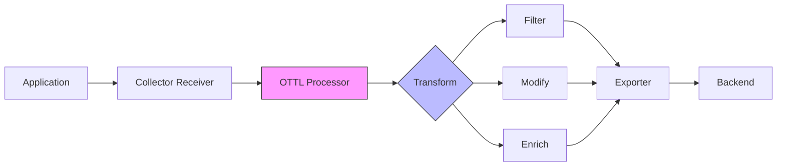

# How to Use the OpenTelemetry Transformation Language (OTTL) to Shape Telemetry Data

Author: [nawazdhandala](https://www.github.com/nawazdhandala)

Tags: OpenTelemetry, OTTL, Data Transformation, Collector, Configuration, Performance

Description: Master the OpenTelemetry Transformation Language to filter, modify, and enrich telemetry data at the collector level with practical OTTL examples and patterns.

The OpenTelemetry Transformation Language (OTTL) provides a powerful way to manipulate telemetry data before it reaches your backend. Instead of processing data after ingestion, OTTL enables transformation at the collector level, reducing costs and improving data quality.

This guide walks through practical OTTL usage patterns for shaping traces, metrics, and logs to meet your observability requirements.

## Understanding OTTL Architecture

OTTL is a domain-specific language designed for telemetry transformation. It operates within OpenTelemetry Collector processors, allowing you to modify, filter, and enrich data in flight.



OTTL operates on different telemetry signals:
- **Traces**: Spans with attributes, events, and status
- **Metrics**: Data points with labels and values
- **Logs**: Log records with body and attributes

## OTTL Contexts and Paths

OTTL uses contexts to access different parts of telemetry data:

- `resource`: Resource attributes (deployment.environment, service.name)
- `span`: Span-level data (name, kind, status)
- `attributes`: Span attributes (http.method, db.statement)
- `instrumentation_scope`: Instrumentation library metadata
- `metric`: Metric metadata (name, description, unit)
- `datapoint`: Individual metric data points
- `log`: Log record data

Path expressions access nested data:

```ottl
# Access resource attribute
resource.attributes["service.name"]

# Access span attribute
attributes["http.status_code"]

# Access span name
span.name

# Access metric name
metric.name

# Access datapoint attribute
datapoint.attributes["environment"]
```

## Basic OTTL Syntax

OTTL statements consist of functions and conditions:

```yaml
# Basic structure
processors:
  transform:
    trace_statements:
      - context: span
        statements:
          - set(attributes["new_key"], "value")
          - delete_key(attributes, "sensitive_key")
```

Common OTTL functions:
- `set()`: Set attribute values
- `delete_key()`: Remove attributes
- `replace_pattern()`: Pattern-based replacement
- `replace_match()`: Exact match replacement
- `truncate_all()`: Truncate string values
- `keep_keys()`: Keep only specified keys
- `limit()`: Limit collection size

## Filtering Spans with OTTL

Drop unwanted spans to reduce noise and costs.

Configure the transform processor to filter health check endpoints:

```yaml
# collector-config.yaml
receivers:
  otlp:
    protocols:
      grpc:
        endpoint: 0.0.0.0:4317

processors:
  transform:
    error_mode: ignore
    trace_statements:
      # Drop health check spans
      - context: span
        statements:
          - drop() where attributes["http.target"] == "/health"
          - drop() where attributes["http.target"] == "/metrics"
          - drop() where attributes["http.target"] == "/readyz"

      # Drop spans with specific status codes
      - context: span
        statements:
          - drop() where attributes["http.status_code"] == 304
          - drop() where attributes["http.status_code"] == 204

      # Drop very short spans (likely noise)
      - context: span
        statements:
          - drop() where span.duration < 1000000  # 1ms in nanoseconds

      # Drop internal polling operations
      - context: span
        statements:
          - drop() where span.name == "internal.poll"
          - drop() where span.name == "background.sync"

exporters:
  otlp:
    endpoint: backend:4317

service:
  pipelines:
    traces:
      receivers: [otlp]
      processors: [transform]
      exporters: [otlp]
```

Use complex conditions with logical operators:

```yaml
processors:
  transform:
    trace_statements:
      # Drop spans matching multiple conditions
      - context: span
        statements:
          # Drop successful health checks (2xx status and /health endpoint)
          - drop() where attributes["http.target"] == "/health" and attributes["http.status_code"] >= 200 and attributes["http.status_code"] < 300

          # Drop fast successful requests to static assets
          - drop() where span.duration < 5000000 and IsMatch(attributes["http.target"], "^/static/.*") and attributes["http.status_code"] == 200

          # Drop internal service calls in development
          - drop() where resource.attributes["deployment.environment"] == "development" and attributes["peer.service"] == "internal-api"
```

## Modifying Span Attributes

Transform attribute values to standardize or enrich data.

Normalize HTTP method to uppercase:

```yaml
processors:
  transform:
    trace_statements:
      # Standardize HTTP methods
      - context: span
        statements:
          # Convert method to uppercase
          - set(attributes["http.method"], ConvertCase(attributes["http.method"], "upper")) where attributes["http.method"] != nil

          # Normalize status codes
          - set(attributes["http.status_code"], Int(attributes["http.status_code"])) where attributes["http.status_code"] != nil
```

Redact sensitive information from attributes:

```yaml
processors:
  transform:
    trace_statements:
      # Remove sensitive data
      - context: span
        statements:
          # Redact API keys from URLs
          - replace_pattern(attributes["http.url"], "apikey=[^&]+", "apikey=REDACTED") where attributes["http.url"] != nil

          # Redact authorization headers
          - set(attributes["http.request.header.authorization"], "REDACTED") where attributes["http.request.header.authorization"] != nil

          # Remove PII from database queries
          - replace_pattern(attributes["db.statement"], "email\\s*=\\s*'[^']+'", "email='REDACTED'") where attributes["db.statement"] != nil

          # Mask credit card numbers
          - replace_pattern(attributes["request.body"], "\\d{4}[-\\s]?\\d{4}[-\\s]?\\d{4}[-\\s]?\\d{4}", "****-****-****-****")
```

Enrich spans with computed attributes:

```yaml
processors:
  transform:
    trace_statements:
      # Add computed attributes
      - context: span
        statements:
          # Calculate response size category
          - set(attributes["response.size.category"], "small") where Int(attributes["http.response.body.size"]) < 1024
          - set(attributes["response.size.category"], "medium") where Int(attributes["http.response.body.size"]) >= 1024 and Int(attributes["http.response.body.size"]) < 1048576
          - set(attributes["response.size.category"], "large") where Int(attributes["http.response.body.size"]) >= 1048576

          # Add latency bucket
          - set(attributes["latency.bucket"], "fast") where span.duration < 100000000  # < 100ms
          - set(attributes["latency.bucket"], "normal") where span.duration >= 100000000 and span.duration < 1000000000  # 100ms-1s
          - set(attributes["latency.bucket"], "slow") where span.duration >= 1000000000  # > 1s

          # Extract user tier from user ID pattern
          - set(attributes["user.tier"], "premium") where IsMatch(attributes["user.id"], "^premium-.*")
          - set(attributes["user.tier"], "free") where IsMatch(attributes["user.id"], "^free-.*")
```

## Transforming Resource Attributes

Resource attributes describe the entity producing telemetry. OTTL can modify these at the resource context level.

```yaml
processors:
  transform:
    trace_statements:
      # Standardize resource attributes
      - context: resource
        statements:
          # Normalize service name
          - replace_match(attributes["service.name"], "my-app-*", "my-app")

          # Add deployment region from environment variable
          - set(attributes["cloud.region"], "us-east-1") where attributes["cloud.region"] == nil

          # Derive environment from namespace
          - set(attributes["deployment.environment"], "production") where IsMatch(attributes["k8s.namespace.name"], "^prod-.*")
          - set(attributes["deployment.environment"], "staging") where IsMatch(attributes["k8s.namespace.name"], "^staging-.*")
          - set(attributes["deployment.environment"], "development") where IsMatch(attributes["k8s.namespace.name"], "^dev-.*")

          # Add cost center tags
          - set(attributes["cost.center"], "engineering") where attributes["service.name"] == "api-service"
          - set(attributes["cost.center"], "operations") where attributes["service.name"] == "monitoring-service"
```

## Transforming Metrics with OTTL

Apply transformations to metrics for normalization and enrichment.

```yaml
processors:
  transform:
    metric_statements:
      # Rename metrics for consistency
      - context: metric
        statements:
          - set(name, "http.server.request.duration") where name == "http_request_duration_seconds"
          - set(name, "http.server.response.size") where name == "http_response_size_bytes"

      # Modify metric attributes
      - context: datapoint
        statements:
          # Normalize HTTP method labels
          - set(attributes["http.method"], ConvertCase(attributes["http.method"], "upper")) where attributes["http.method"] != nil

          # Remove high-cardinality labels
          - delete_key(attributes, "user.id")
          - delete_key(attributes, "request.id")
          - delete_key(attributes, "trace.id")

          # Add aggregation labels
          - set(attributes["status_class"], "2xx") where Int(attributes["http.status_code"]) >= 200 and Int(attributes["http.status_code"]) < 300
          - set(attributes["status_class"], "3xx") where Int(attributes["http.status_code"]) >= 300 and Int(attributes["http.status_code"]) < 400
          - set(attributes["status_class"], "4xx") where Int(attributes["http.status_code"]) >= 400 and Int(attributes["http.status_code"]) < 500
          - set(attributes["status_class"], "5xx") where Int(attributes["http.status_code"]) >= 500

      # Drop unnecessary metrics
      - context: metric
        statements:
          - drop() where name == "runtime.gc.pause.ns"
          - drop() where name == "process.runtime.jvm.gc.duration"
```

Reduce metric cardinality by truncating labels:

```yaml
processors:
  transform:
    metric_statements:
      - context: datapoint
        statements:
          # Truncate long URLs to path only
          - replace_pattern(attributes["http.url"], "^https?://[^/]+", "") where attributes["http.url"] != nil

          # Limit endpoint cardinality by grouping dynamic routes
          - replace_pattern(attributes["http.route"], "/users/\\d+", "/users/{id}")
          - replace_pattern(attributes["http.route"], "/orders/[a-f0-9-]+", "/orders/{uuid}")
          - replace_pattern(attributes["http.route"], "/api/v\\d+/", "/api/{version}/")

          # Truncate version strings
          - replace_pattern(attributes["service.version"], "^(\\d+\\.\\d+)\\..*", "$1")
```

## Transforming Logs with OTTL

Shape log data for better searchability and analysis.

```yaml
processors:
  transform:
    log_statements:
      # Parse and structure log body
      - context: log
        statements:
          # Extract log level from unstructured logs
          - set(severity_text, "ERROR") where IsMatch(body, "(?i)error|exception|fatal")
          - set(severity_text, "WARN") where IsMatch(body, "(?i)warn|warning")
          - set(severity_text, "INFO") where IsMatch(body, "(?i)info")

          # Extract structured fields from log body
          - set(attributes["user.id"], ExtractPatterns(body, "user_id=(\\w+)")[0]) where IsMatch(body, "user_id=")
          - set(attributes["request.id"], ExtractPatterns(body, "request_id=([a-f0-9-]+)")[0]) where IsMatch(body, "request_id=")

          # Redact sensitive data from log body
          - replace_pattern(body, "password=[^\\s]+", "password=REDACTED")
          - replace_pattern(body, "api_key=[^\\s]+", "api_key=REDACTED")
          - replace_pattern(body, "\\b[A-Z0-9._%+-]+@[A-Z0-9.-]+\\.[A-Z]{2,}\\b", "EMAIL_REDACTED")

      # Drop debug logs in production
      - context: log
        statements:
          - drop() where resource.attributes["deployment.environment"] == "production" and severity_text == "DEBUG"

      # Enrich logs with context
      - context: log
        statements:
          - set(attributes["log.source"], "application") where attributes["log.source"] == nil
          - set(attributes["cloud.region"], resource.attributes["cloud.region"])
```

## Advanced OTTL Patterns

Combine multiple transformations for complex scenarios:

```yaml
processors:
  transform:
    trace_statements:
      # Multi-stage transformation pipeline
      - context: span
        statements:
          # Stage 1: Clean and normalize
          - truncate_all(attributes, 4096)  # Limit attribute value length
          - delete_key(attributes, "http.request.header.cookie")
          - delete_key(attributes, "http.request.header.authorization")

          # Stage 2: Enrich with computed values
          - set(attributes["is_error"], true) where attributes["http.status_code"] >= 500
          - set(attributes["is_error"], false) where attributes["http.status_code"] < 500

          # Stage 3: Standardize naming
          - replace_match(attributes["db.system"], "postgresql", "postgres")
          - replace_match(attributes["db.system"], "mongodb", "mongo")

          # Stage 4: Add routing hints for downstream processors
          - set(attributes["sampling.priority"], 10) where attributes["is_error"] == true
          - set(attributes["sampling.priority"], 1) where attributes["is_error"] == false

      # Apply different rules based on service
      - context: span
        statements:
          # API service specific transformations
          - set(attributes["api.version"], ExtractPatterns(attributes["http.target"], "/api/(v\\d+)/")[0]) where resource.attributes["service.name"] == "api-service"

          # Database service specific transformations
          - set(attributes["query.type"], "SELECT") where resource.attributes["service.name"] == "database" and IsMatch(attributes["db.statement"], "^SELECT")
          - set(attributes["query.type"], "INSERT") where resource.attributes["service.name"] == "database" and IsMatch(attributes["db.statement"], "^INSERT")
```

## Using OTTL with Other Processors

Combine OTTL with other processors for comprehensive telemetry shaping:

```yaml
receivers:
  otlp:
    protocols:
      grpc:
        endpoint: 0.0.0.0:4317

processors:
  # Step 1: Transform and enrich
  transform:
    trace_statements:
      - context: span
        statements:
          - set(attributes["environment"], resource.attributes["deployment.environment"])
          - set(attributes["is_slow"], true) where span.duration > 1000000000

  # Step 2: Filter using attributes processor
  attributes:
    actions:
      - key: internal.debug
        action: delete

  # Step 3: Sample based on enriched attributes
  tail_sampling:
    policies:
      - name: sample-slow-requests
        type: string_attribute
        string_attribute:
          key: is_slow
          values: ["true"]
      - name: sample-errors
        type: status_code
        status_code:
          status_codes: [ERROR]
      - name: sample-normal-traffic
        type: probabilistic
        probabilistic:
          sampling_percentage: 10

  # Step 4: Batch for efficiency
  batch:
    timeout: 10s
    send_batch_size: 1024

exporters:
  otlp:
    endpoint: backend:4317

service:
  pipelines:
    traces:
      receivers: [otlp]
      processors: [transform, attributes, tail_sampling, batch]
      exporters: [otlp]
```

## Testing OTTL Transformations

Validate OTTL statements before deploying to production:

```bash
# Use the OpenTelemetry Collector's telemetrygen tool
# to generate test data and verify transformations

# Install telemetrygen
go install github.com/open-telemetry/opentelemetry-collector-contrib/cmd/telemetrygen@latest

# Generate test traces
telemetrygen traces --otlp-insecure --traces 100 --status-code Error

# Check collector logs to verify transformations
tail -f /var/log/otel-collector.log
```

Create test cases for critical transformations:

```yaml
# test-transform.yaml
# Test configuration for OTTL transformations

receivers:
  otlp:
    protocols:
      grpc:
        endpoint: localhost:4317

processors:
  transform:
    trace_statements:
      - context: span
        statements:
          # Test: Should redact API keys
          - replace_pattern(attributes["http.url"], "apikey=[^&]+", "apikey=REDACTED")

  # Add debug exporter to verify transformations
  debug:
    verbosity: detailed

exporters:
  debug:
    verbosity: detailed

service:
  pipelines:
    traces:
      receivers: [otlp]
      processors: [transform, debug]
      exporters: [debug]
```

## Performance Considerations

OTTL transformations add processing overhead. Follow these best practices:

1. **Order matters**: Place drop statements early to avoid processing data that will be discarded
2. **Limit regex usage**: Pattern matching is expensive; use exact matches when possible
3. **Avoid redundant operations**: Combine multiple set operations into single statements
4. **Use error_mode wisely**: Set to `ignore` to prevent transformation errors from blocking data flow
5. **Test under load**: Benchmark transformation performance with realistic data volumes

For more performance optimization techniques, see [How to Benchmark OpenTelemetry SDK Overhead in Go, Java, and Python](https://oneuptime.com/blog/post/benchmark-opentelemetry-sdk-overhead-go-java-python/view) and [How to Aggregate Metrics at the Source to Reduce Data Volume](https://oneuptime.com/blog/post/aggregate-metrics-source-reduce-data-volume/view).

OTTL provides flexible, powerful telemetry transformation capabilities at the collector level, enabling you to shape data before it reaches your backend, reducing costs and improving observability quality.
