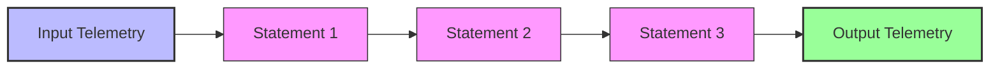

# How to Write OTTL Statements for the Transform Processor in the OpenTelemetry Collector

Author: [nawazdhandala](https://www.github.com/nawazdhandala)

Tags: OpenTelemetry, Collector, Processors, OTTL, Transform, Data Transformation

Description: Master OTTL (OpenTelemetry Transformation Language) statements in the Transform processor to manipulate telemetry attributes, resources, and more with powerful expressions.

The OpenTelemetry Transformation Language (OTTL) provides a powerful, flexible syntax for manipulating telemetry data within the OpenTelemetry Collector. Through the Transform processor, OTTL enables complex data transformations including attribute manipulation, conditional logic, string operations, mathematical calculations, and more. Understanding OTTL is essential for implementing sophisticated telemetry processing pipelines.

## OTTL Fundamentals

OTTL statements operate on telemetry contexts: spans, span events, metrics, data points, logs, and resources. Each statement consists of a function call or expression that reads and modifies telemetry data.

The basic structure of an OTTL statement:

```
function_name(arguments)
```

Statements execute sequentially within the Transform processor, with each statement potentially modifying the telemetry before the next statement processes it.



## Basic Transform Configuration

The Transform processor organizes OTTL statements by telemetry context. For traces, use `trace_statements`, `span_statements`, or `spanevent_statements`.

Here is a basic configuration:

```yaml
# Basic Transform processor with OTTL statements
processors:
  transform:
    # Statements that operate on entire traces
    trace_statements:
      - context: resource
        statements:
          # Set a resource attribute
          - set(attributes["deployment.environment"], "production")

    # Statements that operate on individual spans
    span_statements:
      - context: span
        statements:
          # Rename an attribute
          - set(attributes["http.method"], attributes["method"])
          # Delete the old attribute
          - delete_key(attributes, "method")

service:
  pipelines:
    traces:
      receivers: [otlp]
      processors: [transform, batch]
      exporters: [otlp]
```

This configuration operates on two contexts:
- Resource context: adds deployment environment to all spans in the trace
- Span context: renames the HTTP method attribute

## Setting Attributes

The `set()` function is the most fundamental OTTL operation, allowing you to create or modify attributes.

```yaml
processors:
  transform:
    span_statements:
      - context: span
        statements:
          # Set a simple string value
          - set(attributes["service.version"], "1.2.3")

          # Set a numeric value
          - set(attributes["retry.count"], 0)

          # Set a boolean value
          - set(attributes["is.production"], true)

          # Copy one attribute to another
          - set(attributes["original.name"], attributes["span.name"])

          # Set based on existing attribute
          - set(attributes["http.full_url"], Concat([attributes["http.scheme"], "://", attributes["http.host"], attributes["http.target"]], ""))
```

The `set()` function takes two arguments: the target path and the value to set. Values can be literals, references to other attributes, or expressions.

## Deleting Attributes

Remove unwanted attributes to reduce data volume or eliminate sensitive information:

```yaml
processors:
  transform:
    span_statements:
      - context: span
        statements:
          # Delete a single attribute
          - delete_key(attributes, "internal.debug.info")

          # Delete multiple attributes
          - delete_key(attributes, "temporary.data")
          - delete_key(attributes, "cache.key")

          # Delete resource attributes
          - delete_key(resource.attributes, "cloud.account.id")
```

The `delete_key()` function takes two arguments: the map to modify and the key to delete.

## Conditional Logic

OTTL supports conditional execution through the `where` clause, enabling statements to execute only when specific conditions are met.

```yaml
processors:
  transform:
    span_statements:
      - context: span
        statements:
          # Only set attribute if condition is true
          - set(attributes["environment"], "production") where attributes["cluster"] == "prod-us-east"

          # Multiple conditions with logical operators
          - set(attributes["priority"], "high") where attributes["service.name"] == "api" and attributes["http.status_code"] >= 500

          # Conditional deletion
          - delete_key(attributes, "debug.info") where attributes["environment"] == "production"
```

Conditions support comparison operators (`==`, `!=`, `<`, `<=`, `>`, `>=`) and logical operators (`and`, `or`, `not`).

## String Functions

OTTL provides extensive string manipulation capabilities:

```yaml
processors:
  transform:
    span_statements:
      - context: span
        statements:
          # Convert to uppercase
          - set(attributes["http.method"], Uppercase(attributes["http.method"]))

          # Convert to lowercase
          - set(attributes["service.name"], Lowercase(attributes["service.name"]))

          # Concatenate strings
          - set(attributes["full.url"], Concat([attributes["scheme"], "://", attributes["host"], attributes["path"]], ""))

          # Extract substring
          - set(attributes["short.id"], Substring(attributes["trace.id"], 0, 8))

          # Replace substring
          - set(attributes["sanitized.url"], Replace(attributes["url"], "/api/v1/", "/api/v2/", 1))

          # Split string into array
          - set(attributes["path.segments"], Split(attributes["http.target"], "/"))

          # Trim whitespace
          - set(attributes["clean.name"], Trim(attributes["name"]))
```

String functions enable normalization, sanitization, and extraction of meaningful data from attribute values.

## Mathematical Operations

Perform calculations on numeric attributes:

```yaml
processors:
  transform:
    span_statements:
      - context: span
        statements:
          # Convert milliseconds to seconds
          - set(attributes["duration.seconds"], attributes["duration.ms"] / 1000)

          # Calculate percentage
          - set(attributes["cache.hit.rate"], (attributes["cache.hits"] / attributes["cache.requests"]) * 100)

          # Increment counter
          - set(attributes["retry.count"], attributes["retry.count"] + 1)

          # Round to integer
          - set(attributes["rounded.value"], Int(attributes["float.value"]))
```

Mathematical operations support addition (`+`), subtraction (`-`), multiplication (`*`), division (`/`), and modulo (`%`).

## Working with Time

OTTL provides functions for time manipulation and formatting:

```yaml
processors:
  transform:
    span_statements:
      - context: span
        statements:
          # Calculate span duration in seconds
          - set(attributes["duration.seconds"], (end_time - start_time) / 1000000000)

          # Set current timestamp
          - set(attributes["processed.at"], Now())

          # Format timestamp
          - set(attributes["date"], FormatTime(start_time, "%Y-%m-%d"))

          # Extract time components
          - set(attributes["hour"], Hour(start_time))
          - set(attributes["day_of_week"], DayOfWeek(start_time))
```

Time functions enable time-based filtering, bucketing, and analysis.

## Type Conversions

Convert between data types explicitly:

```yaml
processors:
  transform:
    span_statements:
      - context: span
        statements:
          # Convert string to integer
          - set(attributes["port.number"], Int(attributes["port.string"]))

          # Convert integer to string
          - set(attributes["status.text"], String(attributes["status.code"]))

          # Convert to boolean
          - set(attributes["is.error"], Bool(attributes["error.flag"]))

          # Convert string to float
          - set(attributes["response.time"], Double(attributes["response.time.string"]))
```

Explicit type conversion prevents type mismatch errors in downstream processing.

## Array Operations

Manipulate array-valued attributes:

```yaml
processors:
  transform:
    span_statements:
      - context: span
        statements:
          # Get array length
          - set(attributes["tag.count"], Len(attributes["tags"]))

          # Access array element by index
          - set(attributes["first.tag"], attributes["tags"][0])

          # Check if array contains value
          - set(attributes["has.error.tag"], Contains(attributes["tags"], "error"))

          # Concatenate arrays
          - set(attributes["all.tags"], Concat(attributes["tags"], attributes["labels"]))
```

Array operations enable working with multi-valued attributes.

## Regular Expressions

Use regular expressions for pattern matching and extraction:

```yaml
processors:
  transform:
    span_statements:
      - context: span
        statements:
          # Extract with regex
          - set(attributes["user.id"], ExtractPatterns(attributes["url"], "/users/(\\d+)")[0])

          # Check if matches pattern
          - set(attributes["is.api.call"], IsMatch(attributes["http.target"], "^/api/"))

          # Replace using regex
          - set(attributes["sanitized.url"], ReplacePattern(attributes["url"], "token=[^&]+", "token=REDACTED"))

          # Split by regex pattern
          - set(attributes["segments"], SplitPattern(attributes["path"], "[/.]"))
```

Regular expressions provide powerful pattern-based transformations.

## Working with JSON

Parse and manipulate JSON-encoded attributes:

```yaml
processors:
  transform:
    span_statements:
      - context: span
        statements:
          # Parse JSON string to object
          - set(attributes["parsed.body"], ParseJSON(attributes["http.request.body"]))

          # Access nested JSON fields
          - set(attributes["user.id"], attributes["parsed.body"]["user"]["id"])

          # Convert object to JSON string
          - set(attributes["json.string"], JSON(attributes["structured.data"]))
```

JSON functions enable working with structured data embedded in attributes.

## Resource Transformations

Modify resource attributes that apply to all telemetry from a source:

```yaml
processors:
  transform:
    trace_statements:
      - context: resource
        statements:
          # Set resource attributes
          - set(attributes["deployment.environment"], "production")
          - set(attributes["cloud.region"], "us-east-1")

          # Normalize service name
          - set(attributes["service.name"], Lowercase(attributes["service.name"]))

          # Add computed resource attributes
          - set(attributes["service.namespace"], Split(attributes["service.name"], ".")[0])
```

Resource transformations apply once per batch, making them efficient for attributes shared across multiple spans.

## Span Event Transformations

Transform events within spans:

```yaml
processors:
  transform:
    spanevent_statements:
      - context: spanevent
        statements:
          # Modify event attributes
          - set(attributes["event.processed"], true)

          # Add context from parent span
          - set(attributes["span.name"], span.name)

          # Filter sensitive data
          - delete_key(attributes, "password") where name == "user.login"
```

Span event transformations enable fine-grained manipulation of events without affecting the parent span.

## Metric Transformations

Transform metric data points:

```yaml
processors:
  transform:
    metric_statements:
      - context: datapoint
        statements:
          # Normalize metric names
          - set(metric.name, Replace(metric.name, ".", "_", -1))

          # Add computed attributes
          - set(attributes["is.high"], value > 1000)

          # Convert units
          - set(value, value / 1000) where metric.name == "duration.ms"
          - set(metric.name, "duration.seconds") where metric.name == "duration.ms"
```

Metric transformations enable normalization and enrichment of metrics data.

## Log Transformations

Transform log records:

```yaml
processors:
  transform:
    log_statements:
      - context: log
        statements:
          # Parse log level from body
          - set(severity_text, ExtractPatterns(body, "\\[(DEBUG|INFO|WARN|ERROR)\\]")[0])

          # Add structured attributes from unstructured logs
          - set(attributes["request.id"], ExtractPatterns(body, "request_id=([\\w-]+)")[0])

          # Sanitize sensitive data
          - set(body, ReplacePattern(body, "password=\\S+", "password=REDACTED"))
```

Log transformations extract structure from unstructured log data.

## Complex Pipeline Example

Here is a comprehensive example combining multiple OTTL techniques:

```yaml
processors:
  transform:
    # Transform resources
    trace_statements:
      - context: resource
        statements:
          # Normalize service name
          - set(attributes["service.name"], Lowercase(Trim(attributes["service.name"])))
          # Extract service namespace
          - set(attributes["service.namespace"], Split(attributes["service.name"], ".")[0])
          # Add deployment timestamp
          - set(attributes["deployment.time"], Now())

    # Transform spans
    span_statements:
      - context: span
        statements:
          # Normalize HTTP method
          - set(attributes["http.method"], Uppercase(attributes["http.method"])) where attributes["http.method"] != nil

          # Build full URL
          - set(attributes["http.full_url"], Concat([attributes["http.scheme"], "://", attributes["http.host"], attributes["http.target"]], "")) where attributes["http.scheme"] != nil

          # Extract user ID from URL
          - set(attributes["user.id"], ExtractPatterns(attributes["http.target"], "/users/(\\d+)")[0]) where IsMatch(attributes["http.target"], "/users/\\d+")

          # Categorize response status
          - set(attributes["http.status_category"], "success") where attributes["http.status_code"] >= 200 and attributes["http.status_code"] < 300
          - set(attributes["http.status_category"], "redirect") where attributes["http.status_code"] >= 300 and attributes["http.status_code"] < 400
          - set(attributes["http.status_category"], "client_error") where attributes["http.status_code"] >= 400 and attributes["http.status_code"] < 500
          - set(attributes["http.status_category"], "server_error") where attributes["http.status_code"] >= 500

          # Calculate duration in seconds
          - set(attributes["duration.seconds"], (end_time - start_time) / 1000000000)

          # Mark slow requests
          - set(attributes["is.slow"], true) where attributes["duration.seconds"] > 1.0

          # Sanitize query parameters
          - set(attributes["http.target"], ReplacePattern(attributes["http.target"], "token=[^&]+", "token=REDACTED")) where IsMatch(attributes["http.target"], "token=")

          # Delete debug attributes in production
          - delete_key(attributes, "debug.info") where resource.attributes["deployment.environment"] == "production"

service:
  pipelines:
    traces:
      receivers: [otlp]
      processors: [transform, batch]
      exporters: [otlp]
```

This comprehensive pipeline demonstrates:
- Resource normalization
- Attribute extraction and computation
- Conditional logic
- String manipulation
- Mathematical operations
- Regular expressions
- Data sanitization

## Error Handling

OTTL statements that encounter errors typically log warnings but continue processing. Handle potential errors gracefully:

```yaml
processors:
  transform:
    span_statements:
      - context: span
        statements:
          # Check attribute exists before using it
          - set(attributes["port"], Int(attributes["port.string"])) where attributes["port.string"] != nil

          # Provide default values
          - set(attributes["method"], "UNKNOWN") where attributes["http.method"] == nil
          - set(attributes["method"], attributes["http.method"]) where attributes["http.method"] != nil

          # Guard against division by zero
          - set(attributes["success.rate"], attributes["successes"] / attributes["total"]) where attributes["total"] > 0
```

Always validate attribute existence and value ranges before operations that might fail.

## Performance Optimization

OTTL statement execution has performance implications:

1. **Statement order**: Place filter conditions early to skip unnecessary transformations
2. **Minimize regex**: Regular expressions are computationally expensive
3. **Avoid redundant operations**: Don't recompute values multiple times
4. **Use resource context**: Transform shared attributes at resource level, not per span

Optimized configuration:

```yaml
processors:
  transform:
    span_statements:
      - context: span
        statements:
          # Filter first to skip unnecessary processing
          - set(attributes["skip"], true) where attributes["internal.testing"] == true

          # Only process non-skipped spans
          - set(attributes["normalized.url"], Lowercase(attributes["http.url"])) where attributes["skip"] != true
          - set(attributes["status"], "error") where attributes["skip"] != true and attributes["http.status_code"] >= 500
```

## Debugging OTTL Statements

Enable debug logging to troubleshoot OTTL issues:

```yaml
service:
  telemetry:
    logs:
      level: debug

  pipelines:
    traces:
      receivers: [otlp]
      processors: [transform, batch]
      exporters: [otlp]
```

Debug logs show statement execution and errors, helping identify issues with syntax or logic.

## Related Resources

For more information on OpenTelemetry data transformation:

- [How to Filter Spans Using OTTL](https://oneuptime.com/blog/post/filter-spans-ottl-opentelemetry-collector/view)
- [How to Configure the Lookup Processor](https://oneuptime.com/blog/post/lookup-processor-opentelemetry-collector/view)
- [How to Configure the Unroll Processor](https://oneuptime.com/blog/post/unroll-processor-opentelemetry-collector/view)

OTTL provides a powerful, expressive language for transforming telemetry data in the OpenTelemetry Collector. From simple attribute renaming to complex conditional logic and data extraction, OTTL statements enable sophisticated data processing without custom code. Master the core functions (set, delete, conditionals), understand the available string and mathematical operations, and apply performance best practices to build efficient transformation pipelines. Always validate attribute existence before operations, handle potential errors gracefully, and use debug logging to troubleshoot issues during development.
