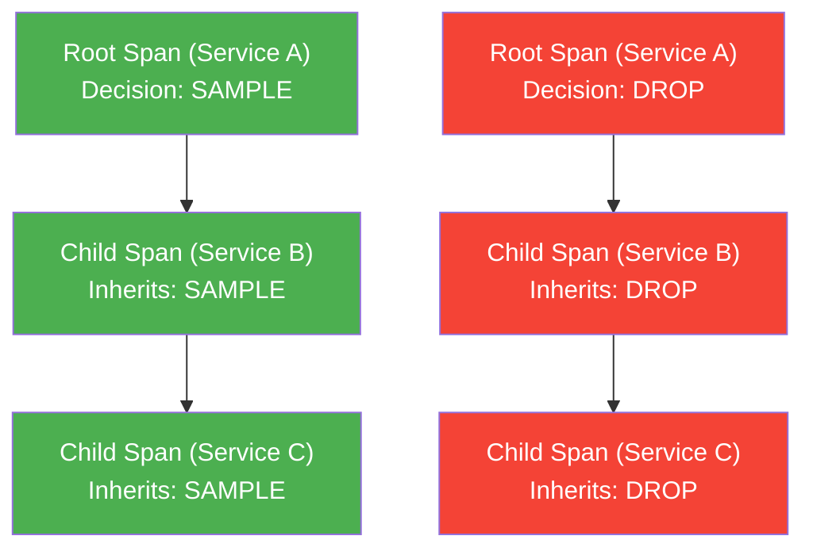

# How to Use Parent-Based Sampling for Consistent Trace Decisions

Author: [nawazdhandala](https://www.github.com/nawazdhandala)

Tags: OpenTelemetry, Sampling, Tracing, Parent-Based Sampling, Distributed Systems, Observability

Description: Learn how parent-based sampling works in OpenTelemetry to ensure consistent trace decisions across distributed microservices and avoid broken traces.

---

One of the most frustrating problems in distributed tracing is ending up with incomplete traces. You see the first two spans of a request, then nothing. The rest of the trace vanished because a downstream service made a different sampling decision than the upstream one. Parent-based sampling exists specifically to solve this problem, and understanding how it works will save you from hours of debugging missing trace data.

## The Broken Trace Problem

Imagine a simple three-service architecture where Service A calls Service B, which calls Service C. If each service independently decides whether to sample a trace, you get inconsistent results. Service A might decide to keep a trace while Service B drops it. Now your trace has a gap in the middle, making it useless for debugging.


This happens because the default behavior in many tracing setups is to let each service make its own sampling decision. With a 50% sampling rate, roughly half the time your services will disagree, producing fragmented traces that tell you nothing useful.

## How Parent-Based Sampling Works

Parent-based sampling delegates the sampling decision to the trace context propagated from the parent span. When a service receives a request that already has trace context, it looks at the `sampled` flag in that context and honors it. The decision made at the root span propagates through the entire trace.



The key insight is that only the root service (the one that starts the trace) actually makes a sampling decision. Every other service just follows along.

## Configuring Parent-Based Sampling in Python

Here is how to set up parent-based sampling in a Python application using the OpenTelemetry SDK. The `ParentBasedTraceIdRatio` sampler wraps a base sampler and applies parent-based logic on top of it.

```python
from opentelemetry import trace
from opentelemetry.sdk.trace import TracerProvider
from opentelemetry.sdk.trace.sampling import (
    ParentBasedTraceIdRatio,
    ALWAYS_OFF,
    ALWAYS_ON,
    ParentBased,
    TraceIdRatioBased,
)
from opentelemetry.sdk.trace.export import BatchSpanProcessor
from opentelemetry.exporter.otlp.proto.grpc.trace_exporter import OTLPSpanExporter

# ParentBasedTraceIdRatio samples 25% of root spans
# and follows the parent decision for child spans
sampler = ParentBasedTraceIdRatio(0.25)

provider = TracerProvider(sampler=sampler)

# Configure the OTLP exporter to send traces to your backend
exporter = OTLPSpanExporter(endpoint="http://localhost:4317")
provider.add_span_processor(BatchSpanProcessor(exporter))

trace.set_tracer_provider(provider)
```

The `ParentBasedTraceIdRatio(0.25)` sampler does two things. For root spans (requests with no parent context), it applies a 25% sampling rate based on the trace ID. For child spans (requests that already carry trace context), it reads the parent's sampled flag and uses that instead.

## Configuring Parent-Based Sampling in Java

The Java SDK has a similar API. You build the sampler using the `ParentBased` builder, which gives you fine-grained control over how sampling behaves for different scenarios.

```java
import io.opentelemetry.sdk.OpenTelemetrySdk;
import io.opentelemetry.sdk.trace.SdkTracerProvider;
import io.opentelemetry.sdk.trace.samplers.Sampler;
import io.opentelemetry.sdk.trace.export.BatchSpanProcessor;
import io.opentelemetry.exporter.otlp.trace.OtlpGrpcSpanExporter;

public class TracingConfig {
    public static void configure() {
        // Build a parent-based sampler with different strategies
        // for root spans vs remote parent spans
        Sampler sampler = Sampler.parentBased(
            // Root sampler: 20% of new traces get sampled
            Sampler.traceIdRatioBased(0.20)
        );

        OtlpGrpcSpanExporter exporter = OtlpGrpcSpanExporter.builder()
            .setEndpoint("http://localhost:4317")
            .build();

        SdkTracerProvider tracerProvider = SdkTracerProvider.builder()
            .setSampler(sampler)
            .addSpanProcessor(BatchSpanProcessor.builder(exporter).build())
            .build();

        OpenTelemetrySdk.builder()
            .setTracerProvider(tracerProvider)
            .buildAndRegisterGlobal();
    }
}
```

The `Sampler.parentBased()` method takes a root sampler as its argument. When a span has no parent (it is a root span), this sampler is used. When a span has a remote parent, the SDK checks the parent's sampled flag from the incoming context.

## Advanced Configuration with the ParentBased Builder

Sometimes you need more control. The `ParentBased` sampler can be configured with different strategies for four scenarios: root spans, remote parent sampled, remote parent not sampled, and local parent sampled/not sampled.

```python
from opentelemetry.sdk.trace.sampling import (
    ParentBased,
    TraceIdRatioBased,
    ALWAYS_ON,
    ALWAYS_OFF,
)

# Advanced parent-based configuration
# Each scenario gets its own sampling strategy
sampler = ParentBased(
    # For root spans with no parent context
    root=TraceIdRatioBased(0.10),
    # When remote parent says "sampled", always record
    remote_parent_sampled=ALWAYS_ON,
    # When remote parent says "not sampled", always drop
    remote_parent_not_sampled=ALWAYS_OFF,
    # When local parent says "sampled", always record
    local_parent_sampled=ALWAYS_ON,
    # When local parent says "not sampled", always drop
    local_parent_not_sampled=ALWAYS_OFF,
)
```

In this configuration, root spans get a 10% sampling rate. If a request comes in from another service with its sampled flag set, we always record it. If the parent decided to drop, we always drop. This is the most common production configuration because it guarantees trace completeness.

You can get creative with these settings. For example, you could set `remote_parent_not_sampled` to a low ratio sampler instead of `ALWAYS_OFF`. This would re-sample a small percentage of traces that the parent dropped, which can be useful if you suspect an upstream service is dropping too aggressively.

## Using the OpenTelemetry Collector for Unified Sampling

While SDK-level parent-based sampling works well, you can also configure sampling at the collector level using the `probabilistic_sampler` processor. This works as a secondary filter after the SDK has made its initial decision.

```yaml
# OpenTelemetry Collector configuration
receivers:
  otlp:
    protocols:
      grpc:
        endpoint: 0.0.0.0:4317

processors:
  # The probabilistic sampler respects parent decisions
  # by default when trace context is present
  probabilistic_sampler:
    # Sample 30% of traces at the collector level
    sampling_percentage: 30
    # Hash the trace ID for deterministic decisions
    hash_seed: 42

exporters:
  otlp:
    endpoint: https://otel.oneuptime.com:4317

service:
  pipelines:
    traces:
      receivers: [otlp]
      processors: [probabilistic_sampler]
      exporters: [otlp]
```

The collector-level sampler uses the trace ID hash to make deterministic decisions. This means that if multiple collector instances process spans from the same trace, they will all make the same keep-or-drop decision. Determinism is critical here because without it, you end up with the same broken trace problem you were trying to avoid.

## Environment Variable Configuration

For teams that prefer configuration over code, OpenTelemetry supports setting the sampler via environment variables. This is especially useful in containerized environments where you want to change sampling behavior without redeploying code.

```bash
# Set the sampler to parent-based with trace ID ratio
export OTEL_TRACES_SAMPLER=parentbased_traceidratio

# Set the sampling rate to 15%
export OTEL_TRACES_SAMPLER_ARG=0.15

# Set the OTLP endpoint
export OTEL_EXPORTER_OTLP_ENDPOINT=http://localhost:4317
```

These environment variables are read by the OpenTelemetry SDK at initialization time. The `parentbased_traceidratio` sampler behaves identically to the code-based configuration shown earlier. It samples root spans at the specified rate and follows parent decisions for child spans.

## Common Pitfalls to Avoid

The most common mistake is mixing parent-based sampling with non-parent-based sampling across services. If Service A uses `ParentBased(TraceIdRatioBased(0.25))` but Service B uses plain `TraceIdRatioBased(0.25)`, Service B will ignore the parent context and make its own decision 75% of the time. Every service in your stack needs to use parent-based sampling for this to work correctly.

Another pitfall is forgetting about context propagation. Parent-based sampling depends entirely on trace context being passed between services. If your HTTP client is not injecting the `traceparent` header, or your server is not extracting it, the downstream service will treat every request as a root span. Make sure you have the appropriate propagator configured.

```python
from opentelemetry.propagate import set_global_textmap
from opentelemetry.propagators.composite import CompositeHTTPPropagator
from opentelemetry.propagators.b3 import B3MultiFormat
from opentelemetry.trace.propagation import TraceContextTextMapPropagator

# Configure context propagation
# W3C TraceContext is the standard, but include B3 if
# you have services that use Zipkin-style headers
set_global_textmap(
    CompositeHTTPPropagator([
        TraceContextTextMapPropagator(),
        B3MultiFormat(),
    ])
)
```

Without proper propagation, parent-based sampling silently degrades into independent per-service sampling, which is exactly the problem you were trying to solve.

## Wrapping Up

Parent-based sampling is the foundation of consistent trace collection in distributed systems. It ensures that once a trace is selected for sampling at the entry point, every downstream service continues to record spans for that trace. The configuration is straightforward across all OpenTelemetry SDKs and the collector, and it plays well with environment variable-based configuration for container deployments. Start with parent-based sampling as your default, and layer more sophisticated sampling strategies on top of it only when you have a specific need.
