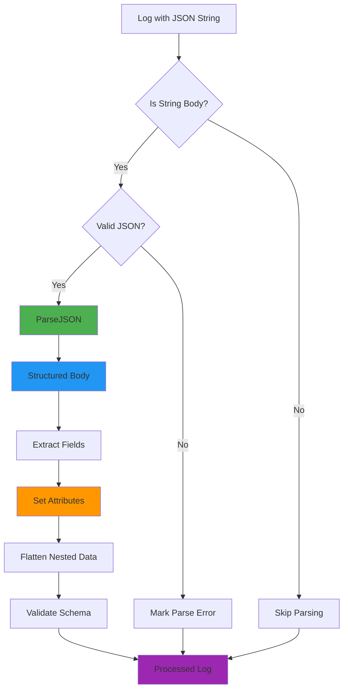

# How to Parse JSON Logs with OTTL in the OpenTelemetry Collector

Author: [nawazdhandala](https://www.github.com/nawazdhandala)

Tags: OpenTelemetry, Collector, OTTL, JSON, Log Processing, Transform Processor

Description: Master JSON log parsing in the OpenTelemetry Collector using OTTL with practical examples for extracting structured data from JSON strings.

Modern applications often emit logs in JSON format, providing rich structured data that's perfect for observability. However, these JSON logs frequently arrive at the OpenTelemetry Collector as plain strings, requiring parsing before you can access the structured fields. The OpenTelemetry Transformation Language (OTTL) provides powerful functions to parse JSON logs and extract meaningful data.

## Why Parse JSON Logs?

JSON logs contain structured information that's much more valuable when properly parsed:

- Extract specific fields into searchable attributes
- Filter logs based on nested JSON values
- Transform and enrich data based on JSON content
- Create metrics from JSON log data
- Route logs based on JSON field values

Without parsing, a JSON log remains a plain string, limiting your ability to analyze and query the data effectively.

## Understanding JSON Parsing in OTTL

OTTL provides several functions for working with JSON data:

- `ParseJSON()`: Converts a JSON string into a structured map
- `ParseSimpleJSON()`: Parses JSON with limited depth
- Type checking functions to verify data types
- Access operators to navigate nested structures

## Basic JSON Parsing

Here's a simple example of parsing a JSON log body:

```yaml
# Basic JSON log parsing
processors:
  transform:
    log_statements:
      - context: log
        statements:
          # Parse the JSON string in the log body
          # This converts the string into a structured map
          - set(body, ParseJSON(body)) where IsString(body)
```

The `IsString(body)` condition ensures we only attempt to parse logs that have string bodies, preventing errors when the body is already a structured object.

After parsing, you can access nested fields directly:

```yaml
# Access parsed JSON fields
processors:
  transform:
    log_statements:
      - context: log
        statements:
          # Parse JSON body
          - set(body, ParseJSON(body)) where IsString(body)

          # Extract fields to attributes after parsing
          - set(attributes["log_level"], body["level"])
          - set(attributes["message"], body["message"])
          - set(attributes["user_id"], body["user"]["id"]) where body["user"] != nil
```

## Handling Complex JSON Structures

Real-world JSON logs often contain deeply nested structures. Here's how to handle them:

```yaml
# Parse complex nested JSON logs
processors:
  transform:
    log_statements:
      - context: log
        statements:
          # Parse the main JSON body
          - set(body, ParseJSON(body)) where IsString(body)

          # Extract data from nested objects
          # Example JSON: {"request": {"method": "POST", "url": "/api/users", "headers": {...}}}
          - set(attributes["http.method"], body["request"]["method"]) where body["request"] != nil
          - set(attributes["http.url"], body["request"]["url"]) where body["request"] != nil

          # Extract from arrays
          # Example: {"errors": ["error1", "error2"]}
          - set(attributes["error_count"], Len(body["errors"])) where body["errors"] != nil
          - set(attributes["first_error"], body["errors"][0]) where body["errors"] != nil and Len(body["errors"]) > 0

          # Handle nested user information
          # Example: {"user": {"id": 123, "email": "user@example.com", "metadata": {"role": "admin"}}}
          - set(attributes["user.id"], body["user"]["id"]) where body["user"] != nil
          - set(attributes["user.email"], body["user"]["email"]) where body["user"] != nil
          - set(attributes["user.role"], body["user"]["metadata"]["role"]) where body["user"]["metadata"] != nil
```

## Parsing JSON from Different Fields

Sometimes JSON data exists in attributes rather than the body:

```yaml
# Parse JSON from various fields
processors:
  transform:
    log_statements:
      - context: log
        statements:
          # Parse JSON from the body
          - set(body, ParseJSON(body)) where IsString(body)

          # Parse JSON from a specific attribute
          # Some systems put JSON in attributes like "message" or "data"
          - set(temp_parsed_attr, ParseJSON(attributes["json_data"])) where IsString(attributes["json_data"])

          # Extract fields from the parsed attribute to top-level attributes
          - set(attributes["extracted_field"], temp_parsed_attr["field_name"]) where temp_parsed_attr != nil

          # Clean up temporary variable
          - delete_key(temp_parsed_attr, "")
```

## Handling Parsing Errors Gracefully

Not all logs will be valid JSON. Here's how to handle parsing failures:

```yaml
# Handle JSON parsing errors
processors:
  transform:
    log_statements:
      - context: log
        statements:
          # Try to parse JSON and set a flag if successful
          - set(temp_parsed, ParseJSON(body)) where IsString(body) and IsMatch(body, "^[\\{\\[]")

          # If parsing succeeded, use the parsed version
          - set(body, temp_parsed) where temp_parsed != nil
          - set(attributes["json_parsed"], true) where temp_parsed != nil

          # If parsing failed, keep original and flag it
          - set(attributes["json_parsed"], false) where temp_parsed == nil and IsString(body)
          - set(attributes["parsing_error"], "Invalid JSON format") where temp_parsed == nil and IsString(body)
```

## Extracting and Flattening JSON

Often you want to flatten nested JSON into top-level attributes for easier querying:

```yaml
# Flatten nested JSON into attributes
processors:
  transform:
    log_statements:
      - context: log
        statements:
          # Parse JSON body
          - set(body, ParseJSON(body)) where IsString(body)

          # Flatten common application log fields
          # Example JSON: {"timestamp": "2026-02-06T10:00:00Z", "level": "error", "logger": "app.module", "message": "Failed to connect"}
          - set(attributes["timestamp"], body["timestamp"]) where body["timestamp"] != nil
          - set(attributes["log.level"], body["level"]) where body["level"] != nil
          - set(attributes["log.logger"], body["logger"]) where body["logger"] != nil
          - set(attributes["log.message"], body["message"]) where body["message"] != nil

          # Flatten error information
          # Example: {"error": {"code": "ERR_500", "message": "Internal error", "stack": "..."}}
          - set(attributes["error.code"], body["error"]["code"]) where body["error"] != nil
          - set(attributes["error.message"], body["error"]["message"]) where body["error"] != nil
          - set(attributes["error.type"], body["error"]["type"]) where body["error"] != nil

          # Flatten HTTP request info
          # Example: {"http": {"method": "GET", "status": 200, "duration_ms": 145}}
          - set(attributes["http.method"], body["http"]["method"]) where body["http"] != nil
          - set(attributes["http.status_code"], body["http"]["status"]) where body["http"] != nil
          - set(attributes["http.duration_ms"], body["http"]["duration_ms"]) where body["http"] != nil
```

## Working with JSON Arrays

JSON arrays require special handling to extract useful information:

```yaml
# Parse and process JSON arrays
processors:
  transform:
    log_statements:
      - context: log
        statements:
          # Parse JSON body
          - set(body, ParseJSON(body)) where IsString(body)

          # Get array length for metrics
          # Example: {"tags": ["urgent", "customer-facing", "backend"]}
          - set(attributes["tags_count"], Len(body["tags"])) where body["tags"] != nil

          # Extract first and last elements
          - set(attributes["first_tag"], body["tags"][0]) where body["tags"] != nil and Len(body["tags"]) > 0
          - set(attributes["last_tag"], body["tags"][Len(body["tags"]) - 1]) where body["tags"] != nil and Len(body["tags"]) > 0

          # Check if array contains specific value
          # Note: This requires iterating or using Contains if available
          - set(attributes["is_urgent"], IsMatch(String(body["tags"]), "urgent")) where body["tags"] != nil

          # Process array of objects
          # Example: {"events": [{"type": "click", "timestamp": "..."}, {"type": "view", "timestamp": "..."}]}
          - set(attributes["event_count"], Len(body["events"])) where body["events"] != nil
          - set(attributes["first_event_type"], body["events"][0]["type"]) where body["events"] != nil and Len(body["events"]) > 0
```

## Complete JSON Parsing Pipeline

Here's a comprehensive example showing JSON parsing in a complete collector configuration:

```yaml
# Complete collector configuration for JSON log parsing
receivers:
  # Receive logs via OTLP
  otlp:
    protocols:
      grpc:
        endpoint: 0.0.0.0:4317
      http:
        endpoint: 0.0.0.0:4318

  # Receive logs from files
  filelog:
    include:
      - /var/log/app/*.log
    # Note: Not parsing here to show OTTL parsing capabilities

processors:
  # Memory limiter
  memory_limiter:
    check_interval: 1s
    limit_mib: 512

  # Parse JSON logs using transform processor
  transform:
    log_statements:
      - context: log
        statements:
          # Step 1: Parse JSON body if it's a string
          - set(body, ParseJSON(body)) where IsString(body) and IsMatch(body, "^\\{")

          # Step 2: Extract standard fields to attributes
          - set(attributes["app.timestamp"], body["timestamp"]) where body["timestamp"] != nil
          - set(attributes["app.level"], body["level"]) where body["level"] != nil
          - set(attributes["app.message"], body["message"]) where body["message"] != nil
          - set(attributes["app.logger"], body["logger"]) where body["logger"] != nil

          # Step 3: Extract trace context from JSON
          - set(attributes["trace_id"], body["trace_id"]) where body["trace_id"] != nil
          - set(attributes["span_id"], body["span_id"]) where body["span_id"] != nil

          # Step 4: Extract error information
          - set(attributes["error.code"], body["error"]["code"]) where body["error"] != nil
          - set(attributes["error.message"], body["error"]["message"]) where body["error"] != nil
          - set(attributes["error.stack"], body["error"]["stack"]) where body["error"] != nil

          # Step 5: Extract HTTP request details
          - set(attributes["http.method"], body["request"]["method"]) where body["request"] != nil
          - set(attributes["http.url"], body["request"]["url"]) where body["request"] != nil
          - set(attributes["http.status_code"], body["response"]["status"]) where body["response"] != nil
          - set(attributes["http.duration_ms"], body["duration_ms"]) where body["duration_ms"] != nil

          # Step 6: Extract user context
          - set(attributes["user.id"], body["user"]["id"]) where body["user"] != nil
          - set(attributes["user.email"], body["user"]["email"]) where body["user"] != nil
          - set(attributes["user.role"], body["user"]["role"]) where body["user"] != nil

          # Step 7: Set severity based on parsed level
          - set(severity_text, body["level"]) where body["level"] != nil
          - set(severity_number, 9) where body["level"] == "error"
          - set(severity_number, 13) where body["level"] == "warn"
          - set(severity_number, 17) where body["level"] == "info"

  # Batch for efficiency
  batch:
    timeout: 10s
    send_batch_size: 1024

  # Attributes processor to organize data
  attributes:
    actions:
      # Remove temporary fields
      - key: temp_parsed
        action: delete

exporters:
  # Export to backend
  otlp:
    endpoint: https://your-backend:4317
    tls:
      insecure: false

  # Debug exporter
  debug:
    verbosity: detailed

service:
  pipelines:
    logs:
      receivers: [otlp, filelog]
      processors: [memory_limiter, transform, batch, attributes]
      exporters: [otlp, debug]
```

## Parsing JSON with Schema Validation

You can validate that parsed JSON contains expected fields:

```yaml
# Validate JSON structure after parsing
processors:
  transform:
    log_statements:
      - context: log
        statements:
          # Parse JSON
          - set(body, ParseJSON(body)) where IsString(body)

          # Validate required fields exist
          - set(attributes["schema_valid"], true) where body["timestamp"] != nil and body["level"] != nil and body["message"] != nil

          # Set validation flag to false if required fields are missing
          - set(attributes["schema_valid"], false) where body["timestamp"] == nil or body["level"] == nil or body["message"] == nil

          # Add validation error message
          - set(attributes["validation_error"], "Missing required fields") where attributes["schema_valid"] == false
```

## JSON Parsing Flow

Here's how JSON parsing flows through the collector:



## Advanced JSON Parsing Patterns

### Parsing JSON from Multiple Sources

```yaml
# Parse JSON from different sources in the same pipeline
processors:
  transform:
    log_statements:
      - context: log
        statements:
          # Kubernetes logs often have nested JSON in the message
          - set(temp_k8s_msg, ParseJSON(body["message"])) where IsString(body["message"])
          - set(body, temp_k8s_msg) where temp_k8s_msg != nil

          # Docker logs wrap JSON in a "log" field
          - set(temp_docker_log, ParseJSON(body["log"])) where IsString(body["log"])
          - set(body, temp_docker_log) where temp_docker_log != nil

          # Direct JSON body
          - set(body, ParseJSON(body)) where IsString(body) and IsMatch(body, "^\\{")
```

### Converting JSON Types

```yaml
# Handle type conversions for JSON fields
processors:
  transform:
    log_statements:
      - context: log
        statements:
          # Parse JSON
          - set(body, ParseJSON(body)) where IsString(body)

          # Convert string numbers to integers
          - set(attributes["status_code"], Int(body["status"])) where IsString(body["status"])

          # Convert timestamps
          - set(attributes["event_time"], Time(body["timestamp"], "%Y-%m-%dT%H:%M:%SZ")) where body["timestamp"] != nil

          # Convert boolean strings
          - set(attributes["is_success"], body["success"] == "true" or body["success"] == true) where body["success"] != nil
```

## Best Practices for JSON Log Parsing

1. **Check Before Parsing**: Always verify the body is a string and resembles JSON before parsing to avoid errors.

2. **Handle Missing Fields**: Use `where` conditions to check for nil before accessing nested fields.

3. **Set Parse Flags**: Add attributes to track whether parsing succeeded for debugging and monitoring.

4. **Preserve Original Data**: Consider copying the original body to an attribute before parsing if you need to retain it.

5. **Flatten Strategically**: Only extract fields you'll actually use for querying or filtering.

6. **Use Type Conversion**: Convert string representations of numbers, booleans, and dates to proper types.

7. **Validate Structure**: Check that required fields exist after parsing to catch schema changes.

8. **Test with Real Data**: Use the [OTTL Playground](https://oneuptime.com/blog/post/ottl-playground-test-opentelemetry-collector/view) to test parsing with actual log samples.

## Common JSON Parsing Challenges

1. **Escaped JSON**: Logs sometimes contain escaped JSON strings (e.g., `"{\"key\":\"value\"}"`). You may need to unescape before parsing.

2. **Mixed Formats**: Not all logs from a source may be JSON. Use pattern matching to identify JSON logs.

3. **Partial JSON**: Truncated logs may contain invalid JSON. Handle parsing failures gracefully.

4. **Performance**: Parsing large JSON structures can be CPU-intensive. Consider parsing only necessary fields.

## Conclusion

Parsing JSON logs with OTTL in the OpenTelemetry Collector unlocks the full value of structured logging. By converting JSON strings into structured data, extracting fields into attributes, and flattening nested structures, you make your logs more queryable and valuable for observability.

Combined with other OTTL capabilities like [log body transformation](https://oneuptime.com/blog/post/transform-log-bodies-ottl-opentelemetry-collector/view), [attribute modification](https://oneuptime.com/blog/post/rename-modify-attributes-ottl-opentelemetry-collector/view), and [conditional logic](https://oneuptime.com/blog/post/conditional-logic-ottl-opentelemetry-collector/view), you can build sophisticated log processing pipelines that transform raw JSON logs into well-structured, searchable telemetry data.

For more information on JSON parsing and OTTL, refer to the [OpenTelemetry Collector documentation](https://opentelemetry.io/docs/collector/transforming-telemetry/).
