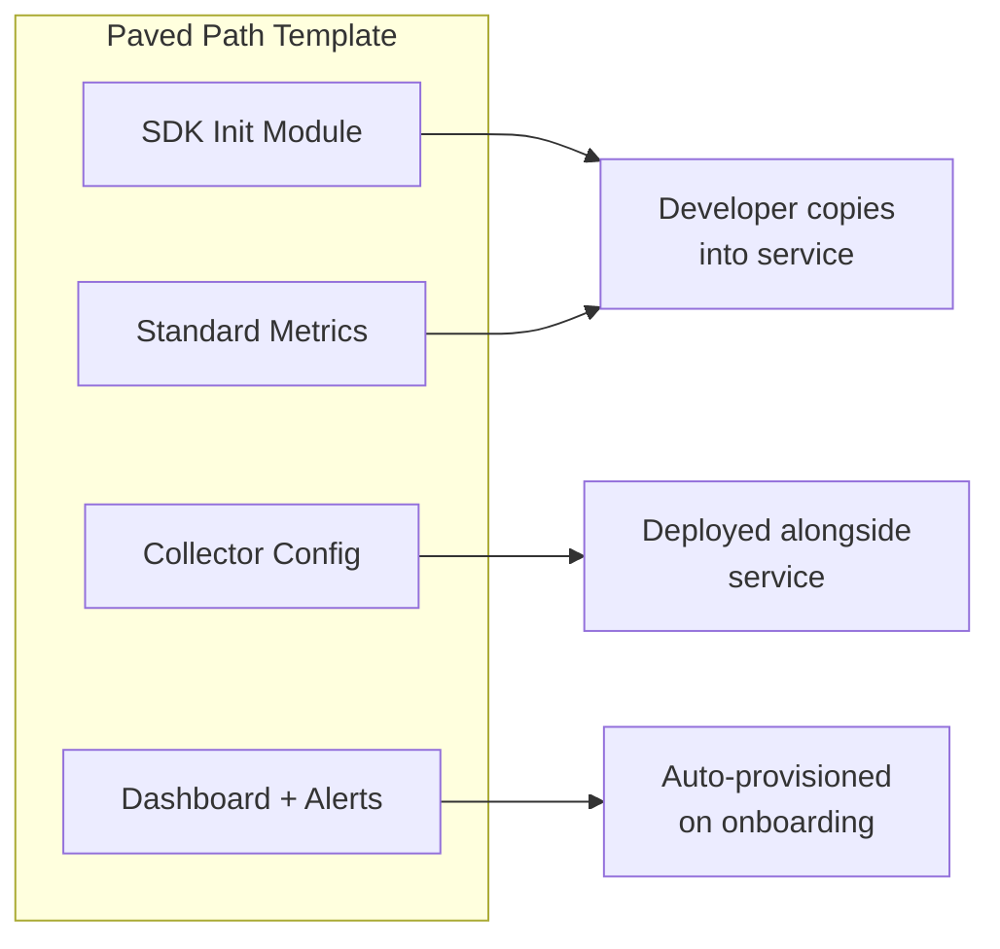

# How to Create Paved-Path Observability Templates for Developer Teams with OpenTelemetry

Author: [nawazdhandala](https://www.github.com/nawazdhandala)

Tags: OpenTelemetry, Platform Engineering, Templates, Developer Experience

Description: Create reusable paved-path observability templates that give developer teams instant, consistent OpenTelemetry instrumentation out of the box.

A paved path is the easy, well-supported route that platform teams build for developers. Instead of asking each team to figure out OpenTelemetry instrumentation from scratch, you give them a template that works immediately. The template handles SDK initialization, standard metric definitions, trace context propagation, and collector configuration. Teams can customize it later, but the default path covers 80% of what they need.

This post shows how to design and distribute paved-path templates that teams actually want to use.

## What Goes Into a Paved-Path Template

A complete template includes four pieces:

1. **SDK initialization code** for the target language and framework
2. **Standard metric definitions** that every service should emit
3. **Collector sidecar configuration** for the deployment environment
4. **Dashboard and alert definitions** that work with the standard metrics



## Python Template: FastAPI Service

Here is a production-ready template for a Python FastAPI service. It initializes tracing, metrics, and logging with sensible defaults.

```python
# otel_paved_path/setup.py
# Drop this module into your FastAPI service.
# Call init_observability() in your app startup.
import os
import logging
from opentelemetry import trace, metrics
from opentelemetry.sdk.trace import TracerProvider
from opentelemetry.sdk.trace.export import BatchSpanProcessor
from opentelemetry.sdk.metrics import MeterProvider
from opentelemetry.sdk.metrics.export import PeriodicExportingMetricReader
from opentelemetry.exporter.otlp.proto.grpc.trace_exporter import OTLPSpanExporter
from opentelemetry.exporter.otlp.proto.grpc.metric_exporter import OTLPMetricExporter
from opentelemetry.sdk.resources import Resource
from opentelemetry.instrumentation.fastapi import FastAPIInstrumentor

logger = logging.getLogger(__name__)

def init_observability(app=None):
    """Initialize OpenTelemetry with organization-standard configuration.

    Reads configuration from environment variables:
      OTEL_SERVICE_NAME - required, your service name
      OTEL_EXPORTER_OTLP_ENDPOINT - defaults to http://localhost:4317
      OTEL_RESOURCE_ATTRIBUTES - additional resource attributes
    """
    service_name = os.environ.get("OTEL_SERVICE_NAME", "unknown-service")
    endpoint = os.environ.get("OTEL_EXPORTER_OTLP_ENDPOINT", "http://localhost:4317")

    resource = Resource.create({
        "service.name": service_name,
        "service.version": os.environ.get("SERVICE_VERSION", "unknown"),
        "deployment.environment": os.environ.get("DEPLOYMENT_ENV", "development"),
    })

    # Tracing setup
    tracer_provider = TracerProvider(resource=resource)
    tracer_provider.add_span_processor(
        BatchSpanProcessor(
            OTLPSpanExporter(endpoint=endpoint, insecure=True),
            max_queue_size=2048,
            max_export_batch_size=512,
        )
    )
    trace.set_tracer_provider(tracer_provider)

    # Metrics setup
    metric_exporter = OTLPMetricExporter(endpoint=endpoint, insecure=True)
    reader = PeriodicExportingMetricReader(metric_exporter, export_interval_millis=30000)
    meter_provider = MeterProvider(resource=resource, metric_readers=[reader])
    metrics.set_meter_provider(meter_provider)

    # Auto-instrument FastAPI if app is provided
    if app:
        FastAPIInstrumentor.instrument_app(app)

    # Register standard metrics
    _register_standard_metrics(meter_provider)

    logger.info(f"Observability initialized for {service_name} -> {endpoint}")
    return tracer_provider, meter_provider
```

## Standard Metrics Module

Every service should emit a consistent set of metrics. This module defines them so teams do not have to reinvent the wheel.

```python
# otel_paved_path/standard_metrics.py
# Standard metrics that every service emits.
# These are registered automatically by init_observability().
from opentelemetry import metrics

_meter = None
_instruments = {}

def _register_standard_metrics(meter_provider):
    """Register the organization-standard metric instruments."""
    global _meter, _instruments

    _meter = metrics.get_meter("org.standard.metrics", version="1.0.0")

    _instruments["request_duration"] = _meter.create_histogram(
        name="http.server.request.duration",
        description="HTTP server request duration",
        unit="ms",
    )

    _instruments["active_requests"] = _meter.create_up_down_counter(
        name="http.server.active_requests",
        description="Number of in-flight requests",
        unit="1",
    )

    _instruments["db_query_duration"] = _meter.create_histogram(
        name="db.client.query.duration",
        description="Database query duration",
        unit="ms",
    )

    _instruments["cache_hit_ratio"] = _meter.create_counter(
        name="cache.hits.total",
        description="Total cache hits",
        unit="1",
    )

    _instruments["cache_miss_ratio"] = _meter.create_counter(
        name="cache.misses.total",
        description="Total cache misses",
        unit="1",
    )

def get_instrument(name: str):
    """Get a standard metric instrument by name."""
    return _instruments.get(name)
```

## Node.js Template

The same concept for a Node.js Express application.

```javascript
// otel-paved-path/setup.js
// Require this file before your Express app starts.
// Usage: node --require ./otel-paved-path/setup.js server.js
const { NodeSDK } = require('@opentelemetry/sdk-node');
const { getNodeAutoInstrumentations } = require('@opentelemetry/auto-instrumentations-node');
const { OTLPTraceExporter } = require('@opentelemetry/exporter-trace-otlp-grpc');
const { OTLPMetricExporter } = require('@opentelemetry/exporter-metrics-otlp-grpc');
const { PeriodicExportingMetricReader } = require('@opentelemetry/sdk-metrics');
const { Resource } = require('@opentelemetry/resources');
const { ATTR_SERVICE_NAME, ATTR_SERVICE_VERSION } = require('@opentelemetry/semantic-conventions');

const resource = new Resource({
  [ATTR_SERVICE_NAME]: process.env.OTEL_SERVICE_NAME || 'unknown-service',
  [ATTR_SERVICE_VERSION]: process.env.SERVICE_VERSION || 'unknown',
  'deployment.environment': process.env.DEPLOYMENT_ENV || 'development',
});

const sdk = new NodeSDK({
  resource,
  traceExporter: new OTLPTraceExporter({
    url: process.env.OTEL_EXPORTER_OTLP_ENDPOINT || 'http://localhost:4317',
  }),
  metricReader: new PeriodicExportingMetricReader({
    exporter: new OTLPMetricExporter({
      url: process.env.OTEL_EXPORTER_OTLP_ENDPOINT || 'http://localhost:4317',
    }),
    exportIntervalMillis: 30000,
  }),
  // Auto-instrument all supported libraries
  instrumentations: [
    getNodeAutoInstrumentations({
      // Disable noisy file system instrumentation
      '@opentelemetry/instrumentation-fs': { enabled: false },
    }),
  ],
});

sdk.start();

// Graceful shutdown
process.on('SIGTERM', () => {
  sdk.shutdown()
    .then(() => console.log('OTel SDK shut down'))
    .catch((err) => console.error('OTel shutdown error', err))
    .finally(() => process.exit(0));
});
```

## Collector Sidecar Template

Each service gets a collector sidecar with a standard configuration. This template is parameterized with the service name and team.

```yaml
# otel-paved-path/collector-sidecar.yaml
# Standard collector sidecar config.
# Replace ${SERVICE_NAME} and ${TEAM_NAME} with actual values.
receivers:
  otlp:
    protocols:
      grpc:
        endpoint: 0.0.0.0:4317
      http:
        endpoint: 0.0.0.0:4318

processors:
  # Standard resource attributes for all telemetry
  resource:
    attributes:
      - key: service.name
        value: "${SERVICE_NAME}"
        action: upsert
      - key: team
        value: "${TEAM_NAME}"
        action: upsert

  # Drop health check spans - they add noise without value
  filter/health:
    traces:
      span:
        - 'attributes["http.route"] == "/health"'
        - 'attributes["http.route"] == "/ready"'
        - 'attributes["http.route"] == "/metrics"'

  # Protect the collector from memory pressure
  memory_limiter:
    check_interval: 5s
    limit_mib: 256
    spike_limit_mib: 64

  batch:
    send_batch_size: 512
    timeout: 5s

exporters:
  otlp/gateway:
    endpoint: "otel-gateway.platform:4317"

service:
  pipelines:
    traces:
      receivers: [otlp]
      processors: [memory_limiter, resource, filter/health, batch]
      exporters: [otlp/gateway]
    metrics:
      receivers: [otlp]
      processors: [memory_limiter, resource, batch]
      exporters: [otlp/gateway]
    logs:
      receivers: [otlp]
      processors: [memory_limiter, resource, batch]
      exporters: [otlp/gateway]
```

## Kubernetes Deployment Template

For teams deploying on Kubernetes, provide a Helm values overlay or a Kustomize patch that adds the collector sidecar.

```yaml
# otel-paved-path/k8s-sidecar-patch.yaml
# Kustomize patch that adds the OTel collector sidecar to any deployment.
apiVersion: apps/v1
kind: Deployment
metadata:
  name: placeholder  # replaced by Kustomize
spec:
  template:
    spec:
      containers:
        - name: otel-collector
          image: otel/opentelemetry-collector-contrib:0.96.0
          args: ["--config=/etc/otel/config.yaml"]
          ports:
            - containerPort: 4317  # gRPC
            - containerPort: 4318  # HTTP
          resources:
            requests:
              cpu: 50m
              memory: 128Mi
            limits:
              cpu: 200m
              memory: 256Mi
          volumeMounts:
            - name: otel-config
              mountPath: /etc/otel
      volumes:
        - name: otel-config
          configMap:
            name: otel-collector-config
```

## Distributing Templates

Package templates so teams can consume them easily.

For Python, publish an internal package:

```bash
# Teams install the paved path as a pip package
pip install your-org-otel-paved-path

# Then in their code:
# from otel_paved_path import init_observability
# init_observability(app)
```

For collector configs, use a shared Helm chart or Kustomize base:

```bash
# Teams add the collector sidecar via Kustomize
# kustomization.yaml
resources:
  - deployment.yaml

patchesStrategicMerge:
  - https://git.internal/platform/otel-paved-path/k8s-sidecar-patch.yaml
```

## Versioning and Updates

Paved-path templates need versioning. When the platform team ships a new version (updated SDK versions, new standard metrics, collector improvements), teams should be able to upgrade at their own pace.

Pin template versions in the service's dependency file. Announce updates through internal channels and give teams a migration window. Breaking changes should be rare - most updates add new capabilities without changing existing behavior.

## Measuring Adoption

Track which teams use the paved path and which have drifted from it. A simple check: query your metrics backend for services that emit the standard metric names. Services missing those metrics are either not instrumented or using a non-standard approach. Both are worth investigating.

The paved path works because it removes decisions. Developers do not have to choose which SDK version, which exporter protocol, which metric names, or which collector configuration. Those decisions are made once by the platform team and encoded in the template. Teams that need something different can fork and customize, but the default path should cover most use cases.
