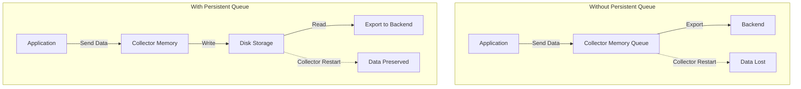

# How to Use Persistent Queue Storage in the Collector for Reliability

Author: [nawazdhandala](https://www.github.com/nawazdhandala)

Tags: OpenTelemetry, Collector, Reliability, Persistent Queue, Storage, Data Loss Prevention

Description: Implement persistent queue storage in OpenTelemetry Collector to prevent data loss during restarts, outages, and network failures with production-ready configurations.

The OpenTelemetry Collector's persistent queue feature is critical for preventing data loss in production environments. By storing telemetry data on disk rather than only in memory, the collector can survive restarts, temporary outages, and network failures without losing valuable observability data. This guide covers how to configure, tune, and monitor persistent queues effectively.

## Why Persistent Queues Matter

In-memory queues are volatile. When the collector restarts or crashes, all queued data is lost. This is particularly problematic in these scenarios:

- **Backend outages**: When your observability backend is temporarily unavailable
- **Network failures**: During connectivity issues between collector and backend
- **Collector restarts**: During configuration updates or version upgrades
- **Resource constraints**: When memory limits force data rejection
- **Deployment updates**: During rolling deployments in Kubernetes

Here's a comparison of data flow with and without persistent queues:


```mermaid
graph TB
    subgraph "Without Persistent Queue"
        A1[Application] -->|Send Data| A2[Collector Memory Queue]
        A2 -->|Export| A3[Backend]
        A2 -.->|Collector Restart| A4[Data Lost]
    end

    subgraph "With Persistent Queue"
        B1[Application] -->|Send Data| B2[Collector Memory]
        B2 -->|Write| B3[Disk Storage]
        B3 -->|Read| B4[Export to Backend]
        B3 -.->|Collector Restart| B5[Data Preserved]
    end
```

## Enabling Persistent Queue

The persistent queue is configured per exporter using the exporter's `sending_queue` settings and a storage extension. Here's a basic configuration:

```yaml
# config.yaml - Basic persistent queue configuration

extensions:
  # File storage extension provides disk-backed storage
  file_storage:
    # Directory where queue data is persisted
    # Must be writable by collector process
    directory: /var/lib/otelcol/queue
    # Create the directory if it does not already exist
    create_directory: true
    # Maximum time to wait for file locks
    timeout: 1s
    # Compact the underlying database to reclaim unused disk space
    compaction:
      # Directory used for temporary compaction files
      directory: /var/lib/otelcol/queue/compact
      # Compact online after the queue grows and then drains
      on_rebound: true

receivers:
  otlp:
    protocols:
      grpc:
        endpoint: 0.0.0.0:4317
      http:
        endpoint: 0.0.0.0:4318

processors:
  batch:
    timeout: 1s
    send_batch_size: 1024

exporters:
  otlp:
    endpoint: backend:4317
    tls:
      insecure: false
    # Enable persistent queue for this exporter
    sending_queue:
      enabled: true
      # Queue capacity, measured in batches by default
      queue_size: 1000
      # Reference to storage extension
      storage: file_storage
      # Number of concurrent export workers
      num_consumers: 10

service:
  # Register the file storage extension
  extensions: [file_storage]

  pipelines:
    traces:
      receivers: [otlp]
      processors: [batch]
      exporters: [otlp]
```

## Storage Extension Configuration

The file storage extension manages the on-disk queue. Key configuration options:

```yaml
# config.yaml - Advanced file storage configuration
extensions:
  file_storage:
    # Storage directory - must exist and be writable
    directory: /var/lib/otelcol/queue
    create_directory: true

    # Maximum time to wait for file locks
    timeout: 1s
    # Enable fsync after each write for stronger durability at a performance cost
    fsync: true

    # Compaction settings to reclaim unused disk space
    compaction:
      # Enable automatic compaction
      on_start: true
      on_rebound: true
      # Directory used for temporary compaction files
      directory: /var/lib/otelcol/queue/compact
      # Mark compaction as needed after allocated storage exceeds this size
      rebound_needed_threshold_mib: 512
      # Run compaction after used storage drops below this size
      rebound_trigger_threshold_mib: 64

  # Multiple storage backends for different exporters
  file_storage/traces:
    directory: /var/lib/otelcol/queue/traces
    create_directory: true
    compaction:
      directory: /var/lib/otelcol/queue/traces/compact
      rebound_needed_threshold_mib: 1024
      rebound_trigger_threshold_mib: 128

  file_storage/metrics:
    directory: /var/lib/otelcol/queue/metrics
    create_directory: true
    compaction:
      directory: /var/lib/otelcol/queue/metrics/compact
      rebound_needed_threshold_mib: 256
      rebound_trigger_threshold_mib: 32

exporters:
  # Traces exporter with larger persistent queue
  otlp/traces:
    endpoint: traces-backend:4317
    sending_queue:
      enabled: true
      queue_size: 2000
      storage: file_storage/traces
      num_consumers: 20

  # Metrics exporter with smaller persistent queue
  otlp/metrics:
    endpoint: metrics-backend:4317
    sending_queue:
      enabled: true
      queue_size: 500
      storage: file_storage/metrics
      num_consumers: 5
```

## Sizing Persistent Queues

Calculate appropriate queue sizes based on your throughput and recovery time objectives:

### Sizing Formula

```text
Required Storage (GB) = (throughput_per_sec × item_size_bytes × max_outage_seconds) / 1024^3
```

Example calculation:
- Throughput: 10,000 spans/sec
- Average span size: 2 KB
- Target recovery time: 1 hour (3,600 seconds)

```text
Storage = (10,000 × 2,048 × 3,600) / 1024^3
Storage = 68 GB
```

### Practical Sizing Guidelines

| Throughput | Item Size | 1 Hour Buffer | 4 Hour Buffer | 24 Hour Buffer |
|------------|-----------|---------------|---------------|----------------|
| 1,000/sec  | 2 KB      | 7 GB          | 28 GB         | 168 GB         |
| 10,000/sec | 2 KB      | 68 GB         | 272 GB        | 1.6 TB         |
| 50,000/sec | 2 KB      | 340 GB        | 1.3 TB        | 8 TB           |

Recommendations:
- **Development**: 1-4 hour buffer
- **Production**: 4-12 hour buffer
- **Critical systems**: 24+ hour buffer

## Production Configuration Example

Here's a production-ready configuration with persistent queues:

```yaml
# config.yaml - Production persistent queue setup
extensions:
  # Health check endpoint for Kubernetes probes
  health_check:
    endpoint: 0.0.0.0:13133

  # Persistent storage for traces
  file_storage/traces:
    directory: /var/lib/otelcol/queue/traces
    create_directory: true
    timeout: 1s
    compaction:
      on_start: true
      on_rebound: true
      directory: /var/lib/otelcol/queue/traces/compact
      rebound_needed_threshold_mib: 102400
      rebound_trigger_threshold_mib: 1024

  # Persistent storage for metrics
  file_storage/metrics:
    directory: /var/lib/otelcol/queue/metrics
    create_directory: true
    timeout: 1s
    compaction:
      directory: /var/lib/otelcol/queue/metrics/compact
      rebound_needed_threshold_mib: 51200
      rebound_trigger_threshold_mib: 512

  # Persistent storage for logs
  file_storage/logs:
    directory: /var/lib/otelcol/queue/logs
    create_directory: true
    timeout: 1s
    compaction:
      directory: /var/lib/otelcol/queue/logs/compact
      rebound_needed_threshold_mib: 51200
      rebound_trigger_threshold_mib: 512

receivers:
  otlp:
    protocols:
      grpc:
        endpoint: 0.0.0.0:4317
        max_recv_msg_size_mib: 32
      http:
        endpoint: 0.0.0.0:4318

processors:
  # Memory limiter to prevent OOM
  memory_limiter:
    check_interval: 1s
    limit_mib: 4096
    spike_limit_mib: 1024

  # Batch processor reduces export frequency
  batch:
    timeout: 1s
    send_batch_size: 1024
    send_batch_max_size: 2048

  # Resource detection adds host information
  resourcedetection:
    detectors: [env, system, docker]
    timeout: 5s

exporters:
  # Traces exporter with persistent queue
  otlp/traces:
    endpoint: traces-backend.example.com:4317
    tls:
      insecure: false
      cert_file: /etc/otelcol/certs/client.crt
      key_file: /etc/otelcol/certs/client.key
      ca_file: /etc/otelcol/certs/ca.crt
    # Retry configuration for transient failures
    retry_on_failure:
      enabled: true
      # Initial delay before retry
      initial_interval: 5s
      # Maximum delay between retries
      max_interval: 30s
      # Maximum time to keep retrying
      max_elapsed_time: 300s
    # Persistent queue configuration
    sending_queue:
      enabled: true
      # Queue capacity, measured in batches by default
      queue_size: 5000
      # Reference to persistent storage
      storage: file_storage/traces
      # Concurrent export workers
      num_consumers: 20

  # Metrics exporter with persistent queue
  otlp/metrics:
    endpoint: metrics-backend.example.com:4317
    tls:
      insecure: false
    retry_on_failure:
      enabled: true
      initial_interval: 5s
      max_interval: 30s
      max_elapsed_time: 300s
    sending_queue:
      enabled: true
      queue_size: 2000
      storage: file_storage/metrics
      num_consumers: 10

  # Logs exporter with persistent queue
  otlp/logs:
    endpoint: logs-backend.example.com:4317
    tls:
      insecure: false
    retry_on_failure:
      enabled: true
      initial_interval: 5s
      max_interval: 30s
      max_elapsed_time: 300s
    sending_queue:
      enabled: true
      queue_size: 2000
      storage: file_storage/logs
      num_consumers: 10

service:
  extensions: [health_check, file_storage/traces, file_storage/metrics, file_storage/logs]

  telemetry:
    logs:
      level: info
    metrics:
      level: detailed
      readers:
        - pull:
            exporter:
              prometheus:
                host: 0.0.0.0
                port: 8888
                without_type_suffix: true
                without_units: true

  pipelines:
    traces:
      receivers: [otlp]
      processors: [memory_limiter, resourcedetection, batch]
      exporters: [otlp/traces]

    metrics:
      receivers: [otlp]
      processors: [memory_limiter, resourcedetection, batch]
      exporters: [otlp/metrics]

    logs:
      receivers: [otlp]
      processors: [memory_limiter, batch]
      exporters: [otlp/logs]
```

## Kubernetes Deployment with Persistent Storage

Deploy the collector in Kubernetes with persistent volumes:

```yaml
# collector-deployment.yaml - Kubernetes deployment with persistent queue
apiVersion: apps/v1
kind: StatefulSet
metadata:
  name: otel-collector
  namespace: observability
spec:
  serviceName: otel-collector
  replicas: 3
  selector:
    matchLabels:
      app: otel-collector
  # Use StatefulSet for stable storage
  volumeClaimTemplates:
  - metadata:
      name: queue-storage
    spec:
      accessModes: [ "ReadWriteOnce" ]
      storageClassName: fast-ssd
      resources:
        requests:
          storage: 300Gi
  template:
    metadata:
      labels:
        app: otel-collector
    spec:
      containers:
      - name: otel-collector
        image: otel/opentelemetry-collector-contrib:0.153.0
        args:
          - --config=/conf/config.yaml
        ports:
        - containerPort: 4317
          name: otlp-grpc
        - containerPort: 4318
          name: otlp-http
        - containerPort: 8888
          name: metrics
        - containerPort: 13133
          name: health
        volumeMounts:
        - name: config
          mountPath: /conf
          readOnly: true
        - name: queue-storage
          # Must match directory in config
          mountPath: /var/lib/otelcol/queue
        resources:
          requests:
            cpu: 2000m
            memory: 4Gi
          limits:
            cpu: 4000m
            memory: 8Gi
        livenessProbe:
          httpGet:
            path: /
            port: 13133
          initialDelaySeconds: 30
          periodSeconds: 10
        readinessProbe:
          httpGet:
            path: /
            port: 13133
          initialDelaySeconds: 10
          periodSeconds: 5
      volumes:
      - name: config
        configMap:
          name: otel-collector-config
```

## Monitoring Persistent Queue Health

Monitor these metrics to ensure persistent queue is functioning correctly:

```yaml
# prometheus-rules.yaml - Alerts for persistent queue issues
groups:
- name: otel_collector_queue
  interval: 30s
  rules:
  # Alert when persistent queue is filling up
  - alert: CollectorQueueNearCapacity
    expr: |
      (otelcol_exporter_queue_size / otelcol_exporter_queue_capacity) > 0.8
    for: 5m
    labels:
      severity: warning
    annotations:
      summary: "Collector queue at {{ $value }}% capacity"
      description: "Exporter {{ $labels.exporter }} queue is filling up"

  # Alert when data is being rejected
  - alert: CollectorEnqueueFailed
    expr: |
      rate(otelcol_exporter_enqueue_failed_spans[5m]) > 0
    for: 1m
    labels:
      severity: critical
    annotations:
      summary: "Collector rejecting data"
      description: "Exporter {{ $labels.exporter }} cannot enqueue data"

  # Alert when persistent storage disk is full
  - alert: CollectorDiskFull
    expr: |
      (node_filesystem_avail_bytes{mountpoint="/var/lib/otelcol/queue"}
       / node_filesystem_size_bytes{mountpoint="/var/lib/otelcol/queue"}) < 0.1
    for: 5m
    labels:
      severity: critical
    annotations:
      summary: "Collector persistent queue disk nearly full"
      description: "Only {{ $value }}% disk space remaining"
```

Key metrics to monitor:

```promql
# Queue size utilization
otelcol_exporter_queue_size / otelcol_exporter_queue_capacity

# Enqueue failures (data loss)
rate(otelcol_exporter_enqueue_failed_spans[5m])

# Items successfully sent
rate(otelcol_exporter_sent_spans[5m])

# Items that failed to send
rate(otelcol_exporter_send_failed_spans[5m])

# Disk usage for queue storage
node_filesystem_avail_bytes{mountpoint="/var/lib/otelcol/queue"}
```

## Testing Persistent Queue Reliability

Verify persistent queue works by simulating failures:

```bash
# Test 1: Backend unavailability
# Start collector with persistent queue
docker run -d --name otel-collector \
  -p 4317:4317 -p 4318:4318 -p 8888:8888 \
  -v $(pwd)/config.yaml:/etc/otelcol/config.yaml \
  -v /tmp/otel-queue:/var/lib/otelcol/queue \
  otel/opentelemetry-collector-contrib:0.153.0

# Generate test data
telemetrygen traces --otlp-endpoint localhost:4317 \
  --otlp-insecure --rate 1000 --duration 60s

# Stop backend (simulate outage)
docker stop backend-container

# Continue sending data - should queue to disk
telemetrygen traces --otlp-endpoint localhost:4317 \
  --otlp-insecure --rate 1000 --duration 120s

# Check disk queue is filling
ls -lh /tmp/otel-queue/

# Restart backend
docker start backend-container

# Verify data drains from queue
watch -n 1 'ls -lh /tmp/otel-queue/'
```

Test collector restart resilience:

```bash
# Test 2: Collector restart
# Send data while collector is running
telemetrygen traces --otlp-endpoint localhost:4317 \
  --otlp-insecure --rate 5000 --duration 300s &

# After 60 seconds, restart collector
sleep 60
docker restart otel-collector

# Verify:
# 1. Queue data persists on disk during restart
# 2. Collector resumes processing after restart
# 3. No data loss (check backend for continuous timestamps)
```

## Performance Considerations

Persistent queues add overhead compared to memory-only queues. Optimize performance:

### Use Fast Storage

```yaml
# Kubernetes: Use SSD storage class
storageClassName: fast-ssd  # or gp3, premium-ssd, etc.

# Docker: Mount tmpfs only for high-performance tests.
# tmpfs is memory-backed and is not persistent across host or container restarts.
volumes:
  - type: tmpfs
    target: /var/lib/otelcol/queue
    tmpfs:
      size: 10G
```

### Tune Disk Sync Behavior

```yaml
extensions:
  file_storage:
    directory: /var/lib/otelcol/queue
    # fsync after each write improves durability but reduces performance
    fsync: true
```

### Adjust Queue Size

```yaml
exporters:
  otlp:
    sending_queue:
      # Larger queue capacity absorbs longer outages
      # But requires more disk space when persistent storage is enabled
      queue_size: 10000  # Default is 1000
      storage: file_storage
```

### Monitor Latency Impact

```promql
# Watch for queue buildup that can indicate export latency or backend slowness
otelcol_exporter_queue_size / otelcol_exporter_queue_capacity
```

## Handling Disk Full Scenarios

When persistent queue disk fills up, the collector must reject new data:

```yaml
# config.yaml - Disk full handling
extensions:
  file_storage:
    directory: /var/lib/otelcol/queue
    create_directory: true
    compaction:
      # Reclaim unused disk space after the queue grows and drains
      directory: /var/lib/otelcol/queue/compact
      rebound_needed_threshold_mib: 102400
      rebound_trigger_threshold_mib: 1024
      # Compact on startup to recover space
      on_start: true

processors:
  # Memory limiter prevents memory issues when queue is full
  memory_limiter:
    check_interval: 1s
    limit_mib: 2048
```

Set up alerting before disk fills:

```yaml
# Alert when disk usage exceeds 80%
- alert: CollectorQueueDiskHigh
  expr: |
    (1 - (node_filesystem_avail_bytes{mountpoint="/var/lib/otelcol/queue"}
          / node_filesystem_size_bytes{mountpoint="/var/lib/otelcol/queue"})) > 0.8
  for: 15m
  labels:
    severity: warning
```

## Migration from Memory-Only Queues

Migrate existing deployments to use persistent queues:

```yaml
# Step 1: Add file storage extension
extensions:
  file_storage:
    directory: /var/lib/otelcol/queue
    create_directory: true

# Step 2: Update exporters to reference storage
exporters:
  otlp:
    endpoint: backend:4317
    sending_queue:
      enabled: true
      queue_size: 1000
      # Add this line
      storage: file_storage
      num_consumers: 10

# Step 3: Register extension in service
service:
  extensions: [file_storage]  # Add here
```

Rolling update strategy for Kubernetes:

```bash
# Update ConfigMap with new configuration
kubectl apply -f otel-collector-configmap.yaml

# Perform rolling restart with readiness checks
kubectl rollout restart statefulset/otel-collector -n observability

# Monitor rollout
kubectl rollout status statefulset/otel-collector -n observability

# Verify persistent volumes are mounted
kubectl describe pod -n observability -l app=otel-collector | grep queue
```

## Troubleshooting Common Issues

### Issue: Permission Denied

```bash
# Error: failed to create queue storage directory
# Solution: Ensure directory is writable

# In Kubernetes, use init container:
initContainers:
- name: setup-queue-dir
  image: busybox:latest
  command: ['sh', '-c', 'mkdir -p /var/lib/otelcol/queue && chmod 777 /var/lib/otelcol/queue']
  volumeMounts:
  - name: queue-storage
    mountPath: /var/lib/otelcol/queue
```

### Issue: Queue Not Draining

```bash
# Check if backend is reachable
kubectl run -it --rm connectivity-check \
  --image=busybox:latest \
  --restart=Never \
  -n observability \
  -- nc -vz backend 4317

# Check exporter metrics
curl -s http://localhost:8888/metrics | grep exporter_send_failed

# Increase num_consumers if needed
```

### Issue: High Disk I/O

```bash
# Monitor disk I/O
iostat -x 1

# Solution: Disable fsync if your durability requirements allow it
# Or use faster storage (SSD instead of HDD)
```

## Conclusion

Persistent queues are essential for production OpenTelemetry Collector deployments, providing resilience against restarts, outages, and network failures. Properly size your persistent storage based on throughput and recovery time objectives, monitor queue health metrics, and test failure scenarios before production deployment. While persistent queues add some performance overhead, the reliability benefits far outweigh the costs for critical telemetry pipelines.

For more information on collector reliability, see related posts:
- https://oneuptime.com/blog/post/2026-02-06-right-size-cpu-memory-opentelemetry-collector/view
- https://oneuptime.com/blog/post/2026-02-06-benchmark-collector-telemetrygen/view
- https://oneuptime.com/blog/post/2026-02-06-troubleshoot-collector-not-exporting-data/view
