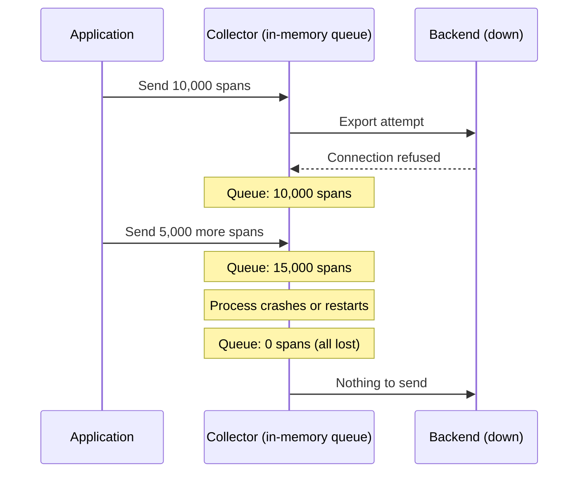
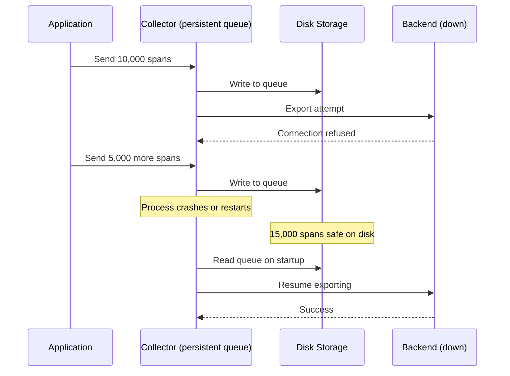
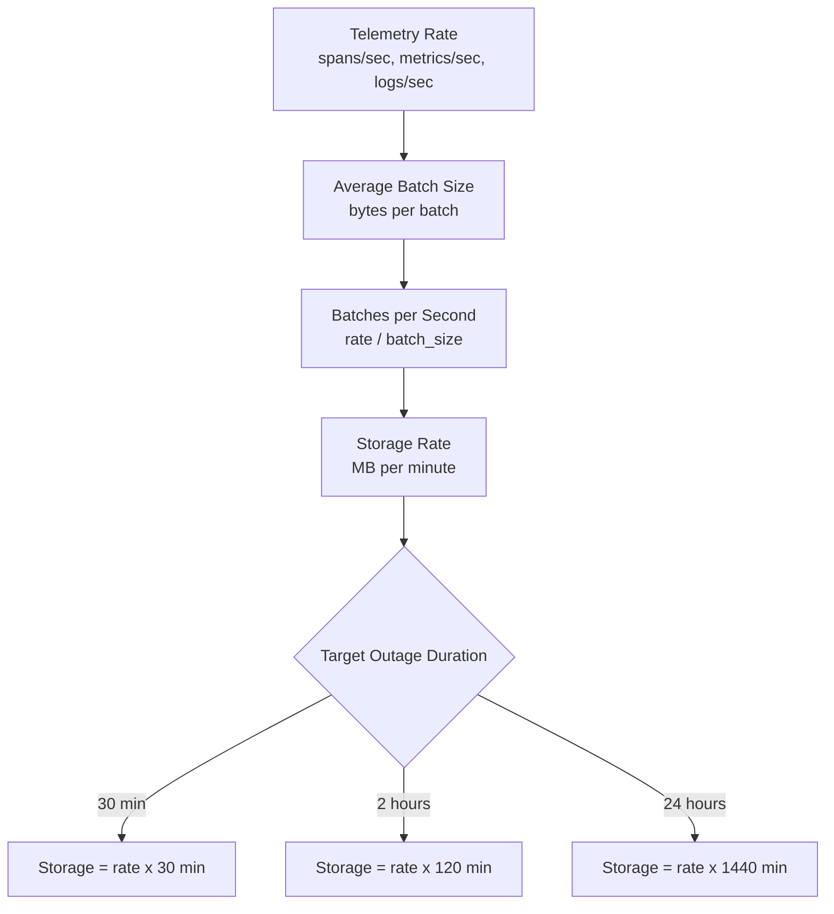

# How to Implement Persistent Storage for OpenTelemetry Collector Queues

Author: [nawazdhandala](https://www.github.com/nawazdhandala)

Tags: OpenTelemetry, Collector, Persistent Storage, Queues, Reliability

Description: Configure persistent queue storage in the OpenTelemetry Collector to prevent telemetry data loss during restarts, crashes, and backend outages.

---

By default, the OpenTelemetry Collector keeps its export queues in memory. If the collector process restarts, crashes, or gets killed by the OOM killer, everything in those queues is gone. For teams where losing telemetry data is not acceptable, the collector supports persistent queue storage backed by disk. This post shows you how to set it up, tune it, and avoid the common pitfalls.

## The Problem with In-Memory Queues

Here is what happens with in-memory queues during a typical failure:



With persistent storage, the data survives:



## Enabling Persistent Queues

The persistent queue feature uses the `file_storage` extension. Add it to your collector configuration:

```yaml
# config.yaml
# Enable persistent storage for export queues

extensions:
  # The file_storage extension manages on-disk queue storage
  file_storage/queue:
    # Directory where queue data will be stored
    directory: /var/lib/otel-collector/queue
    # Maximum time to wait for a file operation
    timeout: 10s
    # Fsync after every write for maximum durability
    # Set to false for better performance at the risk of losing
    # the last few writes during a power failure
    fsync: false
    # Optional: compact the storage periodically to reclaim space
    compaction:
      # Run compaction when the on-disk size exceeds this
      on_rebound: true
      # Target directory for temporary compaction files
      directory: /tmp/otel-compaction

  health_check:
    endpoint: "0.0.0.0:13133"

receivers:
  otlp:
    protocols:
      grpc:
        endpoint: "0.0.0.0:4317"
      http:
        endpoint: "0.0.0.0:4318"

processors:
  memory_limiter:
    check_interval: 1s
    limit_percentage: 80
    spike_limit_percentage: 25

  batch:
    timeout: 5s
    send_batch_size: 8192

exporters:
  otlp:
    endpoint: "backend.example.com:4317"

    # Configure the sending queue to use persistent storage
    sending_queue:
      enabled: true
      # Number of consumers draining the queue
      num_consumers: 10
      # Maximum number of batches in the queue
      queue_size: 10000
      # Link to the file_storage extension for persistence
      storage: file_storage/queue

    retry_on_failure:
      enabled: true
      initial_interval: 5s
      max_interval: 30s
      max_elapsed_time: 300s

service:
  extensions: [file_storage/queue, health_check]
  pipelines:
    traces:
      receivers: [otlp]
      processors: [memory_limiter, batch]
      exporters: [otlp]
    metrics:
      receivers: [otlp]
      processors: [memory_limiter, batch]
      exporters: [otlp]
    logs:
      receivers: [otlp]
      processors: [memory_limiter, batch]
      exporters: [otlp]
```

## Storage Directory Setup

The storage directory needs to exist and have the right permissions before the collector starts:

```bash
#!/bin/bash
# setup-storage.sh
# Prepare the persistent storage directory for the collector

STORAGE_DIR="/var/lib/otel-collector/queue"
COMPACTION_DIR="/tmp/otel-compaction"
COLLECTOR_USER="otel"

# Create the storage directory
mkdir -p "${STORAGE_DIR}"
mkdir -p "${COMPACTION_DIR}"

# Set ownership to the collector's user
chown -R "${COLLECTOR_USER}:${COLLECTOR_USER}" "${STORAGE_DIR}"
chown -R "${COLLECTOR_USER}:${COLLECTOR_USER}" "${COMPACTION_DIR}"

# Set permissions - only the collector user needs access
chmod 750 "${STORAGE_DIR}"
chmod 750 "${COMPACTION_DIR}"

echo "Storage directories ready."
ls -la "${STORAGE_DIR}"
```

## Multiple Storage Instances

You can create separate storage instances for different pipelines. This is useful when you want different durability or size settings per signal type:

```yaml
extensions:
  # High-durability storage for traces (most valuable data)
  file_storage/traces:
    directory: /var/lib/otel-collector/traces
    timeout: 10s
    fsync: true  # Sync every write for maximum durability
    compaction:
      on_rebound: true
      directory: /tmp/otel-compaction-traces

  # Standard storage for metrics (periodic data, easier to reconstruct)
  file_storage/metrics:
    directory: /var/lib/otel-collector/metrics
    timeout: 5s
    fsync: false  # Faster writes, acceptable to lose a few on crash

  # Standard storage for logs
  file_storage/logs:
    directory: /var/lib/otel-collector/logs
    timeout: 5s
    fsync: false

exporters:
  otlp/traces:
    endpoint: "backend.example.com:4317"
    sending_queue:
      enabled: true
      queue_size: 20000
      storage: file_storage/traces
    retry_on_failure:
      enabled: true

  otlp/metrics:
    endpoint: "backend.example.com:4317"
    sending_queue:
      enabled: true
      queue_size: 10000
      storage: file_storage/metrics
    retry_on_failure:
      enabled: true

  otlp/logs:
    endpoint: "backend.example.com:4317"
    sending_queue:
      enabled: true
      queue_size: 15000
      storage: file_storage/logs
    retry_on_failure:
      enabled: true

service:
  extensions: [file_storage/traces, file_storage/metrics, file_storage/logs]
  pipelines:
    traces:
      receivers: [otlp]
      processors: [memory_limiter, batch]
      exporters: [otlp/traces]
    metrics:
      receivers: [otlp]
      processors: [memory_limiter, batch]
      exporters: [otlp/metrics]
    logs:
      receivers: [otlp]
      processors: [memory_limiter, batch]
      exporters: [otlp/logs]
```

## Kubernetes Deployment with Persistent Volumes

In Kubernetes, use a PersistentVolumeClaim to back the storage directory:

```yaml
# kubernetes/collector-statefulset.yaml
# Use a StatefulSet instead of a Deployment for stable storage

apiVersion: apps/v1
kind: StatefulSet
metadata:
  name: otel-collector
  namespace: observability
spec:
  serviceName: otel-collector
  replicas: 3
  selector:
    matchLabels:
      app: otel-collector
  template:
    metadata:
      labels:
        app: otel-collector
    spec:
      serviceAccountName: otel-collector
      containers:
        - name: collector
          image: ghcr.io/myorg/custom-collector:latest
          args: ["--config", "/etc/otel/config.yaml"]
          ports:
            - containerPort: 4317
              name: otlp-grpc
            - containerPort: 4318
              name: otlp-http
            - containerPort: 13133
              name: health
          livenessProbe:
            httpGet:
              path: /health
              port: 13133
            initialDelaySeconds: 10
            periodSeconds: 15
          readinessProbe:
            httpGet:
              path: /health
              port: 13133
            initialDelaySeconds: 5
            periodSeconds: 10
          resources:
            requests:
              cpu: 500m
              memory: 512Mi
            limits:
              cpu: 2000m
              memory: 2Gi
          volumeMounts:
            - name: config
              mountPath: /etc/otel
            - name: queue-storage
              mountPath: /var/lib/otel-collector/queue
      volumes:
        - name: config
          configMap:
            name: otel-collector-config

  # PersistentVolumeClaim template for each pod in the StatefulSet
  volumeClaimTemplates:
    - metadata:
        name: queue-storage
      spec:
        accessModes: ["ReadWriteOnce"]
        storageClassName: fast-ssd
        resources:
          requests:
            # Size this based on your expected queue depth
            # and average telemetry batch size
            storage: 10Gi
```

Create a StorageClass optimized for queue workloads:

```yaml
# kubernetes/storage-class.yaml
# SSD-backed storage class for low-latency queue operations

apiVersion: storage.k8s.io/v1
kind: StorageClass
metadata:
  name: fast-ssd
provisioner: kubernetes.io/aws-ebs  # Adjust for your cloud provider
parameters:
  type: gp3
  iopsPerGB: "50"
reclaimPolicy: Retain  # Keep data if the pod is deleted
volumeBindingMode: WaitForFirstConsumer
allowVolumeExpansion: true
```

## Sizing the Storage

Figuring out how much disk space you need depends on your telemetry volume and how long you want to survive a backend outage.



Here is a rough calculation:

```bash
#!/bin/bash
# estimate-storage.sh
# Estimate how much disk storage you need for persistent queues

# Your telemetry rates (adjust these to match your environment)
SPANS_PER_SEC=5000
METRICS_PER_SEC=10000
LOGS_PER_SEC=2000

# Average size per item in bytes (compressed on disk)
BYTES_PER_SPAN=500
BYTES_PER_METRIC=200
BYTES_PER_LOG=300

# How long you want to survive a backend outage (in seconds)
TARGET_OUTAGE_SECONDS=7200  # 2 hours

# Calculate storage needed
TRACE_BYTES=$((SPANS_PER_SEC * BYTES_PER_SPAN * TARGET_OUTAGE_SECONDS))
METRIC_BYTES=$((METRICS_PER_SEC * BYTES_PER_METRIC * TARGET_OUTAGE_SECONDS))
LOG_BYTES=$((LOGS_PER_SEC * BYTES_PER_LOG * TARGET_OUTAGE_SECONDS))
TOTAL_BYTES=$((TRACE_BYTES + METRIC_BYTES + LOG_BYTES))

# Convert to GB with 20% overhead for filesystem metadata
TOTAL_GB=$(echo "scale=1; ${TOTAL_BYTES} / 1073741824 * 1.2" | bc)

echo "Storage estimate for ${TARGET_OUTAGE_SECONDS}s outage:"
echo "  Traces:  $((TRACE_BYTES / 1073741824)) GB"
echo "  Metrics: $((METRIC_BYTES / 1073741824)) GB"
echo "  Logs:    $((LOG_BYTES / 1073741824)) GB"
echo "  Total (with 20% overhead): ${TOTAL_GB} GB"
```

## Monitoring Queue Health

Keep an eye on persistent queue metrics to know when you are approaching limits:

```yaml
service:
  telemetry:
    metrics:
      address: "0.0.0.0:8888"
      level: detailed
```

Key metrics to monitor:

| Metric | Meaning | Alert When |
|---|---|---|
| `otelcol_exporter_queue_size` | Current items in queue | > 80% of queue_size |
| `otelcol_exporter_queue_capacity` | Maximum queue capacity | N/A (static) |
| `otelcol_exporter_enqueue_failed_spans` | Spans that could not be queued | > 0 |

Set up a Prometheus alert for queue saturation:

```yaml
# prometheus-rules.yaml
groups:
  - name: otel-collector-queue
    rules:
      - alert: CollectorQueueNearFull
        expr: |
          otelcol_exporter_queue_size /
          otelcol_exporter_queue_capacity > 0.8
        for: 5m
        labels:
          severity: warning
        annotations:
          summary: "OTel Collector queue is {{ $value | humanizePercentage }} full"
          description: "The persistent queue on {{ $labels.instance }} is approaching capacity. Check the backend for connectivity issues."

      - alert: CollectorQueueFull
        expr: |
          otelcol_exporter_queue_size >=
          otelcol_exporter_queue_capacity
        for: 1m
        labels:
          severity: critical
        annotations:
          summary: "OTel Collector queue is FULL"
          description: "Data is being dropped on {{ $labels.instance }}. The backend is unreachable or too slow."

      - alert: CollectorDiskUsageHigh
        expr: |
          node_filesystem_avail_bytes{mountpoint="/var/lib/otel-collector"} /
          node_filesystem_size_bytes{mountpoint="/var/lib/otel-collector"} < 0.2
        for: 5m
        labels:
          severity: warning
        annotations:
          summary: "OTel Collector storage disk is {{ $value | humanizePercentage }} free"
```

## Testing Persistent Queues

Verify that your persistent queue actually works by simulating failures:

```bash
#!/bin/bash
# test-persistent-queue.sh
# Verify data survives a collector restart

set -euo pipefail

COLLECTOR_BIN="./dist/otelcol-custom"
CONFIG="config.yaml"
STORAGE_DIR="/tmp/otel-test-queue"

# Clean up from previous runs
rm -rf "${STORAGE_DIR}"
mkdir -p "${STORAGE_DIR}"

echo "Step 1: Start collector..."
${COLLECTOR_BIN} --config ${CONFIG} &
COLLECTOR_PID=$!
sleep 5

echo "Step 2: Send test data..."
docker run --rm --network host \
  ghcr.io/open-telemetry/opentelemetry-collector-contrib/telemetrygen:latest \
  traces --otlp-insecure --traces 1000 --otlp-endpoint localhost:4317

echo "Step 3: Kill collector (simulating crash)..."
kill -9 ${COLLECTOR_PID}
sleep 2

echo "Step 4: Check storage directory..."
QUEUE_FILES=$(ls -la "${STORAGE_DIR}" | wc -l)
echo "  Queue files on disk: ${QUEUE_FILES}"

if [ "${QUEUE_FILES}" -le 1 ]; then
  echo "FAIL: No queue data found on disk"
  exit 1
fi

echo "Step 5: Restart collector..."
${COLLECTOR_BIN} --config ${CONFIG} &
COLLECTOR_PID=$!
sleep 10

echo "Step 6: Check that queued data was processed..."
# Check collector logs for evidence of draining the queue
# The exact log message depends on the exporter

kill ${COLLECTOR_PID}
echo "Test complete. Persistent queue is working."
```

## Performance Considerations

Persistent queues add disk I/O overhead. Here are tuning tips:

```yaml
extensions:
  file_storage/queue:
    directory: /var/lib/otel-collector/queue
    # Increase timeout if using network-attached storage
    timeout: 30s
    # fsync: true gives maximum durability but costs performance
    # fsync: false is faster and acceptable for most use cases
    # since the OS will flush to disk periodically anyway
    fsync: false
    compaction:
      on_rebound: true
      # Use a separate disk for compaction temp files if possible
      directory: /tmp/otel-compaction
```

Performance comparison:

| Setting | Write Throughput | Durability | Use Case |
|---|---|---|---|
| `fsync: true` | ~5,000 batches/sec | Survives power loss | Critical telemetry |
| `fsync: false` | ~20,000 batches/sec | Survives process crash | Most environments |
| In-memory only | ~50,000 batches/sec | Nothing survives | Development/testing |

## Wrapping Up

Persistent queues are the safety net between your applications and your observability backend. They turn a collector restart from a data-loss event into a non-event. The setup is straightforward: add the `file_storage` extension, point your exporter queues at it, and make sure the storage directory has enough space for your expected outage duration. In Kubernetes, use a StatefulSet with PersistentVolumeClaims. Monitor queue depth and disk usage, and test the failure-recovery cycle before you need it in production.
