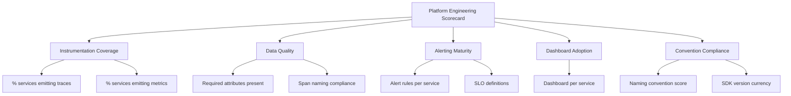

# How to Build a Platform Engineering Scorecard That Tracks OpenTelemetry Adoption Metrics

Author: [nawazdhandala](https://www.github.com/nawazdhandala)

Tags: OpenTelemetry, Platform Engineering, Adoption Metrics, Scorecard

Description: Build a platform engineering scorecard that measures OpenTelemetry adoption, instrumentation quality, and observability maturity across all teams and services.

You cannot improve what you do not measure. Rolling out OpenTelemetry across an organization is a multi-quarter effort, and without a scorecard, you have no visibility into whether adoption is growing, stalling, or regressing. A platform engineering scorecard tracks concrete metrics: how many services emit traces, which teams have alerts configured, what percentage of spans follow naming conventions, and where the gaps are.

The scorecard serves two audiences. Platform engineers use it to identify teams that need help. Engineering leadership uses it to understand the return on investment in observability infrastructure.

## Scorecard Dimensions

Break the scorecard into dimensions that reflect different aspects of observability maturity. Each dimension has measurable indicators that can be computed from your telemetry backend and service catalog.



## Defining the Scoring Model

Each dimension gets a score from 0 to 100. The overall scorecard is a weighted average. Define the scoring criteria in a configuration that can evolve as your standards mature.

```yaml
# scorecard/scoring-model.yaml
dimensions:
  instrumentation_coverage:
    weight: 0.30
    indicators:
      traces_enabled:
        description: "Service emits at least 1 span per minute"
        weight: 0.4
        scoring:
          - threshold: true
            score: 100
          - threshold: false
            score: 0

      metrics_enabled:
        description: "Service emits HTTP server metrics"
        weight: 0.3
        scoring:
          - threshold: true
            score: 100
          - threshold: false
            score: 0

      logs_structured:
        description: "Service emits structured logs via OTLP"
        weight: 0.3
        scoring:
          - threshold: true
            score: 100
          - threshold: false
            score: 0

  data_quality:
    weight: 0.25
    indicators:
      required_attributes:
        description: "All required resource attributes present"
        weight: 0.5
        scoring:
          - threshold: 4   # all 4 required attributes
            score: 100
          - threshold: 3
            score: 75
          - threshold: 2
            score: 50
          - threshold: 1
            score: 25

      span_naming:
        description: "Percentage of spans following naming conventions"
        weight: 0.5
        scoring: linear  # 0-100% maps to 0-100 score

  alerting_maturity:
    weight: 0.20
    indicators:
      has_error_rate_alert:
        weight: 0.4
      has_latency_alert:
        weight: 0.3
      has_slo_definition:
        weight: 0.3

  convention_compliance:
    weight: 0.25
    indicators:
      sdk_version_current:
        description: "Using latest supported SDK wrapper version"
        weight: 0.5
      attribute_naming:
        description: "Custom attributes follow naming conventions"
        weight: 0.5
```

## Computing Scores from Telemetry Data

The scorecard engine queries your telemetry backend and service catalog to compute each indicator.

```python
# scorecard/engine.py
from dataclasses import dataclass
from typing import List, Dict
import requests

@dataclass
class IndicatorResult:
    name: str
    score: float
    details: str

@dataclass
class DimensionResult:
    name: str
    score: float
    indicators: List[IndicatorResult]

@dataclass
class ServiceScorecard:
    service_name: str
    team_name: str
    overall_score: float
    dimensions: List[DimensionResult]
    computed_at: str

METRICS_API = "https://metrics.internal/api/v1/query"
CATALOG_API = "https://service-catalog.internal/api/v1"

def check_traces_enabled(service_name: str) -> IndicatorResult:
    """Check if a service is actively emitting traces."""
    query = f'sum(rate(traces_spanmetricsconnector_duration_seconds_count{{service_name="{service_name}"}}[1h]))'
    result = requests.get(METRICS_API, params={"query": query})
    data = result.json()["data"]["result"]

    has_traces = len(data) > 0 and float(data[0]["value"][1]) > 0
    return IndicatorResult(
        name="traces_enabled",
        score=100.0 if has_traces else 0.0,
        details=f"Span rate: {data[0]['value'][1]}/s" if has_traces else "No traces detected",
    )

def check_required_attributes(service_name: str) -> IndicatorResult:
    """Check how many required resource attributes are present."""
    required = ["service.name", "team.name", "deployment.environment", "service.version"]
    present = 0

    # Query a recent span to check resource attributes
    query = f'resource.service.name = "{service_name}"'
    result = requests.get(
        "https://traces.internal/api/v1/search",
        params={"q": query, "limit": 1},
    )
    if result.json().get("traces"):
        resource_attrs = result.json()["traces"][0].get("resource", {})
        for attr in required:
            if attr in resource_attrs:
                present += 1

    score_map = {4: 100, 3: 75, 2: 50, 1: 25, 0: 0}
    return IndicatorResult(
        name="required_attributes",
        score=score_map.get(present, 0),
        details=f"{present}/{len(required)} required attributes present",
    )

def check_sdk_version(service_name: str) -> IndicatorResult:
    """Check if the service uses the current SDK wrapper version."""
    # Query the telemetry.sdk.wrapper resource attribute
    query = f'resource.service.name = "{service_name}"'
    result = requests.get(
        "https://traces.internal/api/v1/search",
        params={"q": query, "limit": 1},
    )

    current_version = "internal-v2"
    if result.json().get("traces"):
        wrapper_version = (
            result.json()["traces"][0]
            .get("resource", {})
            .get("telemetry.sdk.wrapper", "none")
        )
        is_current = wrapper_version == current_version
    else:
        wrapper_version = "unknown"
        is_current = False

    return IndicatorResult(
        name="sdk_version_current",
        score=100.0 if is_current else 0.0,
        details=f"Wrapper version: {wrapper_version} (current: {current_version})",
    )
```

## Aggregating Scores by Team

The most useful view is per-team aggregation. It shows which teams are fully onboarded and which need support.

```python
# scorecard/aggregator.py
from typing import List, Dict

def aggregate_team_scores(
    service_scorecards: List[ServiceScorecard],
) -> Dict[str, dict]:
    """
    Aggregate individual service scores into team-level summaries.
    Returns a dict keyed by team name with average scores and details.
    """
    teams = {}
    for sc in service_scorecards:
        if sc.team_name not in teams:
            teams[sc.team_name] = {
                "services": [],
                "scores": [],
            }
        teams[sc.team_name]["services"].append(sc.service_name)
        teams[sc.team_name]["scores"].append(sc.overall_score)

    result = {}
    for team_name, data in teams.items():
        scores = data["scores"]
        result[team_name] = {
            "team": team_name,
            "service_count": len(scores),
            "average_score": round(sum(scores) / len(scores), 1),
            "min_score": round(min(scores), 1),
            "max_score": round(max(scores), 1),
            "services_below_50": sum(1 for s in scores if s < 50),
        }

    return result
```

## Scorecard API and Reporting

Expose the scorecard through an API that your internal portal and reporting tools consume. Schedule a weekly computation and store historical results to track trends.

```python
# scorecard/api.py
from flask import Flask, jsonify
from scorecard.engine import compute_scorecard
from scorecard.aggregator import aggregate_team_scores

app = Flask(__name__)

@app.route("/api/v1/scorecard/services/<service_name>")
def service_scorecard(service_name: str):
    """Get the current scorecard for a single service."""
    scorecard = compute_scorecard(service_name)
    return jsonify({
        "service": scorecard.service_name,
        "team": scorecard.team_name,
        "overall_score": scorecard.overall_score,
        "dimensions": [
            {
                "name": d.name,
                "score": d.score,
                "indicators": [
                    {"name": i.name, "score": i.score, "details": i.details}
                    for i in d.indicators
                ],
            }
            for d in scorecard.dimensions
        ],
    })

@app.route("/api/v1/scorecard/teams")
def team_scorecards():
    """Get aggregated scorecards for all teams."""
    all_services = get_all_services_from_catalog()
    scorecards = [compute_scorecard(s) for s in all_services]
    team_summary = aggregate_team_scores(scorecards)

    return jsonify({
        "teams": list(team_summary.values()),
        "org_average": round(
            sum(t["average_score"] for t in team_summary.values())
            / len(team_summary),
            1,
        ),
    })
```

## Using the Scorecard to Drive Adoption

The scorecard is a conversation starter, not a judgment tool. When a team scores 30/100 on instrumentation coverage, the platform team reaches out to offer help, not to assign blame. Common patterns that the scorecard reveals include teams that adopted traces but skipped metrics, services running outdated SDK versions, and alert rules that reference the wrong metric names.

Run the scorecard weekly and share results in a summary that highlights improvements and flags regressions. Celebrate teams that improve their scores. Over time, the organizational average should trend upward as more teams reach full observability maturity. If it plateaus, look at the lowest-scoring dimensions to understand where the friction is and invest in tooling to remove it.
