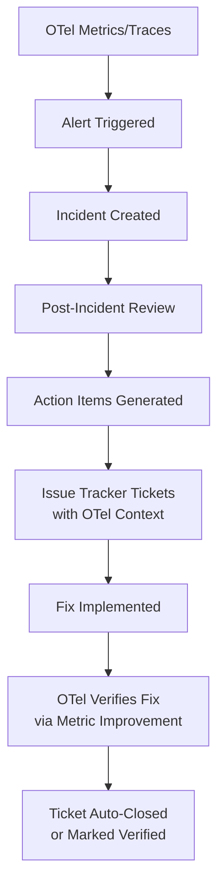

# How to Automate Post-Incident Action Item Tracking with OpenTelemetry and Issue Trackers

Author: [nawazdhandala](https://www.github.com/nawazdhandala)

Tags: OpenTelemetry, Incident Management, Automation, SRE

Description: Automate the creation and tracking of post-incident action items by connecting OpenTelemetry alert data to issue trackers like Jira and GitHub Issues.

Post-incident reviews produce action items. Those action items go into a tracker. Then, in many organizations, they sit there. Completion rates for post-incident action items are often below 50%, not because teams do not care, but because the items lose context and priority over time.

Connecting OpenTelemetry alert and incident data directly to issue trackers creates a feedback loop: incidents generate specific, context-rich tickets, and the resolution of those tickets can be verified through the same telemetry that detected the problem.

## The Feedback Loop



## Capturing Incident Context from OpenTelemetry

When an alert fires, capture the telemetry context that triggered it. This context becomes the foundation of the action item.

```python
# incident_context.py - Capture OTel alert context for action items
from dataclasses import dataclass, field
from datetime import datetime
from typing import Optional

@dataclass
class IncidentContext:
    """Structured context from an OpenTelemetry alert."""
    alert_name: str
    metric_name: str
    threshold_value: float
    actual_value: float
    service_name: str
    environment: str
    triggered_at: datetime
    # Trace IDs from the time window of the incident
    sample_trace_ids: list = field(default_factory=list)
    # Related metric snapshots
    related_metrics: dict = field(default_factory=dict)
    # Affected endpoints or components
    affected_components: list = field(default_factory=list)

    def to_markdown(self) -> str:
        """Format context as markdown for issue tracker descriptions."""
        traces_section = "\n".join(
            f"- `{tid}`" for tid in self.sample_trace_ids[:5]
        )
        metrics_section = "\n".join(
            f"- **{k}**: {v}" for k, v in self.related_metrics.items()
        )

        return f"""## Incident Context (Auto-Generated from OpenTelemetry)

**Alert**: {self.alert_name}
**Service**: {self.service_name}
**Environment**: {self.environment}
**Triggered At**: {self.triggered_at.isoformat()}

### Metric That Triggered Alert
- **Metric**: `{self.metric_name}`
- **Threshold**: {self.threshold_value}
- **Actual Value**: {self.actual_value}

### Sample Trace IDs
{traces_section}

### Related Metrics at Time of Incident
{metrics_section}

### Affected Components
{', '.join(self.affected_components)}
"""
```

## Generating Action Items from Incident Reviews

After a post-incident review, the team identifies action items. Each action item should reference the incident context and include a verification metric - a specific OpenTelemetry metric that should improve once the fix is deployed.

```python
# action_item.py - Define action items with verification metrics
from dataclasses import dataclass
from typing import Optional

@dataclass
class ActionItem:
    title: str
    description: str
    priority: str  # P0, P1, P2, P3
    assignee: str
    incident_id: str
    incident_context: IncidentContext
    # The metric to check after the fix is deployed
    verification_metric: str
    verification_condition: str  # e.g., "< 100ms p99" or "error_rate < 0.1%"
    # How long to wait after fix before verifying
    verification_delay_hours: int = 48
    labels: list = None

    def to_issue_body(self) -> str:
        """Generate the full issue body for the tracker."""
        return f"""{self.description}

{self.incident_context.to_markdown()}

## Verification Criteria
Once implemented, this fix will be verified by checking:
- **Metric**: `{self.verification_metric}`
- **Expected**: {self.verification_condition}
- **Verification Window**: {self.verification_delay_hours} hours after deployment

This ticket was auto-generated from incident **{self.incident_id}**.
"""
```

## Pushing Action Items to Jira

Here is the integration that creates Jira issues from action items with full context.

```python
# jira_integration.py - Create Jira issues from post-incident action items
import requests
from typing import List

class JiraActionItemCreator:
    def __init__(self, base_url: str, email: str, api_token: str, project_key: str):
        self.base_url = base_url
        self.auth = (email, api_token)
        self.project_key = project_key

    def create_issue(self, action_item: ActionItem) -> str:
        """Create a Jira issue from an action item. Returns the issue key."""
        # Map priority to Jira priority IDs
        priority_map = {"P0": "1", "P1": "2", "P2": "3", "P3": "4"}

        payload = {
            "fields": {
                "project": {"key": self.project_key},
                "summary": f"[Post-Incident] {action_item.title}",
                "description": action_item.to_issue_body(),
                "issuetype": {"name": "Bug"},
                "priority": {"id": priority_map.get(action_item.priority, "3")},
                "labels": [
                    "post-incident",
                    f"incident-{action_item.incident_id}",
                    "auto-generated",
                ] + (action_item.labels or []),
            }
        }

        # Add assignee if provided
        if action_item.assignee:
            payload["fields"]["assignee"] = {"name": action_item.assignee}

        response = requests.post(
            f"{self.base_url}/rest/api/2/issue",
            json=payload,
            auth=self.auth,
        )
        response.raise_for_status()
        issue_key = response.json()["key"]

        # Store the verification metadata as a custom field or comment
        self._add_verification_comment(issue_key, action_item)

        return issue_key

    def _add_verification_comment(self, issue_key: str, action_item: ActionItem):
        """Add verification criteria as a comment for the automation to check."""
        comment = {
            "body": (
                f"*Automated Verification Config*\n"
                f"{{code}}\n"
                f"metric: {action_item.verification_metric}\n"
                f"condition: {action_item.verification_condition}\n"
                f"delay_hours: {action_item.verification_delay_hours}\n"
                f"{{code}}"
            )
        }
        requests.post(
            f"{self.base_url}/rest/api/2/issue/{issue_key}/comment",
            json=comment,
            auth=self.auth,
        )
```

## GitHub Issues Integration

For teams using GitHub, the same pattern applies with a different API.

```python
# github_integration.py - Create GitHub issues from action items
import requests

class GitHubActionItemCreator:
    def __init__(self, owner: str, repo: str, token: str):
        self.owner = owner
        self.repo = repo
        self.headers = {
            "Authorization": f"token {token}",
            "Accept": "application/vnd.github.v3+json",
        }

    def create_issue(self, action_item: ActionItem) -> int:
        """Create a GitHub issue. Returns the issue number."""
        payload = {
            "title": f"[Post-Incident] {action_item.title}",
            "body": action_item.to_issue_body(),
            "labels": [
                "post-incident",
                f"priority:{action_item.priority}",
                f"incident:{action_item.incident_id}",
            ],
            "assignees": [action_item.assignee] if action_item.assignee else [],
        }

        response = requests.post(
            f"https://api.github.com/repos/{self.owner}/{self.repo}/issues",
            json=payload,
            headers=self.headers,
        )
        response.raise_for_status()
        return response.json()["number"]
```

## Automated Verification with OpenTelemetry

The verification step closes the loop. A scheduled job checks whether the metric associated with each action item has improved after the fix was deployed.

```python
# verification_checker.py - Verify action items are resolved via OTel metrics
from datetime import datetime, timedelta

class VerificationChecker:
    def __init__(self, metrics_store, issue_tracker):
        self.metrics_store = metrics_store
        self.tracker = issue_tracker

    def check_pending_verifications(self):
        """Check all open action items that are past their verification window."""
        open_items = self.tracker.get_issues_with_label("post-incident", status="done")

        for item in open_items:
            config = self._parse_verification_config(item)
            if not config:
                continue

            # Check if enough time has passed since the fix was deployed
            resolved_at = item.resolved_at
            if datetime.utcnow() < resolved_at + timedelta(hours=config["delay_hours"]):
                continue

            # Query the metric after the fix
            metric_value = self.metrics_store.query_latest(
                config["metric"],
                window=timedelta(hours=config["delay_hours"]),
            )

            # Evaluate the condition
            verified = self._evaluate_condition(metric_value, config["condition"])

            if verified:
                self.tracker.add_comment(
                    item.key,
                    f"Verified: `{config['metric']}` now meets condition "
                    f"`{config['condition']}` (current value: {metric_value})"
                )
                self.tracker.add_label(item.key, "verified-by-otel")
            else:
                self.tracker.add_comment(
                    item.key,
                    f"Verification FAILED: `{config['metric']}` does not meet "
                    f"`{config['condition']}` (current value: {metric_value}). "
                    f"Reopening for investigation."
                )
                self.tracker.reopen(item.key)
```

## Running Verification as a Cron Job

Schedule the verification checker to run periodically.

```yaml
# kubernetes CronJob for verification checks
apiVersion: batch/v1
kind: CronJob
metadata:
  name: action-item-verifier
spec:
  schedule: "0 */6 * * *"  # Every 6 hours
  jobTemplate:
    spec:
      template:
        spec:
          containers:
            - name: verifier
              image: your-org/action-item-verifier:latest
              env:
                - name: OTEL_ENDPOINT
                  value: "http://otel-collector:4317"
                - name: JIRA_BASE_URL
                  valueFrom:
                    secretKeyRef:
                      name: jira-credentials
                      key: base-url
                - name: JIRA_API_TOKEN
                  valueFrom:
                    secretKeyRef:
                      name: jira-credentials
                      key: api-token
          restartPolicy: OnFailure
```

## Making This Work in Practice

The system works best when teams adopt two habits: first, every post-incident review should produce at least one action item with a verification metric. Second, the verification results should be reviewed in weekly SRE syncs. Tickets that fail verification need immediate attention because they represent incomplete fixes that leave the system vulnerable to repeat incidents.

The automation does not replace human judgment. It provides a structured, data-backed way to track whether the fixes you committed to actually improved the system.
