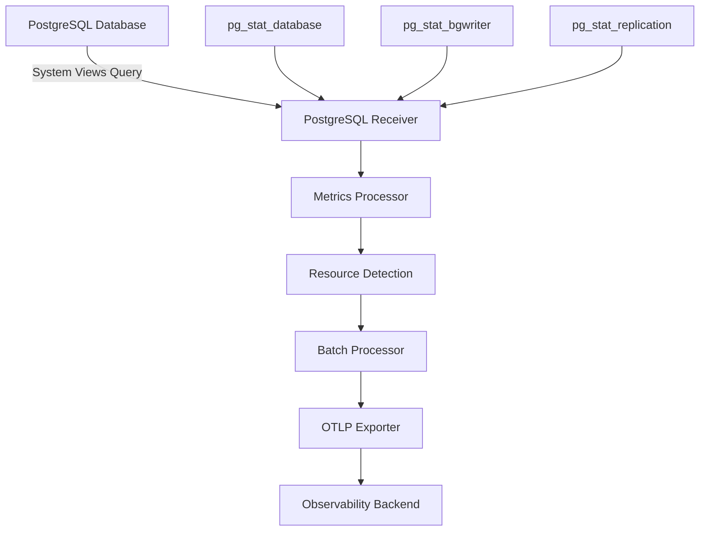

# How to Configure the PostgreSQL Receiver in the OpenTelemetry Collector

Author: [nawazdhandala](https://www.github.com/nawazdhandala)

Tags: OpenTelemetry, Collector, PostgreSQL, Database Monitoring, Metrics, Performance

Description: Comprehensive guide to configuring the PostgreSQL receiver in OpenTelemetry Collector for database monitoring with practical examples, query optimization, and alerting strategies.

The PostgreSQL receiver enables the OpenTelemetry Collector to collect performance and health metrics directly from PostgreSQL databases. This receiver provides insights into database operations, connection pool usage, query performance, and resource consumption, making it essential for maintaining healthy and performant PostgreSQL deployments.

## Why Monitor PostgreSQL

PostgreSQL monitoring is critical for maintaining application performance and database health. Key metrics like active connections, transaction rates, buffer cache hit ratios, and replication lag help you identify bottlenecks, optimize queries, and prevent outages before they impact users.

The PostgreSQL receiver collects metrics by querying PostgreSQL system views and statistics tables. Unlike log-based monitoring, this approach provides real-time operational metrics with minimal performance overhead.



## Basic Configuration

The minimal configuration requires database connection details and credentials:

```yaml
receivers:
  # PostgreSQL receiver with basic connection
  postgresql:
    # Database connection endpoint
    endpoint: localhost:5432

    # Transport protocol (default: tcp)
    transport: tcp

    # Database credentials
    username: postgres
    password: ${env:POSTGRES_PASSWORD}

    # Database name to monitor
    # Use 'postgres' for instance-wide metrics
    databases:
      - postgres

    # Collection interval (default: 10s)
    collection_interval: 10s

    # TLS configuration
    tls:
      insecure: false
      insecure_skip_verify: false

processors:
  # Batch metrics for efficiency
  batch:
    timeout: 10s
    send_batch_size: 100

exporters:
  # Export to stdout for testing
  logging:
    loglevel: info

service:
  pipelines:
    metrics:
      receivers: [postgresql]
      processors: [batch]
      exporters: [logging]
```

This basic configuration connects to a local PostgreSQL instance and collects default metrics every 10 seconds. The password is read from an environment variable for security.

## Understanding PostgreSQL Metrics

The receiver collects a comprehensive set of metrics organized by category:

### Connection Metrics

- `postgresql.backends`: Number of active connections to the database
- `postgresql.connection.max`: Maximum configured connections
- `postgresql.connection.usage`: Connection pool utilization percentage

### Transaction Metrics

- `postgresql.commits`: Number of committed transactions
- `postgresql.rollbacks`: Number of rolled back transactions
- `postgresql.transactions.rate`: Transaction rate per second

### Database Operations

- `postgresql.blocks_read`: Disk blocks read
- `postgresql.buffers_alloc`: Buffers allocated
- `postgresql.buffers_backend`: Buffers written by backends
- `postgresql.temp_files`: Temporary files created

### Cache Performance

- `postgresql.db_size`: Database size in bytes
- `postgresql.rows.inserted`: Rows inserted
- `postgresql.rows.updated`: Rows updated
- `postgresql.rows.deleted`: Rows deleted
- `postgresql.rows.fetched`: Rows fetched by queries

### Replication Metrics

- `postgresql.replication.data_delay`: Replication lag in bytes
- `postgresql.wal.age`: Write-ahead log age
- `postgresql.wal.lag`: Time delay in replication

## Advanced Configuration

For production environments, you'll want to monitor multiple databases and configure specific metric collection:

```yaml
receivers:
  postgresql:
    endpoint: postgres.example.com:5432
    transport: tcp
    username: monitoring_user
    password: ${env:PG_MONITORING_PASSWORD}

    # Monitor multiple databases
    databases:
      - postgres
      - app_production
      - analytics_db

    # Collection interval
    collection_interval: 30s

    # TLS configuration for secure connection
    tls:
      insecure: false
      insecure_skip_verify: false
      ca_file: /etc/otel/certs/postgres-ca.crt
      cert_file: /etc/otel/certs/client.crt
      key_file: /etc/otel/certs/client.key

    # Metric configuration
    metrics:
      # Enable or disable specific metrics
      postgresql.backends:
        enabled: true
      postgresql.commits:
        enabled: true
      postgresql.rollbacks:
        enabled: true
      postgresql.db_size:
        enabled: true
      postgresql.blocks_read:
        enabled: true
      postgresql.rows.inserted:
        enabled: true
      postgresql.rows.updated:
        enabled: true
      postgresql.rows.deleted:
        enabled: true
      postgresql.rows.fetched:
        enabled: true
      postgresql.replication.data_delay:
        enabled: true
```

## Setting Up Monitoring User

Create a dedicated monitoring user with minimal required permissions:

```sql
-- Create monitoring user
CREATE USER monitoring_user WITH PASSWORD 'secure_password_here';

-- Grant connection privilege
GRANT CONNECT ON DATABASE postgres TO monitoring_user;
GRANT CONNECT ON DATABASE app_production TO monitoring_user;

-- Grant usage on schema
GRANT USAGE ON SCHEMA public TO monitoring_user;

-- Grant access to pg_stat views
GRANT pg_monitor TO monitoring_user;

-- For PostgreSQL < 10, grant individual permissions
GRANT SELECT ON pg_stat_database TO monitoring_user;
GRANT SELECT ON pg_stat_bgwriter TO monitoring_user;
GRANT SELECT ON pg_stat_replication TO monitoring_user;
GRANT SELECT ON pg_stat_activity TO monitoring_user;

-- Allow viewing table statistics
GRANT SELECT ON ALL TABLES IN SCHEMA pg_catalog TO monitoring_user;
```

The `pg_monitor` role (PostgreSQL 10+) provides read-only access to monitoring functions and views without granting excessive privileges.

## Monitoring Replication

For PostgreSQL replication setups, enable replication-specific metrics:

```yaml
receivers:
  # Primary database monitoring
  postgresql/primary:
    endpoint: pg-primary.example.com:5432
    username: monitoring_user
    password: ${env:PG_MONITORING_PASSWORD}
    databases:
      - postgres

    # Enable replication metrics
    metrics:
      postgresql.replication.data_delay:
        enabled: true
      postgresql.wal.age:
        enabled: true
      postgresql.wal.lag:
        enabled: true

    # Add resource attributes
    resource_attributes:
      postgresql.role:
        enabled: true
        value: primary

  # Replica monitoring
  postgresql/replica:
    endpoint: pg-replica.example.com:5432
    username: monitoring_user
    password: ${env:PG_MONITORING_PASSWORD}
    databases:
      - postgres

    resource_attributes:
      postgresql.role:
        enabled: true
        value: replica

processors:
  # Add custom attributes
  resource:
    attributes:
      - key: db.cluster
        value: production-cluster
        action: insert

  batch:
    timeout: 30s

exporters:
  otlp:
    endpoint: https://observability.example.com:4317

service:
  pipelines:
    metrics:
      receivers: [postgresql/primary, postgresql/replica]
      processors: [resource, batch]
      exporters: [otlp]
```

## Per-Table Metrics

To monitor specific tables, configure custom queries:

```yaml
receivers:
  postgresql:
    endpoint: localhost:5432
    username: monitoring_user
    password: ${env:PG_MONITORING_PASSWORD}
    databases:
      - app_production

    # Custom queries for table-level metrics
    statements:
      # Monitor table bloat
      - query: |
          SELECT
            schemaname,
            tablename,
            pg_total_relation_size(schemaname||'.'||tablename) AS total_size,
            pg_relation_size(schemaname||'.'||tablename) AS table_size,
            pg_indexes_size(schemaname||'.'||tablename) AS indexes_size
          FROM pg_tables
          WHERE schemaname NOT IN ('pg_catalog', 'information_schema')
        metrics:
          - metric_name: postgresql.table.total_size
            value_column: total_size
            data_type: gauge
            attribute_columns:
              - schema
              - table
          - metric_name: postgresql.table.data_size
            value_column: table_size
            data_type: gauge
          - metric_name: postgresql.table.indexes_size
            value_column: indexes_size
            data_type: gauge

      # Monitor table statistics
      - query: |
          SELECT
            schemaname,
            relname,
            seq_scan,
            seq_tup_read,
            idx_scan,
            idx_tup_fetch,
            n_tup_ins,
            n_tup_upd,
            n_tup_del,
            n_live_tup,
            n_dead_tup
          FROM pg_stat_user_tables
        metrics:
          - metric_name: postgresql.table.sequential_scans
            value_column: seq_scan
            data_type: counter
          - metric_name: postgresql.table.index_scans
            value_column: idx_scan
            data_type: counter
          - metric_name: postgresql.table.live_tuples
            value_column: n_live_tup
            data_type: gauge
          - metric_name: postgresql.table.dead_tuples
            value_column: n_dead_tup
            data_type: gauge
```

## Production Configuration

Here's a complete production-ready configuration with all best practices:

```yaml
receivers:
  postgresql:
    endpoint: postgres-primary.prod.example.com:5432
    transport: tcp
    username: otel_monitoring
    password: ${env:POSTGRES_MONITORING_PASSWORD}

    # Monitor all application databases
    databases:
      - postgres
      - app_production
      - app_staging
      - analytics

    # Collect every 30 seconds to reduce load
    collection_interval: 30s

    # Production TLS settings
    tls:
      insecure: false
      insecure_skip_verify: false
      ca_file: /etc/otel/certs/postgres-ca.pem
      cert_file: /etc/otel/certs/client-cert.pem
      key_file: /etc/otel/certs/client-key.pem
      min_version: "1.2"

    # Enable all important metrics
    metrics:
      postgresql.backends:
        enabled: true
      postgresql.commits:
        enabled: true
      postgresql.rollbacks:
        enabled: true
      postgresql.db_size:
        enabled: true
      postgresql.blocks_read:
        enabled: true
      postgresql.buffers_alloc:
        enabled: true
      postgresql.rows.inserted:
        enabled: true
      postgresql.rows.updated:
        enabled: true
      postgresql.rows.deleted:
        enabled: true
      postgresql.rows.fetched:
        enabled: true
      postgresql.temp_files:
        enabled: true
      postgresql.replication.data_delay:
        enabled: true

processors:
  # Memory limiter to prevent OOM
  memory_limiter:
    check_interval: 1s
    limit_mib: 512
    spike_limit_mib: 128

  # Detect resource attributes
  resourcedetection:
    detectors: [env, system]
    timeout: 5s

  # Add custom resource attributes
  resource:
    attributes:
      - key: deployment.environment
        value: production
        action: insert
      - key: db.cluster.name
        value: prod-postgres-cluster
        action: insert
      - key: db.cluster.region
        value: us-east-1
        action: insert

  # Filter metrics if needed
  filter/exclude_test_dbs:
    metrics:
      exclude:
        match_type: strict
        resource_attributes:
          - key: db.name
            value: test_database

  # Transform metric names for compatibility
  metricstransform:
    transforms:
      - include: postgresql.backends
        action: update
        new_name: pg.connections.active

  # Batch for efficiency
  batch:
    timeout: 30s
    send_batch_size: 500

exporters:
  # Export to observability platform
  otlp:
    endpoint: https://observability.example.com:4317
    headers:
      api-key: ${env:OBSERVABILITY_API_KEY}
    compression: gzip
    sending_queue:
      enabled: true
      num_consumers: 10
      queue_size: 1000
    retry_on_failure:
      enabled: true
      initial_interval: 5s
      max_interval: 30s

  # Prometheus endpoint for local monitoring
  prometheus:
    endpoint: "0.0.0.0:8889"
    namespace: postgresql
    const_labels:
      cluster: production
      region: us-east-1

service:
  pipelines:
    metrics:
      receivers: [postgresql]
      processors:
        - memory_limiter
        - resourcedetection
        - resource
        - filter/exclude_test_dbs
        - metricstransform
        - batch
      exporters: [otlp, prometheus]

  # Enable collector telemetry
  telemetry:
    logs:
      level: info
    metrics:
      address: :8888
```

## Connection Pooling Considerations

When monitoring PostgreSQL through a connection pooler like PgBouncer, adjust your configuration:

```yaml
receivers:
  # Monitor PgBouncer statistics
  postgresql/pgbouncer:
    endpoint: pgbouncer.example.com:6432
    username: monitoring_user
    password: ${env:PGBOUNCER_PASSWORD}
    databases:
      - pgbouncer

  # Monitor actual PostgreSQL database
  postgresql/database:
    endpoint: postgres.example.com:5432
    username: monitoring_user
    password: ${env:POSTGRES_PASSWORD}
    databases:
      - app_production

processors:
  resource/pgbouncer:
    attributes:
      - key: component
        value: pgbouncer
        action: insert

  resource/database:
    attributes:
      - key: component
        value: postgresql
        action: insert

service:
  pipelines:
    metrics/pgbouncer:
      receivers: [postgresql/pgbouncer]
      processors: [resource/pgbouncer, batch]
      exporters: [otlp]

    metrics/database:
      receivers: [postgresql/database]
      processors: [resource/database, batch]
      exporters: [otlp]
```

## Query Performance Monitoring

Monitor slow queries using pg_stat_statements extension:

```sql
-- Enable pg_stat_statements extension
CREATE EXTENSION IF NOT EXISTS pg_stat_statements;

-- Grant access to monitoring user
GRANT SELECT ON pg_stat_statements TO monitoring_user;
```

Configure the receiver to collect query statistics:

```yaml
receivers:
  postgresql:
    endpoint: localhost:5432
    username: monitoring_user
    password: ${env:PG_MONITORING_PASSWORD}

    statements:
      # Top queries by execution time
      - query: |
          SELECT
            queryid,
            calls,
            total_exec_time,
            mean_exec_time,
            max_exec_time,
            rows
          FROM pg_stat_statements
          WHERE total_exec_time > 1000
          ORDER BY total_exec_time DESC
          LIMIT 20
        metrics:
          - metric_name: postgresql.query.calls
            value_column: calls
            data_type: counter
          - metric_name: postgresql.query.total_time
            value_column: total_exec_time
            data_type: counter
          - metric_name: postgresql.query.mean_time
            value_column: mean_exec_time
            data_type: gauge
```

## Alerting Strategies

Common PostgreSQL alerts based on collected metrics:

### High Connection Usage

Alert when connection pool is near capacity:

```yaml
# Example Prometheus alert rule
- alert: PostgreSQLHighConnections
  expr: |
    (postgresql.backends / postgresql.connection.max) > 0.8
  for: 5m
  labels:
    severity: warning
  annotations:
    summary: "PostgreSQL connection pool usage high on {{ $labels.instance }}"
    description: "Connection usage is {{ $value | humanizePercentage }}"
```

### Low Cache Hit Ratio

Alert on poor buffer cache performance:

```yaml
- alert: PostgreSQLLowCacheHitRatio
  expr: |
    rate(postgresql.blocks_read[5m]) /
    (rate(postgresql.blocks_read[5m]) + rate(postgresql.buffers_alloc[5m])) < 0.9
  for: 15m
  labels:
    severity: warning
  annotations:
    summary: "PostgreSQL cache hit ratio low"
    description: "Cache hit ratio is {{ $value | humanizePercentage }}"
```

### Replication Lag

Alert on excessive replication delay:

```yaml
- alert: PostgreSQLReplicationLag
  expr: postgresql.replication.data_delay > 104857600  # 100MB
  for: 10m
  labels:
    severity: critical
  annotations:
    summary: "PostgreSQL replication lag high"
    description: "Replication lag is {{ $value | humanize1024 }}B"
```

### Dead Tuple Accumulation

Alert when tables need vacuuming:

```yaml
- alert: PostgreSQLDeadTuples
  expr: |
    postgresql.table.dead_tuples /
    (postgresql.table.live_tuples + postgresql.table.dead_tuples) > 0.2
  for: 30m
  labels:
    severity: warning
  annotations:
    summary: "PostgreSQL table {{ $labels.table }} has excessive dead tuples"
```

## Troubleshooting

### Connection Failures

If the receiver cannot connect to PostgreSQL:

1. Verify credentials and network connectivity
2. Check pg_hba.conf allows connections from collector host
3. Ensure SSL/TLS settings match server configuration
4. Verify monitoring user has required permissions

### Missing Metrics

If expected metrics are not appearing:

1. Check that required extensions are installed (pg_stat_statements)
2. Verify monitoring user has access to system views
3. Review metric enable/disable configuration
4. Check collector logs for errors

### High Database Load

If monitoring causes performance issues:

1. Increase collection_interval to reduce query frequency
2. Disable expensive custom queries
3. Use connection pooling
4. Monitor fewer databases

## Integration with OneUptime

Configure the collector to send PostgreSQL metrics to OneUptime:

```yaml
exporters:
  otlp:
    endpoint: https://opentelemetry-collector.oneuptime.com:4317
    headers:
      x-oneuptime-token: ${env:ONEUPTIME_API_KEY}
    compression: gzip

service:
  pipelines:
    metrics:
      receivers: [postgresql]
      processors: [batch]
      exporters: [otlp]
```

OneUptime provides pre-built PostgreSQL dashboards and intelligent alerting based on industry best practices. For monitoring other databases alongside PostgreSQL, see our guides on [MySQL receiver](https://oneuptime.com/blog/post/mysql-receiver-opentelemetry-collector/view) and [MongoDB receiver](https://oneuptime.com/blog/post/mongodb-receiver-opentelemetry-collector/view).

## Conclusion

The PostgreSQL receiver provides comprehensive database monitoring through the OpenTelemetry Collector. By collecting metrics on connections, transactions, cache performance, and replication, you gain complete visibility into database health and performance.

Start with basic configuration to establish baseline metrics, then progressively add custom queries, table-level monitoring, and replication tracking as your needs grow. Use the collected metrics to optimize queries, tune configuration parameters, and maintain healthy PostgreSQL operations.

For container-based PostgreSQL deployments, combine this receiver with the [Docker Stats receiver](https://oneuptime.com/blog/post/docker-stats-receiver-opentelemetry-collector/view) for full-stack observability.
