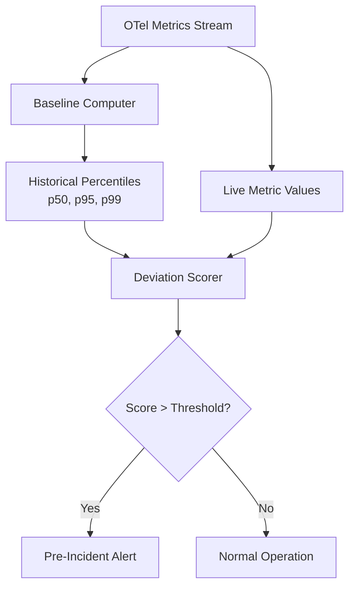

# How to Build Pre-Incident Detection Systems Using OpenTelemetry Anomaly Baselines

Author: [nawazdhandala](https://www.github.com/nawazdhandala)

Tags: OpenTelemetry, Anomaly Detection, Incident Prevention, SRE

Description: Build a pre-incident detection system that uses OpenTelemetry metric baselines to catch anomalies before they escalate into outages.

Most incident response starts after something breaks. By that point, customers are already affected, and the team is in reactive mode. A better approach is detecting anomalous patterns early - minutes or hours before they become incidents. OpenTelemetry provides the data pipeline for this, and with some baseline computation on top, you can build a practical early warning system.

This post covers how to establish metric baselines from OpenTelemetry data, compute deviation scores, and trigger pre-incident alerts when signals drift outside normal ranges.

## The Baseline Concept

A baseline is a statistical profile of what "normal" looks like for a given metric over a specific time window. For a web service, the baseline for request latency at 2 PM on a Tuesday is different from 3 AM on a Sunday. Effective anomaly detection accounts for these patterns.



## Collecting Baseline Metrics with OpenTelemetry

First, instrument your services to emit the metrics you want to baseline. Latency, error rate, queue depth, and resource utilization are strong candidates.

```python
# baseline_metrics.py - Instrument key signals for baseline tracking
from opentelemetry import metrics
from opentelemetry.sdk.metrics import MeterProvider
from opentelemetry.sdk.metrics.export import PeriodicExportingMetricReader
from opentelemetry.exporter.otlp.proto.grpc.metric_exporter import OTLPMetricExporter

exporter = OTLPMetricExporter(endpoint="http://otel-collector:4317", insecure=True)
reader = PeriodicExportingMetricReader(exporter, export_interval_millis=30000)
provider = MeterProvider(metric_readers=[reader])
metrics.set_meter_provider(provider)

meter = metrics.get_meter("pre.incident.detector", version="1.0.0")

# Histogram captures the full distribution, essential for percentile baselines
request_latency = meter.create_histogram(
    name="http.server.request.duration",
    description="Server request duration in milliseconds",
    unit="ms",
)

error_counter = meter.create_counter(
    name="http.server.errors.total",
    description="Total HTTP server errors",
    unit="1",
)

queue_depth = meter.create_observable_gauge(
    name="messaging.queue.depth",
    description="Current message queue depth",
    unit="1",
    callbacks=[lambda options: observe_queue_depth()],
)
```

## Computing Baselines from Historical Data

Baselines should be computed from at least two weeks of data to capture weekly patterns. Here is a Python module that pulls historical metrics and computes time-bucketed percentiles.

```python
# baseline_computer.py - Compute hourly baselines from stored metrics
import numpy as np
from datetime import datetime, timedelta
from collections import defaultdict

class BaselineComputer:
    def __init__(self, metrics_store):
        self.store = metrics_store
        # Store baselines keyed by (metric_name, day_of_week, hour)
        self.baselines = {}

    def compute_baselines(self, metric_name: str, lookback_days: int = 14):
        """Build hourly baselines grouped by day-of-week."""
        end = datetime.utcnow()
        start = end - timedelta(days=lookback_days)

        # Fetch raw metric values with timestamps
        data_points = self.store.query(metric_name, start, end)

        # Group by (day_of_week, hour)
        buckets = defaultdict(list)
        for ts, value in data_points:
            key = (ts.weekday(), ts.hour)
            buckets[key].append(value)

        # Compute percentiles for each bucket
        for key, values in buckets.items():
            arr = np.array(values)
            self.baselines[(metric_name, *key)] = {
                "p50": float(np.percentile(arr, 50)),
                "p95": float(np.percentile(arr, 95)),
                "p99": float(np.percentile(arr, 99)),
                "mean": float(np.mean(arr)),
                "stddev": float(np.std(arr)),
                "sample_count": len(values),
            }

    def get_baseline(self, metric_name: str, timestamp: datetime) -> dict:
        """Look up the baseline for a metric at a given time."""
        key = (metric_name, timestamp.weekday(), timestamp.hour)
        return self.baselines.get(key)
```

## Scoring Deviations in Real Time

With baselines computed, compare live metric values against them. A z-score approach works well for metrics with roughly normal distributions, while percentile breach detection is better for skewed distributions like latency.

```python
# deviation_scorer.py - Score how far a live metric deviates from baseline
from datetime import datetime

class DeviationScorer:
    def __init__(self, baseline_computer):
        self.baselines = baseline_computer

    def score(self, metric_name: str, current_value: float,
              timestamp: datetime = None) -> dict:
        """Compute deviation score for a metric value."""
        timestamp = timestamp or datetime.utcnow()
        baseline = self.baselines.get_baseline(metric_name, timestamp)

        if not baseline or baseline["stddev"] == 0:
            return {"score": 0, "severity": "unknown"}

        # Z-score: how many standard deviations from the mean
        z_score = (current_value - baseline["mean"]) / baseline["stddev"]

        # Percentile breach check
        breached_p95 = current_value > baseline["p95"]
        breached_p99 = current_value > baseline["p99"]

        # Composite severity
        if breached_p99 or abs(z_score) > 3:
            severity = "critical"
        elif breached_p95 or abs(z_score) > 2:
            severity = "warning"
        else:
            severity = "normal"

        return {
            "score": round(z_score, 2),
            "severity": severity,
            "current": current_value,
            "baseline_mean": baseline["mean"],
            "baseline_p95": baseline["p95"],
            "baseline_p99": baseline["p99"],
            "breached_p95": breached_p95,
            "breached_p99": breached_p99,
        }
```

## Wiring It Into the OpenTelemetry Collector

Use the OpenTelemetry Collector's processing pipeline to route metrics both to your storage backend and to the anomaly detection service.

```yaml
# otel-collector-config.yaml
receivers:
  otlp:
    protocols:
      grpc:
        endpoint: 0.0.0.0:4317

processors:
  batch:
    send_batch_size: 200
    timeout: 5s

exporters:
  # Primary metrics storage for baseline computation
  otlp/storage:
    endpoint: "https://metrics-store:4317"

  # Real-time feed to anomaly detection service
  otlp/anomaly:
    endpoint: "http://anomaly-detector:4317"

service:
  pipelines:
    metrics:
      receivers: [otlp]
      processors: [batch]
      # Fan out to both destinations
      exporters: [otlp/storage, otlp/anomaly]
```

## Triggering Pre-Incident Alerts

When the deviation scorer flags a critical or warning severity, generate an alert. The key difference from a normal alert is context: pre-incident alerts include baseline comparison data so the responder understands why the system thinks something is off.

```python
# alert_trigger.py - Generate pre-incident alerts with baseline context
def evaluate_and_alert(scorer, metric_name, current_value, alert_manager):
    result = scorer.score(metric_name, current_value)

    if result["severity"] in ("warning", "critical"):
        alert_manager.send_alert({
            "type": "pre_incident",
            "severity": result["severity"],
            "metric": metric_name,
            "message": (
                f"{metric_name} is at {result['current']}, "
                f"which is {result['score']} standard deviations from "
                f"the baseline mean of {result['baseline_mean']:.2f}"
            ),
            "baseline_context": {
                "mean": result["baseline_mean"],
                "p95": result["baseline_p95"],
                "p99": result["baseline_p99"],
                "z_score": result["score"],
            },
        })
```

## Reducing False Positives

Single-metric anomalies often produce noise. Two techniques help:

1. **Sustained deviation** - require the anomaly to persist for multiple evaluation cycles (e.g., 3 consecutive checks over 5 minutes) before alerting
2. **Correlated signals** - only alert when multiple related metrics deviate together (e.g., latency up AND error rate up AND queue depth growing)

Correlated detection catches real pre-incident conditions much more reliably than single-metric thresholds.

## Practical Considerations

Recompute baselines weekly or on a rolling window to account for organic growth. Services that are scaling up will naturally have shifting baselines, and stale baselines generate false alerts.

Store baseline data alongside your metric data so you can review historical accuracy. When a real incident occurs, check whether the pre-incident system caught it, and if not, investigate which metrics or thresholds need tuning.

The goal is not to catch every possible incident in advance. It is to catch the common failure patterns - gradual resource exhaustion, slow memory leaks, traffic shifts - that produce detectable drift before they produce customer impact.
