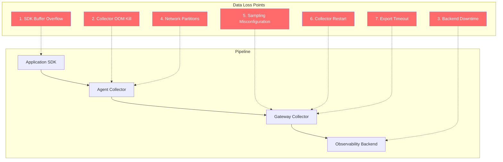

# How to Prevent Data Loss in Seven Common OpenTelemetry Scenarios

Author: [nawazdhandala](https://www.github.com/nawazdhandala)

Tags: OpenTelemetry, Data Loss, Observability, Reliability, Production

Description: Practical strategies for preventing telemetry data loss across seven real-world OpenTelemetry failure scenarios, with configuration examples and architecture fixes.

---

Losing telemetry data is one of the most frustrating problems in observability. You are investigating a production incident, and the traces or metrics you need are simply not there. This happens more often than people admit, and it usually comes down to a handful of common scenarios that are all preventable.

This guide covers seven real-world situations where OpenTelemetry pipelines lose data and shows you exactly how to fix each one.

## The Seven Scenarios

Before diving into each scenario, here is a map of where in the pipeline each type of loss typically occurs:



## Scenario 1: SDK Buffer Overflow

The OpenTelemetry SDK inside your application has an in-memory queue for spans, metrics, and log records. When the queue fills up, new data gets dropped silently. This happens when your application generates telemetry faster than the SDK can export it.

The default queue size in most SDKs is 2048 spans. For a high-throughput service, that fills up in seconds.

Here is how to tune the SDK exporter in a Java application:

```java
// Configure the span exporter with a larger queue and more export threads
// The default queue size of 2048 is too small for services handling
// more than a few hundred requests per second
SdkTracerProvider tracerProvider = SdkTracerProvider.builder()
    .addSpanProcessor(
        BatchSpanProcessor.builder(spanExporter)
            // Increase the queue from default 2048 to 16384
            .setMaxQueueSize(16384)
            // Export in batches of 1024 spans
            .setMaxExportBatchSize(1024)
            // Export at least every 2 seconds even if batch is not full
            .setScheduleDelay(Duration.ofSeconds(2))
            // Give the exporter 30 seconds to flush on shutdown
            .setExporterTimeout(Duration.ofSeconds(30))
            .build()
    )
    .build();
```

For Python applications, the configuration looks like this:

```python
# Configure the batch span processor with tuned buffer sizes
# These settings prevent queue overflow during traffic spikes
from opentelemetry.sdk.trace.export import BatchSpanProcessor

processor = BatchSpanProcessor(
    span_exporter,
    # Maximum number of spans kept in the queue before dropping
    max_queue_size=16384,
    # Number of spans exported in each batch
    max_export_batch_size=1024,
    # Maximum time in milliseconds between exports
    schedule_delay_millis=2000,
    # Time in milliseconds to wait for export to complete
    export_timeout_millis=30000,
)
```

Monitor for drops by watching the SDK's internal metrics. Most SDKs expose a counter for dropped spans.

## Scenario 2: Collector OOM Kill

Kubernetes will kill your collector pod if it exceeds its memory limit. When that happens, everything in the collector's in-memory queues is gone. This is one of the most common causes of data loss in production.

The fix is the `memory_limiter` processor, which applies backpressure before memory gets critical:

```yaml
# Collector config with memory limiter to prevent OOM kills
# The memory limiter MUST be the first processor in every pipeline
processors:
  memory_limiter:
    # Check memory usage every second
    check_interval: 1s
    # Hard limit -- start refusing data at this point
    # Set this to about 80% of your container's memory limit
    limit_mib: 1600
    # Soft limit -- start applying backpressure at this point
    # The difference between limit and spike limit is your buffer
    # for already-in-flight data
    spike_limit_mib: 400

  batch:
    send_batch_size: 1024
    timeout: 5s

service:
  pipelines:
    traces:
      receivers: [otlp]
      # memory_limiter must come first so it can reject data
      # before other processors consume memory
      processors: [memory_limiter, batch]
      exporters: [otlp]
```

Match your Kubernetes resource limits to the memory limiter settings:

```yaml
# Pod resource configuration matching the memory limiter
# The container limit should be slightly above the memory_limiter's limit_mib
resources:
  requests:
    cpu: "500m"
    memory: 1536Mi
  limits:
    cpu: "1"
    # Set this to limit_mib + some headroom for the Go runtime
    memory: 2048Mi
```

## Scenario 3: Backend Downtime

Your observability backend will go down at some point. Maybe it is a planned upgrade, maybe it is an unexpected outage. Without a retry and queuing strategy, all telemetry generated during the downtime is lost.

The sending queue and retry configuration on the exporter handle this:

```yaml
exporters:
  otlp:
    endpoint: tempo.observability.svc:4317
    # Retry configuration handles transient failures
    retry_on_failure:
      enabled: true
      # Start with a 5-second delay between retries
      initial_interval: 5s
      # Double the delay each time, up to 60 seconds
      max_interval: 60s
      # Give up after 5 minutes of continuous failure
      max_elapsed_time: 300s

    # The sending queue buffers data during backend outages
    sending_queue:
      enabled: true
      # Number of concurrent export workers
      num_consumers: 10
      # Maximum number of batches held in the queue
      # With batch size of 1024, this holds about 5 million spans
      queue_size: 5000
      # Persist the queue to disk so it survives collector restarts
      storage: file_storage

extensions:
  # File storage extension for persistent queuing
  # This is critical -- without it, the queue is in-memory only
  file_storage:
    directory: /var/lib/otel/queue
    # Set a maximum size to prevent filling the disk
    max_file_size_mib: 5120
    timeout: 10s

service:
  extensions: [file_storage]
  pipelines:
    traces:
      receivers: [otlp]
      processors: [memory_limiter, batch]
      exporters: [otlp]
```

The persistent queue is the key piece here. Without the `storage` field, the sending queue only exists in memory and is lost on restart.

## Scenario 4: Network Partitions

Network partitions between collectors are tricky because the connection might be half-open. The exporter thinks it is sending data, but nothing is actually reaching the other side. TCP timeouts can take minutes to detect this.

Configure aggressive timeouts and health checks:

```yaml
exporters:
  otlp:
    endpoint: gateway.observability.svc:4317
    # Set connection-level timeouts to detect partitions quickly
    timeout: 15s
    # Configure keepalive to detect dead connections
    keepalive:
      # Send keepalive pings every 30 seconds
      time: 30s
      # Wait 10 seconds for a ping response before considering
      # the connection dead
      timeout: 10s
      # Allow pings even when there are no active RPCs
      permit_without_stream: true

    retry_on_failure:
      enabled: true
      initial_interval: 1s
      max_interval: 30s
      max_elapsed_time: 120s

    sending_queue:
      enabled: true
      queue_size: 5000
      storage: file_storage
```

## Scenario 5: Sampling Misconfiguration

Sampling gone wrong is a sneaky form of data loss because the system is working exactly as configured. You just configured it to throw away more data than you intended.

The most common mistake is applying sampling at multiple levels. If your SDK samples at 50% and your collector also samples at 50%, you end up keeping only 25% of your data.


The fix is to sample in exactly one place, preferably at the collector level using tail-based sampling:

```yaml
# Use tail-based sampling at the gateway collector ONLY
# Remove any head sampling from your SDKs
processors:
  tail_sampling:
    # Wait up to 30 seconds to collect all spans for a trace
    # before making a sampling decision
    decision_wait: 30s
    # Keep all error traces regardless of the sampling rate
    policies:
      - name: always-keep-errors
        type: status_code
        status_code:
          status_codes:
            - ERROR
      - name: always-keep-slow
        type: latency
        latency:
          # Keep any trace with total duration over 2 seconds
          threshold_ms: 2000
      - name: probabilistic-sample-rest
        type: probabilistic
        probabilistic:
          sampling_percentage: 10

service:
  pipelines:
    traces:
      receivers: [otlp]
      processors: [memory_limiter, tail_sampling, batch]
      exporters: [otlp]
```

## Scenario 6: Collector Restart During Deployment

Rolling deployments restart collector pods. Any data in the pod's in-memory queues is lost. This happens on every single deployment, which means you have predictable data gaps in your telemetry.

The solution combines persistent queuing with graceful shutdown:

```yaml
# Collector config with graceful shutdown and persistent queuing
extensions:
  file_storage:
    directory: /var/lib/otel/queue
    max_file_size_mib: 2048

exporters:
  otlp:
    endpoint: backend.observability.svc:4317
    sending_queue:
      enabled: true
      queue_size: 5000
      # Persistent storage survives pod restarts
      storage: file_storage

service:
  # Give the collector time to flush its queues before shutting down
  # This should be less than your pod's terminationGracePeriodSeconds
  telemetry:
    metrics:
      address: 0.0.0.0:8888
  extensions: [file_storage]
```

And on the Kubernetes side, make sure the termination grace period is generous enough:

```yaml
# Deployment spec with proper termination handling
apiVersion: apps/v1
kind: Deployment
metadata:
  name: otel-collector
spec:
  template:
    spec:
      # Give the collector 60 seconds to flush queues on shutdown
      terminationGracePeriodSeconds: 60
      containers:
        - name: collector
          image: otel/opentelemetry-collector-contrib:0.96.0
          # Mount a persistent volume for the queue storage
          volumeMounts:
            - name: queue-storage
              mountPath: /var/lib/otel/queue
      volumes:
        - name: queue-storage
          persistentVolumeClaim:
            claimName: otel-queue-pvc
---
# PVC for queue persistence across pod restarts
apiVersion: v1
kind: PersistentVolumeClaim
metadata:
  name: otel-queue-pvc
spec:
  accessModes: [ReadWriteOnce]
  resources:
    requests:
      storage: 5Gi
  storageClassName: fast-ssd
```

## Scenario 7: Export Timeouts

Large batches sent to a slow backend can hit the export timeout. When a batch times out, the entire batch is lost even if most of it would have succeeded. This is especially common when exporting to backends over high-latency links.

Tune the batch size and timeout together:

```yaml
processors:
  # Smaller batches reduce the blast radius of a timeout
  batch:
    # Smaller batch size means less data lost per timeout
    send_batch_size: 256
    send_batch_max_size: 512
    timeout: 5s

exporters:
  otlp:
    endpoint: backend.observability.svc:4317
    # Give exports enough time to complete
    # This should be longer than the expected round-trip time
    # for your largest batch
    timeout: 30s
    retry_on_failure:
      enabled: true
      initial_interval: 1s
      max_interval: 30s
    sending_queue:
      enabled: true
      queue_size: 10000
```

## Monitoring for Data Loss

You cannot fix what you cannot see. Set up monitoring that tells you when data loss is happening.

The OpenTelemetry Collector exposes internal metrics that reveal data loss:

```promql
# Spans dropped by the processor pipeline
# A non-zero rate means the memory limiter is kicking in
rate(otelcol_processor_dropped_spans[5m])

# Spans that failed to export
# This catches backend failures and timeouts
rate(otelcol_exporter_send_failed_spans[5m])

# Queue utilization -- when this approaches 1.0, you are close
# to dropping data from queue overflow
otelcol_exporter_queue_size / otelcol_exporter_queue_capacity
```

## Summary

Data loss in OpenTelemetry pipelines is preventable. The seven scenarios covered here account for the vast majority of telemetry loss in production. The common themes across all fixes are: use persistent queues, configure retries with backoff, set memory limits before Kubernetes does it for you, monitor your pipeline health, and sample intentionally in exactly one place. Get these right and your telemetry pipeline becomes something you can actually trust.
