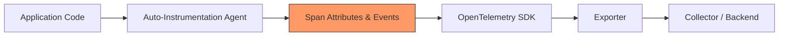
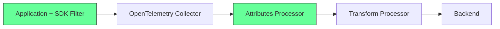

# How to Prevent Sensitive Data Leakage in Auto-Instrumentation

Author: [nawazdhandala](https://www.github.com/nawazdhandala)

Tags: OpenTelemetry, Auto-Instrumentation, Security, Data Privacy, Observability, PII

Description: Learn how to prevent sensitive data from leaking through OpenTelemetry auto-instrumentation by configuring span limits, attribute filters, and environment variables.

---

Auto-instrumentation is one of the most appealing features of OpenTelemetry. You add an agent or SDK, and suddenly your application emits traces, metrics, and logs without writing a single line of instrumentation code. But that convenience comes with a serious risk: the auto-instrumentation libraries capture everything by default. HTTP headers, query parameters, database statements, message payloads - all of it can end up in your telemetry backend. If your application handles passwords, tokens, credit card numbers, or health records, those values can silently leak into your observability pipeline.

This post walks through the practical steps you need to take to lock down auto-instrumentation and keep sensitive data out of your spans and logs.

## Why Auto-Instrumentation Leaks Data

Auto-instrumentation libraries hook into common frameworks and libraries at runtime. When an HTTP request comes in, the instrumentation captures the URL, headers, request body attributes, and response codes. When a database query runs, the instrumentation records the SQL statement, sometimes including parameter values. The libraries do this because more data generally means better debugging. But "more data" and "safe data" are not the same thing.

Here is a simplified view of how data flows from your application through auto-instrumentation to your backend:



The dangerous point is at stage C. Span attributes and events are where sensitive values get captured. Once they pass through the exporter, they are stored in your backend and potentially visible to anyone with dashboard access.

## Step 1: Disable Capturing of HTTP Request and Response Headers

Most HTTP auto-instrumentation libraries allow you to control which headers get captured. By default, many capture all request and response headers. You should explicitly limit this.

For Java, you can set environment variables to control which headers the OTLP auto-instrumentation captures. An empty value means no headers are captured.

```bash
# Disable all HTTP request header capture
export OTEL_INSTRUMENTATION_HTTP_CAPTURE_HEADERS_CLIENT_REQUEST=""
export OTEL_INSTRUMENTATION_HTTP_CAPTURE_HEADERS_CLIENT_RESPONSE=""
export OTEL_INSTRUMENTATION_HTTP_CAPTURE_HEADERS_SERVER_REQUEST=""
export OTEL_INSTRUMENTATION_HTTP_CAPTURE_HEADERS_SERVER_RESPONSE=""
```

If you need specific headers for debugging (like `Content-Type` or `X-Request-Id`), list only those and nothing else.

```bash
# Capture only safe, non-sensitive headers
export OTEL_INSTRUMENTATION_HTTP_CAPTURE_HEADERS_SERVER_REQUEST="content-type,x-request-id"
export OTEL_INSTRUMENTATION_HTTP_CAPTURE_HEADERS_SERVER_RESPONSE="content-type,x-request-id"
```

## Step 2: Suppress SQL Parameter Values

Database instrumentation often records full SQL statements. A query like `SELECT * FROM users WHERE email = 'john@example.com'` will embed the actual email address in the span. This is a direct PII leak.

Most OpenTelemetry database instrumentations support a sanitization mode that replaces parameter values with placeholders. For Java auto-instrumentation, you can configure this through system properties.

```bash
# Enable SQL statement sanitization to replace literal values with '?'
export OTEL_INSTRUMENTATION_COMMON_DB_STATEMENT_SANITIZER_ENABLED=true
```

After enabling this, your spans will contain `SELECT * FROM users WHERE email = ?` instead of the actual parameter value. This preserves the query structure for debugging without leaking user data.

For Python, the SQLAlchemy and psycopg2 instrumentations also support this. You configure it when initializing the instrumentor.

```python
from opentelemetry.instrumentation.sqlalchemy import SQLAlchemyInstrumentor

# Initialize with enable_commenter but without capturing bound parameters
# This ensures query parameters like emails and passwords are not recorded
SQLAlchemyInstrumentor().instrument(
    engine=engine,
    enable_commenter=True,
)
```

## Step 3: Use the OpenTelemetry SDK's Attribute Limits

The OpenTelemetry SDK provides built-in controls for limiting attribute values. While this is not a replacement for proper filtering, it acts as a safety net that truncates overly long attribute values which might contain large payloads.

```bash
# Limit the maximum length of any attribute value to 256 characters
# This prevents large request bodies or responses from being fully captured
export OTEL_ATTRIBUTE_VALUE_LENGTH_LIMIT=256

# Limit the maximum number of attributes per span
# This prevents unbounded attribute growth from verbose instrumentation
export OTEL_SPAN_ATTRIBUTE_COUNT_LIMIT=64
```

These limits do not replace redaction. A credit card number is only 16 digits and fits well within 256 characters. But the limits do help prevent full request or response bodies from being stored.

## Step 4: Filter Sensitive URLs and Routes

Some endpoints inherently deal with sensitive data. Login routes, payment processing endpoints, and health record APIs are all places where you want to either suppress instrumentation entirely or heavily sanitize the captured data.

In Java, you can exclude specific URL patterns from instrumentation.

```bash
# Exclude authentication and payment endpoints from tracing entirely
# Requests to these paths will not generate spans
export OTEL_INSTRUMENTATION_HTTP_SERVER_SUPPRESS_PATTERN="/api/auth/.*|/api/payments/.*|/api/health-records/.*"
```

In Node.js, you can configure the HTTP instrumentation to ignore specific routes by passing a filter function during setup.

```javascript
const { HttpInstrumentation } = require('@opentelemetry/instrumentation-http');

const httpInstrumentation = new HttpInstrumentation({
  // Filter function returns true for requests that should NOT be traced
  ignoreIncomingRequestHook: (request) => {
    const sensitivePatterns = ['/api/auth', '/api/payments', '/api/health-records'];
    // Check if the request URL matches any sensitive pattern
    return sensitivePatterns.some(pattern => request.url.startsWith(pattern));
  },
});
```

## Step 5: Apply SpanProcessor-Based Filtering in the SDK

For cases where you cannot control what the auto-instrumentation captures, you can add a custom SpanProcessor that strips sensitive attributes before they leave the application. This runs inside the SDK, before data reaches the exporter.

Here is a Python example that removes specific attribute keys from every span.

```python
from opentelemetry.sdk.trace import SpanProcessor

class SensitiveDataFilter(SpanProcessor):
    """
    Custom span processor that removes sensitive attributes
    before spans are exported. This is a last line of defense
    inside the application process.
    """
    # List of attribute keys that should never be exported
    SENSITIVE_KEYS = {
        'http.request.header.authorization',
        'http.request.header.cookie',
        'http.request.header.set-cookie',
        'db.statement',
        'http.request.body',
        'http.response.body',
    }

    def on_start(self, span, parent_context=None):
        pass

    def on_end(self, span):
        # Remove sensitive attributes from the span before export
        if span.attributes:
            for key in self.SENSITIVE_KEYS:
                if key in span.attributes:
                    span.attributes[key] = "[REDACTED]"

    def shutdown(self):
        pass

    def force_flush(self, timeout_millis=None):
        pass
```

Register this processor in your tracer provider before the batch span processor.

```python
from opentelemetry.sdk.trace import TracerProvider
from opentelemetry.sdk.trace.export import BatchSpanProcessor

# Create the tracer provider
provider = TracerProvider()

# Add the sensitive data filter FIRST so it runs before export
provider.add_span_processor(SensitiveDataFilter())

# Then add the batch processor that handles actual export
provider.add_span_processor(BatchSpanProcessor(otlp_exporter))
```

## Step 6: Use the Collector as a Second Layer of Defense

Even with SDK-level controls, you should treat the OpenTelemetry Collector as a second filtering layer. The Collector's `attributes` processor can drop or hash attribute values before they reach your backend.

```yaml
processors:
  attributes:
    actions:
      # Delete the authorization header attribute entirely
      - key: http.request.header.authorization
        action: delete
      # Delete cookie attributes
      - key: http.request.header.cookie
        action: delete
      # Hash the user ID so it can be correlated but not read directly
      - key: enduser.id
        action: hash
```

This two-layer approach (SDK filtering plus Collector filtering) gives you defense in depth. If one layer misses something, the other catches it.



## Step 7: Audit What Your Instrumentation Actually Captures

After applying all these controls, you need to verify that nothing slips through. The simplest way is to temporarily export to the `logging` exporter in the Collector and inspect the output.

```yaml
exporters:
  # Use the logging exporter during audits to see exactly what data
  # is being captured in spans, metrics, and logs
  logging:
    verbosity: detailed

service:
  pipelines:
    traces:
      receivers: [otlp]
      processors: [attributes]
      exporters: [logging]
```

Run your application, trigger the sensitive endpoints, and read the Collector logs. Search for known test values (use a test credit card number, a test email) and confirm they do not appear in the output. Make this audit a regular part of your release process.

## Summary

Auto-instrumentation saves time, but it requires careful configuration to be safe for production. The key steps are: disable unnecessary header capture, sanitize database statements, limit attribute sizes, suppress sensitive routes, filter attributes in both the SDK and the Collector, and audit everything regularly. None of these steps are difficult on their own. The challenge is remembering to do all of them before you ship to production. Build a checklist, automate the configuration through environment variables, and review your telemetry data periodically for anything that should not be there.
