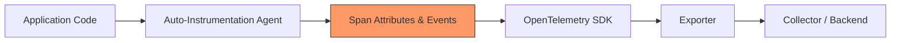
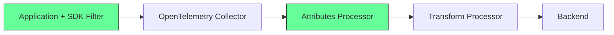

# How to Prevent Sensitive Data Leakage in Auto-Instrumentation

Author: [nawazdhandala](https://www.github.com/nawazdhandala)

Tags: OpenTelemetry, Auto-Instrumentation, Security, Data Privacy, Observability, PII

Description: Learn how to prevent sensitive data from leaking through OpenTelemetry auto-instrumentation by configuring span limits, attribute filters, and environment variables.

---

Auto-instrumentation is one of the most appealing features of OpenTelemetry. You add an agent or SDK, and suddenly your application emits traces, metrics, and logs without writing a single line of instrumentation code. But that convenience comes with a serious risk: the auto-instrumentation libraries can capture more than you expect. HTTP metadata, selected headers, query parameters, database statements, and messaging metadata can end up in your telemetry backend. If your application handles passwords, tokens, credit card numbers, or health records, those values can silently leak into your observability pipeline.

This post walks through the practical steps you need to take to lock down auto-instrumentation and keep sensitive data out of your spans and logs.

## Why Auto-Instrumentation Leaks Data

Auto-instrumentation libraries hook into common frameworks and libraries at runtime. When an HTTP request comes in, the instrumentation captures metadata such as the method, route, URL attributes, and response codes. Some instrumentations can also be configured to capture selected headers, request parameters, or body-size attributes. When a database query runs, the instrumentation records the SQL statement, sometimes including literal values if the statement text already contains them. The libraries do this because more data generally means better debugging. But "more data" and "safe data" are not the same thing.

Here is a simplified view of how data flows from your application through auto-instrumentation to your backend:


```mermaid
flowchart LR
    A[Application Code] --> B[Auto-Instrumentation Agent]
    B --> C[Span Attributes & Events]
    C --> D[OpenTelemetry SDK]
    D --> E[Exporter]
    E --> F[Collector / Backend]

    style C fill:#f96,stroke:#333
```

The dangerous point is at stage C. Span attributes and events are where sensitive values get captured. Once they pass through the exporter, they are stored in your backend and potentially visible to anyone with dashboard access.

## Step 1: Disable Capturing of HTTP Request and Response Headers

Most HTTP auto-instrumentation libraries allow you to control which headers get captured. OpenTelemetry Java does not capture arbitrary HTTP headers unless you configure the header names. You should explicitly limit this list and never include secrets.

For Java, you can set environment variables to control which headers the OpenTelemetry Java agent captures. Leaving these unset, or setting them to an empty value, means no extra headers are captured.

```bash
# Disable all HTTP request header capture

export OTEL_INSTRUMENTATION_HTTP_CLIENT_CAPTURE_REQUEST_HEADERS=""
export OTEL_INSTRUMENTATION_HTTP_CLIENT_CAPTURE_RESPONSE_HEADERS=""
export OTEL_INSTRUMENTATION_HTTP_SERVER_CAPTURE_REQUEST_HEADERS=""
export OTEL_INSTRUMENTATION_HTTP_SERVER_CAPTURE_RESPONSE_HEADERS=""
```

If you need specific headers for debugging (like `Content-Type` or `X-Request-Id`), list only those and nothing else.

```bash
# Capture only safe, non-sensitive headers
export OTEL_INSTRUMENTATION_HTTP_SERVER_CAPTURE_REQUEST_HEADERS="content-type,x-request-id"
export OTEL_INSTRUMENTATION_HTTP_SERVER_CAPTURE_RESPONSE_HEADERS="content-type,x-request-id"
```

## Step 2: Suppress SQL Parameter Values

Database instrumentation often records full SQL statements. A query like `SELECT * FROM users WHERE email = 'john@example.com'` will embed the actual email address in the span. This is a direct PII leak.

OpenTelemetry Java auto-instrumentation supports a sanitization mode that replaces literal values with placeholders. It is enabled by default, but you can set it explicitly so the safety setting is visible in your deployment configuration.

```bash
# Keep SQL statement sanitization enabled so literal values are replaced with '?'
export OTEL_INSTRUMENTATION_COMMON_DB_STATEMENT_SANITIZER_ENABLED=true
```

With this enabled, your spans will contain `SELECT * FROM users WHERE email = ?` instead of the actual literal value when the database statement is sanitized. This preserves the query structure for debugging without leaking user data.

For Python, avoid building SQL strings by interpolating user data. Use bound parameters so sensitive values are passed separately from the SQL statement that instrumentation records.

```python
from opentelemetry.instrumentation.sqlalchemy import SQLAlchemyInstrumentor
from sqlalchemy import text

# Instrument SQLAlchemy. Bound parameter values are not part of this SQL text.
SQLAlchemyInstrumentor().instrument(engine=engine)

with engine.connect() as connection:
    connection.execute(
        text("SELECT * FROM users WHERE email = :email"),
        {"email": "john@example.com"},
    )
```

## Step 3: Use the OpenTelemetry SDK's Attribute Limits

The OpenTelemetry SDK provides built-in controls for limiting attribute values. While this is not a replacement for proper filtering, it acts as a safety net that truncates overly long attribute values which might contain large payloads.

```bash
# Limit the maximum length of any span attribute value to 256 characters
# This prevents large request bodies or responses from being fully captured
export OTEL_SPAN_ATTRIBUTE_VALUE_LENGTH_LIMIT=256

# Limit the maximum number of attributes per span
# This prevents unbounded attribute growth from verbose instrumentation
export OTEL_SPAN_ATTRIBUTE_COUNT_LIMIT=64
```

These limits do not replace redaction. A credit card number is only 16 digits and fits well within 256 characters. But the limits do help prevent full request or response bodies from being stored.

## Step 4: Filter Sensitive URLs and Routes

Some endpoints inherently deal with sensitive data. Login routes, payment processing endpoints, and health record APIs are all places where you want to either suppress instrumentation entirely or heavily sanitize the captured data.

The OpenTelemetry Java agent does not provide a single generic environment variable for suppressing HTTP server spans by URL pattern. If you need route-based dropping outside the application, use the Collector's filter processor.

```yaml
processors:
  filter/sensitive_routes:
    error_mode: ignore
    traces:
      span:
        - 'IsMatch(attributes["url.path"], "^/api/(auth|payments|health-records)/")'
```

In Node.js, you can configure the HTTP instrumentation to ignore specific routes by passing a filter function during setup.

```javascript
const { HttpInstrumentation } = require('@opentelemetry/instrumentation-http');

const httpInstrumentation = new HttpInstrumentation({
  // Filter function returns true for requests that should NOT be traced
  ignoreIncomingRequestHook: (request) => {
    const sensitivePatterns = ['/api/auth', '/api/payments', '/api/health-records'];
    // Check if the request URL matches any sensitive pattern
    return sensitivePatterns.some(pattern => request.url.startsWith(pattern));
  },
});
```

## Step 5: Apply SpanProcessor-Based Filtering in the SDK

For cases where you cannot control what the auto-instrumentation captures, you can add a custom SpanProcessor that redacts sensitive attributes before they leave the application. This runs inside the SDK, before data reaches the exporter.

In OpenTelemetry Python, `SpanProcessor.on_end` receives a read-only `ReadableSpan`, so do not try to mutate `span.attributes` there. In SDKs that expose a mutable "span ending" hook, redact before the span is exported. For example, OpenTelemetry JavaScript exposes an `onEnding` hook on `SpanProcessor`.

```javascript
const { NodeSDK } = require('@opentelemetry/sdk-node');
const { BatchSpanProcessor } = require('@opentelemetry/sdk-trace-base');

const SENSITIVE_KEYS = [
  'http.request.header.authorization',
  'http.request.header.cookie',
  'http.response.header.set-cookie',
  'db.statement',
  'http.request.body',
  'http.response.body',
];

const sensitiveDataFilter = {
  onStart() {},
  onEnding(span) {
    // Force known sensitive keys to safe placeholder values before onEnd/export.
    for (const key of SENSITIVE_KEYS) {
      span.setAttribute(key, '[REDACTED]');
    }
  },
  onEnd() {},
  shutdown: async () => {},
  forceFlush: async () => {},
};

const sdk = new NodeSDK({
  spanProcessors: [
    sensitiveDataFilter,
    new BatchSpanProcessor(otlpExporter),
  ],
});

sdk.start();
```

## Step 6: Use the Collector as a Second Layer of Defense

Even with SDK-level controls, you should treat the OpenTelemetry Collector as a second filtering layer. The Collector's `attributes` processor can drop or hash attribute values before they reach your backend.

```yaml
processors:
  attributes:
    actions:
      # Delete the authorization header attribute entirely
      - key: http.request.header.authorization
        action: delete
      # Delete cookie attributes
      - key: http.request.header.cookie
        action: delete
      # Hash the user ID so it can be correlated but not read directly
      - key: enduser.id
        action: hash
```

This two-layer approach (SDK filtering plus Collector filtering) gives you defense in depth. If one layer misses something, the other catches it.


```mermaid
flowchart LR
    A[Application + SDK Filter] --> B[OpenTelemetry Collector]
    B --> C[Attributes Processor]
    C --> D[Transform Processor]
    D --> E[Backend]

    style A fill:#6f9,stroke:#333
    style C fill:#6f9,stroke:#333
```

## Step 7: Audit What Your Instrumentation Actually Captures

After applying all these controls, you need to verify that nothing slips through. The simplest way is to temporarily export to the `debug` exporter in the Collector and inspect the output.

```yaml
exporters:
  # Use the debug exporter during audits to see exactly what data
  # is being captured in spans, metrics, and logs
  debug:
    verbosity: detailed

service:
  pipelines:
    traces:
      receivers: [otlp]
      processors: [attributes]
      exporters: [debug]
```

Run your application, trigger the sensitive endpoints, and read the Collector logs. Search for known test values (use a test credit card number, a test email) and confirm they do not appear in the output. Make this audit a regular part of your release process.

## Summary

Auto-instrumentation saves time, but it requires careful configuration to be safe for production. The key steps are: disable unnecessary header capture, sanitize database statements, limit attribute sizes, suppress sensitive routes, filter attributes in both the SDK and the Collector, and audit everything regularly. None of these steps are difficult on their own. The challenge is remembering to do all of them before you ship to production. Build a checklist, automate the configuration through environment variables, and review your telemetry data periodically for anything that should not be there.
