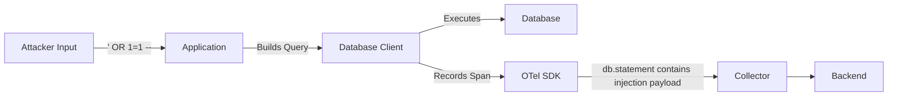
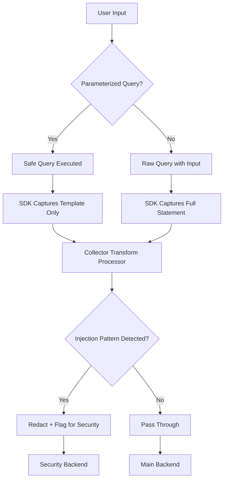

# How to Prevent SQL Injection Data from Appearing in Traces

Author: [nawazdhandala](https://www.github.com/nawazdhandala)

Tags: OpenTelemetry, Security, SQL Injection, Tracing, Database

Description: Learn how to prevent SQL injection payloads and sensitive query data from leaking into your OpenTelemetry traces and distributed tracing systems.

---

When attackers send SQL injection payloads to your application, those malicious strings can end up in your telemetry data. If your database instrumentation captures the full query text, you might find `db.statement` span attributes containing things like `' OR 1=1 --` or worse, complete UNION SELECT statements targeting your system tables. This is a problem for two reasons: it exposes information about the attack vectors that worked (or almost worked), and it can leak sensitive database schema details through your observability pipeline.

This guide covers practical steps to prevent SQL injection data from appearing in your OpenTelemetry traces while still keeping your database observability useful.

## How SQL Injection Data Ends Up in Traces

Most OpenTelemetry database instrumentation libraries capture the SQL statement being executed as a span attribute. This is incredibly useful for debugging slow queries and understanding application behavior. But it also means that whatever query your application runs, including queries built from unsanitized user input, gets recorded.



Consider a vulnerable application that concatenates user input into a query. Even if the injection does not succeed because of other safeguards, the instrumentation will capture the full query text.

This Python example shows how a vulnerable query pattern leads to injection data in spans.

```python
# VULNERABLE CODE - Do not do this in production
# This concatenates user input directly into the query
def get_user(username):
    query = f"SELECT * FROM users WHERE name = '{username}'"
    # The OTel database instrumentation will capture this query
    # If username is "' OR 1=1 --", the span will contain:
    # db.statement = "SELECT * FROM users WHERE name = '' OR 1=1 --'"
    cursor.execute(query)
    return cursor.fetchone()
```

## Step 1: Fix the Root Cause - Use Parameterized Queries

The most effective defense is using parameterized queries. This prevents SQL injection at the application level, and as a bonus, the instrumentation will capture the parameterized query template instead of the resolved values.

This example shows the safe pattern using parameterized queries. The OTel instrumentation will record the template, not the values.

```python
# SAFE CODE - Use parameterized queries
def get_user(username):
    # The OTel instrumentation captures: "SELECT * FROM users WHERE name = ?"
    # The actual parameter value is NOT included in db.statement by default
    query = "SELECT * FROM users WHERE name = %s"
    cursor.execute(query, (username,))
    return cursor.fetchone()
```

Most OpenTelemetry database instrumentation libraries will record the parameterized form of the query. For example, the `opentelemetry-instrumentation-psycopg2` library for Python records the query template by default. But this behavior varies across languages and libraries, so you need to verify what your specific instrumentation does.

## Step 2: Configure SDK-Level Statement Sanitization

Some instrumentation libraries offer options to sanitize or truncate the captured SQL statement. Check the specific instrumentation library you are using for available options.

For the Python psycopg2 instrumentation, you can disable query capture entirely or enable sanitization.

This configuration shows how to control SQL statement capture at the instrumentation level.

```python
# Configure the psycopg2 instrumentation to sanitize queries
from opentelemetry.instrumentation.psycopg2 import Psycopg2Instrumentor

# Option 1: Disable capturing the SQL statement entirely
Psycopg2Instrumentor().instrument(
    enable_commenter=True,
    # Set to True to avoid recording the full db.statement
    sanitize_query=True
)
```

For Java applications using the OpenTelemetry Java agent, you can control statement sanitization through system properties.

These JVM flags configure the Java agent to sanitize database statements.

```bash
# Start the Java application with statement sanitization enabled
java -javaagent:opentelemetry-javaagent.jar \
  -Dotel.instrumentation.common.db-statement-sanitizer.enabled=true \
  -Dotel.instrumentation.jdbc.statement.sanitizer.enabled=true \
  -jar myapp.jar
```

For .NET applications, the instrumentation provides similar configuration options.

```csharp
// Configure SQL client instrumentation to sanitize queries
using var tracerProvider = Sdk.CreateTracerProviderBuilder()
    .AddSqlClientInstrumentation(options =>
    {
        // Record the SQL statement but sanitize parameter values
        options.SetDbStatementForText = true;
        // Filter function to redact sensitive patterns
        options.Filter = (command) =>
        {
            // Skip tracing for specific query patterns
            return !command.CommandText.Contains("information_schema");
        };
    })
    .Build();
```

## Step 3: Redact SQL Statements at the Collector

Even with SDK-level protections, defense in depth requires Collector-level sanitization. Use the attributes processor or the transform processor to redact or modify `db.statement` values before they reach your backend.

This Collector configuration uses the transform processor to sanitize SQL statements matching suspicious patterns.

```yaml
# collector-config.yaml
processors:
  # Use the transform processor with OTTL to sanitize SQL statements
  transform/sanitize-sql:
    trace_statements:
      - context: span
        statements:
          # Replace db.statement values containing common injection patterns
          - replace_pattern(attributes["db.statement"], "(?i)(OR|AND)\\s+1\\s*=\\s*1", "[REDACTED-INJECTION]")
          - replace_pattern(attributes["db.statement"], "(?i)UNION\\s+SELECT", "[REDACTED-INJECTION]")
          - replace_pattern(attributes["db.statement"], "(?i)(--|#|/\\*)", "[REDACTED-COMMENT]")
          # Truncate very long statements that might indicate injection attempts
          - truncate_all(attributes, 500)

service:
  pipelines:
    traces:
      receivers: [otlp]
      processors: [transform/sanitize-sql, batch]
      exporters: [otlp]
```

For a more aggressive approach, you can completely remove the `db.statement` attribute and replace it with just the operation type.

This configuration strips the full SQL text and keeps only the operation name.

```yaml
# collector-config-aggressive.yaml
processors:
  # Remove full SQL statements, keep only the operation type
  transform/strip-sql:
    trace_statements:
      - context: span
        statements:
          # Extract just the operation type (SELECT, INSERT, UPDATE, DELETE)
          - replace_pattern(attributes["db.statement"], "(?i)^(SELECT|INSERT|UPDATE|DELETE|CREATE|DROP|ALTER)\\s.*$", "$$1 [REDACTED]")

  # Alternative: delete the attribute entirely
  attributes/remove-sql:
    actions:
      - key: db.statement
        action: delete
```

## Step 4: Detect Injection Attempts Through Telemetry

While you are sanitizing the data, you can also use the Collector to detect and flag potential injection attempts. This turns your telemetry pipeline into an additional security monitoring layer.

This configuration adds a warning attribute to spans that contain SQL injection patterns, then routes them to a security monitoring system.

```yaml
# collector-security-detect.yaml
processors:
  # Flag spans that contain potential SQL injection patterns
  transform/detect-injection:
    trace_statements:
      - context: span
        statements:
          # Check for common injection patterns and add a security flag
          - set(attributes["security.sql_injection_detected"], "true") where IsMatch(attributes["db.statement"], "(?i)(union\\s+select|or\\s+1\\s*=\\s*1|drop\\s+table|;\\s*--)")

connectors:
  # Route flagged spans to a security pipeline
  routing:
    default_pipelines: [traces/default]
    table:
      - statement: route() where attributes["security.sql_injection_detected"] == "true"
        pipelines: [traces/security]

service:
  pipelines:
    traces/input:
      receivers: [otlp]
      processors: [transform/detect-injection]
      exporters: [routing]
    traces/security:
      receivers: [routing]
      processors: [batch]
      exporters: [otlp/security-backend]
    traces/default:
      receivers: [routing]
      processors: [batch]
      exporters: [otlp/main-backend]
```

## Step 5: Limit What Gets Captured at the Source

Beyond parameterized queries, you can configure your application to limit what database information is captured in traces.

This OpenTelemetry SDK configuration limits the size of span attributes, which helps contain any injection data that slips through.

```yaml
# otel-sdk-limits.yaml
# Set global limits on attribute values to prevent large injection payloads
OTEL_SPAN_ATTRIBUTE_VALUE_LENGTH_LIMIT=200
OTEL_SPAN_ATTRIBUTE_COUNT_LIMIT=50
```

You can also implement a custom SpanProcessor that sanitizes attributes before they are exported.

This Python custom SpanProcessor redacts SQL injection patterns from span attributes before export.

```python
from opentelemetry.sdk.trace import SpanProcessor
import re

class SqlSanitizingProcessor(SpanProcessor):
    """Custom processor that sanitizes SQL statements in span attributes."""

    # Patterns commonly associated with SQL injection
    INJECTION_PATTERNS = [
        re.compile(r"(?i)(union\s+select)", re.IGNORECASE),
        re.compile(r"(?i)(or\s+1\s*=\s*1)", re.IGNORECASE),
        re.compile(r"(?i)(;\s*drop\s+table)", re.IGNORECASE),
        re.compile(r"(?i)(information_schema)", re.IGNORECASE),
    ]

    def on_end(self, span):
        # Check if the span has a db.statement attribute
        statement = span.attributes.get("db.statement")
        if statement:
            for pattern in self.INJECTION_PATTERNS:
                if pattern.search(statement):
                    # Replace the statement with a redacted version
                    span.set_attribute("db.statement", "[REDACTED - potential injection]")
                    span.set_attribute("security.redacted", True)
                    break
```

## The Full Pipeline

Here is how all these layers work together to keep injection data out of your traces.



## Key Takeaways

Preventing SQL injection data in traces is a layered problem. Fix the root cause first by using parameterized queries everywhere. Then add SDK-level sanitization to control what gets captured. Follow that with Collector-level redaction as a safety net. And finally, use the telemetry pipeline itself to detect and alert on injection attempts.

Do not just delete `db.statement` attributes entirely unless you have no alternative. That attribute is incredibly valuable for debugging. The goal is to capture useful query information while stripping out anything that could be dangerous or sensitive. With the right combination of parameterized queries, instrumentation configuration, and Collector processors, you can have both security and observability.
