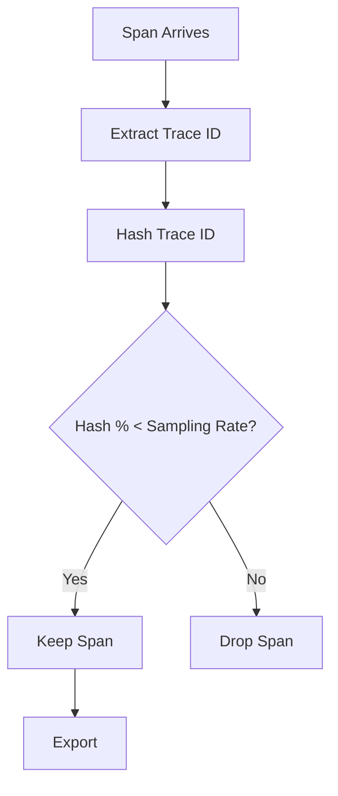

# How to Configure the Probabilistic Sampler Processor in the OpenTelemetry Collector

Author: [nawazdhandala](https://www.github.com/nawazdhandala)

Tags: OpenTelemetry, Collector, Processors, Probabilistic Sampling, Head Sampling, Distributed Tracing

Description: Learn how to configure the probabilistic sampler processor in OpenTelemetry Collector for consistent, stateless trace sampling across distributed systems.

The probabilistic sampler processor provides deterministic, stateless sampling based on trace IDs. Unlike tail sampling that requires buffering complete traces, probabilistic sampling makes sampling decisions immediately when spans arrive. This makes it lightweight, fast, and ideal for high-throughput systems where you need to reduce data volume without adding latency or memory overhead.

## Why Probabilistic Sampling

When dealing with high-volume tracing data, capturing every trace is often impractical. Probabilistic sampling lets you keep a consistent percentage of traces while dramatically reducing storage and processing costs. Because it uses the trace ID for sampling decisions, all spans in a trace get the same decision, maintaining trace completeness.

For more context on managing trace volume, see our guide on [reducing noise in OpenTelemetry](https://oneuptime.com/blog/post/2025-08-25-how-to-reduce-noise-in-opentelemetry/view).

## How Probabilistic Sampling Works

The processor hashes the trace ID and uses the result to make a deterministic sampling decision. For example, with 10% sampling, traces whose hashed ID falls in the first 10% of the hash space are kept; others are dropped. Because the decision is based solely on the trace ID, the same trace always gets the same decision regardless of which collector instance processes it.



## Basic Configuration

Here's a simple configuration that samples 10% of all traces:

```yaml
# Basic probabilistic sampling configuration
# Samples 10% of traces deterministically by trace ID
receivers:
  otlp:
    protocols:
      grpc:
        endpoint: 0.0.0.0:4317

processors:
  # Probabilistic sampler makes instant decisions
  # No buffering or waiting for complete traces
  probabilistic_sampler:
    # Percentage of traces to keep (0-100)
    # Uses trace ID hash for deterministic decisions
    sampling_percentage: 10

    # Optional: Hash seed for reproducibility
    # Same seed + trace ID = same decision
    # Leave unset for random seed
    hash_seed: 42

exporters:
  otlp:
    endpoint: https://oneuptime.com/otlp
    headers:
      x-oneuptime-token: YOUR_ONEUPTIME_TOKEN

service:
  pipelines:
    traces:
      receivers: [otlp]
      processors: [probabilistic_sampler]
      exporters: [otlp]
```

## Sampling Modes

The probabilistic sampler supports two modes: proportional and equalizing.

### Proportional Mode (Default)

Respects upstream sampling decisions. If a trace is already sampled at 50% upstream and you sample at 10%, the effective rate is 5% (0.5 × 0.1).

```yaml
processors:
  probabilistic_sampler:
    # Proportional mode multiplies sampling rates
    # Effective rate = upstream_rate × local_rate
    sampling_percentage: 10

    # Default mode - can be explicit
    mode: proportional

    # When using proportional mode, you can set different rates
    # for traces that have no prior sampling information
    sampling_percentage_for_missing_priority: 10
```

### Equalizing Mode

Adjusts sampling to achieve a target rate regardless of upstream decisions. If upstream sampled at 50% and you want 10% final rate, this mode samples at 20% (0.5 × 0.2 = 0.1).

```yaml
processors:
  probabilistic_sampler:
    # Equalizing mode ensures consistent final sampling rate
    # Compensates for upstream sampling decisions
    sampling_percentage: 10

    # Enable equalizing mode
    mode: equalizing

    # Traces without sampling info use this rate
    sampling_percentage_for_missing_priority: 10
```

## Attribute-Based Sampling Configuration

While the basic probabilistic sampler uses only the trace ID, you can combine it with other processors for attribute-based logic:

```yaml
processors:
  # Route traces to different pipelines based on attributes
  routing:
    default_pipelines:
      - traces/sampled
    table:
      # High-priority traces go to different pipeline
      - statement: route() where attributes["priority"] == "high"
        pipelines:
          - traces/high-priority

  # Sample regular traffic at 10%
  probabilistic_sampler/regular:
    sampling_percentage: 10

  # Sample high-priority traffic at 100%
  probabilistic_sampler/high-priority:
    sampling_percentage: 100

exporters:
  otlp:
    endpoint: https://oneuptime.com/otlp
    headers:
      x-oneuptime-token: YOUR_ONEUPTIME_TOKEN

service:
  pipelines:
    # Pipeline for regular traces
    traces/sampled:
      receivers: [otlp]
      processors: [probabilistic_sampler/regular]
      exporters: [otlp]

    # Pipeline for high-priority traces
    traces/high-priority:
      receivers: [otlp]
      processors: [probabilistic_sampler/high-priority]
      exporters: [otlp]
```

## Multi-Stage Sampling

Combine probabilistic sampling at different stages for fine-grained control:

```yaml
receivers:
  otlp:
    protocols:
      grpc:
        endpoint: 0.0.0.0:4317

processors:
  # Stage 1: Aggressive initial sampling to reduce load
  # Applied to all incoming traces
  probabilistic_sampler/initial:
    sampling_percentage: 25
    hash_seed: 1

  # Stage 2: Further reduce after processing
  # Applied after enrichment/filtering
  probabilistic_sampler/final:
    sampling_percentage: 40
    hash_seed: 2
    # Effective rate: 25% × 40% = 10%

  # Add attributes between sampling stages
  attributes:
    actions:
      - key: sampling.stage
        value: "processed"
        action: insert

exporters:
  otlp:
    endpoint: https://oneuptime.com/otlp
    headers:
      x-oneuptime-token: YOUR_ONEUPTIME_TOKEN

service:
  pipelines:
    traces:
      receivers: [otlp]
      processors:
        - probabilistic_sampler/initial
        - attributes
        - probabilistic_sampler/final
      exporters: [otlp]
```

## Dynamic Sampling Rates

While the collector doesn't support dynamic rate adjustment natively, you can implement it using environment variables and configuration reloading:

```yaml
processors:
  probabilistic_sampler:
    # Reference environment variable for dynamic control
    # Update env var and reload collector to change rate
    sampling_percentage: ${SAMPLING_RATE}
    hash_seed: ${SAMPLING_SEED:42}  # Default to 42 if not set

exporters:
  otlp:
    endpoint: https://oneuptime.com/otlp
    headers:
      x-oneuptime-token: YOUR_ONEUPTIME_TOKEN

service:
  pipelines:
    traces:
      receivers: [otlp]
      processors: [probabilistic_sampler]
      exporters: [otlp]
```

Deploy with environment variables:

```bash
# Set sampling rate via environment
export SAMPLING_RATE=10
export SAMPLING_SEED=12345

# Run collector
otelcol --config config.yaml

# To change rate at runtime, update env and send SIGHUP
export SAMPLING_RATE=25
kill -SIGHUP $(pidof otelcol)
```

## Per-Environment Sampling

Configure different sampling rates for different environments:

```yaml
receivers:
  otlp:
    protocols:
      grpc:
        endpoint: 0.0.0.0:4317

processors:
  # Filter processor to route by environment
  filter/production:
    traces:
      span:
        - 'attributes["deployment.environment"] == "production"'

  filter/staging:
    traces:
      span:
        - 'attributes["deployment.environment"] == "staging"'

  filter/development:
    traces:
      span:
        - 'attributes["deployment.environment"] == "development"'

  # Different sampling rates per environment
  probabilistic_sampler/production:
    sampling_percentage: 5

  probabilistic_sampler/staging:
    sampling_percentage: 25

  probabilistic_sampler/development:
    sampling_percentage: 100

exporters:
  otlp:
    endpoint: https://oneuptime.com/otlp
    headers:
      x-oneuptime-token: YOUR_ONEUPTIME_TOKEN

service:
  pipelines:
    # Production traces - aggressive sampling
    traces/production:
      receivers: [otlp]
      processors:
        - filter/production
        - probabilistic_sampler/production
      exporters: [otlp]

    # Staging traces - moderate sampling
    traces/staging:
      receivers: [otlp]
      processors:
        - filter/staging
        - probabilistic_sampler/staging
      exporters: [otlp]

    # Development traces - keep everything
    traces/development:
      receivers: [otlp]
      processors:
        - filter/development
        - probabilistic_sampler/development
      exporters: [otlp]
```

## Combining with Tail Sampling

Use probabilistic sampling to reduce volume before tail sampling analyzes traces:

```yaml
receivers:
  otlp:
    protocols:
      grpc:
        endpoint: 0.0.0.0:4317

processors:
  # Stage 1: Probabilistic sampling reduces initial volume
  # Keeps 25% of traces immediately
  probabilistic_sampler:
    sampling_percentage: 25
    hash_seed: 100

  # Stage 2: Tail sampling makes intelligent decisions
  # Only processes 25% of original volume
  tail_sampling:
    decision_wait: 10s
    num_traces: 100000
    expected_new_traces_per_sec: 1000
    policies:
      # Keep all errors (from the 25% that passed probabilistic sampling)
      - name: errors
        type: status_code
        status_code:
          status_codes:
            - ERROR

      # Keep slow traces
      - name: slow-traces
        type: latency
        latency:
          threshold_ms: 1000

      # Sample remaining at 40% (effective: 25% × 40% = 10%)
      - name: baseline
        type: probabilistic
        probabilistic:
          sampling_percentage: 40

exporters:
  otlp:
    endpoint: https://oneuptime.com/otlp
    headers:
      x-oneuptime-token: YOUR_ONEUPTIME_TOKEN

service:
  pipelines:
    traces:
      receivers: [otlp]
      processors:
        - probabilistic_sampler
        - tail_sampling
      exporters: [otlp]
```

## Production Configuration

Here's a comprehensive production setup with monitoring and optimization:

```yaml
receivers:
  otlp:
    protocols:
      grpc:
        endpoint: 0.0.0.0:4317
        # Increase max message size for large traces
        max_recv_msg_size_mib: 16
      http:
        endpoint: 0.0.0.0:4318

processors:
  # Add batch processor for efficiency
  # Groups spans before sampling decisions
  batch:
    timeout: 1s
    send_batch_size: 1024
    send_batch_max_size: 2048

  # Probabilistic sampling
  probabilistic_sampler:
    # Sample 10% of traces
    sampling_percentage: ${SAMPLING_PERCENTAGE:10}

    # Use consistent hash seed for reproducibility
    # Useful for testing and debugging
    hash_seed: ${SAMPLING_HASH_SEED:42}

    # Equalizing mode for consistent rate
    mode: ${SAMPLING_MODE:equalizing}

    # Rate for traces without sampling priority
    sampling_percentage_for_missing_priority: 10

  # Add sampling decision as attribute for analysis
  attributes:
    actions:
      - key: sampling.probabilistic.rate
        value: "${SAMPLING_PERCENTAGE:10}"
        action: insert
      - key: sampling.probabilistic.seed
        value: "${SAMPLING_HASH_SEED:42}"
        action: insert

exporters:
  otlp:
    endpoint: ${OTEL_EXPORTER_OTLP_ENDPOINT:https://oneuptime.com/otlp}
    headers:
      x-oneuptime-token: ${OTEL_EXPORTER_OTLP_TOKEN}

    # Configure timeouts and retries
    timeout: 30s
    retry_on_failure:
      enabled: true
      initial_interval: 5s
      max_interval: 30s
      max_elapsed_time: 300s

    # Enable compression to reduce bandwidth
    compression: gzip

  # Optional: Export to multiple backends
  otlp/backup:
    endpoint: ${BACKUP_OTLP_ENDPOINT}
    headers:
      authorization: Bearer ${BACKUP_TOKEN}

service:
  pipelines:
    traces:
      receivers: [otlp]
      processors:
        - batch
        - probabilistic_sampler
        - attributes
      exporters: [otlp, otlp/backup]

  # Monitor sampler performance
  telemetry:
    metrics:
      level: detailed
      readers:
        - periodic:
            exporter:
              otlp:
                protocol: http/protobuf
                endpoint: https://oneuptime.com/otlp
                headers:
                  x-oneuptime-token: ${OTEL_EXPORTER_OTLP_TOKEN}
```

## Sampling Rate Selection Guidelines

Choose sampling rates based on traffic volume and observability needs:

| Traffic Volume | Recommended Rate | Rationale |
|----------------|-----------------|-----------|
| < 100 traces/sec | 100% | Capture everything |
| 100-1K traces/sec | 50-100% | Minimal sampling |
| 1K-10K traces/sec | 10-50% | Moderate sampling |
| 10K-100K traces/sec | 1-10% | Aggressive sampling |
| > 100K traces/sec | < 1% | Very aggressive sampling |

Adjust based on:
- **Storage costs**: Lower rate = less storage
- **Query performance**: More data = slower queries
- **Debugging needs**: Critical services need higher rates
- **Compliance requirements**: Some traces must be kept

## Trace ID Consistency

Probabilistic sampling ensures consistency across distributed traces:

```yaml
# Service A collector
processors:
  probabilistic_sampler:
    sampling_percentage: 10
    hash_seed: 12345  # Same seed across services

# Service B collector
processors:
  probabilistic_sampler:
    sampling_percentage: 10
    hash_seed: 12345  # Same seed ensures consistency
```

With the same hash seed, a trace sampled by Service A will also be sampled by Service B, maintaining trace completeness across service boundaries.

## Monitoring Probabilistic Sampling

Track these metrics to understand sampling behavior:

```yaml
service:
  telemetry:
    metrics:
      level: detailed
      readers:
        - periodic:
            exporter:
              otlp:
                protocol: http/protobuf
                endpoint: https://oneuptime.com/otlp
                headers:
                  x-oneuptime-token: YOUR_TOKEN
```

Key metrics to monitor:
- `otelcol_processor_probabilistic_sampler_count_traces_sampled` - Traces sampled
- `otelcol_processor_probabilistic_sampler_sampling_percentage` - Current sampling rate
- `otelcol_processor_dropped_spans` - Spans dropped by sampling
- `otelcol_receiver_accepted_spans` - Total spans received

Calculate actual sampling rate:
```
Actual Rate = (sampled_traces / total_traces) × 100
```

## Troubleshooting

### Inconsistent Sampling Across Services

**Issue**: Different services sample the same trace differently.

**Solutions**:
- Ensure all collectors use the same `hash_seed`
- Verify all collectors use the same `sampling_percentage`
- Check that trace IDs are propagated correctly
- Confirm collectors use the same sampling mode

### Lower Than Expected Sampling Rate

**Issue**: Actual sampling rate is lower than configured.

**Solutions**:
- Check if multiple probabilistic samplers are in the pipeline (rates multiply)
- Verify upstream sampling isn't reducing the rate
- Use `equalizing` mode if upstream sampling is affecting results
- Monitor `sampling_percentage_for_missing_priority` usage

### Higher Than Expected Costs

**Issue**: Storage costs higher than expected from sampling rate.

**Solutions**:
- Reduce `sampling_percentage`
- Implement multi-stage sampling
- Add tail sampling to keep only important traces
- Use attribute filtering to exclude low-value traces

## Performance Characteristics

Probabilistic sampling is extremely lightweight:

- **CPU**: Minimal (simple hash calculation)
- **Memory**: No buffering (stateless)
- **Latency**: Negligible (< 1ms per span)
- **Throughput**: Supports millions of spans/sec

This makes it ideal for high-throughput scenarios where tail sampling would be too memory-intensive.

## Summary

| Feature | Probabilistic Sampler | Tail Sampler |
|---------|----------------------|--------------|
| **Decision timing** | Immediate | After trace complete |
| **Memory usage** | Minimal | High |
| **Trace consistency** | Guaranteed | Guaranteed |
| **Intelligence** | Random | Policy-based |
| **Latency** | None | Adds decision_wait |
| **Use case** | Volume reduction | Keep important traces |

Probabilistic sampling provides a simple, efficient way to reduce trace volume while maintaining trace completeness. It works deterministically based on trace IDs, ensuring consistent sampling decisions across distributed systems without memory overhead or latency.

For more advanced sampling strategies, see our guide on [tail sampling](https://oneuptime.com/blog/post/2026-02-06-tail-sampling-processor-opentelemetry-collector/view). To understand the traces being sampled, check out [traces and spans in OpenTelemetry](https://oneuptime.com/blog/post/2025-08-27-traces-and-spans-in-opentelemetry/view).
