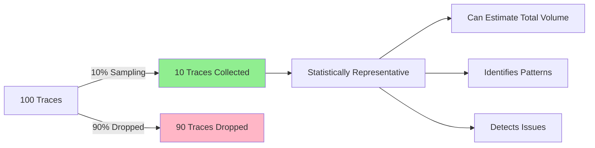

# How to Implement Probabilistic Sampling in OpenTelemetry for Cost Control

Author: [nawazdhandala](https://www.github.com/nawazdhandala)

Tags: OpenTelemetry, Sampling, Cost Optimization, Tracing, Performance

Description: Master probabilistic sampling in OpenTelemetry to reduce trace costs by 50-90% while maintaining statistical accuracy. Learn head sampling, tail sampling, and adaptive strategies.

Collecting 100% of traces is expensive and often unnecessary. Probabilistic sampling allows you to collect a statistically representative subset of traces, reducing costs by 50-90% while maintaining the ability to identify issues and understand system behavior.

OpenTelemetry supports multiple sampling strategies, each with different trade-offs. This guide covers practical implementations of probabilistic sampling for cost control without sacrificing observability.

## Understanding Probabilistic Sampling

Probabilistic sampling makes random decisions about which traces to keep. A 10% sampling rate means each trace has a 10% probability of being collected.



The key insight is that with proper sampling, 10 traces can tell you almost as much as 100 traces about system behavior, but at 1/10th the cost.

## Head Sampling: SDK-Level Decisions

Head sampling makes decisions at trace creation time, before any spans are generated. This is the most efficient approach because unsampled traces never consume resources.

### Basic Head Sampling Configuration

```python
# Python SDK head sampling configuration
from opentelemetry import trace
from opentelemetry.sdk.trace import TracerProvider
from opentelemetry.sdk.trace.sampling import (
    TraceIdRatioBased,
    ParentBased,
    ALWAYS_ON,
    ALWAYS_OFF,
)
from opentelemetry.sdk.trace.export import BatchSpanProcessor
from opentelemetry.exporter.otlp.proto.grpc.trace_exporter import OTLPSpanExporter

# Simple probabilistic sampling: keep 10% of traces
sampler = TraceIdRatioBased(0.1)

# Parent-based sampling: respect parent's sampling decision
# If trace has no parent, use probabilistic sampling
# If trace has parent, follow parent's decision
sampler = ParentBased(root=TraceIdRatioBased(0.1))

# Initialize tracer provider with sampler
provider = TracerProvider(sampler=sampler)
provider.add_span_processor(
    BatchSpanProcessor(OTLPSpanExporter())
)

trace.set_tracer_provider(provider)

# Usage in code remains unchanged
tracer = trace.get_tracer(__name__)
with tracer.start_as_current_span("operation"):
    # This span will only be created 10% of the time
    pass
```

### Advanced Head Sampling with Custom Logic

```python
# Custom sampler with advanced logic
from opentelemetry.sdk.trace.sampling import (
    Sampler,
    SamplingResult,
    Decision,
)
from opentelemetry.trace import SpanKind
import hashlib

class SmartProbabilisticSampler(Sampler):
    """
    Custom sampler that adjusts sampling rate based on span attributes.
    """

    def __init__(
        self,
        default_rate=0.1,
        error_rate=1.0,
        slow_request_rate=1.0,
        critical_endpoint_rate=1.0,
    ):
        self.default_rate = default_rate
        self.error_rate = error_rate
        self.slow_request_rate = slow_request_rate
        self.critical_endpoint_rate = critical_endpoint_rate

    def should_sample(
        self,
        parent_context,
        trace_id,
        name,
        kind,
        attributes,
        links,
        trace_state,
    ):
        """
        Make sampling decision based on trace attributes.
        """
        # Always follow parent's sampling decision
        if parent_context and parent_context.trace_flags.sampled:
            return SamplingResult(
                Decision.RECORD_AND_SAMPLE,
                attributes=attributes,
                trace_state=trace_state,
            )

        # Check for error indicators
        if attributes and attributes.get("error"):
            rate = self.error_rate
        # Check for slow requests
        elif attributes and attributes.get("http.duration_ms", 0) > 1000:
            rate = self.slow_request_rate
        # Check for critical endpoints
        elif attributes and attributes.get("http.route") in [
            "/api/payment",
            "/api/checkout",
            "/api/auth",
        ]:
            rate = self.critical_endpoint_rate
        # Default rate for everything else
        else:
            rate = self.default_rate

        # Use trace_id for deterministic sampling
        # This ensures consistent sampling across distributed services
        trace_id_bytes = trace_id.to_bytes(16, byteorder="big")
        hash_value = int(hashlib.md5(trace_id_bytes).hexdigest(), 16)
        threshold = rate * (2**128)

        if hash_value < threshold:
            return SamplingResult(
                Decision.RECORD_AND_SAMPLE,
                attributes=attributes,
                trace_state=trace_state,
            )
        else:
            return SamplingResult(
                Decision.DROP,
                attributes=attributes,
                trace_state=trace_state,
            )

    def get_description(self):
        return f"SmartProbabilisticSampler(default={self.default_rate})"

# Use custom sampler
provider = TracerProvider(
    sampler=SmartProbabilisticSampler(
        default_rate=0.1,       # 10% of normal traffic
        error_rate=1.0,         # 100% of errors
        slow_request_rate=1.0,  # 100% of slow requests
        critical_endpoint_rate=0.5,  # 50% of critical endpoints
    )
)
```

### Go SDK Head Sampling

```go
// Go SDK probabilistic sampling configuration
package main

import (
    "go.opentelemetry.io/otel"
    "go.opentelemetry.io/otel/sdk/trace"
    sdktrace "go.opentelemetry.io/otel/sdk/trace"
)

func initTracerProvider() *sdktrace.TracerProvider {
    // Simple probabilistic sampling: 10%
    sampler := sdktrace.TraceIDRatioBased(0.1)

    // Parent-based sampling (recommended)
    sampler = sdktrace.ParentBased(
        sdktrace.TraceIDRatioBased(0.1),
        // Optional: override behavior for different scenarios
        sdktrace.WithRemoteParentSampled(sdktrace.AlwaysSample()),
        sdktrace.WithRemoteParentNotSampled(sdktrace.NeverSample()),
        sdktrace.WithLocalParentSampled(sdktrace.AlwaysSample()),
        sdktrace.WithLocalParentNotSampled(sdktrace.NeverSample()),
    )

    return sdktrace.NewTracerProvider(
        sdktrace.WithSampler(sampler),
        sdktrace.WithBatcher(exporter),
    )
}
```

## Tail Sampling: Collector-Level Decisions

Tail sampling makes decisions after seeing complete traces. This allows sampling based on trace content (errors, latency, specific attributes) but requires more collector resources.

### Basic Tail Sampling Configuration

```yaml
# OpenTelemetry Collector tail sampling configuration
receivers:
  otlp:
    protocols:
      grpc:
        endpoint: 0.0.0.0:4317

processors:
  # Tail sampling processor
  tail_sampling:
    # How long to wait for complete traces
    decision_wait: 10s

    # Number of traces to keep in memory
    # Increase for high-throughput systems
    num_traces: 100000

    # Expected new traces per second
    # Used for memory allocation optimization
    expected_new_traces_per_sec: 1000

    # Sampling policies (evaluated in order)
    policies:
      # Policy 1: Always sample errors (100%)
      - name: errors-policy
        type: status_code
        status_code:
          status_codes:
            - ERROR
            - UNSET

      # Policy 2: Always sample slow traces (100%)
      - name: latency-policy
        type: latency
        latency:
          threshold_ms: 1000

      # Policy 3: Sample based on trace ID (10%)
      - name: probabilistic-policy
        type: probabilistic
        probabilistic:
          sampling_percentage: 10
          # Hash seed for deterministic sampling
          hash_seed: 22

  batch:
    timeout: 10s
    send_batch_size: 1024

exporters:
  otlp:
    endpoint: backend:4317

service:
  pipelines:
    traces:
      receivers: [otlp]
      processors: [tail_sampling, batch]
      exporters: [otlp]
```

### Advanced Multi-Policy Tail Sampling

```yaml
# Advanced tail sampling with multiple policies
processors:
  tail_sampling:
    decision_wait: 10s
    num_traces: 100000
    expected_new_traces_per_sec: 1000

    policies:
      # Policy 1: Always keep errors (Priority 1)
      - name: errors
        type: status_code
        status_code:
          status_codes: [ERROR, UNSET]

      # Policy 2: Always keep slow requests (Priority 2)
      - name: slow-traces
        type: latency
        latency:
          threshold_ms: 2000

      # Policy 3: Sample by service name (Priority 3)
      # Critical services get higher sampling
      - name: critical-services
        type: and
        and:
          and_sub_policy:
            - type: string_attribute
              string_attribute:
                key: service.name
                values:
                  - payment-service
                  - auth-service
                  - checkout-service
            - type: probabilistic
              probabilistic:
                sampling_percentage: 50  # 50% for critical services

      # Policy 4: Sample by endpoint (Priority 4)
      # Important endpoints get higher sampling
      - name: important-endpoints
        type: string_attribute
        string_attribute:
          key: http.route
          values:
            - /api/payment
            - /api/checkout
            - /api/order
          enabled_regex_matching: true
          invert_match: false

      # Policy 5: Composite policy - errors OR slow requests
      - name: errors-or-slow
        type: or
        or:
          or_sub_policy:
            - type: status_code
              status_code:
                status_codes: [ERROR]
            - type: latency
              latency:
                threshold_ms: 1000

      # Policy 6: Rate limiting (Priority 6)
      # Maximum 500 traces per second regardless of other policies
      - name: rate-limit
        type: rate_limiting
        rate_limiting:
          spans_per_second: 500

      # Policy 7: Span count policy
      # Keep traces with many spans (might indicate complexity)
      - name: complex-traces
        type: span_count
        span_count:
          min_spans: 20

      # Policy 8: Numeric attribute policy
      # Sample based on numeric attributes
      - name: high-value-transactions
        type: numeric_attribute
        numeric_attribute:
          key: transaction.amount
          min_value: 1000
          max_value: 999999

      # Policy 9: String attribute with regex
      - name: specific-users
        type: string_attribute
        string_attribute:
          key: user.tier
          values: [premium, enterprise]

      # Policy 10: Probabilistic baseline (Priority 10)
      # Catch remaining traces at 5%
      - name: probabilistic-baseline
        type: probabilistic
        probabilistic:
          sampling_percentage: 5
          hash_seed: 22

      # Policy 11: Always sample (for testing)
      # Useful for specific trace IDs during debugging
      - name: always-sample-test
        type: always_sample
```

## Adaptive Sampling: Dynamic Rate Adjustment

Adaptive sampling adjusts rates dynamically based on traffic patterns, costs, or error rates:

```yaml
# Collector configuration with adaptive sampling
processors:
  # Note: Adaptive sampling requires custom implementation
  # This is a conceptual example

  tail_sampling:
    decision_wait: 10s
    num_traces: 100000

    # Policies can be dynamically adjusted via remote config
    policies:
      - name: adaptive-probabilistic
        type: probabilistic
        probabilistic:
          # This rate can be updated dynamically
          sampling_percentage: ${SAMPLING_RATE:10}

      - name: always-errors
        type: status_code
        status_code:
          status_codes: [ERROR]

# External service adjusts SAMPLING_RATE based on:
# - Current span volume
# - Monthly cost budget consumption
# - Error rate (increase sampling when errors spike)
# - Time of day (higher sampling during business hours)
```

### Implementing Adaptive Sampling Logic

```python
# Python script for adaptive sampling rate calculation
import os
import time
import requests
from datetime import datetime

class AdaptiveSamplingController:
    """
    Dynamically adjusts sampling rate based on cost and volume.
    """

    def __init__(
        self,
        collector_config_api,
        monthly_budget_usd=5000,
        cost_per_span_usd=0.00001,
    ):
        self.collector_config_api = collector_config_api
        self.monthly_budget = monthly_budget_usd
        self.cost_per_span = cost_per_span_usd

        # Calculate daily budget
        self.daily_budget = monthly_budget_usd / 30

        # Track current month spending
        self.current_month_spend = 0
        self.last_update = time.time()

    def calculate_sampling_rate(self):
        """
        Calculate optimal sampling rate based on budget consumption.
        """
        # Get current span rate
        span_rate = self.get_current_span_rate()

        # Calculate projected daily cost at 100% sampling
        daily_cost_100pct = span_rate * 86400 * self.cost_per_span

        # Calculate required sampling rate to stay within budget
        if daily_cost_100pct > 0:
            target_sampling_rate = min(
                1.0,
                self.daily_budget / daily_cost_100pct
            )
        else:
            target_sampling_rate = 1.0

        # Get current day of month to adjust budget
        day_of_month = datetime.now().day
        days_in_month = 30
        remaining_budget_ratio = (days_in_month - day_of_month) / days_in_month

        # If we've spent too much, reduce sampling more aggressively
        month_budget_used = self.current_month_spend / self.monthly_budget
        if month_budget_used > (1 - remaining_budget_ratio):
            # We're over budget pace, reduce sampling
            adjustment_factor = 0.8
            target_sampling_rate *= adjustment_factor

        # Ensure minimum sampling rate for error detection
        target_sampling_rate = max(0.01, target_sampling_rate)

        # Ensure maximum sampling rate
        target_sampling_rate = min(1.0, target_sampling_rate)

        return target_sampling_rate

    def get_current_span_rate(self):
        """
        Query collector metrics for current span ingestion rate.
        """
        # Query Prometheus or collector metrics endpoint
        response = requests.get(
            f"{self.collector_config_api}/metrics",
            timeout=5
        )

        # Parse metrics to get span rate
        # This is a simplified example
        span_rate = 1000  # spans per second
        return span_rate

    def update_collector_config(self, sampling_rate):
        """
        Update collector configuration with new sampling rate.
        """
        # Update via config management API or environment variable
        response = requests.post(
            f"{self.collector_config_api}/config/update",
            json={
                "sampling_rate": sampling_rate * 100  # Convert to percentage
            },
            timeout=5
        )

        if response.status_code == 200:
            print(f"Updated sampling rate to {sampling_rate:.2%}")
        else:
            print(f"Failed to update sampling rate: {response.text}")

    def run(self, interval=300):
        """
        Run adaptive sampling control loop.
        """
        while True:
            try:
                # Calculate new sampling rate
                new_rate = self.calculate_sampling_rate()

                # Update collector configuration
                self.update_collector_config(new_rate)

                # Sleep until next update
                time.sleep(interval)

            except Exception as e:
                print(f"Error in adaptive sampling: {e}")
                time.sleep(interval)

# Usage
controller = AdaptiveSamplingController(
    collector_config_api="http://collector:8888",
    monthly_budget_usd=5000,
    cost_per_span_usd=0.00001,
)
controller.run(interval=300)  # Update every 5 minutes
```

## Consistent Sampling Across Services

For distributed traces, all services must make consistent sampling decisions:

```python
# Consistent sampling using trace ID
from opentelemetry.sdk.trace.sampling import (
    Sampler,
    SamplingResult,
    Decision,
)
import hashlib

class ConsistentProbabilisticSampler(Sampler):
    """
    Ensures all services make the same sampling decision for a trace.
    Uses trace ID as deterministic hash seed.
    """

    def __init__(self, sampling_rate=0.1):
        self.sampling_rate = sampling_rate
        # Calculate threshold once
        self.threshold = sampling_rate * (2**64)

    def should_sample(
        self,
        parent_context,
        trace_id,
        name,
        kind,
        attributes,
        links,
        trace_state,
    ):
        """
        Make deterministic sampling decision based on trace ID.
        """
        # Always follow parent's decision if present
        if parent_context and parent_context.trace_flags.sampled:
            return SamplingResult(
                Decision.RECORD_AND_SAMPLE,
                attributes=attributes,
                trace_state=trace_state,
            )

        # Use trace_id as hash input for deterministic sampling
        # All services seeing the same trace_id will make the same decision
        trace_id_bytes = trace_id.to_bytes(16, byteorder="big")

        # Use first 8 bytes of trace_id as hash
        hash_value = int.from_bytes(trace_id_bytes[:8], byteorder="big")

        # Compare with threshold
        if hash_value < self.threshold:
            return SamplingResult(
                Decision.RECORD_AND_SAMPLE,
                attributes=attributes,
                trace_state=trace_state,
            )
        else:
            return SamplingResult(
                Decision.DROP,
                attributes=attributes,
                trace_state=trace_state,
            )

    def get_description(self):
        return f"ConsistentProbabilisticSampler({self.sampling_rate})"
```

## Monitoring Sampling Effectiveness

Track these metrics to validate your sampling strategy:

```yaml
# Metrics to monitor sampling effectiveness

# 1. Sampling rate metrics
- otelcol_processor_tail_sampling_sampling_decision_latency
- otelcol_processor_tail_sampling_sampling_decision_timer_latency
- otelcol_processor_tail_sampling_count_traces_sampled

# 2. Volume reduction metrics
- otelcol_receiver_accepted_spans (before sampling)
- otelcol_exporter_sent_spans (after sampling)
# Calculate: reduction = (accepted - sent) / accepted

# 3. Policy effectiveness metrics
- otelcol_processor_tail_sampling_policy_decision{policy="errors"}
- otelcol_processor_tail_sampling_policy_decision{policy="latency"}
- otelcol_processor_tail_sampling_policy_decision{policy="probabilistic"}

# 4. Cost metrics
# cost_per_day = sent_spans_per_day * cost_per_span
# savings = (accepted_spans - sent_spans) * cost_per_span
```

### Grafana Dashboard for Sampling

```json
{
  "dashboard": {
    "title": "OpenTelemetry Sampling Effectiveness",
    "panels": [
      {
        "title": "Sampling Rate",
        "targets": [
          {
            "expr": "rate(otelcol_exporter_sent_spans[5m]) / rate(otelcol_receiver_accepted_spans[5m])",
            "legendFormat": "Current Sampling Rate"
          }
        ]
      },
      {
        "title": "Daily Cost Projection",
        "targets": [
          {
            "expr": "rate(otelcol_exporter_sent_spans[5m]) * 86400 * 0.00001",
            "legendFormat": "Projected Daily Cost (USD)"
          }
        ]
      },
      {
        "title": "Sampling Policy Breakdown",
        "targets": [
          {
            "expr": "otelcol_processor_tail_sampling_policy_decision",
            "legendFormat": "{{policy}}"
          }
        ]
      }
    ]
  }
}
```

## Real-World Case Study: SaaS Platform

A SaaS platform reduced tracing costs by 82% with probabilistic sampling:

**Before Sampling**:
- 200M spans/day
- 100% sampling rate
- $20,000/month tracing costs

**After Sampling**:
- 36M spans/day (82% reduction)
- Tiered sampling rates
- $3,600/month tracing costs (82% savings)

Their configuration:

```yaml
# Production sampling configuration
processors:
  tail_sampling:
    decision_wait: 10s
    num_traces: 150000
    expected_new_traces_per_sec: 2000

    policies:
      # Tier 1: Always keep errors and slow traces (5% of traffic)
      - name: errors
        type: status_code
        status_code:
          status_codes: [ERROR, UNSET]

      - name: slow
        type: latency
        latency:
          threshold_ms: 2000

      # Tier 2: Sample critical services at 25% (20% of traffic)
      - name: critical-services
        type: and
        and:
          and_sub_policy:
            - type: string_attribute
              string_attribute:
                key: service.name
                values: [api-gateway, auth-service, payment-service]
            - type: probabilistic
              probabilistic:
                sampling_percentage: 25

      # Tier 3: Sample normal services at 10% (75% of traffic)
      - name: normal-services
        type: probabilistic
        probabilistic:
          sampling_percentage: 10
          hash_seed: 22

      # Tier 4: Rate limit to prevent cost spikes
      - name: rate-limit
        type: rate_limiting
        rate_limiting:
          spans_per_second: 1000

# Result: 18% effective sampling rate
# (5% * 1.0) + (20% * 0.25) + (75% * 0.10) = 18%
```

## Best Practices

1. **Start with head sampling** - It's simpler and more efficient
2. **Use parent-based sampling** - Ensures trace consistency
3. **Always sample errors** - Never let errors be dropped
4. **Use consistent sampling** - All services must agree on sampling decisions
5. **Monitor sampling effectiveness** - Track reduction and cost savings
6. **Adjust rates gradually** - Don't change sampling rates dramatically
7. **Document your strategy** - Explain sampling decisions to your team

## Related Resources

For more cost optimization strategies:
- https://oneuptime.com/blog/post/2026-02-06-cut-observability-costs-opentelemetry-filtering-sampling/view
- https://oneuptime.com/blog/post/2026-02-06-reduce-telemetry-data-volume-span-suppression/view
- https://oneuptime.com/blog/post/2026-02-06-handle-high-cardinality-metrics-opentelemetry/view

Probabilistic sampling is essential for cost-effective tracing at scale. By implementing intelligent sampling strategies, you can reduce costs by 50-90% while maintaining statistical accuracy and debugging capability. The key is balancing cost reduction with observability needs through tiered sampling policies.
