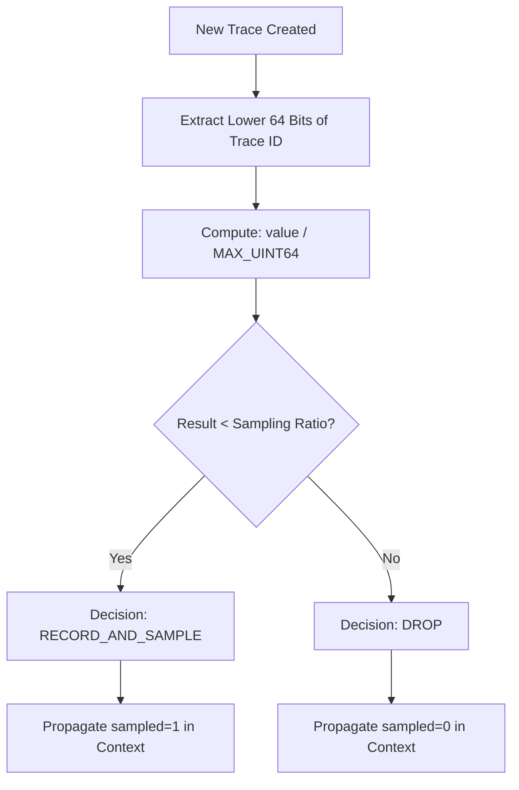

# How to Configure Probability-Based Sampling in OpenTelemetry SDKs

Author: [nawazdhandala](https://www.github.com/nawazdhandala)

Tags: OpenTelemetry, Sampling, Probability Sampling, SDK, Tracing, Python, Node.js, Java, Go, Observability

Description: A hands-on guide to configuring probability-based sampling across OpenTelemetry SDKs in Python, Node.js, Java, and Go with practical examples and tuning advice.

---

Probability-based sampling is the most widely used sampling strategy in OpenTelemetry. It is simple to understand, easy to configure, and works well as a starting point for most applications. You pick a percentage of traces to keep, and the SDK handles the rest.

But there are important details that determine whether your sampling actually works correctly in a distributed system. How the SDK makes its decision, how that decision propagates across services, and how you tune the percentage for your workload all matter. This post covers probability-based sampling configuration in Python, Node.js, Java, and Go, with explanations of the underlying mechanics.

---

## How Probability Sampling Works Internally

The OpenTelemetry SDK does not flip a coin for each trace. Instead, it uses a deterministic algorithm based on the trace ID. The trace ID is a 128-bit random number. The sampler takes the lower 64 bits, divides by the maximum possible value, and compares the result to your sampling ratio.



This deterministic approach has a critical property: any service that sees the same trace ID and uses the same sampling ratio will independently arrive at the same decision. This means you do not need a centralized sampling coordinator. Two services can independently decide to sample the same trace without any communication between them.

---

## Python SDK Configuration

### Basic TraceIdRatioBased Sampler

```python
# tracing.py
from opentelemetry import trace
from opentelemetry.sdk.trace import TracerProvider
from opentelemetry.sdk.trace.sampling import TraceIdRatioBased
from opentelemetry.sdk.trace.export import BatchSpanProcessor
from opentelemetry.exporter.otlp.proto.grpc.trace_exporter import OTLPSpanExporter
from opentelemetry.sdk.resources import Resource

resource = Resource.create({
    "service.name": "inventory-service",
    "deployment.environment": "production",
})

# TraceIdRatioBased takes a float between 0.0 and 1.0.
# 0.25 means 25% of traces will be sampled.
sampler = TraceIdRatioBased(0.25)

provider = TracerProvider(
    resource=resource,
    sampler=sampler,
)

exporter = OTLPSpanExporter(endpoint="http://localhost:4317")
provider.add_span_processor(BatchSpanProcessor(exporter))
trace.set_tracer_provider(provider)
```

This works, but it has a problem. If this service receives a request from an upstream service that already decided to sample the trace, the `TraceIdRatioBased` sampler might independently decide to drop it. This breaks trace completeness.

### ParentBased Wrapper (The Right Way)

```python
# tracing.py - corrected version
from opentelemetry.sdk.trace.sampling import (
    ParentBasedTraceIdRatio,
    ALWAYS_ON,
    ALWAYS_OFF,
)

# ParentBasedTraceIdRatio combines parent-based logic with
# probability sampling. The behavior is:
#   - If there is a remote parent that is sampled: ALWAYS sample (follow parent)
#   - If there is a remote parent that is not sampled: NEVER sample (follow parent)
#   - If there is no parent (root span): Apply the ratio (25%)
sampler = ParentBasedTraceIdRatio(0.25)

provider = TracerProvider(
    resource=resource,
    sampler=sampler,
)
```

`ParentBasedTraceIdRatio` is a convenience wrapper. Under the hood, it configures a `ParentBased` sampler with `TraceIdRatioBased(0.25)` as the root sampler, `ALWAYS_ON` for remote parents that are sampled, and `ALWAYS_OFF` for remote parents that are not sampled. This is almost always what you want.

### Environment Variable Configuration

You can also set sampling via environment variables, which is useful for containerized deployments where you want to change sampling without redeploying code.

```bash
# Set the sampler type and argument via environment variables.
# OTEL_TRACES_SAMPLER accepts: always_on, always_off,
# traceidratio, parentbased_always_on, parentbased_always_off,
# parentbased_traceidratio
export OTEL_TRACES_SAMPLER=parentbased_traceidratio

# The ratio argument. 0.1 means 10% of root traces.
export OTEL_TRACES_SAMPLER_ARG=0.1

# These take effect when TracerProvider is created without
# an explicit sampler argument.
```

```python
# tracing_env.py
from opentelemetry import trace
from opentelemetry.sdk.trace import TracerProvider
from opentelemetry.sdk.resources import Resource

# When no sampler is passed, the SDK reads OTEL_TRACES_SAMPLER
# and OTEL_TRACES_SAMPLER_ARG from the environment.
provider = TracerProvider(
    resource=Resource.create({"service.name": "cart-service"}),
)
trace.set_tracer_provider(provider)
```

---

## Node.js SDK Configuration

```javascript
// tracing.js
const { NodeSDK } = require('@opentelemetry/sdk-node');
const { getNodeAutoInstrumentations } = require('@opentelemetry/auto-instrumentations-node');
const { OTLPTraceExporter } = require('@opentelemetry/exporter-trace-otlp-http');
const { Resource } = require('@opentelemetry/resources');
const {
  ParentBasedSampler,
  TraceIdRatioBasedSampler,
  AlwaysOnSampler,
  AlwaysOffSampler,
} = require('@opentelemetry/sdk-trace-base');

// ParentBasedSampler wraps TraceIdRatioBasedSampler.
// For root spans: apply 15% probability.
// For child spans with sampled parent: always sample.
// For child spans with unsampled parent: never sample.
const sampler = new ParentBasedSampler({
  root: new TraceIdRatioBasedSampler(0.15),
  remoteParentSampled: new AlwaysOnSampler(),
  remoteParentNotSampled: new AlwaysOffSampler(),
  localParentSampled: new AlwaysOnSampler(),
  localParentNotSampled: new AlwaysOffSampler(),
});

const sdk = new NodeSDK({
  resource: new Resource({
    'service.name': 'notification-service',
    'deployment.environment': 'production',
  }),
  traceExporter: new OTLPTraceExporter({
    url: 'http://localhost:4318/v1/traces',
  }),
  sampler: sampler,
  instrumentations: [getNodeAutoInstrumentations()],
});

sdk.start();

// Graceful shutdown on process exit
process.on('SIGTERM', () => {
  sdk.shutdown().then(
    () => console.log('SDK shut down successfully'),
    (err) => console.log('Error shutting down SDK', err)
  );
});
```

The `ParentBasedSampler` constructor shows all four configurable behaviors explicitly. In most cases, you only need to specify the `root` sampler since the defaults for the other parameters are exactly what is shown above. But writing them out makes the behavior crystal clear for anyone reading the code.

---

## Java SDK Configuration

```java
// TracingConfig.java
import io.opentelemetry.api.OpenTelemetry;
import io.opentelemetry.sdk.OpenTelemetrySdk;
import io.opentelemetry.sdk.trace.SdkTracerProvider;
import io.opentelemetry.sdk.trace.samplers.Sampler;
import io.opentelemetry.sdk.trace.export.BatchSpanProcessor;
import io.opentelemetry.exporter.otlp.trace.OtlpGrpcSpanExporter;
import io.opentelemetry.sdk.resources.Resource;
import io.opentelemetry.api.common.Attributes;
import io.opentelemetry.semconv.ResourceAttributes;

public class TracingConfig {

    public static OpenTelemetry initialize() {
        // Resource identifies this service in traces
        Resource resource = Resource.getDefault().merge(
            Resource.create(Attributes.of(
                ResourceAttributes.SERVICE_NAME, "user-service",
                ResourceAttributes.DEPLOYMENT_ENVIRONMENT, "production"
            ))
        );

        // Sampler.parentBased wraps Sampler.traceIdRatioBased.
        // The ratio of 0.2 means 20% of root traces are sampled.
        // Child spans follow their parent's decision automatically.
        Sampler sampler = Sampler.parentBased(
            Sampler.traceIdRatioBased(0.2)
        );

        // Configure the OTLP exporter to send spans over gRPC
        OtlpGrpcSpanExporter exporter = OtlpGrpcSpanExporter.builder()
            .setEndpoint("http://localhost:4317")
            .build();

        // BatchSpanProcessor batches and exports spans asynchronously.
        // This avoids blocking the application thread on export.
        SdkTracerProvider tracerProvider = SdkTracerProvider.builder()
            .setResource(resource)
            .setSampler(sampler)
            .addSpanProcessor(BatchSpanProcessor.builder(exporter).build())
            .build();

        return OpenTelemetrySdk.builder()
            .setTracerProvider(tracerProvider)
            .buildAndRegisterGlobal();
    }
}
```

The Java SDK's `Sampler.parentBased()` method is the idiomatic way to wrap any sampler with parent-based logic. You pass the root sampler as the argument, and the parent-based wrapper handles all the parent/child propagation logic.

---

## Go SDK Configuration

```go
// tracing.go
package tracing

import (
	"context"
	"log"

	"go.opentelemetry.io/otel"
	"go.opentelemetry.io/otel/exporters/otlp/otlptrace/otlptracegrpc"
	"go.opentelemetry.io/otel/sdk/resource"
	sdktrace "go.opentelemetry.io/otel/sdk/trace"
	semconv "go.opentelemetry.io/otel/semconv/v1.24.0"
)

func InitTracing(ctx context.Context) func() {
	// Create the OTLP exporter. By default it connects
	// to localhost:4317 over gRPC.
	exporter, err := otlptracegrpc.New(ctx,
		otlptracegrpc.WithEndpoint("localhost:4317"),
		otlptracegrpc.WithInsecure(),
	)
	if err != nil {
		log.Fatalf("failed to create exporter: %v", err)
	}

	// Resource identifies the service in all exported telemetry.
	res, err := resource.Merge(
		resource.Default(),
		resource.NewWithAttributes(
			semconv.SchemaURL,
			semconv.ServiceName("catalog-service"),
			semconv.DeploymentEnvironment("production"),
		),
	)
	if err != nil {
		log.Fatalf("failed to create resource: %v", err)
	}

	// ParentBased wraps TraceIDRatioBased.
	// Root spans are sampled at 30%. Child spans follow
	// their parent's decision.
	sampler := sdktrace.ParentBased(
		sdktrace.TraceIDRatioBased(0.3),
	)

	tp := sdktrace.NewTracerProvider(
		sdktrace.WithBatcher(exporter),
		sdktrace.WithResource(res),
		sdktrace.WithSampler(sampler),
	)

	otel.SetTracerProvider(tp)

	// Return a cleanup function for graceful shutdown
	return func() {
		if err := tp.Shutdown(ctx); err != nil {
			log.Printf("error shutting down tracer provider: %v", err)
		}
	}
}
```

Go's `sdktrace.ParentBased()` works the same way as in other languages. The function takes a root sampler and returns a new sampler that respects parent context. You can also pass options like `sdktrace.WithRemoteParentSampled()` and `sdktrace.WithRemoteParentNotSampled()` if you need to override the default behavior.

---

## Choosing the Right Sampling Percentage

There is no universal answer, but here are some guidelines based on traffic volume.

| Requests per Second | Suggested Starting Ratio | Estimated Spans/sec (at 8 spans/trace) |
|---|---|---|
| Under 100 | 1.0 (100%) | Under 800 |
| 100 to 1,000 | 0.5 (50%) | 400 to 4,000 |
| 1,000 to 10,000 | 0.1 (10%) | 800 to 8,000 |
| 10,000 to 100,000 | 0.01 (1%) | 800 to 8,000 |
| Over 100,000 | 0.001 (0.1%) | 800 to 8,000 |

Notice how the spans-per-second column stays roughly consistent. The goal is to keep your export rate manageable regardless of traffic volume. Start with a ratio that keeps you under 10,000 spans per second and adjust based on your backend's capacity and your budget.

---

## Common Pitfalls

**Using TraceIdRatioBased without ParentBased.** This is the most common mistake. Without the parent-based wrapper, each service independently decides whether to sample, which leads to broken traces where some services record spans and others do not.

**Mismatched ratios across services.** If Service A uses 0.1 and Service B uses 0.5, traces that start at Service B and flow to Service A will be inconsistent. When using probability sampling, configure the same ratio on all services, or better yet, use environment variables to manage it centrally.

**Forgetting that ratio applies to root spans only.** With `ParentBased`, the ratio only applies when there is no parent. If 100% of your traffic comes from an upstream service that already made a sampling decision, the ratio has no effect. The ratio matters at the edge of your system where traces originate.

**Setting the ratio too low too early.** When you are still setting up observability, use a high ratio (0.5 or even 1.0) so you can verify that instrumentation is working correctly. Reduce it later once you are confident in your setup.

---

## Dynamic Sampling Ratio with Feature Flags

For production systems, you might want to change the sampling ratio without redeploying. One approach is to read the ratio from an environment variable or config file and restart the service. A more sophisticated approach is to implement a custom sampler that checks a feature flag.

```python
# dynamic_sampler.py
from opentelemetry.sdk.trace.sampling import (
    SamplingResult,
    Decision,
    Sampler,
)
from opentelemetry.trace import SpanKind
import hashlib

class DynamicRatioSampler(Sampler):
    """A sampler that reads its ratio from a callable,
    allowing runtime changes without restart."""

    def __init__(self, ratio_provider):
        # ratio_provider is a callable that returns a float
        # between 0.0 and 1.0. It could read from Redis,
        # a config file, or a feature flag service.
        self._ratio_provider = ratio_provider

    def should_sample(self, parent_context, trace_id, name,
                      kind=None, attributes=None, links=None):
        ratio = self._ratio_provider()

        # Use the same deterministic algorithm as TraceIdRatioBased
        bound = int(ratio * (2**64 - 1))
        trace_id_lower = trace_id & 0xFFFFFFFFFFFFFFFF

        if trace_id_lower < bound:
            return SamplingResult(
                Decision.RECORD_AND_SAMPLE,
                attributes or {},
            )
        else:
            return SamplingResult(
                Decision.DROP,
                attributes or {},
            )

    def get_description(self):
        return f"DynamicRatioSampler(ratio={self._ratio_provider()})"
```

You could then use this with a simple file-based provider for testing or integrate it with LaunchDarkly, Unleash, or any other feature flag system.

---

## Conclusion

Probability-based sampling is straightforward once you understand two things: always wrap it with `ParentBased` for distributed tracing, and use the same ratio across all services at the boundary where traces originate.

Start with a ratio that keeps your span volume manageable, monitor your effective sampling rate in production, and adjust as needed. For most teams, probability-based sampling with a parent-based wrapper is all you need until your observability requirements grow more sophisticated.
