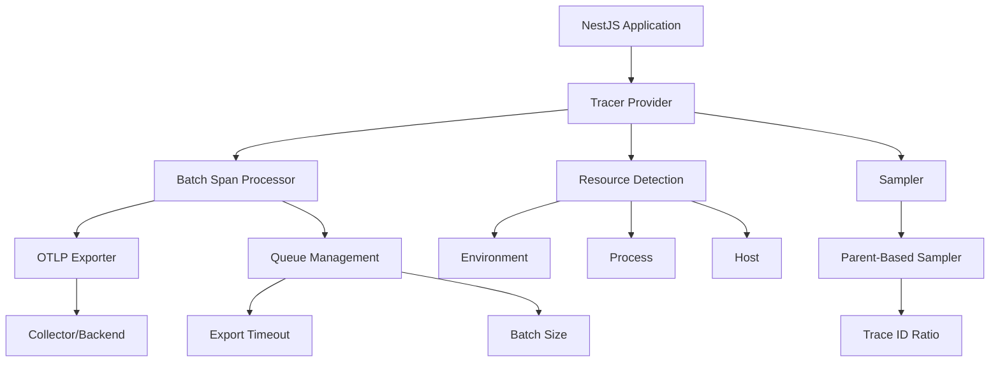

# How to Set Up Production-Ready OpenTelemetry Tracing in NestJS Applications

Author: [nawazdhandala](https://www.github.com/nawazdhandala)

Tags: OpenTelemetry, NestJS, Node.js, Production, Tracing, TypeScript

Description: Learn how to implement production-grade OpenTelemetry tracing in NestJS applications with proper error handling, performance optimization, and best practices for distributed systems.

Setting up observability in production NestJS applications requires more than just installing a few packages. You need proper error handling, performance considerations, resource management, and configuration that works across different environments. This guide walks through building a production-ready OpenTelemetry tracing setup that you can actually ship to production.

## Why Production-Ready Tracing Matters

Most OpenTelemetry tutorials show you how to get started, but production environments have different requirements. You need to handle trace sampling, manage resource consumption, deal with failing exporters, and ensure tracing doesn't become a performance bottleneck. A poorly configured tracing setup can crash your application, leak memory, or overwhelm your observability backend.

## Architecture Overview

Here's how the components fit together in a production setup:



## Installing Dependencies

Start with the core OpenTelemetry packages needed for NestJS:

```bash
npm install @opentelemetry/sdk-node \
            @opentelemetry/auto-instrumentations-node \
            @opentelemetry/exporter-trace-otlp-http \
            @opentelemetry/resources \
            @opentelemetry/semantic-conventions
```

## Creating the Tracing Configuration Module

Create a dedicated configuration file that handles all tracing setup. This keeps your tracing logic separate and testable.

```typescript
// src/tracing/tracing.config.ts

import { NodeSDK } from '@opentelemetry/sdk-node';
import { getNodeAutoInstrumentations } from '@opentelemetry/auto-instrumentations-node';
import { OTLPTraceExporter } from '@opentelemetry/exporter-trace-otlp-http';
import { Resource } from '@opentelemetry/resources';
import { SemanticResourceAttributes } from '@opentelemetry/semantic-conventions';
import { BatchSpanProcessor } from '@opentelemetry/sdk-trace-node';
import { ParentBasedSampler, TraceIdRatioBasedSampler } from '@opentelemetry/sdk-trace-base';

export class TracingConfig {
  private sdk: NodeSDK;

  constructor() {
    // Define service resource with metadata
    const resource = new Resource({
      [SemanticResourceAttributes.SERVICE_NAME]: process.env.SERVICE_NAME || 'nestjs-app',
      [SemanticResourceAttributes.SERVICE_VERSION]: process.env.SERVICE_VERSION || '1.0.0',
      [SemanticResourceAttributes.DEPLOYMENT_ENVIRONMENT]: process.env.NODE_ENV || 'development',
      [SemanticResourceAttributes.SERVICE_NAMESPACE]: process.env.SERVICE_NAMESPACE || 'default',
    });

    // Configure OTLP exporter with retry and timeout settings
    const traceExporter = new OTLPTraceExporter({
      url: process.env.OTEL_EXPORTER_OTLP_ENDPOINT || 'http://localhost:4318/v1/traces',
      headers: {
        // Add authentication if needed
        'Authorization': process.env.OTEL_EXPORTER_AUTH_HEADER || '',
      },
      timeoutMillis: 15000, // 15 second timeout for exports
    });

    // Use batch processor for better performance
    const spanProcessor = new BatchSpanProcessor(traceExporter, {
      maxQueueSize: 2048,
      maxExportBatchSize: 512,
      scheduledDelayMillis: 5000,
      exportTimeoutMillis: 30000,
    });

    // Configure sampling based on environment
    const sampler = this.configureSampler();

    this.sdk = new NodeSDK({
      resource,
      spanProcessor,
      sampler,
      instrumentations: [
        getNodeAutoInstrumentations({
          '@opentelemetry/instrumentation-fs': {
            enabled: false, // Too noisy for production
          },
          '@opentelemetry/instrumentation-http': {
            enabled: true,
            ignoreIncomingPaths: ['/health', '/metrics', '/ready'],
          },
          '@opentelemetry/instrumentation-express': {
            enabled: true,
          },
          '@opentelemetry/instrumentation-nestjs-core': {
            enabled: true,
          },
        }),
      ],
    });
  }

  private configureSampler() {
    const samplingRate = parseFloat(process.env.OTEL_SAMPLING_RATE || '1.0');

    // Use parent-based sampling in production
    // This ensures child spans follow parent sampling decisions
    return new ParentBasedSampler({
      root: new TraceIdRatioBasedSampler(samplingRate),
    });
  }

  async start(): Promise<void> {
    try {
      await this.sdk.start();
      console.log('OpenTelemetry tracing initialized successfully');

      // Graceful shutdown on process termination
      process.on('SIGTERM', async () => {
        await this.shutdown();
      });
    } catch (error) {
      console.error('Failed to initialize OpenTelemetry:', error);
      // Don't crash the app if tracing fails
      // Log the error and continue
    }
  }

  async shutdown(): Promise<void> {
    try {
      await this.sdk.shutdown();
      console.log('OpenTelemetry tracing shut down successfully');
    } catch (error) {
      console.error('Error shutting down OpenTelemetry:', error);
    }
  }
}
```

## Initializing Tracing Before Application Bootstrap

The tracing SDK must be initialized before any other code runs. Create a separate tracing initialization file:

```typescript
// src/tracing/tracing.ts

import { TracingConfig } from './tracing.config';

let tracingInstance: TracingConfig | null = null;

export async function initializeTracing(): Promise<void> {
  if (tracingInstance) {
    return;
  }

  tracingInstance = new TracingConfig();
  await tracingInstance.start();
}

export function getTracingInstance(): TracingConfig | null {
  return tracingInstance;
}
```

## Modifying main.ts for Early Initialization

Update your main.ts to initialize tracing before bootstrapping NestJS:

```typescript
// src/main.ts

import { NestFactory } from '@nestjs/core';
import { AppModule } from './app.module';
import { initializeTracing } from './tracing/tracing';

async function bootstrap() {
  // Initialize tracing FIRST, before anything else
  await initializeTracing();

  const app = await NestFactory.create(AppModule);

  // Configure your app
  app.enableCors();
  app.setGlobalPrefix('api');

  const port = process.env.PORT || 3000;
  await app.listen(port);

  console.log(`Application is running on: http://localhost:${port}`);
}

bootstrap();
```

## Environment Configuration

Create a comprehensive environment configuration that works across development, staging, and production:

```bash
# .env.production

# Service identification
SERVICE_NAME=my-nestjs-service
SERVICE_VERSION=1.0.0
SERVICE_NAMESPACE=production
NODE_ENV=production

# OpenTelemetry collector endpoint
OTEL_EXPORTER_OTLP_ENDPOINT=https://collector.example.com:4318/v1/traces

# Authentication (if needed)
OTEL_EXPORTER_AUTH_HEADER=Bearer your-token-here

# Sampling configuration
# 0.1 = 10% of traces, 1.0 = 100% of traces
OTEL_SAMPLING_RATE=0.1

# Application port
PORT=3000
```

## Creating a Health Check with Tracing Status

Add a health check endpoint that includes tracing status:

```typescript
// src/health/health.controller.ts

import { Controller, Get } from '@nestjs/common';
import { getTracingInstance } from '../tracing/tracing';

@Controller('health')
export class HealthController {
  @Get()
  check() {
    const tracingInstance = getTracingInstance();

    return {
      status: 'ok',
      timestamp: new Date().toISOString(),
      tracing: {
        enabled: tracingInstance !== null,
        status: tracingInstance ? 'active' : 'inactive',
      },
    };
  }
}
```

## Handling Graceful Shutdown

Ensure traces are flushed before the application terminates:

```typescript
// src/main.ts (updated)

import { NestFactory } from '@nestjs/core';
import { AppModule } from './app.module';
import { initializeTracing, getTracingInstance } from './tracing/tracing';

async function bootstrap() {
  await initializeTracing();

  const app = await NestFactory.create(AppModule);

  app.enableCors();
  app.setGlobalPrefix('api');

  // Enable graceful shutdown
  app.enableShutdownHooks();

  const port = process.env.PORT || 3000;
  await app.listen(port);

  console.log(`Application is running on: http://localhost:${port}`);
}

// Handle process termination
process.on('SIGTERM', async () => {
  console.log('SIGTERM received, shutting down gracefully');
  const tracingInstance = getTracingInstance();
  if (tracingInstance) {
    await tracingInstance.shutdown();
  }
  process.exit(0);
});

bootstrap();
```

## Performance Considerations

Production tracing should have minimal performance impact. Here are key optimizations:

**Batch Processing**: Use `BatchSpanProcessor` instead of `SimpleSpanProcessor`. Batching reduces network overhead by sending multiple spans in one request.

**Sampling**: In high-traffic services, sample a percentage of traces rather than all of them. Start with 10% in production and adjust based on your needs.

**Queue Management**: Configure appropriate queue sizes to prevent memory issues during traffic spikes. The default queue size of 2048 works for most applications.

**Ignore Health Checks**: Exclude health check and metrics endpoints from tracing to reduce noise and overhead.

## Monitoring Tracing Performance

Add metrics to monitor your tracing infrastructure:

```typescript
// src/tracing/tracing-metrics.ts

import { trace } from '@opentelemetry/api';

export class TracingMetrics {
  private static spanCount = 0;
  private static exportErrors = 0;

  static incrementSpanCount(): void {
    this.spanCount++;
  }

  static incrementExportErrors(): void {
    this.exportErrors++;
  }

  static getMetrics() {
    return {
      totalSpans: this.spanCount,
      exportErrors: this.exportErrors,
      tracingActive: trace.getTracer('default') !== undefined,
    };
  }

  static reset(): void {
    this.spanCount = 0;
    this.exportErrors = 0;
  }
}
```

## Testing Your Setup

Verify tracing works correctly before deploying:

```typescript
// src/tracing/tracing.test.ts

import { Test, TestingModule } from '@nestjs/testing';
import { INestApplication } from '@nestjs/common';
import { AppModule } from '../app.module';
import { initializeTracing } from './tracing';
import * as request from 'supertest';

describe('Tracing Integration', () => {
  let app: INestApplication;

  beforeAll(async () => {
    await initializeTracing();

    const moduleFixture: TestingModule = await Test.createTestingModule({
      imports: [AppModule],
    }).compile();

    app = moduleFixture.createNestApplication();
    await app.init();
  });

  afterAll(async () => {
    await app.close();
  });

  it('should trace HTTP requests', async () => {
    const response = await request(app.getHttpServer())
      .get('/api/health')
      .expect(200);

    expect(response.body.tracing.enabled).toBe(true);
  });
});
```

## Common Production Issues and Solutions

**Memory Leaks**: If you see memory growing over time, reduce `maxQueueSize` and `maxExportBatchSize` in the batch processor configuration.

**Missing Traces**: Check that your exporter endpoint is reachable and authentication headers are correct. Enable debug logging temporarily to diagnose issues.

**High CPU Usage**: Lower sampling rate or disable verbose instrumentations like filesystem tracing.

**Export Failures**: Implement retry logic and circuit breakers for exporter failures to prevent cascading issues.

## Deployment Checklist

Before deploying to production:

- Set appropriate sampling rate for your traffic volume
- Configure authentication for your collector endpoint
- Set resource attributes (service name, version, environment)
- Exclude health check endpoints from tracing
- Enable graceful shutdown handling
- Test trace export in staging environment
- Monitor tracing overhead and adjust configuration
- Document runbook for tracing-related incidents

Production-ready tracing takes more effort than basic setup, but the visibility you gain into your distributed system is worth it. With proper configuration, error handling, and performance tuning, OpenTelemetry tracing becomes a reliable part of your observability stack without becoming a liability.
