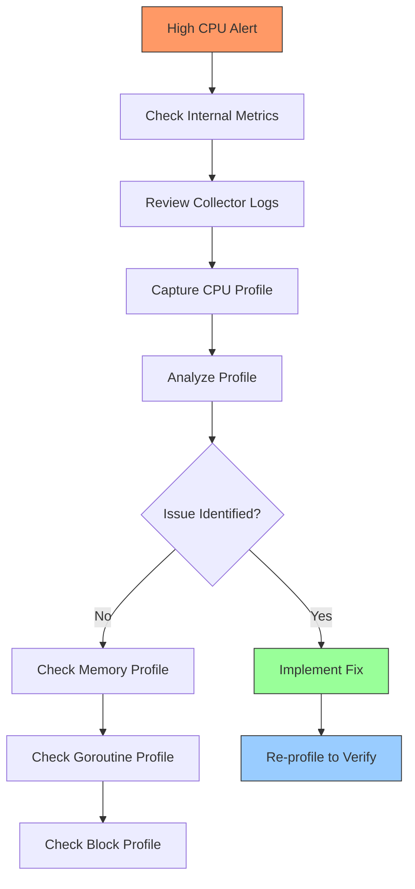

# How to Profile the Collector with pprof Extension

Author: [nawazdhandala](https://www.github.com/nawazdhandala)

Tags: OpenTelemetry, Collector, pprof, Performance, Profiling, Optimization, Troubleshooting

Description: Master performance profiling of the OpenTelemetry Collector using the pprof extension to identify bottlenecks, memory leaks, and optimization opportunities.

Performance profiling is essential for understanding and optimizing OpenTelemetry Collector behavior. The pprof extension exposes Go's powerful profiling tools, allowing you to analyze CPU usage, memory allocation, goroutine behavior, and blocking operations. This deep visibility enables identifying performance bottlenecks, memory leaks, and optimization opportunities in production collectors.

## Understanding pprof

pprof is Go's built-in profiler that captures runtime performance data. The OpenTelemetry Collector, written in Go, exposes pprof endpoints through the pprof extension, providing access to various profile types.

Available profile types include:
- **CPU profile**: Shows where the collector spends CPU time
- **Heap profile**: Reveals memory allocation patterns
- **Goroutine profile**: Displays all active goroutines and their states
- **Block profile**: Identifies blocking operations causing delays
- **Mutex profile**: Shows contention on mutexes
- **Allocs profile**: Tracks all memory allocations (including freed memory)

Each profile type provides different insights into collector performance and behavior.

## Enabling the pprof Extension

Add the pprof extension to your collector configuration:

```yaml
# Basic pprof extension configuration
extensions:
  # pprof extension exposes profiling endpoints
  pprof:
    # HTTP endpoint for accessing profiles
    endpoint: 0.0.0.0:1777
    # Block profile rate (nanoseconds)
    # 0 disables block profiling, higher values reduce overhead
    block_profile_fraction: 0
    # Mutex profile rate
    # 0 disables mutex profiling, 1 captures all events
    mutex_profile_fraction: 0

receivers:
  otlp:
    protocols:
      grpc:
        endpoint: 0.0.0.0:4317
      http:
        endpoint: 0.0.0.0:4318

processors:
  batch:
    timeout: 10s
    send_batch_size: 100

exporters:
  otlp:
    endpoint: backend.example.com:4317

service:
  # Extensions must be listed in service section
  extensions: [pprof]

  pipelines:
    traces:
      receivers: [otlp]
      processors: [batch]
      exporters: [otlp]
```

After starting the collector, pprof endpoints are available at `http://localhost:1777/debug/pprof/`.

## Security Considerations for Production

Like zPages, pprof exposes internal information that should be protected in production:

```yaml
# Production pprof configuration with localhost binding
extensions:
  pprof:
    # Bind to localhost only
    endpoint: 127.0.0.1:1777
    # Disable expensive profiling by default
    block_profile_fraction: 0
    mutex_profile_fraction: 0

receivers:
  otlp:
    protocols:
      grpc:
        endpoint: 0.0.0.0:4317

processors:
  batch:
    timeout: 10s

exporters:
  otlp:
    endpoint: backend.example.com:4317

service:
  extensions: [pprof]

  pipelines:
    traces:
      receivers: [otlp]
      processors: [batch]
      exporters: [otlp]
```

For Kubernetes deployments, use port forwarding to access pprof securely:

```bash
# Forward pprof port to local machine
kubectl port-forward -n observability deployment/otel-collector 1777:1777

# Access pprof locally
go tool pprof http://localhost:1777/debug/pprof/heap
```

## CPU Profiling

CPU profiling reveals where the collector spends execution time, helping identify expensive operations and optimization opportunities.

### Capturing a CPU Profile

```bash
# Capture 30 seconds of CPU profiling
curl -o cpu.prof http://localhost:1777/debug/pprof/profile?seconds=30

# During capture, run representative workload
# The profile will capture actual CPU usage patterns

# Analyze the profile with pprof tool
go tool pprof cpu.prof
```

The pprof tool opens an interactive prompt for analysis:

```
File: otelcol-contrib
Type: cpu
Time: Feb 6, 2026 at 10:30am (PST)
Duration: 30.01s, Total samples = 12.50s (41.65%)
Entering interactive mode (type "help" for commands, "o" for options)
(pprof)
```

### Analyzing CPU Profiles

Common pprof commands for CPU analysis:

**Show top CPU consumers**:

```
(pprof) top
Showing nodes accounting for 8.5s, 68% of 12.5s total
Dropped 45 nodes (cum <= 0.06s)
      flat  flat%   sum%        cum   cum%
     2.3s 18.4% 18.4%      2.8s 22.4%  go.opentelemetry.io/collector/processor/batchprocessor.(*batchProcessor).processItem
     1.8s 14.4% 32.8%      1.9s 15.2%  runtime.mallocgc
     1.2s  9.6% 42.4%      1.5s 12.0%  go.opentelemetry.io/collector/pdata/ptrace.NewTraces
     0.9s  7.2% 49.6%      0.9s  7.2%  runtime.memmove
     0.8s  6.4% 56.0%      1.2s  9.6%  google.golang.org/protobuf/proto.Unmarshal
     0.7s  5.6% 61.6%      0.8s  6.4%  compress/gzip.(*Writer).Write
     0.8s  6.4% 68.0%      0.9s  7.2%  runtime.scanobject
```

This output shows:
- `flat`: CPU time spent in the function itself
- `flat%`: Percentage of total CPU time
- `sum%`: Cumulative percentage
- `cum`: CPU time spent in the function and its callees
- `cum%`: Cumulative percentage including callees

**Examine specific function**:

```
(pprof) list batchProcessor.processItem
Total: 12.5s
ROUTINE ======================== batchProcessor.processItem
     2.3s      2.8s (flat, cum) 22.4% of Total
         .          .    145:func (bp *batchProcessor) processItem(item interface{}) {
         .      0.1s    146:    // Type assertion to determine item type
     0.2s      0.2s    147:    switch v := item.(type) {
         .          .    148:    case ptrace.Traces:
     1.5s      1.8s    149:        bp.traces = append(bp.traces, v)
     0.4s      0.5s    150:        bp.itemCount += v.SpanCount()
     0.2s      0.2s    151:    case pmetric.Metrics:
         .          .    152:        bp.metrics = append(bp.metrics, v)
```

This shows CPU time spent on specific lines of code, revealing expensive operations.

**Generate a visual graph**:

```bash
# Generate PDF visualization (requires graphviz)
go tool pprof -pdf cpu.prof > cpu_profile.pdf

# Generate SVG visualization
go tool pprof -svg cpu.prof > cpu_profile.svg

# Generate interactive web UI
go tool pprof -http=:8080 cpu.prof
# Opens browser to http://localhost:8080
```

The visual graph shows call relationships and CPU time with thicker arrows indicating more time spent.

### Interpreting CPU Profile Results

Common patterns in CPU profiles:

**High time in batch processor**: Normal for high-throughput collectors. If excessive, consider tuning batch parameters:

```yaml
processors:
  batch:
    # Reduce processing frequency
    timeout: 15s  # Increased from 10s
    # Process larger batches less frequently
    send_batch_size: 500  # Increased from 100
```

**High time in protocol unmarshaling**: Indicates CPU spent deserializing data. This is often unavoidable but can be optimized by:
- Using binary protocols (gRPC) instead of JSON (HTTP)
- Reducing attribute cardinality at data sources
- Scaling horizontally to distribute load

**High time in compression**: Expected when using compressed exports. Balance compression savings against CPU cost:

```yaml
exporters:
  otlp:
    endpoint: backend.example.com:4317
    # Disable compression to reduce CPU usage
    compression: none  # Default is gzip
```

**High time in runtime memory functions**: Suggests frequent allocations. Consider memory optimization techniques discussed in the heap profiling section.

## Memory Profiling

Memory profiling identifies allocation patterns, memory leaks, and opportunities for memory optimization.

### Heap Profile

The heap profile shows current memory allocations:

```bash
# Capture heap profile
curl -o heap.prof http://localhost:1777/debug/pprof/heap

# Analyze with pprof
go tool pprof heap.prof
```

### Analyzing Heap Profiles

```
(pprof) top
Showing nodes accounting for 450MB, 90% of 500MB total
      flat  flat%   sum%        cum   cum%
    180MB 36.0% 36.0%    200MB 40.0%  go.opentelemetry.io/collector/processor/batchprocessor.(*batchProcessor).traces
    120MB 24.0% 60.0%    120MB 24.0%  go.opentelemetry.io/collector/exporter/otlpexporter.(*exporter).queue
     80MB 16.0% 76.0%     90MB 18.0%  go.opentelemetry.io/collector/receiver/otlpreceiver.(*Receiver).buffer
     50MB 10.0% 86.0%     50MB 10.0%  compress/gzip.NewWriter
     20MB  4.0% 90.0%     20MB  4.0%  runtime.mallocgc
```

This shows memory allocated by different components. High allocations in specific components indicate where memory is consumed.

**Identify memory leaks**:

Capture heap profiles over time and compare:

```bash
# First profile
curl -o heap1.prof http://localhost:1777/debug/pprof/heap
sleep 300  # Wait 5 minutes
# Second profile
curl -o heap2.prof http://localhost:1777/debug/pprof/heap

# Compare profiles to find growing allocations
go tool pprof -base heap1.prof heap2.prof
```

Growing allocations between profiles indicate potential memory leaks:

```
(pprof) top
Showing nodes accounting for 150MB, 100% of 150MB total
      flat  flat%   sum%        cum   cum%
    150MB 100.0% 100.0%    150MB 100.0%  somepackage.leakyFunction
```

If `somepackage.leakyFunction` shows significant growth, investigate that function for unbounded buffers, missing cleanup, or goroutine leaks.

### Allocs Profile

The allocs profile shows all allocations, including those that have been freed:

```bash
# Capture allocations profile
curl -o allocs.prof http://localhost:1777/debug/pprof/allocs

# Analyze allocation patterns
go tool pprof allocs.prof
```

Allocs profiles reveal allocation frequency, useful for identifying functions that allocate excessively:

```
(pprof) top
Showing nodes accounting for 2.5GB, 85% of 3GB total
      flat  flat%   sum%        cum   cum%
    1.2GB 40.0% 40.0%    1.5GB 50.0%  go.opentelemetry.io/collector/pdata/ptrace.NewTraces
    0.8GB 26.7% 66.7%    0.8GB 26.7%  google.golang.org/protobuf/proto.Unmarshal
    0.5GB 16.7% 83.3%    0.6GB 20.0%  go.opentelemetry.io/collector/processor/batchprocessor.processItem
```

High allocation rates increase garbage collection overhead. Optimize by:
- Reusing objects through object pools
- Reducing intermediate allocations
- Pre-allocating slices with appropriate capacity

## Goroutine Profiling

Goroutine profiles show all active goroutines and their current state, useful for identifying goroutine leaks and understanding concurrency patterns.

### Capturing Goroutine Profile

```bash
# Capture goroutine profile
curl -o goroutine.prof http://localhost:1777/debug/pprof/goroutine

# Analyze with pprof
go tool pprof goroutine.prof
```

### Analyzing Goroutine Profiles

```
(pprof) top
Showing nodes accounting for 1250 goroutines, 100% of 1250 total
      flat  flat%   sum%        cum   cum%
       500 40.0% 40.0%        500 40.0%  runtime.gopark
       300 24.0% 64.0%        300 24.0%  internal/poll.runtime_pollWait
       200 16.0% 80.0%        200 16.0%  sync.(*Cond).Wait
       150 12.0% 92.0%        150 12.0%  time.Sleep
       100  8.0% 100.0%       100  8.0%  select
```

**Identify goroutine leaks**:

Compare goroutine counts over time:

```bash
# Check goroutine count
curl -s http://localhost:1777/debug/pprof/goroutine | head -1
# Output: goroutine profile: total 1250

# Wait and check again
sleep 300
curl -s http://localhost:1777/debug/pprof/goroutine | head -1
# Output: goroutine profile: total 2500
```

Growing goroutine counts indicate leaks. Examine the profile to find where goroutines are created:

```
(pprof) list leakyFunction
Total: 2500 goroutines
ROUTINE ======================== leakyFunction
    1000   1000 goroutines (flat, cum) 40% of Total
         .          .     45:func leakyFunction() {
         .          .     46:    for {
    1000   1000     47:        go func() {
         .          .     48:            // This goroutine never exits
         .          .     49:            <-make(chan struct{})
         .          .     50:        }()
         .          .     51:    }
         .          .     52:}
```

This shows a function creating goroutines that never terminate.

### Viewing Goroutine Stack Traces

For detailed goroutine investigation:

```bash
# Get full goroutine stack traces as text
curl http://localhost:1777/debug/pprof/goroutine?debug=2 > goroutines.txt

# Examine the output
less goroutines.txt
```

Output shows each goroutine with its full stack trace:

```
goroutine 1245 [chan receive]:
go.opentelemetry.io/collector/processor/batchprocessor.(*batchProcessor).startLoop(...)
    /workspace/processor/batchprocessor/batch_processor.go:156
created by go.opentelemetry.io/collector/processor/batchprocessor.(*batchProcessor).Start
    /workspace/processor/batchprocessor/batch_processor.go:128

goroutine 1246 [select]:
go.opentelemetry.io/collector/exporter/otlpexporter.(*exporter).sender(...)
    /workspace/exporter/otlpexporter/exporter.go:89
```

This detailed view helps understand what each goroutine is doing and why it exists.

## Block Profiling

Block profiling identifies operations that block goroutines, such as channel operations, mutex locks, and I/O waits.

### Enabling Block Profiling

Block profiling has overhead, so enable it only during troubleshooting:

```yaml
extensions:
  pprof:
    endpoint: 0.0.0.0:1777
    # Enable block profiling
    # Rate of 1 captures every blocking event
    # Higher values reduce overhead but capture fewer events
    block_profile_fraction: 1
```

Alternatively, enable at runtime:

```bash
# Enable block profiling via HTTP
curl -X POST http://localhost:1777/debug/pprof/block?rate=1
```

### Capturing Block Profile

```bash
# Capture block profile
curl -o block.prof http://localhost:1777/debug/pprof/block

# Analyze with pprof
go tool pprof block.prof
```

### Analyzing Block Profiles

```
(pprof) top
Showing nodes accounting for 45s, 90% of 50s total
      flat  flat%   sum%        cum   cum%
      20s 40.0% 40.0%       20s 40.0%  sync.(*Mutex).Lock
      15s 30.0% 70.0%       15s 30.0%  chan send
       10s 20.0% 90.0%       10s 20.0%  chan receive
```

High blocking time on mutex locks suggests contention. Consider:
- Reducing critical section size
- Using finer-grained locks
- Employing lock-free data structures

High blocking time on channels may indicate:
- Receivers not keeping up with senders
- Undersized channel buffers
- Inappropriate synchronous operations

## Mutex Profiling

Mutex profiling shows contention on mutexes, helping identify locks that cause performance issues.

### Enabling Mutex Profiling

Like block profiling, mutex profiling has overhead:

```yaml
extensions:
  pprof:
    endpoint: 0.0.0.0:1777
    # Enable mutex profiling
    # Rate of 1 captures all mutex events
    mutex_profile_fraction: 1
```

### Capturing Mutex Profile

```bash
# Capture mutex profile
curl -o mutex.prof http://localhost:1777/debug/pprof/mutex

# Analyze with pprof
go tool pprof mutex.prof
```

### Analyzing Mutex Profiles

```
(pprof) top
Showing nodes accounting for 8000 mutex waits, 100% of 8000 total
      flat  flat%   sum%        cum   cum%
      5000 62.5% 62.5%       5000 62.5%  batchprocessor.(*batchProcessor).addItem
      2000 25.0% 87.5%       2000 25.0%  exporter.(*exporter).enqueue
      1000 12.5% 100.0%      1000 12.5%  receiver.(*receiver).receive
```

High mutex waits indicate contention hotspots. Optimize by:
- Reducing lock scope
- Using read-write locks when appropriate
- Implementing lock-free algorithms
- Sharding data to reduce contention

## Practical Profiling Workflows

### Investigating High CPU Usage

When collector shows high CPU usage:

**Step 1**: Capture CPU profile during high usage:

```bash
# Capture 60 seconds of CPU profiling
curl -o cpu_high.prof http://localhost:1777/debug/pprof/profile?seconds=60
```

**Step 2**: Analyze top CPU consumers:

```bash
go tool pprof -top cpu_high.prof
```

**Step 3**: Investigate expensive functions:

```bash
go tool pprof -list=<function_name> cpu_high.prof
```

**Step 4**: Generate visual graph for overview:

```bash
go tool pprof -http=:8080 cpu_high.prof
```

**Step 5**: Implement optimizations based on findings and re-profile to verify improvements.

### Investigating Memory Growth

When collector memory usage grows over time:

**Step 1**: Capture baseline heap profile:

```bash
curl -o heap_baseline.prof http://localhost:1777/debug/pprof/heap
```

**Step 2**: Wait for memory growth (monitor with metrics or system tools):

```bash
# Monitor memory usage
watch 'curl -s http://localhost:1777/debug/pprof/heap | head -1'
```

**Step 3**: Capture second profile after growth:

```bash
curl -o heap_after.prof http://localhost:1777/debug/pprof/heap
```

**Step 4**: Compare profiles to find growth:

```bash
go tool pprof -base heap_baseline.prof heap_after.prof
```

**Step 5**: Investigate growing allocations:

```bash
(pprof) top
# Focus on functions with largest growth
(pprof) list <growing_function>
```

**Step 6**: Check for goroutine leaks which often cause memory growth:

```bash
curl http://localhost:1777/debug/pprof/goroutine?debug=2 > goroutines.txt
# Look for unexpectedly high counts of similar goroutines
```

For comprehensive memory troubleshooting, see https://oneuptime.com/blog/post/2026-02-06-troubleshoot-memory-issues-oom-kills-collector/view.

### Investigating Performance Degradation

When collector throughput decreases over time:

**Step 1**: Check for memory pressure:

```bash
curl -o heap.prof http://localhost:1777/debug/pprof/heap
go tool pprof -top heap.prof
```

**Step 2**: Check for goroutine buildup:

```bash
curl -s http://localhost:1777/debug/pprof/goroutine | head -1
```

**Step 3**: Profile blocking operations:

```bash
# Enable block profiling
curl -X POST http://localhost:1777/debug/pprof/block?rate=1

# Capture profile after enabling
sleep 60
curl -o block.prof http://localhost:1777/debug/pprof/block

# Analyze
go tool pprof -top block.prof
```

**Step 4**: Check mutex contention:

```bash
# Enable mutex profiling
curl -X POST http://localhost:1777/debug/pprof/mutex?rate=1

# Capture profile
sleep 60
curl -o mutex.prof http://localhost:1777/debug/pprof/mutex

# Analyze
go tool pprof -top mutex.prof
```

**Step 5**: Correlate findings with collector metrics and logs. Use zPages for live statistics: https://oneuptime.com/blog/post/2026-02-06-zpages-live-debugging-collector/view.

## Continuous Profiling for Production

For production monitoring, implement continuous profiling to capture profiles automatically:

```yaml
# Configuration with comprehensive profiling enabled
extensions:
  pprof:
    endpoint: 127.0.0.1:1777
    # Conservative profiling settings for production
    block_profile_fraction: 0
    mutex_profile_fraction: 0

  health_check:
    endpoint: 0.0.0.0:13133

  zpages:
    endpoint: 0.0.0.0:55679

receivers:
  otlp:
    protocols:
      grpc:
        endpoint: 0.0.0.0:4317

processors:
  memory_limiter:
    check_interval: 1s
    limit_mib: 1536
    spike_limit_mib: 512

  batch:
    timeout: 10s

exporters:
  otlp:
    endpoint: backend.example.com:4317

service:
  extensions: [pprof, health_check, zpages]

  telemetry:
    logs:
      level: info
      encoding: json

    metrics:
      level: detailed
      address: 0.0.0.0:8888

  pipelines:
    traces:
      receivers: [otlp]
      processors: [memory_limiter, batch]
      exporters: [otlp]
```

Implement automated profile collection:

```bash
#!/bin/bash
# collect_profiles.sh - Automated profile collection script

COLLECTOR_HOST="localhost:1777"
PROFILE_DIR="/var/lib/otelcol/profiles"
TIMESTAMP=$(date +%Y%m%d_%H%M%S)

# Create profile directory if it doesn't exist
mkdir -p "$PROFILE_DIR"

# Collect heap profile
curl -s -o "$PROFILE_DIR/heap_$TIMESTAMP.prof" \
    "http://$COLLECTOR_HOST/debug/pprof/heap"

# Collect goroutine profile
curl -s -o "$PROFILE_DIR/goroutine_$TIMESTAMP.prof" \
    "http://$COLLECTOR_HOST/debug/pprof/goroutine"

# Collect 30-second CPU profile
curl -s -o "$PROFILE_DIR/cpu_$TIMESTAMP.prof" \
    "http://$COLLECTOR_HOST/debug/pprof/profile?seconds=30"

# Extract goroutine count for metrics
GOROUTINE_COUNT=$(curl -s "http://$COLLECTOR_HOST/debug/pprof/goroutine" | head -1 | grep -oP '\d+')
echo "goroutine_count=$GOROUTINE_COUNT timestamp=$TIMESTAMP"

# Cleanup old profiles (keep last 7 days)
find "$PROFILE_DIR" -name "*.prof" -mtime +7 -delete

echo "Profiles collected successfully at $TIMESTAMP"
```

Schedule with cron:

```bash
# Run profile collection every hour
0 * * * * /usr/local/bin/collect_profiles.sh >> /var/log/otelcol/profile_collection.log 2>&1
```

## Visualizing Profiles with pprof Web UI

The pprof web UI provides interactive visualization:

```bash
# Start web UI for any profile
go tool pprof -http=:8080 heap.prof

# Or fetch and analyze in one command
go tool pprof -http=:8080 http://localhost:1777/debug/pprof/heap
```

The web UI offers several views:

**Graph view**: Shows call graph with time/memory weighted edges. Larger nodes and thicker edges indicate more resources consumed.

**Flame graph**: Displays hierarchical visualization of call stacks. Wider sections indicate more time/memory spent.

**Top view**: Lists functions consuming most resources.

**Source view**: Shows annotated source code with resource consumption per line.

**Disassembly view**: Shows assembly code for deep optimization.

Use the web UI for exploratory analysis and the command-line tool for automated workflows.

## Profile-Guided Optimization

Use profiling data to guide optimization efforts:

### Example: Optimizing Batch Processor

**Initial profile** shows high CPU usage in batch processor:

```
(pprof) top
      flat  flat%   sum%        cum   cum%
     2.5s 50.0% 50.0%      3.0s 60.0%  batchprocessor.(*batchProcessor).addItem
```

**Investigation** with list command:

```
(pprof) list addItem
Total: 5.0s
ROUTINE ======================== batchprocessor.addItem
     2.5s      3.0s (flat, cum) 60.0% of Total
         .          .    120:func (bp *batchProcessor) addItem(item interface{}) {
         .      0.1s    121:    bp.lock.Lock()
         .      0.1s    122:    defer bp.lock.Unlock()
     2.0s      2.3s    123:    bp.items = append(bp.items, item)
     0.5s      0.5s    124:    bp.itemCount++
         .          .    125:}
```

High CPU time on append suggests frequent slice growth. **Optimize** by pre-allocating:

```yaml
processors:
  batch:
    timeout: 10s
    send_batch_size: 1000
    # Pre-allocate slices reduces reallocation overhead
```

**Re-profile** to verify improvement:

```
(pprof) top
      flat  flat%   sum%        cum   cum%
     0.8s 20.0% 20.0%      1.0s 25.0%  batchprocessor.(*batchProcessor).addItem
```

CPU usage reduced significantly after optimization.

## Integrating Profiling with Monitoring

Correlate profiling data with metrics and logs for comprehensive analysis:



This workflow combines multiple data sources:
1. Metrics alert on high resource usage
2. Logs provide context about events
3. Profiles reveal specific code causing issues
4. zPages show live pipeline statistics
5. Verification confirms fixes work

For comprehensive troubleshooting, use profiling alongside:
- Internal logs: https://oneuptime.com/blog/post/2026-02-06-read-interpret-collector-internal-logs/view
- zPages: https://oneuptime.com/blog/post/2026-02-06-zpages-live-debugging-collector/view
- Debug exporter: https://oneuptime.com/blog/post/2026-02-06-debug-exporter-troubleshoot-collector-pipelines/view

## Common Profiling Patterns and Solutions

### Pattern: High CPU in Unmarshaling

**Profile shows**:

```
(pprof) top
      flat  flat%   sum%        cum   cum%
     3.0s 60.0% 60.0%      3.5s 70.0%  proto.Unmarshal
```

**Solutions**:
- Use binary protocols (gRPC) instead of JSON
- Reduce payload sizes at sources
- Scale horizontally to distribute load
- Consider direct instrumentation instead of agent-based collection

### Pattern: High Memory in Batch Processor

**Profile shows**:

```
(pprof) top
      flat  flat%   sum%        cum   cum%
    200MB 80.0% 80.0%    200MB 80.0%  batchprocessor.(*batchProcessor).traces
```

**Solutions**:

```yaml
processors:
  batch:
    # Send smaller batches more frequently
    timeout: 5s
    send_batch_size: 500
```

### Pattern: Goroutine Leak in Exporter

**Profile shows**:

```
goroutine profile: total 5000
4500 @ 0x... 0x... 0x...
#   4500 running
    exporter.(*exporter).sender
```

**Solutions**:
- Check for proper context cancellation
- Verify goroutines exit when pipelines stop
- Review error handling in concurrent code

### Pattern: Mutex Contention in Receiver

**Profile shows**:

```
(pprof) top
      flat  flat%   sum%        cum   cum%
      8000 80.0% 80.0%       8000 80.0%  receiver.(*receiver).Lock
```

**Solutions**:
- Reduce critical section size
- Use channel-based coordination instead of mutexes
- Implement sharding to reduce contention
- Use read-write locks for read-heavy workloads

## Best Practices for Production Profiling

**Enable pprof in production**: The overhead is minimal when not actively profiling. Keep the extension enabled but bound to localhost.

**Collect profiles during incidents**: When issues occur, immediately capture relevant profiles for post-mortem analysis.

**Automate profile collection**: Use scheduled jobs to collect profiles regularly, creating a baseline for comparison.

**Store profiles for historical analysis**: Keep profiles for trending and identifying gradual degradation.

**Combine with continuous profiling services**: Consider using Pyroscope or similar tools for long-term profile storage and analysis.

**Profile production configurations**: Test environments may not reveal issues that only appear under production loads and configurations.

**Document baseline metrics**: Establish normal ranges for goroutine counts, memory usage, and CPU patterns to quickly identify anomalies.

## Advanced Profiling Techniques

### Differential Profiling

Compare profiles to find changes:

```bash
# Baseline profile
curl -o before.prof http://localhost:1777/debug/pprof/heap

# Make configuration change or wait for condition
sleep 300

# After profile
curl -o after.prof http://localhost:1777/debug/pprof/heap

# Compare to see differences
go tool pprof -base before.prof after.prof
```

### Targeted Profiling

Focus profiling on specific time windows:

```bash
# Short CPU profile for quick check
curl -o cpu_short.prof "http://localhost:1777/debug/pprof/profile?seconds=10"

# Extended CPU profile for comprehensive analysis
curl -o cpu_long.prof "http://localhost:1777/debug/pprof/profile?seconds=120"
```

### Correlation with Events

Capture profiles around specific events:

```bash
#!/bin/bash
# Profile before, during, and after a deployment

# Before
curl -o heap_before.prof http://localhost:1777/debug/pprof/heap

# Deploy new configuration
kubectl apply -f new-config.yaml
sleep 60

# After
curl -o heap_after.prof http://localhost:1777/debug/pprof/heap

# Compare
go tool pprof -base heap_before.prof heap_after.prof
```

## Conclusion

The pprof extension provides powerful profiling capabilities for understanding and optimizing OpenTelemetry Collector performance. CPU profiling identifies expensive operations, memory profiling reveals allocation patterns and leaks, goroutine profiling detects concurrency issues, and blocking profiles show synchronization bottlenecks. Combining profiling with metrics, logs, and live debugging tools creates a comprehensive troubleshooting toolkit for maintaining high-performance collector deployments.

For complementary troubleshooting techniques, see https://oneuptime.com/blog/post/2026-02-06-zpages-live-debugging-collector/view for live monitoring, https://oneuptime.com/blog/post/2026-02-06-troubleshoot-memory-issues-oom-kills-collector/view for memory optimization, and https://oneuptime.com/blog/post/2026-02-06-read-interpret-collector-internal-logs/view for log analysis.
