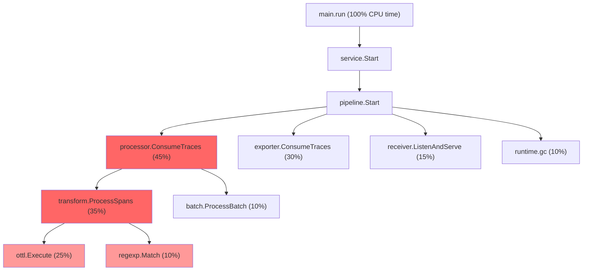
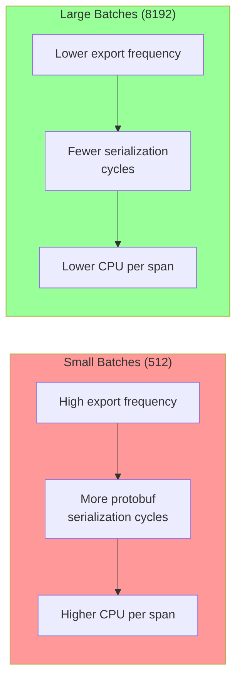

# How to Profile and Optimize OpenTelemetry Collector CPU Usage

Author: [nawazdhandala](https://www.github.com/nawazdhandala)

Tags: OpenTelemetry, Collector, Performance, Profiling, CPU, Optimization

Description: A hands-on guide to profiling OpenTelemetry Collector CPU usage with pprof and optimizing processor pipelines for lower resource consumption.

---

The OpenTelemetry Collector is a workhorse. It receives, processes, and exports telemetry data at scale. But like any data processing pipeline, it can become a CPU bottleneck when it handles enough volume or when its configuration is not tuned properly.

I have seen collectors that should have been comfortably handling their workload pegging at 100% CPU because of a poorly configured transform processor or an expensive regex in a filter rule. The good news is that the Collector is written in Go, which means you get access to Go's excellent profiling tools. This post shows you how to find what is eating your CPU and what to do about it.

## Enabling the pprof Extension

The Collector includes a built-in pprof extension that exposes Go's standard profiling endpoints. This is your primary tool for CPU profiling.

Add the pprof extension to your collector configuration:

```yaml
# collector-config.yaml - Enable pprof for profiling
extensions:
  # Expose Go pprof profiling endpoints on port 1777
  pprof:
    endpoint: 0.0.0.0:1777
    # Block profiling rate (0 = disabled, 1 = every block event)
    block_profile_fraction: 0
    # Mutex profiling rate (0 = disabled)
    mutex_profile_fraction: 0

  # Also enable zpages for live pipeline debugging
  zpages:
    endpoint: 0.0.0.0:55679

service:
  extensions: [pprof, zpages]
  pipelines:
    traces:
      receivers: [otlp]
      processors: [batch]
      exporters: [otlp/backend]
```

Once enabled, you can access the profiling endpoints at `http://localhost:1777/debug/pprof/`.

## Capturing a CPU Profile

To capture a CPU profile, use Go's `pprof` tool or simply curl the endpoint. The profile will record what the Collector is doing during the sampling period.

```bash
# Capture a 30-second CPU profile and save it to a file
# The 'seconds' parameter controls how long the profiler records
curl -o collector-cpu.prof "http://localhost:1777/debug/pprof/profile?seconds=30"

# Open the profile in Go's interactive pprof tool
go tool pprof -http=:8080 collector-cpu.prof
```

The second command opens a web UI where you can explore flame graphs, top functions, and call graphs. If you do not have Go installed locally, you can use `go tool pprof` in a container:

```bash
# Run pprof analysis in a container if Go is not installed locally
docker run --rm -v $(pwd):/profiles -p 8080:8080 golang:1.22 \
    go tool pprof -http=0.0.0.0:8080 /profiles/collector-cpu.prof
```

Make sure to capture the profile while the Collector is under its normal load. A profile taken during idle time will not show you the real bottlenecks.

## Reading the Flame Graph

The flame graph is the most useful visualization. Here is how to interpret it:



The width of each block represents the percentage of CPU time spent in that function. In this example, the transform processor is consuming 35% of total CPU, with most of that time spent in OTTL execution and regex matching. That is where you should focus your optimization efforts.

Common functions you will see in Collector profiles:

- **pdata.* functions**: Serialization and deserialization of telemetry data. High time here means your volume is large.
- **regexp.Match / regexp.Find**: Regular expressions in filter or transform processors. These are often the biggest CPU offenders.
- **proto.Marshal / proto.Unmarshal**: OTLP protobuf encoding and decoding. Proportional to data volume.
- **runtime.mallocgc**: Memory allocation and garbage collection. High time here indicates too many short-lived objects.
- **compress/gzip**: Compression of exported data. Can be significant if you export with gzip compression.

## Profiling Memory Allocation

CPU and memory allocation are closely linked in Go. Excessive allocations cause the garbage collector to run more frequently, which consumes CPU. Capture a heap profile to see what is allocating:

```bash
# Capture a heap profile showing current memory allocations
curl -o collector-heap.prof "http://localhost:1777/debug/pprof/heap"

# Analyze allocations (not just current heap, but total allocation rate)
go tool pprof -alloc_space -http=:8080 collector-heap.prof

# For allocation count (number of objects) rather than bytes
go tool pprof -alloc_objects -http=:8080 collector-heap.prof
```

If you see high allocation rates in processor code, it usually means string operations (concatenation, regex replacement, or OTTL transformations) are creating many temporary objects. These are opportunities for optimization.

## Optimization 1: Replace Regex With Exact Matching

Regular expressions are expensive. Every time the Collector evaluates a regex against a span attribute or metric name, it burns CPU cycles. If you can replace a regex with an exact match or prefix/suffix check, you should.

```yaml
# BEFORE: Regex matching is expensive, especially on high-volume pipelines
processors:
  filter/slow:
    traces:
      span:
        # This regex is evaluated for every single span
        - 'attributes["http.target"] matches "^/api/v[0-9]+/health$"'
        - 'attributes["http.target"] matches "^/api/v[0-9]+/ready$"'

# AFTER: Exact string matching is much faster
processors:
  filter/fast:
    traces:
      span:
        # Exact matches use simple string comparison instead of regex
        - 'attributes["http.target"] == "/api/v1/health"'
        - 'attributes["http.target"] == "/api/v2/health"'
        - 'attributes["http.target"] == "/api/v1/ready"'
        - 'attributes["http.target"] == "/api/v2/ready"'
```

Yes, the exact match version is more verbose. But at 100,000 spans per second, the difference in CPU usage is significant. Regex matching can consume 5-10x more CPU than exact string comparison.

If you must use regex, anchor your patterns (use `^` and `$`) and avoid greedy quantifiers like `.*`. Anchored patterns let the regex engine fail fast on non-matching strings.

## Optimization 2: Tune the Batch Processor

The batch processor has a major impact on CPU efficiency. Small batches mean more frequent processing and export cycles, each with their own overhead. Large batches reduce per-span overhead but use more memory.

```yaml
# collector-config.yaml - Optimized batch processor settings
processors:
  batch:
    # Maximum number of spans/metrics/logs in a batch
    # Larger batches = fewer export cycles = less CPU overhead per item
    send_batch_size: 8192

    # Maximum time to wait before sending a batch
    # Even if the batch is not full, send it after this duration
    timeout: 5s

    # Maximum batch size (acts as a ceiling to prevent memory issues)
    send_batch_max_size: 16384
```

The default `send_batch_size` of 8192 works well for most deployments, but if your CPU profile shows significant time in export-related functions, try increasing it. The tradeoff is latency: larger batches mean your data arrives at the backend slightly later.



## Optimization 3: Reduce Transform Processor Complexity

The transform processor using OTTL (OpenTelemetry Transformation Language) is incredibly powerful but can be a CPU hog if you are not careful. Each OTTL statement is evaluated for every telemetry item that passes through the pipeline.

```yaml
# BEFORE: Multiple OTTL statements evaluated for every span
processors:
  transform/expensive:
    trace_statements:
      - context: span
        statements:
          # Each of these runs for every span, even if conditions don't match
          - set(attributes["service.tier"], "premium") where attributes["customer.plan"] == "enterprise"
          - set(attributes["service.tier"], "standard") where attributes["customer.plan"] == "pro"
          - set(attributes["service.tier"], "free") where attributes["customer.plan"] == "free"
          - delete_key(attributes, "internal.debug.id")
          - delete_key(attributes, "internal.trace.tag")
          - delete_key(attributes, "internal.request.id")

# AFTER: Combined conditions reduce the number of evaluations
processors:
  transform/efficient:
    trace_statements:
      - context: span
        statements:
          # Combine deletions into fewer operations
          - delete_key(attributes, "internal.debug.id")
          - delete_key(attributes, "internal.trace.tag")
          - delete_key(attributes, "internal.request.id")
```

For the tier assignment, consider whether you really need it in the Collector. If this mapping is static, it might be cheaper to do it in the application SDK or in your backend's query layer.

## Optimization 4: Use the Right Exporter Protocol

The exporter protocol affects CPU usage more than most people realize. Protobuf (gRPC) encoding is faster than JSON encoding, and compression settings add CPU overhead that may or may not be worth the network savings.

```yaml
# Compare CPU impact of different exporter configurations
exporters:
  # Most CPU-efficient: gRPC with no compression
  otlp/fast:
    endpoint: collector-gateway:4317
    compression: none

  # Balanced: gRPC with gzip (saves bandwidth, costs CPU)
  otlp/balanced:
    endpoint: collector-gateway:4317
    compression: gzip

  # Most CPU-expensive: HTTP/JSON with gzip compression
  otlphttp/expensive:
    endpoint: http://collector-gateway:4318
    compression: gzip
```

If your Collector is CPU-bound and network bandwidth is not a concern (for example, when the Collector runs as a sidecar communicating with a local gateway), disable compression. gzip compression can consume 10-20% of total Collector CPU at high throughput.

## Optimization 5: Scale Horizontally

Sometimes the best optimization is to spread the load. The Collector supports horizontal scaling through load balancing at the receiver level.

```yaml
# collector-config.yaml - Gateway collector with multiple receiver workers
receivers:
  otlp:
    protocols:
      grpc:
        endpoint: 0.0.0.0:4317
        # Increase the number of gRPC server workers
        # Default is based on the number of CPUs
        max_recv_msg_size_mib: 16
      http:
        endpoint: 0.0.0.0:4318

# Set GOMAXPROCS to match your container CPU limit
# This prevents Go from spawning too many OS threads
```

For Kubernetes deployments, use a Deployment with multiple replicas behind a Service:

```yaml
# kubernetes deployment for horizontally scaled collectors
apiVersion: apps/v1
kind: Deployment
metadata:
  name: otel-collector-gateway
spec:
  # Scale to multiple replicas to distribute CPU load
  replicas: 3
  template:
    spec:
      containers:
        - name: collector
          image: otel/opentelemetry-collector-contrib:latest
          resources:
            requests:
              cpu: "2"
              memory: "4Gi"
            limits:
              cpu: "4"
              memory: "8Gi"
          env:
            # Match GOMAXPROCS to CPU limit to prevent over-scheduling
            - name: GOMAXPROCS
              value: "4"
```

## Continuous Profiling Setup

Rather than profiling only when problems arise, set up continuous profiling to catch regressions early. You can send the Collector's pprof data to a continuous profiling backend:

```bash
# Use a profiling agent alongside your collector
# This example uses Pyroscope's Go agent approach via environment variables

# Set environment variables for the collector container
PYROSCOPE_SERVER_ADDRESS=http://pyroscope:4040
PYROSCOPE_APPLICATION_NAME=otel-collector
PYROSCOPE_AUTH_TOKEN=your-token
```

Alternatively, write a simple script that captures profiles on a schedule:

```bash
#!/bin/bash
# capture-profiles.sh - Capture collector CPU profiles every hour
# Run this as a cron job or sidecar container

COLLECTOR_PPROF="http://localhost:1777"
PROFILE_DIR="/profiles/collector"

mkdir -p "$PROFILE_DIR"

while true; do
    # Generate a timestamp for the profile filename
    TIMESTAMP=$(date +%Y%m%d-%H%M%S)

    # Capture a 60-second CPU profile
    curl -s -o "$PROFILE_DIR/cpu-${TIMESTAMP}.prof" \
        "${COLLECTOR_PPROF}/debug/pprof/profile?seconds=60"

    # Also capture a heap snapshot
    curl -s -o "$PROFILE_DIR/heap-${TIMESTAMP}.prof" \
        "${COLLECTOR_PPROF}/debug/pprof/heap"

    # Clean up profiles older than 7 days
    find "$PROFILE_DIR" -name "*.prof" -mtime +7 -delete

    # Wait one hour before the next capture
    sleep 3600
done
```

## Quick Wins Checklist

If you are in a hurry and need to reduce Collector CPU usage right now, here is a prioritized list:

1. **Disable gzip compression** on internal (collector-to-collector) exports
2. **Replace regex filters** with exact string matches where possible
3. **Increase batch size** to 8192 or higher
4. **Remove unnecessary transform processor statements** that can be handled elsewhere
5. **Set GOMAXPROCS** to match your container's CPU limit
6. **Add more replicas** if a single instance is maxed out
7. **Profile with pprof** to find the actual bottleneck before making further changes

## Wrapping Up

Profiling the OpenTelemetry Collector is straightforward thanks to Go's built-in tooling. The pprof extension gives you everything you need to identify CPU hotspots. The most common culprits are regex-heavy filter rules, complex OTTL transformations, compression overhead, and undersized batch configurations. Address those first, measure the impact, and scale horizontally if single-instance optimization is not enough. A well-tuned Collector should use less than 1 CPU core per 50,000 spans per second. If yours is using significantly more, there is almost certainly an optimization waiting to be found.
