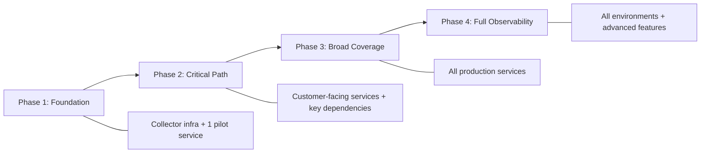

# How to Implement Progressive Observability Rollout for Platform Engineering Teams

Author: [nawazdhandala](https://www.github.com/nawazdhandala)

Tags: OpenTelemetry, Platform Engineering, Progressive Rollout, Observability Strategy

Description: A step-by-step approach to rolling out OpenTelemetry instrumentation progressively across platform teams without overwhelming infrastructure or developers.

Turning on full observability for every service simultaneously is a recipe for problems. Your collectors get overwhelmed. Storage costs spike before you have budgets approved. Developers get buried in alerts they do not understand yet. The backlash kills the initiative.

A progressive rollout gives you control. You start small, prove value, and expand incrementally. Each phase builds on the previous one, and you have clear criteria for moving to the next stage.

## The Four Phases



## Phase 1: Foundation

The goal of Phase 1 is to prove the pipeline works end-to-end with a single service. Pick a service that is actively maintained by a team willing to participate.

Deploy the OpenTelemetry Collector and configure it with conservative resource limits:

```yaml
# phase1-collector-config.yaml
# Minimal collector for the pilot phase - one service, basic pipeline
receivers:
  otlp:
    protocols:
      grpc:
        endpoint: 0.0.0.0:4317

processors:
  # Keep resource usage predictable during pilot
  memory_limiter:
    check_interval: 5s
    limit_mib: 512
    spike_limit_mib: 128

  batch:
    timeout: 10s
    send_batch_size: 256

exporters:
  otlphttp:
    endpoint: https://your-backend:4318

service:
  pipelines:
    traces:
      receivers: [otlp]
      processors: [memory_limiter, batch]
      exporters: [otlphttp]
```

For the pilot service, use auto-instrumentation to get traces without code changes. In a Python service, this means adding the OpenTelemetry distro:

```bash
# Install auto-instrumentation for Python
pip install opentelemetry-distro opentelemetry-exporter-otlp
opentelemetry-bootstrap -a install

# Run the service with auto-instrumentation enabled
opentelemetry-instrument \
    --service_name order-service \
    --traces_exporter otlp \
    --metrics_exporter otlp \
    --exporter_otlp_endpoint http://otel-collector:4317 \
    python app.py
```

**Exit criteria for Phase 1:** Traces appear in your backend. You can follow a request through the pilot service. The collector runs stable for two weeks without resource issues.

## Phase 2: Critical Path

Phase 2 extends instrumentation to services on the critical path - the ones that handle user-facing requests. The goal is to get end-to-end trace visibility for your most important user journeys.

Add sampling to manage data volume as you onboard more services:

```yaml
# phase2-collector-config.yaml
# Extended collector with sampling for multiple services
receivers:
  otlp:
    protocols:
      grpc:
        endpoint: 0.0.0.0:4317

processors:
  memory_limiter:
    check_interval: 5s
    limit_mib: 1024
    spike_limit_mib: 256

  # Sample intelligently - keep errors and slow requests, sample the rest
  tail_sampling:
    decision_wait: 10s
    policies:
      # Always keep error traces
      - name: errors
        type: status_code
        status_code:
          status_codes: [ERROR]
      # Always keep slow requests
      - name: slow-requests
        type: latency
        latency:
          threshold_ms: 1000
      # Sample 20% of normal traffic
      - name: normal-traffic
        type: probabilistic
        probabilistic:
          sampling_percentage: 20

  batch:
    timeout: 10s
    send_batch_size: 512

exporters:
  otlphttp:
    endpoint: https://your-backend:4318

service:
  pipelines:
    traces:
      receivers: [otlp]
      processors: [memory_limiter, tail_sampling, batch]
      exporters: [otlphttp]
```

At this stage, also start collecting metrics from the instrumented services. Metrics are cheaper to store than traces and give you aggregate visibility.

**Exit criteria for Phase 2:** You can trace a user request from the edge through all critical-path services. On-call engineers use traces during at least one incident. Storage costs are within the approved budget.

## Phase 3: Broad Coverage

Phase 3 brings in all production services. This is where the shared instrumentation library (covered in a separate post) becomes essential - you cannot onboard dozens of services without standardized instrumentation.

Create a rollout tracker to manage the process:

```python
# rollout_tracker.py - Track which services have been onboarded
# Store this in a database or config management system

SERVICES = {
    "order-service":    {"phase": 2, "traces": True, "metrics": True, "logs": False},
    "user-service":     {"phase": 2, "traces": True, "metrics": True, "logs": False},
    "payment-service":  {"phase": 2, "traces": True, "metrics": True, "logs": False},
    "inventory-service":{"phase": 3, "traces": True, "metrics": True, "logs": False},
    "notification-svc": {"phase": 3, "traces": True, "metrics": False, "logs": False},
    "analytics-worker": {"phase": 3, "traces": False, "metrics": True, "logs": False},
    # ... remaining services
}

def rollout_progress():
    """Calculate and print rollout coverage statistics."""
    total = len(SERVICES)
    traced = sum(1 for s in SERVICES.values() if s["traces"])
    metriced = sum(1 for s in SERVICES.values() if s["metrics"])
    print(f"Trace coverage: {traced}/{total} ({100*traced//total}%)")
    print(f"Metric coverage: {metriced}/{total} ({100*metriced//total}%)")
```

Scale the collector infrastructure to handle the increased load. Switch from a single collector to a collector pool behind a load balancer:

```yaml
# phase3-collector-deployment.yaml
apiVersion: apps/v1
kind: Deployment
metadata:
  name: otel-collector-gateway
  namespace: observability
spec:
  replicas: 3  # Scale horizontally for Phase 3 volume
  selector:
    matchLabels:
      app: otel-collector
  template:
    spec:
      containers:
        - name: collector
          image: otel/opentelemetry-collector-contrib:0.96.0
          resources:
            requests:
              cpu: "1"
              memory: 2Gi
            limits:
              cpu: "2"
              memory: 4Gi
```

**Exit criteria for Phase 3:** 80%+ of production services emit traces and metrics. Dashboards exist for all major service groups. Incident response regularly uses telemetry data.

## Phase 4: Full Observability

Phase 4 adds the remaining capabilities: structured logging through OpenTelemetry, non-production environment coverage, and advanced features like continuous profiling.

Add log collection to your existing pipeline:

```yaml
# phase4-addition - Add logs pipeline to existing config
service:
  pipelines:
    # Existing trace and metric pipelines unchanged
    logs:
      receivers: [otlp]
      processors: [memory_limiter, batch]
      exporters: [otlphttp]
```

## Managing Resistance

Not every team will be enthusiastic. Common objections and practical responses:

**"It will slow down our service."** Show benchmarks from Phase 1. OpenTelemetry auto-instrumentation typically adds less than 3% overhead. Provide actual numbers from your pilot.

**"We do not have time."** If you have a shared instrumentation library, onboarding takes less than an hour. Offer to pair with the team for the first setup.

**"We already have monitoring."** Position OpenTelemetry as an upgrade, not a replacement. It provides correlated signals that existing tools cannot match.

The key to a successful rollout is patience. Each phase should run for at least a month before you move to the next. Rushing creates fragile infrastructure and frustrated teams. Take the time to get each phase solid before expanding.
