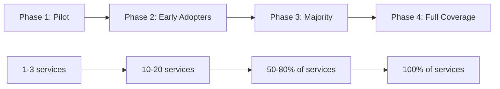

# How to Implement Progressive Rollout of OpenTelemetry Instrumentation

Author: [nawazdhandala](https://www.github.com/nawazdhandala)

Tags: OpenTelemetry, Progressive Rollout, Instrumentation, Migration, Adoption, Strategy

Description: Learn how to progressively roll out OpenTelemetry instrumentation across your organization using phased adoption, canary deployments, and feature flags.

---

Rolling out OpenTelemetry across an entire organization at once is risky and impractical. Instrumentation adds dependencies, changes application startup behavior, consumes CPU and memory, and generates network traffic. If something goes wrong with any of these, you want to catch it in a controlled way before it affects your entire production fleet. A progressive rollout lets you introduce instrumentation gradually, validate at each step, and roll back quickly if problems arise.

This post covers a phased approach to rolling out OpenTelemetry, from the first pilot service to full organizational adoption.

## The Rollout Phases

A progressive rollout typically has four phases:



Each phase has different goals, different risk tolerance, and different success criteria.

## Phase 1: Pilot (1-3 Services)

Start with one to three services owned by the platform team or a closely collaborating team. These should be non-critical but representative services.

### Selection Criteria

Pick services that:
- Are not in the critical path of revenue-generating transactions
- Represent common patterns (HTTP API, background worker, message consumer)
- Have an engaged team willing to provide feedback
- Run in both staging and production environments

### Instrumentation Setup

For the pilot, use the simplest possible setup:

```yaml
# Phase 1: Minimal collector configuration for the pilot.
# Single collector instance receiving from pilot services only.
receivers:
  otlp:
    protocols:
      http:
        endpoint: 0.0.0.0:4318

processors:
  batch:
    timeout: 5s
    send_batch_size: 256

exporters:
  otlphttp:
    endpoint: https://oneuptime.com/otlp
  logging:
    # Also log to stdout for easy debugging during pilot
    loglevel: info

service:
  pipelines:
    traces:
      receivers: [otlp]
      processors: [batch]
      exporters: [otlphttp, logging]
```

### Feature Flag Control

Use a feature flag to control instrumentation without requiring redeployment:

```python
# Use a feature flag to control whether telemetry is active.
# This lets you turn instrumentation on and off without redeploying.
import os
from opentelemetry import trace
from opentelemetry.sdk.trace import TracerProvider
from opentelemetry.sdk.trace.export import BatchSpanProcessor, SimpleSpanProcessor
from opentelemetry.exporter.otlp.proto.http.trace_exporter import OTLPSpanExporter

def init_telemetry():
    # Check if instrumentation is enabled via feature flag
    otel_enabled = os.getenv("OTEL_INSTRUMENTATION_ENABLED", "false").lower() == "true"

    if not otel_enabled:
        # Use the no-op tracer provider (zero overhead)
        trace.set_tracer_provider(trace.NoOpTracerProvider())
        return

    provider = TracerProvider()
    exporter = OTLPSpanExporter()
    provider.add_span_processor(BatchSpanProcessor(exporter))
    trace.set_tracer_provider(provider)
```

For Kubernetes, control the feature flag via a ConfigMap:

```yaml
# Feature flag ConfigMap for controlling OTel rollout.
# Update the ConfigMap and restart pods to toggle instrumentation.
apiVersion: v1
kind: ConfigMap
metadata:
  name: otel-feature-flags
data:
  # Phase 1: Only pilot services are enabled
  OTEL_INSTRUMENTATION_ENABLED: "false"  # default for all services
---
# Override for pilot services
apiVersion: v1
kind: ConfigMap
metadata:
  name: otel-feature-flags-pilot
data:
  OTEL_INSTRUMENTATION_ENABLED: "true"
```

### Success Criteria for Phase 1

Before moving to Phase 2, validate:
- Traces are flowing and visible in the backend
- No measurable impact on service latency (less than 1% increase)
- No measurable impact on memory usage (less than 50MB increase)
- No increase in error rates
- Context propagation works between pilot services

## Phase 2: Early Adopters (10-20 Services)

Expand to teams that volunteered or expressed interest. Provide them with templates, documentation, and direct support.

### Canary Deployment Strategy

For each new service, roll out instrumentation using a canary pattern:

```yaml
# Canary deployment: run instrumented and uninstrumented pods side by side.
# Gradually shift traffic to the instrumented version.
apiVersion: apps/v1
kind: Deployment
metadata:
  name: order-service-canary
spec:
  replicas: 1  # Start with 1 instrumented pod
  template:
    metadata:
      labels:
        app: order-service
        variant: canary
    spec:
      containers:
        - name: order-service
          image: mycompany/order-service:latest
          env:
            - name: OTEL_INSTRUMENTATION_ENABLED
              value: "true"
            - name: OTEL_SERVICE_NAME
              value: "order-service"
---
apiVersion: apps/v1
kind: Deployment
metadata:
  name: order-service-stable
spec:
  replicas: 4  # Original uninstrumented pods
  template:
    metadata:
      labels:
        app: order-service
        variant: stable
    spec:
      containers:
        - name: order-service
          image: mycompany/order-service:latest
          env:
            - name: OTEL_INSTRUMENTATION_ENABLED
              value: "false"
```

Compare metrics between the canary and stable pods to detect any performance impact:

```bash
# Compare p99 latency between canary and stable pods.
# If the canary shows significantly higher latency, pause the rollout.
curl -G "http://prometheus:9090/api/v1/query" \
  --data-urlencode 'query=
    histogram_quantile(0.99,
      rate(http_request_duration_seconds_bucket{app="order-service",variant="canary"}[5m])
    )
    /
    histogram_quantile(0.99,
      rate(http_request_duration_seconds_bucket{app="order-service",variant="stable"}[5m])
    )'
```

### Rollback Procedure

Document a clear rollback procedure before expanding the rollout:

```bash
#!/bin/bash
# scripts/rollback-otel.sh
# Emergency rollback script for OpenTelemetry instrumentation.
# Disables instrumentation for a specific service.

SERVICE=$1

if [ -z "$SERVICE" ]; then
  echo "Usage: ./rollback-otel.sh <service-name>"
  exit 1
fi

echo "Rolling back OpenTelemetry instrumentation for $SERVICE"

# Set the feature flag to disabled
kubectl set env deployment/$SERVICE OTEL_INSTRUMENTATION_ENABLED=false

# Trigger a rolling restart to pick up the change
kubectl rollout restart deployment/$SERVICE

# Wait for the rollout to complete
kubectl rollout status deployment/$SERVICE

echo "Rollback complete. Instrumentation disabled for $SERVICE."
```

## Phase 3: Majority (50-80% of Services)

At this phase, instrumentation is no longer experimental. It is becoming the standard. This is where automation and self-service become critical.

### Automated Onboarding

Use the OpenTelemetry Operator to handle instrumentation automatically:

```yaml
# The OTel Operator injects instrumentation into pods based on annotations.
# Teams just add an annotation to their Deployment to opt in.
apiVersion: opentelemetry.io/v1alpha1
kind: Instrumentation
metadata:
  name: auto-instrumentation
  namespace: default
spec:
  exporter:
    endpoint: http://otel-collector.observability:4318
  propagators:
    - tracecontext
    - baggage
  sampler:
    type: parentbased_traceidratio
    argument: "0.1"
  java:
    image: ghcr.io/open-telemetry/opentelemetry-operator/autoinstrumentation-java:latest
  python:
    image: ghcr.io/open-telemetry/opentelemetry-operator/autoinstrumentation-python:latest
  nodejs:
    image: ghcr.io/open-telemetry/opentelemetry-operator/autoinstrumentation-nodejs:latest
```

Teams opt in with a single annotation:

```yaml
# Teams add this annotation to enable auto-instrumentation.
# No code changes required.
metadata:
  annotations:
    instrumentation.opentelemetry.io/inject-java: "true"
```

### Tracking Rollout Progress

Build a dashboard that tracks instrumentation coverage:

```python
# scripts/rollout_progress.py
# Tracks which services are instrumented and which are not.
import subprocess
import json

def get_rollout_status():
    # Get all deployments
    result = subprocess.run(
        ["kubectl", "get", "deployments", "-A", "-o", "json"],
        capture_output=True, text=True
    )
    deployments = json.loads(result.stdout)["items"]

    instrumented = 0
    total = 0

    for deploy in deployments:
        # Skip infrastructure deployments
        ns = deploy["metadata"]["namespace"]
        if ns in ["kube-system", "observability"]:
            continue

        total += 1
        annotations = deploy["spec"]["template"]["metadata"].get("annotations", {})
        env_vars = {}
        for container in deploy["spec"]["template"]["spec"]["containers"]:
            for env in container.get("env", []):
                env_vars[env["name"]] = env.get("value", "")

        # Check for auto-instrumentation annotation or manual setup
        has_auto = any("opentelemetry" in str(v) for v in annotations.values())
        has_manual = env_vars.get("OTEL_INSTRUMENTATION_ENABLED") == "true"
        has_sdk = "OTEL_SERVICE_NAME" in env_vars

        if has_auto or has_manual or has_sdk:
            instrumented += 1

    return {
        "total": total,
        "instrumented": instrumented,
        "coverage": f"{100 * instrumented / total:.1f}%",
    }

status = get_rollout_status()
print(f"Instrumentation coverage: {status['coverage']} ({status['instrumented']}/{status['total']})")
```

## Phase 4: Full Coverage

The final phase aims for 100% coverage. At this point, the question flips from "why should we instrument?" to "why is this service not instrumented?"

### Make Instrumentation the Default

Configure your platform so that new services are instrumented by default:

```yaml
# Namespace-level default annotation using a mutating webhook.
# Every new pod in this namespace gets auto-instrumentation
# unless it explicitly opts out.
apiVersion: v1
kind: Namespace
metadata:
  name: production
  annotations:
    instrumentation.opentelemetry.io/inject-java: "true"
    instrumentation.opentelemetry.io/inject-python: "true"
    instrumentation.opentelemetry.io/inject-nodejs: "true"
```

Services that cannot be instrumented (for example, third-party containers) opt out with an annotation:

```yaml
metadata:
  annotations:
    instrumentation.opentelemetry.io/inject-java: "false"
```

## Monitoring Rollout Health

Throughout all phases, monitor the health impact of instrumentation:

```yaml
# Prometheus alerts for detecting instrumentation-related issues
groups:
  - name: otel-rollout-health
    rules:
      # Alert if any service shows a latency increase after instrumentation
      - alert: InstrumentationLatencyIncrease
        expr: |
          (
            histogram_quantile(0.99, rate(http_request_duration_seconds_bucket[5m]))
            /
            histogram_quantile(0.99, rate(http_request_duration_seconds_bucket[5m] offset 1h))
          ) > 1.1
        for: 10m
        labels:
          severity: warning
        annotations:
          summary: "{{ $labels.service }} p99 latency increased by >10% after instrumentation change"
```

## Conclusion

Progressive rollout is the safe way to adopt OpenTelemetry across an organization. Starting with a small pilot, expanding through canary deployments, automating with the operator, and finally making instrumentation the default creates a smooth adoption curve. At each phase, you have clear success criteria, a tested rollback procedure, and monitoring that catches problems early. This approach takes longer than a big-bang rollout, but it builds confidence and avoids the kind of incidents that turn teams against observability tooling.
