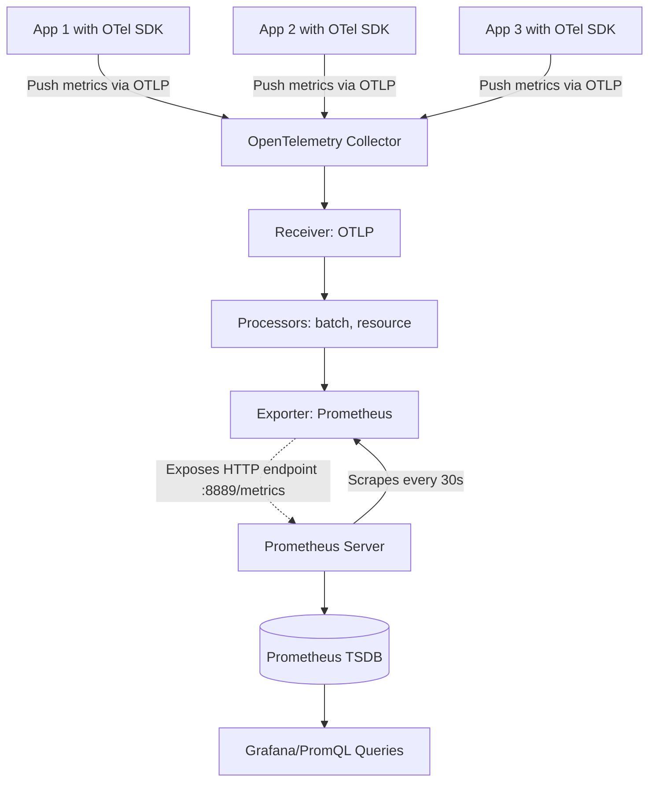
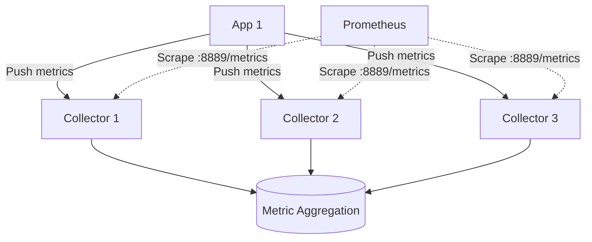

# How to Configure the Prometheus Exporter in the OpenTelemetry Collector

Author: [nawazdhandala](https://www.github.com/nawazdhandala)

Tags: OpenTelemetry, Collector, Exporters, Prometheus, Metrics, Observability

Description: A comprehensive guide to configuring the Prometheus exporter in OpenTelemetry Collector, enabling Prometheus to scrape metrics via HTTP endpoints with practical YAML examples, metric translation patterns, and production-ready configurations.

---

The Prometheus exporter in the OpenTelemetry Collector exposes metrics in Prometheus exposition format over HTTP, allowing Prometheus servers to scrape them using the familiar pull-based model. This exporter bridges the gap between OpenTelemetry's push-based architecture and Prometheus's pull-based monitoring ecosystem.

Unlike push-based exporters that actively send data to backends, the Prometheus exporter runs an HTTP server that waits for Prometheus to scrape metrics on a regular interval. This makes it ideal for environments where Prometheus is the primary metrics backend or where you need to maintain compatibility with existing Prometheus infrastructure.

This guide covers everything from basic setup to advanced metric translation, resource-to-label mapping, and production deployment patterns.

---

## Why Use the Prometheus Exporter?

The Prometheus exporter serves several key use cases:

**Prometheus integration**: If you already run Prometheus for metrics collection, the exporter lets you collect OpenTelemetry metrics without changing your Prometheus setup.

**Pull-based architecture**: Some organizations prefer pull-based monitoring for security reasons (no outbound connections from monitoring infrastructure) or operational simplicity (centralized scrape configuration).

**Hybrid observability**: You can use OpenTelemetry for traces and logs while keeping Prometheus for metrics, giving you the best of both ecosystems.

**Cost efficiency**: Prometheus is free and efficient for metrics storage. Combining it with OpenTelemetry for traces can reduce costs compared to all-in-one commercial solutions.

---

## Basic Configuration

Here is a minimal Prometheus exporter configuration. This exposes metrics on port 8889 for Prometheus to scrape:

```yaml
# receivers configuration (how telemetry enters the Collector)
receivers:
  otlp:
    protocols:
      grpc:        # Accept OTLP over gRPC from instrumented apps
      http:        # Accept OTLP over HTTP from instrumented apps

# exporters configuration (expose metrics for Prometheus scraping)
exporters:
  prometheus:
    endpoint: "0.0.0.0:8889"  # HTTP endpoint for Prometheus to scrape

# service pipelines (wire receivers to exporters)
service:
  pipelines:
    metrics:
      receivers: [otlp]
      exporters: [prometheus]
```

After starting the Collector, metrics are available at `http://collector-host:8889/metrics`. Configure Prometheus to scrape this endpoint:

```yaml
# prometheus.yml
scrape_configs:
  - job_name: 'otel-collector'
    scrape_interval: 30s
    static_configs:
      - targets: ['localhost:8889']
```

---

## Architecture and Data Flow

This diagram shows how metrics flow from applications through the Collector to Prometheus:



The key difference from push-based exporters: the Collector does not initiate connections to Prometheus. Instead, Prometheus scrapes the Collector on a schedule.

---

## Metric Translation

OpenTelemetry and Prometheus use different metric models. The Prometheus exporter automatically translates OpenTelemetry metrics to Prometheus format:

### Counter Translation

OpenTelemetry counters become Prometheus counters:

```yaml
# OpenTelemetry metric
name: http_requests_total
type: Counter
value: 1523
attributes:
  method: GET
  status: 200

# Prometheus format (after translation)
http_requests_total{method="GET",status="200"} 1523
```

### Gauge Translation

OpenTelemetry gauges map directly to Prometheus gauges:

```yaml
# OpenTelemetry metric
name: system_memory_usage
type: Gauge
value: 2048000000
attributes:
  host: server-1

# Prometheus format
system_memory_usage{host="server-1"} 2048000000
```

### Histogram Translation

OpenTelemetry histograms become Prometheus histograms with bucket, sum, and count metrics:

```yaml
# OpenTelemetry histogram
name: http_request_duration_seconds
type: Histogram
bucket_counts: [45, 89, 12, 3, 1]
explicit_bounds: [0.1, 0.5, 1.0, 5.0, 10.0]

# Prometheus format (multiple metrics generated)
http_request_duration_seconds_bucket{le="0.1"} 45
http_request_duration_seconds_bucket{le="0.5"} 134
http_request_duration_seconds_bucket{le="1.0"} 146
http_request_duration_seconds_bucket{le="5.0"} 149
http_request_duration_seconds_bucket{le="10.0"} 150
http_request_duration_seconds_bucket{le="+Inf"} 150
http_request_duration_seconds_sum 892.5
http_request_duration_seconds_count 150
```

### Summary Translation

OpenTelemetry summary metrics become Prometheus summaries:

```yaml
# Prometheus format
http_request_duration_summary{quantile="0.5"} 0.23
http_request_duration_summary{quantile="0.9"} 1.2
http_request_duration_summary{quantile="0.99"} 4.5
http_request_duration_summary_sum 892.5
http_request_duration_summary_count 150
```

---

## Resource Attribute Mapping

OpenTelemetry metrics include resource attributes (metadata about the source) that need to be converted to Prometheus labels. The exporter handles this automatically:

```yaml
exporters:
  prometheus:
    endpoint: "0.0.0.0:8889"

    # Control how resource attributes become labels
    resource_to_telemetry_conversion:
      enabled: true  # Convert resource attributes to metric labels
```

Example transformation:

```yaml
# OpenTelemetry metric with resource attributes
Resource:
  service.name: payment-service
  deployment.environment: production
  host.name: server-1

Metric:
  name: http_requests_total
  value: 1523

# Prometheus output (resource attributes become labels)
http_requests_total{
  service_name="payment-service",
  deployment_environment="production",
  host_name="server-1"
} 1523
```

Note that attribute names are sanitized for Prometheus (dots become underscores).

---

## Metric Namespacing

To avoid metric name collisions when running multiple collectors or services, add a namespace prefix:

```yaml
exporters:
  prometheus:
    endpoint: "0.0.0.0:8889"

    # Add prefix to all metric names
    namespace: "otel"
```

This transforms metric names:

```
# Without namespace
http_requests_total{method="GET"} 1523

# With namespace "otel"
otel_http_requests_total{method="GET"} 1523
```

Namespacing is especially useful in multi-tenant environments or when aggregating metrics from multiple sources.

---

## Const Labels

Add static labels to all exported metrics for identification:

```yaml
exporters:
  prometheus:
    endpoint: "0.0.0.0:8889"

    # Add these labels to every metric
    const_labels:
      cluster: "us-west-2"
      environment: "production"
      collector_instance: "${HOSTNAME}"  # Environment variable expansion
```

Result:

```
http_requests_total{
  method="GET",
  cluster="us-west-2",
  environment="production",
  collector_instance="collector-1"
} 1523
```

Use const labels for:
- Identifying which collector exported the metric
- Tagging metrics by environment, region, or cluster
- Adding organizational metadata (team, cost center, etc.)

---

## Production-Ready Configuration

Here is a complete production configuration combining best practices:

```yaml
receivers:
  # Accept metrics from instrumented applications
  otlp:
    protocols:
      grpc:
        endpoint: 0.0.0.0:4317
      http:
        endpoint: 0.0.0.0:4318

processors:
  # Protect Collector from memory exhaustion
  memory_limiter:
    check_interval: 1s
    limit_mib: 512
    spike_limit_mib: 128

  # Batch metrics to reduce processing overhead
  batch:
    timeout: 10s
    send_batch_size: 1000

  # Add resource attributes for better metric context
  resource:
    attributes:
      - key: deployment.environment
        value: production
        action: upsert

  # Filter out high-cardinality metrics that could overwhelm Prometheus
  filter/drop_noisy:
    metrics:
      exclude:
        match_type: regexp
        metric_names:
          - ".*\.user_id"  # Drop metrics with user IDs (high cardinality)
          - ".*\.request_id"  # Drop per-request metrics

  # Rename metrics for consistency with existing Prometheus metrics
  metricstransform:
    transforms:
      - include: "^http\\.server\\..*"
        match_type: regexp
        action: update
        new_name: "http_$${1}"  # http.server.duration -> http_duration

exporters:
  # Prometheus exporter for scraping
  prometheus:
    endpoint: "0.0.0.0:8889"

    # Add namespace to avoid collisions
    namespace: "otel"

    # Convert resource attributes to labels
    resource_to_telemetry_conversion:
      enabled: true

    # Add static labels for identification
    const_labels:
      cluster: "us-west-2"
      environment: "production"
      collector_instance: "${HOSTNAME}"

    # Control metric expiration
    send_timestamps: true  # Include timestamps in exposition format
    metric_expiration: 5m  # Remove metrics not updated in 5 minutes

# Service configuration
service:
  pipelines:
    metrics:
      receivers: [otlp]
      processors:
        - memory_limiter
        - filter/drop_noisy
        - metricstransform
        - resource
        - batch
      exporters: [prometheus]

  # Enable health check endpoint for Kubernetes liveness/readiness
  extensions: [health_check]

extensions:
  health_check:
    endpoint: "0.0.0.0:13133"
```

This configuration includes:

- Memory protection to prevent crashes
- Filtering to remove high-cardinality metrics
- Metric renaming for consistency
- Namespacing to avoid collisions
- Resource attribute conversion
- Static labels for environment tagging
- Metric expiration to clean up stale metrics
- Health check endpoint for container orchestration

---

## Prometheus Scrape Configuration

Configure Prometheus to scrape the Collector. Here are several deployment patterns:

### Static Configuration

For fixed Collector instances:

```yaml
# prometheus.yml
scrape_configs:
  - job_name: 'otel-collector'
    scrape_interval: 30s
    scrape_timeout: 10s
    metrics_path: '/metrics'  # Default path
    static_configs:
      - targets:
          - 'collector-1.example.com:8889'
          - 'collector-2.example.com:8889'
          - 'collector-3.example.com:8889'
```

### Kubernetes Service Discovery

For collectors running in Kubernetes:

```yaml
# prometheus.yml
scrape_configs:
  - job_name: 'otel-collector-k8s'
    scrape_interval: 30s

    kubernetes_sd_configs:
      - role: pod
        namespaces:
          names:
            - observability  # Namespace where collectors run

    relabel_configs:
      # Only scrape pods with specific label
      - source_labels: [__meta_kubernetes_pod_label_app]
        action: keep
        regex: otel-collector

      # Use pod IP as target
      - source_labels: [__meta_kubernetes_pod_ip]
        action: replace
        target_label: __address__
        replacement: $1:8889

      # Add pod metadata as labels
      - source_labels: [__meta_kubernetes_pod_name]
        action: replace
        target_label: pod

      - source_labels: [__meta_kubernetes_namespace]
        action: replace
        target_label: namespace
```

### Consul Service Discovery

For collectors registered in Consul:

```yaml
# prometheus.yml
scrape_configs:
  - job_name: 'otel-collector-consul'
    scrape_interval: 30s

    consul_sd_configs:
      - server: 'consul.example.com:8500'
        services:
          - otel-collector

    relabel_configs:
      - source_labels: [__meta_consul_service]
        target_label: job
```

---

## Securing the Metrics Endpoint

The Prometheus exporter does not include built-in authentication. For production deployments, protect the metrics endpoint using one of these approaches:

### Network Isolation

Restrict access using firewall rules or network policies:

```yaml
# Kubernetes NetworkPolicy example
apiVersion: networking.k8s.io/v1
kind: NetworkPolicy
metadata:
  name: allow-prometheus-scrape
spec:
  podSelector:
    matchLabels:
      app: otel-collector
  ingress:
    - from:
        - podSelector:
            matchLabels:
              app: prometheus
      ports:
        - port: 8889
          protocol: TCP
```

### Reverse Proxy with Authentication

Place the Collector behind a reverse proxy (nginx, Envoy) that handles authentication:

```nginx
# nginx.conf
server {
    listen 443 ssl;
    server_name metrics.example.com;

    ssl_certificate /etc/nginx/cert.pem;
    ssl_certificate_key /etc/nginx/key.pem;

    location /metrics {
        # Basic authentication
        auth_basic "Metrics Access";
        auth_basic_user_file /etc/nginx/.htpasswd;

        # Proxy to Collector
        proxy_pass http://otel-collector:8889/metrics;
    }
}
```

### Mutual TLS

Use mTLS between Prometheus and the Collector (requires custom setup with a service mesh or proxy).

---

## High Availability Setup

For production resilience, run multiple Collector instances behind a load balancer. Prometheus scrapes all instances:



Prometheus automatically deduplicates metrics from multiple collectors that have identical label sets. To distinguish metrics from different collectors, use const labels:

```yaml
# collector-1.yaml
exporters:
  prometheus:
    const_labels:
      collector_instance: "collector-1"

# collector-2.yaml
exporters:
  prometheus:
    const_labels:
      collector_instance: "collector-2"
```

This allows you to track per-collector metrics while still aggregating across collectors.

---

## Troubleshooting Common Issues

### Metrics Not Appearing in Prometheus

**Problem**: Prometheus scrape succeeds but metrics are missing.

**Solution**:
- Check that the metrics pipeline is configured correctly
- Verify processors are not filtering out the metrics
- Look for metric name conflicts (duplicates get dropped)
- Check Prometheus relabel configs for accidental drops

### High Cardinality Metrics

**Problem**: Prometheus performance degrades, high memory usage.

**Solution**: Filter high-cardinality labels before export:

```yaml
processors:
  filter/drop_high_cardinality:
    metrics:
      exclude:
        match_type: regexp
        metric_names:
          - ".*\\.user_id"  # Drop user ID labels
          - ".*\\.trace_id"  # Drop trace ID labels
          - ".*\\.request_id"  # Drop request ID labels
```

Monitor cardinality with Prometheus queries:

```promql
# Count unique time series per metric
count by (__name__) ({__name__=~".+"})
```

### Scrape Timeouts

**Problem**: Prometheus logs show scrape timeout errors.

**Solution**:
- Increase Prometheus scrape timeout
- Reduce metric volume with filtering
- Increase Collector resources if it is slow to respond
- Check for network latency between Prometheus and Collector

### Stale Metrics

**Problem**: Old metrics linger in Prometheus after source stops sending.

**Solution**: Configure metric expiration:

```yaml
exporters:
  prometheus:
    metric_expiration: 5m  # Remove metrics not updated in 5 minutes
```

---

## Monitoring the Exporter

The Prometheus exporter itself emits internal metrics about its operation:

```promql
# Number of metrics currently exposed
otelcol_exporter_prometheus_total_metric_points

# Scrape duration
otelcol_exporter_prometheus_scrape_duration_seconds

# Failed metric exports
otelcol_exporter_sent_failed_metric_points_total
```

Create alerts for export failures:

```yaml
# prometheus-rules.yml
groups:
  - name: otel-collector
    interval: 30s
    rules:
      - alert: CollectorMetricExportFailure
        expr: rate(otelcol_exporter_sent_failed_metric_points_total[5m]) > 0
        for: 5m
        annotations:
          summary: "Collector failing to export metrics"
```

See our guide on [collecting OpenTelemetry Collector internal metrics](https://oneuptime.com/blog/post/2025-01-22-how-to-collect-opentelemetry-collector-internal-metrics/view) for comprehensive monitoring.

---

## Prometheus Remote Write Alternative

If you prefer push-based delivery to Prometheus, use the Prometheus Remote Write exporter instead. See our guide: [How to Configure the Prometheus Remote Write Exporter](https://oneuptime.com/blog/post/2026-02-06-prometheus-remote-write-exporter-opentelemetry-collector/view).

The remote write exporter actively pushes metrics to Prometheus or compatible backends (Thanos, Cortex, Mimir, VictoriaMetrics), eliminating the need for scrape configuration.

---

## Related Resources

- [What is the OpenTelemetry Collector and Why Use One?](https://oneuptime.com/blog/post/2025-09-18-what-is-opentelemetry-collector-and-why-use-one/view)
- [How to Configure the OTLP HTTP Exporter in the OpenTelemetry Collector](https://oneuptime.com/blog/post/2026-02-06-otlp-http-exporter-opentelemetry-collector/view)
- [How to Configure the Debug Exporter in the OpenTelemetry Collector](https://oneuptime.com/blog/post/2026-02-06-debug-exporter-opentelemetry-collector/view)

---

## Summary

The Prometheus exporter enables pull-based metrics collection in OpenTelemetry Collector, making it ideal for environments where Prometheus is the primary metrics backend. Key takeaways:

- The exporter runs an HTTP server that Prometheus scrapes
- OpenTelemetry metrics are automatically translated to Prometheus format
- Resource attributes become Prometheus labels
- Use namespacing and const labels to avoid conflicts
- Filter high-cardinality metrics to protect Prometheus performance
- Secure the endpoint with network policies or reverse proxies
- Run multiple collectors for high availability

The Prometheus exporter is production-ready and widely used. It provides a bridge between OpenTelemetry's modern instrumentation and Prometheus's proven metrics storage, giving you the best of both ecosystems.

For a fully integrated OpenTelemetry solution that includes traces, logs, and metrics without the need for separate Prometheus infrastructure, check out [OneUptime](https://oneuptime.com).
