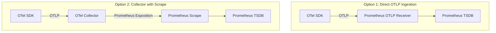

# How to Set Up Prometheus as an OpenTelemetry Metrics Backend

Author: [nawazdhandala](https://www.github.com/nawazdhandala)

Tags: OpenTelemetry, Prometheus, Metrics, Observability, Collector, Backend

Description: Learn how to configure Prometheus to receive and store OpenTelemetry metrics, including OTLP ingestion, collector setup, and PromQL querying.

---

Prometheus is one of the most popular metrics systems in the cloud native world. It powers alerting and dashboarding for thousands of organizations. OpenTelemetry, on the other hand, is becoming the standard for instrumenting applications. The good news is that these two systems work well together. You can use OpenTelemetry to instrument your code and send metrics to Prometheus for storage, querying, and alerting.

This guide covers the full setup: configuring Prometheus to accept OpenTelemetry metrics, setting up the OpenTelemetry Collector to export to Prometheus, and understanding the nuances of how OTel metrics map to Prometheus types.

## Architecture Options

There are two main approaches to getting OpenTelemetry metrics into Prometheus. The first is using the Prometheus OTLP receiver, which lets Prometheus ingest OTLP data directly. The second is using the OpenTelemetry Collector with a Prometheus exporter that exposes a scrape endpoint.



Option 1 is simpler because you remove the collector from the pipeline. Option 2 gives you more flexibility for processing, filtering, and routing metrics before they reach Prometheus. Both are valid, and you can even combine them depending on your use case.

## Option 1: Prometheus OTLP Receiver

Since Prometheus 2.47, there is experimental support for receiving OTLP metrics directly. This feature has matured significantly and is a solid choice for teams that want to avoid running a separate collector just for metrics.

Here is a Prometheus configuration that enables the OTLP receiver.

```yaml
# prometheus.yml - Enable OTLP receiver for direct metric ingestion
global:
  scrape_interval: 15s
  evaluation_interval: 15s

# Enable the OTLP receiver feature
otlp:
  # Configure the OTLP receiver to accept both gRPC and HTTP
  protocols:
    grpc:
      endpoint: "0.0.0.0:4317"
    http:
      endpoint: "0.0.0.0:4318"

  # Resource attributes to promote to labels
  # These attributes from OTel resources become Prometheus labels
  resource_attributes:
    - service.name
    - service.namespace
    - deployment.environment

# Standard Prometheus scrape configs can coexist with OTLP
scrape_configs:
  - job_name: "prometheus"
    static_configs:
      - targets: ["localhost:9090"]
```

You need to start Prometheus with the OTLP feature flag enabled.

```bash
# Start Prometheus with the OTLP write receiver enabled
prometheus \
  --config.file=prometheus.yml \
  --enable-feature=otlp-write-receiver \
  --storage.tsdb.path=/var/lib/prometheus/data \
  --web.listen-address=0.0.0.0:9090
```

Once Prometheus is running with these settings, you can point any OpenTelemetry SDK or collector directly at the Prometheus OTLP endpoint. No separate collector needed.

Here is a quick test using the OTel SDK in a Python application.

```python
# app.py - Send metrics directly to Prometheus OTLP endpoint
from opentelemetry import metrics
from opentelemetry.sdk.metrics import MeterProvider
from opentelemetry.sdk.metrics.export import PeriodicExportingMetricReader
from opentelemetry.exporter.otlp.proto.grpc.metric_exporter import OTLPMetricExporter
from opentelemetry.sdk.resources import Resource

# Create a resource identifying this service
resource = Resource.create({
    "service.name": "payment-service",
    "service.namespace": "backend",
    "deployment.environment": "production",
})

# Configure the OTLP exporter pointing at Prometheus
exporter = OTLPMetricExporter(
    endpoint="localhost:4317",  # Prometheus OTLP gRPC endpoint
    insecure=True,
)

# Set up the meter provider with a 30-second export interval
reader = PeriodicExportingMetricReader(exporter, export_interval_millis=30000)
provider = MeterProvider(resource=resource, metric_readers=[reader])
metrics.set_meter_provider(provider)

# Create and use metrics
meter = metrics.get_meter("payment-service")
request_counter = meter.create_counter(
    "http_requests_total",
    description="Total HTTP requests",
    unit="1",
)
request_duration = meter.create_histogram(
    "http_request_duration_seconds",
    description="HTTP request duration",
    unit="s",
)

# Record some data
request_counter.add(1, {"method": "POST", "path": "/api/charge", "status": "200"})
request_duration.record(0.145, {"method": "POST", "path": "/api/charge"})
```

After the export interval elapses, you can query these metrics in Prometheus using PromQL just like any other Prometheus metric.

## Option 2: OpenTelemetry Collector with Prometheus Exporter

If you want to process, transform, or route metrics before they land in Prometheus, running the OpenTelemetry Collector between your applications and Prometheus is the way to go. The collector exposes a Prometheus-compatible scrape endpoint that Prometheus can pull from.

```yaml
# otel-collector-config.yaml
receivers:
  otlp:
    protocols:
      grpc:
        # Accept OTLP metrics from instrumented applications
        endpoint: 0.0.0.0:4317
      http:
        endpoint: 0.0.0.0:4318

processors:
  # Batch metrics for efficient processing
  batch:
    timeout: 15s
    send_batch_size: 2048

  # Add resource attributes to all metrics
  resource:
    attributes:
      - key: collector.instance
        value: "otel-collector-01"
        action: upsert

  # Limit memory to avoid OOM
  memory_limiter:
    check_interval: 1s
    limit_mib: 512
    spike_limit_mib: 128

exporters:
  # Expose a Prometheus scrape endpoint on port 8889
  prometheus:
    endpoint: 0.0.0.0:8889

    # Namespace prefix for all metrics (optional)
    namespace: otel

    # Send timestamps with metrics
    send_timestamps: true

    # Configure how OTel resource attributes map to Prometheus labels
    resource_to_telemetry_conversion:
      enabled: true

    # Enable target_info metric for resource attribute discovery
    enable_open_metrics: true

service:
  pipelines:
    metrics:
      receivers: [otlp]
      processors: [memory_limiter, resource, batch]
      exporters: [prometheus]
```

Then configure Prometheus to scrape the collector endpoint.

```yaml
# prometheus.yml - Scrape OTel Collector's Prometheus exporter
global:
  scrape_interval: 15s

scrape_configs:
  # Scrape the OTel Collector's Prometheus exporter
  - job_name: "otel-collector"
    scrape_interval: 15s
    static_configs:
      - targets: ["otel-collector:8889"]

  # You can still scrape other Prometheus targets alongside
  - job_name: "node-exporter"
    static_configs:
      - targets: ["node-exporter:9100"]
```

This pattern lets you run standard Prometheus scraping alongside OpenTelemetry metric collection in the same Prometheus instance.

## Understanding Metric Type Mappings

OpenTelemetry and Prometheus have different metric type systems, and understanding the mapping is important for writing correct PromQL queries.

OpenTelemetry Counters become Prometheus counters. They get a `_total` suffix automatically. So an OTel counter named `http_requests` becomes `http_requests_total` in Prometheus.

OpenTelemetry Histograms become Prometheus histograms with `_bucket`, `_sum`, and `_count` suffixes. The bucket boundaries from the OTel histogram are preserved.

OpenTelemetry Gauges map directly to Prometheus gauges with no suffix changes.

OpenTelemetry UpDownCounters also map to Prometheus gauges, since Prometheus does not have a native up-down counter type.

Here is a reference table for quick lookup.

```text
OTel Metric Type       Prometheus Type    Suffix Added
-------------------    ---------------    ---------------
Counter                Counter            _total
Histogram              Histogram          _bucket, _sum, _count
Gauge                  Gauge              (none)
UpDownCounter          Gauge              (none)
Summary                Summary            (quantile labels)
```

Keep these mappings in mind when writing PromQL queries against OTel-sourced metrics. If your application creates a counter called `requests`, query it as `requests_total` in Prometheus.

## Handling Attribute to Label Conversion

OpenTelemetry metrics can have both resource attributes and data point attributes. In Prometheus, everything is a label. The conversion rules matter because Prometheus has strict label naming requirements.

Dots in attribute names get converted to underscores. For example, `service.name` becomes `service_name`. Characters that are not valid in Prometheus label names get replaced with underscores as well.

You can control which resource attributes become labels using the collector configuration.

```yaml
exporters:
  prometheus:
    endpoint: 0.0.0.0:8889

    # Convert all resource attributes to metric labels
    resource_to_telemetry_conversion:
      enabled: true

processors:
  # Selectively remove attributes you do not want as labels
  # to keep cardinality under control
  attributes:
    actions:
      # Remove high-cardinality attributes before export
      - key: http.request.header.x-request-id
        action: delete
      - key: user.id
        action: delete

      # Rename attributes to match Prometheus conventions
      - key: http_method
        from_attribute: http.request.method
        action: upsert

service:
  pipelines:
    metrics:
      receivers: [otlp]
      processors: [attributes, batch]
      exporters: [prometheus]
```

Label cardinality is one of the biggest operational concerns with Prometheus. Each unique combination of label values creates a new time series. Be deliberate about which attributes you promote to labels and drop high-cardinality ones early in the pipeline.

## Setting Up Alerting on OTel Metrics

Once your OpenTelemetry metrics are in Prometheus, you can use standard Prometheus alerting rules. Here is an example alerting configuration for metrics coming from OTel-instrumented services.

```yaml
# alerting-rules.yml
groups:
  - name: otel-service-alerts
    rules:
      # Alert when error rate exceeds 5% over 5 minutes
      - alert: HighErrorRate
        expr: |
          sum(rate(http_requests_total{status=~"5.."}[5m])) by (service_name)
          /
          sum(rate(http_requests_total[5m])) by (service_name)
          > 0.05
        for: 5m
        labels:
          severity: critical
        annotations:
          summary: "High error rate on {{ $labels.service_name }}"

      # Alert on high p99 latency
      - alert: HighLatencyP99
        expr: |
          histogram_quantile(0.99,
            sum(rate(http_request_duration_seconds_bucket[5m])) by (le, service_name)
          ) > 2.0
        for: 5m
        labels:
          severity: warning
        annotations:
          summary: "P99 latency above 2s on {{ $labels.service_name }}"
```

These rules work exactly the same whether the metrics came from Prometheus client libraries or from OpenTelemetry SDKs. That is one of the strengths of using Prometheus as a backend: the entire alerting and querying ecosystem just works.

## Production Considerations

When running Prometheus as an OpenTelemetry metrics backend in production, keep these things in mind.

The scrape interval should align with the OTel metric export interval. If your SDK exports every 60 seconds but Prometheus scrapes every 15 seconds, three out of four scrapes will return stale data. Match the intervals, or better yet, use the OTLP receiver to avoid this issue entirely.

Use remote write if you need long-term storage. Prometheus local storage is designed for short-term retention (typically 15 to 30 days). For longer retention, configure Prometheus remote write to send data to Thanos, Cortex, or Grafana Mimir.

Monitor cardinality carefully. OpenTelemetry instrumentation can produce high-cardinality metrics if attributes are not managed. Use the `prometheus_tsdb_head_series` metric to track the number of active time series and set alerts if it grows unexpectedly.

Prometheus works well as an OpenTelemetry metrics backend whether you use direct OTLP ingestion or the collector-based approach. The choice depends on how much processing you need in the middle and whether your team prefers the push or pull model for metric collection.
