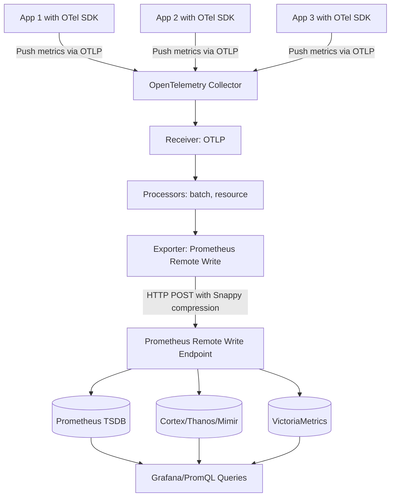

# How to Configure the Prometheus Remote Write Exporter in the OpenTelemetry Collector

Author: [nawazdhandala](https://www.github.com/nawazdhandala)

Tags: OpenTelemetry, Collector, Exporters, Prometheus, Remote Write, Metrics, Observability

Description: A detailed guide to configuring the Prometheus Remote Write exporter in OpenTelemetry Collector for push-based metrics delivery to Prometheus, Cortex, Thanos, Mimir, and VictoriaMetrics with authentication, retry logic, and production patterns.

---

The Prometheus Remote Write exporter enables push-based metrics delivery from the OpenTelemetry Collector to Prometheus-compatible backends. Unlike the standard Prometheus exporter (which requires Prometheus to scrape an HTTP endpoint), this exporter actively pushes metrics using the Prometheus Remote Write protocol.

This push-based approach works with Prometheus itself (if remote write is enabled) and with popular Prometheus-compatible storage systems like Thanos, Cortex, Mimir, VictoriaMetrics, and various managed services (Grafana Cloud, AWS Managed Prometheus, Azure Monitor, etc.).

The remote write exporter is ideal when you want the operational benefits of push-based telemetry (centralized configuration, no scrape discovery, better control over data flow) while maintaining compatibility with the Prometheus ecosystem.

---

## Why Use Prometheus Remote Write?

The Prometheus Remote Write exporter offers several advantages over pull-based scraping:

**Push-based delivery**: The Collector controls when and how metrics are sent, eliminating the need for Prometheus to discover and scrape endpoints.

**Centralized control**: Retry logic, batching, compression, and authentication are handled by the Collector, not individual Prometheus instances.

**Multi-tenant support**: Easily route metrics to different Prometheus instances or tenants using headers and labels.

**Firewall-friendly**: Works in environments where inbound scraping is restricted but outbound connections are allowed.

**Managed service compatibility**: Many cloud providers offer Prometheus-compatible endpoints that only support remote write (AWS Managed Prometheus, Grafana Cloud, etc.).

**Better backpressure handling**: The Collector can queue and buffer metrics during outages rather than losing data between scrape intervals.

---

## Basic Configuration

Here is a minimal Prometheus Remote Write exporter configuration:

```yaml
# receivers configuration (how telemetry enters the Collector)
receivers:
  otlp:
    protocols:
      grpc:        # Accept OTLP over gRPC from instrumented apps
      http:        # Accept OTLP over HTTP from instrumented apps

# exporters configuration (push metrics via remote write)
exporters:
  prometheusremotewrite:
    endpoint: "https://prometheus.example.com/api/v1/write"

# service pipelines (wire receivers to exporters)
service:
  pipelines:
    metrics:
      receivers: [otlp]
      exporters: [prometheusremotewrite]
```

The `endpoint` must point to a Prometheus remote write endpoint. Common endpoint patterns:

- Prometheus: `http://prometheus:9090/api/v1/write`
- Cortex/Mimir: `https://cortex.example.com/api/v1/push`
- Thanos: `https://thanos-receive.example.com/api/v1/receive`
- VictoriaMetrics: `https://victoria.example.com/api/v1/write`
- Grafana Cloud: `https://prometheus-prod-01-eu-west-0.grafana.net/api/prom/push`

---

## Architecture and Data Flow

This diagram shows how metrics flow from applications through the Collector to Prometheus-compatible backends using remote write:



Unlike scraping, the Collector initiates all connections and pushes metrics on its own schedule (controlled by batch processor settings).

---

## Authentication Patterns

Most production Prometheus remote write endpoints require authentication. The exporter supports multiple authentication methods:

### Basic Authentication

Use HTTP Basic Auth with username and password:

```yaml
exporters:
  prometheusremotewrite:
    endpoint: "https://prometheus.example.com/api/v1/write"

    auth:
      authenticator: basicauth

extensions:
  basicauth:
    client_auth:
      username: "${PROMETHEUS_USER}"
      password: "${PROMETHEUS_PASSWORD}"

service:
  extensions: [basicauth]
  pipelines:
    metrics:
      receivers: [otlp]
      exporters: [prometheusremotewrite]
```

Set credentials via environment variables:

```bash
export PROMETHEUS_USER="admin"
export PROMETHEUS_PASSWORD="secret-password"
./otelcol-contrib --config=config.yaml
```

### Bearer Token Authentication

Many managed services use bearer tokens:

```yaml
exporters:
  prometheusremotewrite:
    endpoint: "https://prometheus.example.com/api/v1/write"

    headers:
      authorization: "Bearer ${PROMETHEUS_TOKEN}"
```

### Custom Header Authentication

For services using custom authentication headers:

```yaml
exporters:
  prometheusremotewrite:
    endpoint: "https://prometheus.example.com/api/v1/write"

    headers:
      x-prometheus-remote-write-version: "0.1.0"
      x-api-key: "${API_KEY}"
      x-scope-orgid: "tenant-123"  # Multi-tenant ID (Cortex/Mimir)
```

### Grafana Cloud Configuration

Grafana Cloud requires specific authentication:

```yaml
exporters:
  prometheusremotewrite_grafana:
    endpoint: "https://prometheus-prod-01-eu-west-0.grafana.net/api/prom/push"

    headers:
      authorization: "Bearer ${GRAFANA_CLOUD_API_KEY}"

    # Optional: Add Grafana-specific headers
    external_labels:
      cluster: "production"
      region: "us-west-2"
```

---

## Metric Translation and Labels

The exporter automatically translates OpenTelemetry metrics to Prometheus format and handles label mapping:

### Resource Attributes to Labels

OpenTelemetry resource attributes become Prometheus labels:

```yaml
exporters:
  prometheusremotewrite:
    endpoint: "https://prometheus.example.com/api/v1/write"

    # Control resource attribute conversion
    resource_to_telemetry_conversion:
      enabled: true  # Convert resource attributes to metric labels
```

Example transformation:

```yaml
# OpenTelemetry metric
Resource:
  service.name: payment-api
  deployment.environment: production
  k8s.pod.name: payment-api-7d8f9b-xyz

Metric:
  name: http_requests_total
  value: 1523

# Prometheus metric (after export)
http_requests_total{
  service_name="payment-api",
  deployment_environment="production",
  k8s_pod_name="payment-api-7d8f9b-xyz"
} 1523
```

### External Labels

Add static labels to all metrics for identification:

```yaml
exporters:
  prometheusremotewrite:
    endpoint: "https://prometheus.example.com/api/v1/write"

    # Labels added to every metric
    external_labels:
      cluster: "us-west-2"
      environment: "production"
      collector_id: "${HOSTNAME}"
```

External labels are useful for:
- Multi-cluster deployments (identify which cluster sent the metric)
- Multi-tenant routing (add tenant ID as label)
- Cost allocation (add team or project labels)
- A/B testing (add experiment group labels)

---

## Compression and Performance

The remote write protocol uses Snappy compression by default to reduce bandwidth:

```yaml
exporters:
  prometheusremotewrite:
    endpoint: "https://prometheus.example.com/api/v1/write"

    # Compression is enabled by default (Snappy)
    compression: snappy  # Options: snappy, none

    # Request timeout
    timeout: 30s

    # Maximum number of concurrent remote write requests
    max_concurrent_requests: 10
```

Snappy provides fast compression with low CPU overhead (typically 70-80% size reduction). Only disable compression if you have extremely fast networks and CPU-constrained collectors.

---

## Retry and Queue Configuration

The exporter includes sophisticated retry logic and queuing for handling transient failures:

```yaml
exporters:
  prometheusremotewrite:
    endpoint: "https://prometheus.example.com/api/v1/write"

    # Request timeout
    timeout: 30s

    # Retry configuration for failed requests
    retry_on_failure:
      enabled: true
      initial_interval: 5s      # Wait 5s after first failure
      max_interval: 30s          # Cap backoff at 30s
      max_elapsed_time: 300s     # Give up after 5 minutes

    # Queue configuration for buffering during outages
    sending_queue:
      enabled: true
      num_consumers: 10          # Parallel export workers
      queue_size: 5000           # Buffer up to 5000 batches

      # Persistent queue (survive collector restarts)
      storage: file_storage

# File storage extension for persistent queuing
extensions:
  file_storage:
    directory: /var/lib/otelcol/queue
    timeout: 10s

service:
  extensions: [file_storage]
  pipelines:
    metrics:
      receivers: [otlp]
      exporters: [prometheusremotewrite]
```

The persistent queue ensures metrics are not lost if the Collector crashes or restarts during an outage. Size the queue based on:

- Typical metric volume (metrics per second)
- Expected outage duration tolerance
- Available disk space

Example calculation: If you send 10,000 metrics/sec and want to survive a 5-minute outage:
- 10,000 metrics/sec × 300 seconds = 3,000,000 metrics
- Set `queue_size` to at least 3,000,000

---

## Production-Ready Configuration

Here is a comprehensive production configuration:

```yaml
receivers:
  # Accept metrics from instrumented applications
  otlp:
    protocols:
      grpc:
        endpoint: 0.0.0.0:4317
      http:
        endpoint: 0.0.0.0:4318

processors:
  # Protect Collector from memory exhaustion
  memory_limiter:
    check_interval: 1s
    limit_mib: 512
    spike_limit_mib: 128

  # Add resource attributes for environment context
  resource:
    attributes:
      - key: deployment.environment
        value: production
        action: upsert
      - key: cluster.name
        value: us-west-2-prod
        action: upsert

  # Filter out high-cardinality metrics
  filter/drop_noisy:
    metrics:
      exclude:
        match_type: regexp
        metric_names:
          - ".*\\.user_id"       # Drop user-specific metrics
          - ".*\\.request_id"    # Drop request-specific metrics
          - ".*\\.trace_id"      # Drop trace-specific metrics

  # Batch metrics for efficiency
  batch:
    timeout: 10s
    send_batch_size: 1000
    send_batch_max_size: 1500

exporters:
  # Primary Prometheus remote write endpoint
  prometheusremotewrite:
    endpoint: "https://prometheus.example.com/api/v1/write"

    # Authentication
    headers:
      authorization: "Bearer ${PROMETHEUS_TOKEN}"

    # External labels for identification
    external_labels:
      cluster: "us-west-2-prod"
      environment: "production"
      collector_instance: "${HOSTNAME}"

    # Enable resource attribute conversion
    resource_to_telemetry_conversion:
      enabled: true

    # Performance settings
    timeout: 30s
    max_concurrent_requests: 10
    compression: snappy

    # Retry configuration
    retry_on_failure:
      enabled: true
      initial_interval: 5s
      max_interval: 30s
      max_elapsed_time: 300s

    # Persistent queue for reliability
    sending_queue:
      enabled: true
      num_consumers: 10
      queue_size: 5000
      storage: file_storage

  # Backup endpoint for redundancy (optional)
  prometheusremotewrite/backup:
    endpoint: "https://backup-prometheus.example.com/api/v1/write"
    headers:
      authorization: "Bearer ${BACKUP_TOKEN}"
    external_labels:
      cluster: "us-west-2-prod"
      environment: "production"

# Extensions
extensions:
  # Persistent storage for queues
  file_storage:
    directory: /var/lib/otelcol/queue
    timeout: 10s

  # Health check endpoint
  health_check:
    endpoint: "0.0.0.0:13133"

# Service configuration
service:
  extensions: [file_storage, health_check]

  pipelines:
    metrics:
      receivers: [otlp]
      processors:
        - memory_limiter
        - filter/drop_noisy
        - resource
        - batch
      exporters:
        - prometheusremotewrite
        # - prometheusremotewrite/backup  # Uncomment for dual shipping
```

This configuration provides:

- Memory protection against overload
- High-cardinality metric filtering
- Environment tagging with resource attributes
- Efficient batching to reduce network calls
- Persistent queuing to survive outages
- Retry logic with exponential backoff
- Optional backup endpoint for redundancy

---

## Multi-Tenant Configuration

Route metrics to different Prometheus tenants based on labels:

```yaml
exporters:
  # Tenant A endpoint
  prometheusremotewrite/tenant_a:
    endpoint: "https://prometheus.example.com/api/v1/write"
    headers:
      x-scope-orgid: "tenant-a"  # Cortex/Mimir tenant ID
    external_labels:
      tenant: "tenant-a"

  # Tenant B endpoint
  prometheusremotewrite/tenant_b:
    endpoint: "https://prometheus.example.com/api/v1/write"
    headers:
      x-scope-orgid: "tenant-b"
    external_labels:
      tenant: "tenant-b"

processors:
  # Route metrics to appropriate tenant based on labels
  routing:
    default_exporters: [prometheusremotewrite/tenant_a]
    from_attribute: "tenant.id"  # Route based on this attribute
    table:
      - value: "tenant-a"
        exporters: [prometheusremotewrite/tenant_a]
      - value: "tenant-b"
        exporters: [prometheusremotewrite/tenant_b]

service:
  pipelines:
    metrics:
      receivers: [otlp]
      processors: [routing]
      exporters:
        - prometheusremotewrite/tenant_a
        - prometheusremotewrite/tenant_b
```

---

## AWS Managed Prometheus Configuration

AWS Managed Prometheus (AMP) requires SigV4 signing:

```yaml
exporters:
  prometheusremotewrite:
    endpoint: "https://aps-workspaces.us-west-2.amazonaws.com/workspaces/ws-abc123/api/v1/remote_write"

    # AWS SigV4 authentication
    auth:
      authenticator: sigv4auth

extensions:
  sigv4auth:
    region: "us-west-2"
    service: "aps"  # AWS Managed Prometheus service name

    # Use IAM role credentials (recommended for EKS/EC2)
    # Or explicit credentials (not recommended)
    # access_key: "${AWS_ACCESS_KEY_ID}"
    # secret_key: "${AWS_SECRET_ACCESS_KEY}"

service:
  extensions: [sigv4auth]
  pipelines:
    metrics:
      receivers: [otlp]
      exporters: [prometheusremotewrite]
```

When running on EKS, use IAM Roles for Service Accounts (IRSA):

```yaml
# kubernetes deployment
apiVersion: v1
kind: ServiceAccount
metadata:
  name: otel-collector
  annotations:
    eks.amazonaws.com/role-arn: arn:aws:iam::123456789012:role/OtelCollectorRole
---
apiVersion: apps/v1
kind: Deployment
metadata:
  name: otel-collector
spec:
  template:
    spec:
      serviceAccountName: otel-collector  # Use the service account with IAM role
```

---

## Troubleshooting Common Issues

### 401/403 Authentication Errors

**Problem**: Remote write requests fail with authentication errors.

**Solution**:
- Verify API token is correct and not expired
- Check header name matches backend requirements (case-sensitive)
- Ensure environment variables are set before starting Collector
- Test authentication with curl:

```bash
curl -X POST \
  -H "Authorization: Bearer YOUR_TOKEN" \
  -H "Content-Type: application/x-protobuf" \
  -H "X-Prometheus-Remote-Write-Version: 0.1.0" \
  --data-binary @/dev/null \
  https://prometheus.example.com/api/v1/write
```

### 400 Bad Request Errors

**Problem**: Backend rejects metrics with validation errors.

**Solution**:
- Check for invalid metric names (must match `[a-zA-Z_:][a-zA-Z0-9_:]*`)
- Verify label names are valid (must match `[a-zA-Z_][a-zA-Z0-9_]*`)
- Look for empty label values (not allowed in Prometheus)
- Enable debug logging to see rejected metrics:

```yaml
service:
  telemetry:
    logs:
      level: debug
```

### High Memory Usage

**Problem**: Collector consumes excessive memory.

**Solution**:
- Reduce `queue_size` in sending_queue configuration
- Decrease batch size to send more frequently
- Enable memory_limiter processor with appropriate limits
- Check for metric explosion (too many unique time series)

### Metrics Not Appearing in Prometheus

**Problem**: Remote write succeeds but metrics are missing.

**Solution**:
- Check for metric name conflicts (duplicates get overwritten)
- Verify time range in Prometheus query matches ingestion time
- Look for backend-side metric relabeling or dropping
- Check backend logs for ingestion errors

---

## Monitoring Remote Write Health

Monitor the exporter's performance using its internal metrics:

```promql
# Successful remote write requests
rate(otelcol_exporter_sent_metric_points_total[5m])

# Failed remote write requests
rate(otelcol_exporter_send_failed_metric_points_total[5m])

# Remote write request duration
histogram_quantile(0.99,
  rate(otelcol_exporter_send_latency_bucket[5m])
)

# Queue depth (should stay well below maximum)
otelcol_exporter_queue_size
```

Create alerts for export failures:

```yaml
# prometheus-rules.yml
groups:
  - name: otel-remote-write
    interval: 30s
    rules:
      - alert: RemoteWriteFailures
        expr: |
          rate(otelcol_exporter_send_failed_metric_points_total[5m]) > 0
        for: 5m
        annotations:
          summary: "Remote write failing to export metrics"

      - alert: RemoteWriteQueueFull
        expr: |
          otelcol_exporter_queue_size / otelcol_exporter_queue_capacity > 0.8
        for: 5m
        annotations:
          summary: "Remote write queue is 80% full"
```

---

## Comparison: Remote Write vs Standard Prometheus Exporter

| Feature | Prometheus Exporter | Remote Write Exporter |
|---------|-------------------|---------------------|
| Direction | Pull (Prometheus scrapes) | Push (Collector sends) |
| Configuration | Prometheus scrape configs | Collector exporter config |
| Managed service support | Limited | Excellent |
| Firewall traversal | Requires inbound access | Only outbound needed |
| Backpressure handling | Collector must buffer between scrapes | Collector controls send rate |
| Multi-tenancy | Complex | Simple (headers/labels) |
| Overhead | HTTP server in Collector | HTTP client in Collector |
| Best for | Self-hosted Prometheus | Cloud/managed Prometheus |

See our guide on [configuring the standard Prometheus exporter](https://oneuptime.com/blog/post/2026-02-06-prometheus-exporter-opentelemetry-collector/view) for pull-based scenarios.

---

## Related Resources

- [What is the OpenTelemetry Collector and Why Use One?](https://oneuptime.com/blog/post/2025-09-18-what-is-opentelemetry-collector-and-why-use-one/view)
- [How to Configure the Prometheus Exporter in the OpenTelemetry Collector](https://oneuptime.com/blog/post/2026-02-06-prometheus-exporter-opentelemetry-collector/view)
- [How to Configure the OTLP HTTP Exporter in the OpenTelemetry Collector](https://oneuptime.com/blog/post/2026-02-06-otlp-http-exporter-opentelemetry-collector/view)

---

## Summary

The Prometheus Remote Write exporter brings push-based metrics delivery to the Prometheus ecosystem. Key takeaways:

- Use remote write for cloud/managed Prometheus services
- Authentication is critical (bearer tokens, Basic Auth, SigV4)
- External labels help with multi-cluster and multi-tenant deployments
- Persistent queues prevent data loss during outages
- Retry logic handles transient failures automatically
- Filter high-cardinality metrics before export
- Monitor queue depth and export failures

Remote write is the modern way to integrate OpenTelemetry metrics with Prometheus-compatible backends. It offers better control, reliability, and flexibility compared to pull-based scraping while maintaining full compatibility with the Prometheus query language and ecosystem.

For a fully integrated solution that supports both OpenTelemetry and Prometheus without additional configuration, check out [OneUptime](https://oneuptime.com).
