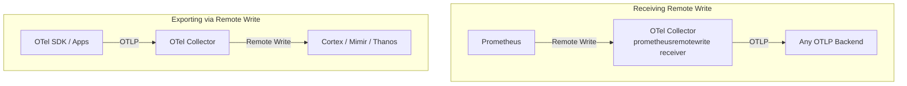

# How to Use Prometheus Remote Write with the OpenTelemetry Collector

Author: [nawazdhandala](https://www.github.com/nawazdhandala)

Tags: OpenTelemetry, Prometheus, Remote Write, Metrics, Collector, Observability

Description: Complete guide to configuring Prometheus remote write with the OpenTelemetry Collector for receiving and exporting metrics in remote write format.

---

Prometheus remote write is a protocol that lets Prometheus push metrics to external systems instead of relying solely on its local time series database. The OpenTelemetry Collector supports this protocol on both sides of the pipeline. It can receive metrics via Prometheus remote write (acting as a remote write endpoint) and it can export metrics using Prometheus remote write (pushing to compatible backends like Cortex, Thanos, or Grafana Mimir).

This two-way support makes the collector a powerful bridge between Prometheus-native infrastructure and OTLP-based observability platforms. This guide covers both directions in detail.

## Understanding Remote Write in Context

In a standard Prometheus setup, Prometheus scrapes targets and stores data locally. Remote write extends this by having Prometheus also push data to one or more remote endpoints. The remote write protocol uses HTTP POST with snappy-compressed Protocol Buffers.

The OpenTelemetry Collector fits into this architecture in two ways.



The first scenario is useful when you have an existing Prometheus server and want to forward its data to a new OTLP-based backend without changing Prometheus itself. The second scenario is useful when you are collecting metrics with OpenTelemetry but want to store them in a Prometheus-compatible long-term storage system.

## Receiving Prometheus Remote Write

The OpenTelemetry Collector can act as a Prometheus remote write endpoint using the `prometheusremotewrite` receiver (available in the contrib distribution). This lets your existing Prometheus servers push metrics to the collector, where they get converted to OTLP and can be routed anywhere.

First, configure Prometheus to send remote write data to the collector.

```yaml
# prometheus.yml - Configure Prometheus to remote write to the OTel Collector
global:
  scrape_interval: 15s

# Send all scraped metrics to the OTel Collector via remote write
remote_write:
  - url: "http://otel-collector:19291/api/v1/push"
    # Queue configuration for reliability
    queue_config:
      capacity: 10000
      max_shards: 50
      min_shards: 1
      max_samples_per_send: 2000
      batch_send_deadline: 5s
      min_backoff: 30ms
      max_backoff: 5s

    # Retry on temporary failures
    metadata_config:
      send: true
      send_interval: 1m

    # Optional: filter which metrics get remote-written
    write_relabel_configs:
      # Only send metrics matching specific names
      - source_labels: [__name__]
        regex: "http_.*|grpc_.*|process_.*"
        action: keep

scrape_configs:
  - job_name: "my-apps"
    static_configs:
      - targets: ["app1:8080", "app2:8080", "app3:8080"]
```

Then configure the collector to receive the remote write data.

```yaml
# otel-collector-config.yaml
receivers:
  # Accept Prometheus remote write data
  prometheusremotewrite:
    # Endpoint where Prometheus sends remote write data
    endpoint: 0.0.0.0:19291

processors:
  # Batch for efficient export
  batch:
    timeout: 15s
    send_batch_size: 2048

  # Add resource attributes for context
  resource:
    attributes:
      - key: source.type
        value: "prometheus-remote-write"
        action: upsert

exporters:
  # Forward as OTLP to your backend
  otlp:
    endpoint: backend.example.com:4317
    tls:
      insecure: false

service:
  pipelines:
    metrics:
      receivers: [prometheusremotewrite]
      processors: [resource, batch]
      exporters: [otlp]
```

With this setup, Prometheus pushes metrics to the collector, which converts them to OTLP and forwards them to your backend. The collector handles the protocol translation transparently.

## Exporting via Prometheus Remote Write

The more common use case is exporting OTLP metrics to a Prometheus-compatible backend using the remote write protocol. This is useful when your applications are instrumented with OpenTelemetry SDKs but your storage layer speaks Prometheus remote write.

```yaml
# otel-collector-config.yaml
receivers:
  # Receive OTLP from instrumented applications
  otlp:
    protocols:
      grpc:
        endpoint: 0.0.0.0:4317
      http:
        endpoint: 0.0.0.0:4318

processors:
  batch:
    timeout: 10s
    send_batch_size: 2048

  memory_limiter:
    check_interval: 1s
    limit_mib: 512
    spike_limit_mib: 128

exporters:
  # Export metrics via Prometheus remote write
  prometheusremotewrite:
    # Remote write endpoint (Cortex, Mimir, Thanos, etc.)
    endpoint: "https://mimir.example.com/api/v1/push"

    # Authentication for the remote write endpoint
    headers:
      Authorization: "Bearer ${REMOTE_WRITE_TOKEN}"
      X-Scope-OrgID: "my-tenant"

    # TLS configuration
    tls:
      insecure: false
      ca_file: /etc/ssl/certs/ca.crt

    # Convert resource attributes to metric labels
    resource_to_telemetry_conversion:
      enabled: true

    # External labels added to all metrics
    external_labels:
      cluster: "production-us-east"
      collector: "otel-gateway"

    # Retry configuration for reliability
    retry_on_failure:
      enabled: true
      initial_interval: 5s
      max_interval: 30s
      max_elapsed_time: 300s

    # Queue for handling backpressure
    sending_queue:
      enabled: true
      num_consumers: 10
      queue_size: 5000

service:
  pipelines:
    metrics:
      receivers: [otlp]
      processors: [memory_limiter, batch]
      exporters: [prometheusremotewrite]
```

The `external_labels` field is important for multi-cluster deployments. These labels get added to every metric and are used by backends like Thanos for deduplication and Cortex/Mimir for tenant identification.

## Multi-Tenant Configuration

When running a shared collector that serves multiple teams or environments, you need to route metrics to different tenants in your remote write backend. The collector can handle this using headers and processing.

```yaml
receivers:
  # Separate OTLP receivers for different teams
  otlp/team-a:
    protocols:
      grpc:
        endpoint: 0.0.0.0:4317

  otlp/team-b:
    protocols:
      grpc:
        endpoint: 0.0.0.0:4318

exporters:
  # Team A writes to their tenant
  prometheusremotewrite/team-a:
    endpoint: "https://mimir.example.com/api/v1/push"
    headers:
      X-Scope-OrgID: "team-a"
    external_labels:
      team: "team-a"
    retry_on_failure:
      enabled: true

  # Team B writes to their tenant
  prometheusremotewrite/team-b:
    endpoint: "https://mimir.example.com/api/v1/push"
    headers:
      X-Scope-OrgID: "team-b"
    external_labels:
      team: "team-b"
    retry_on_failure:
      enabled: true

processors:
  batch/team-a:
    timeout: 10s
    send_batch_size: 1024

  batch/team-b:
    timeout: 10s
    send_batch_size: 1024

service:
  pipelines:
    # Separate pipelines for each team
    metrics/team-a:
      receivers: [otlp/team-a]
      processors: [batch/team-a]
      exporters: [prometheusremotewrite/team-a]

    metrics/team-b:
      receivers: [otlp/team-b]
      processors: [batch/team-b]
      exporters: [prometheusremotewrite/team-b]
```

Each team gets its own receiver, pipeline, and exporter with the appropriate tenant header. This ensures data isolation while sharing the same collector infrastructure.

## Handling OTLP to Remote Write Type Conversions

When the collector converts OTLP metrics to Prometheus remote write format, it applies the inverse of the Prometheus-to-OTLP type mappings. Understanding these conversions helps you predict how metrics will appear in the backend.

OTLP monotonic sums become Prometheus counters with a `_total` suffix. OTLP gauges stay as gauges. OTLP histograms become Prometheus histograms with `_bucket`, `_sum`, and `_count` series. The collector also generates a `target_info` metric that carries the resource attributes as labels, which is useful for joining resource information with metric queries.

You can control some of this behavior in the exporter configuration.

```yaml
exporters:
  prometheusremotewrite:
    endpoint: "https://mimir.example.com/api/v1/push"

    # Add metric type suffixes (_total, _bucket, etc.)
    # Set to false if your backend handles this
    add_metric_suffixes: true

    # Convert resource attributes to labels on every metric
    resource_to_telemetry_conversion:
      enabled: true

    # Create target_info metric for resource discovery
    target_info:
      enabled: true
```

The `target_info` metric is a gauge with value 1 that carries all resource attributes as labels. You can join it with other metrics in PromQL to access resource information.

```promql
# Join target_info with a metric to get the service version
http_requests_total * on(instance, job) group_left(service_version)
  target_info
```

## High Availability with WAL

For production deployments where metric loss is not acceptable, enable the Write-Ahead Log (WAL) on the remote write exporter. The WAL persists metrics to disk before sending, so they survive collector restarts.

```yaml
exporters:
  prometheusremotewrite:
    endpoint: "https://mimir.example.com/api/v1/push"

    # Enable WAL for durability
    wal:
      # Directory for WAL storage
      directory: /var/lib/otel/wal

      # Maximum size of the WAL before truncation
      buffer_size: 300

      # Truncation frequency
      truncate_frequency: 1m

    retry_on_failure:
      enabled: true
      initial_interval: 5s
      max_interval: 30s

    sending_queue:
      enabled: true
      num_consumers: 10
      queue_size: 10000

service:
  pipelines:
    metrics:
      receivers: [otlp]
      processors: [memory_limiter, batch]
      exporters: [prometheusremotewrite]
```

The WAL directory needs to be on persistent storage (not an ephemeral container volume). In Kubernetes, use a PersistentVolumeClaim mounted to the WAL directory.

## Monitoring the Remote Write Pipeline

Remote write introduces network-dependent failure modes that you need to monitor. The collector exposes metrics about the exporter's health.

```yaml
service:
  telemetry:
    metrics:
      level: detailed
      address: 0.0.0.0:8888
    logs:
      level: info

  pipelines:
    metrics:
      receivers: [otlp]
      processors: [batch]
      exporters: [prometheusremotewrite]
```

Key metrics to watch include:

- `otelcol_exporter_sent_metric_points`: Successful exports
- `otelcol_exporter_send_failed_metric_points`: Failed exports
- `otelcol_exporter_queue_size`: Current queue depth
- `otelcol_exporter_queue_capacity`: Total queue capacity

If `send_failed_metric_points` is increasing, check the collector logs for HTTP status codes from the remote write endpoint. A 429 means rate limiting (increase backoff or reduce send rate), a 413 means the payload is too large (reduce batch size), and 5xx errors indicate backend issues.

## Comparing Remote Write with OTLP Export

If your backend supports both OTLP and Prometheus remote write, you might wonder which to use. OTLP is generally the better choice for new deployments because it carries richer metadata, supports all three signal types (metrics, traces, logs) in a single protocol, and is the native format of the collector. Use remote write when your backend only supports Prometheus remote write, when you need compatibility with existing Prometheus remote write infrastructure, or when you are using backends like Cortex or Thanos that were designed around the remote write protocol.

For most teams, the choice comes down to what their backend supports best. Both protocols are reliable and well tested in production.
