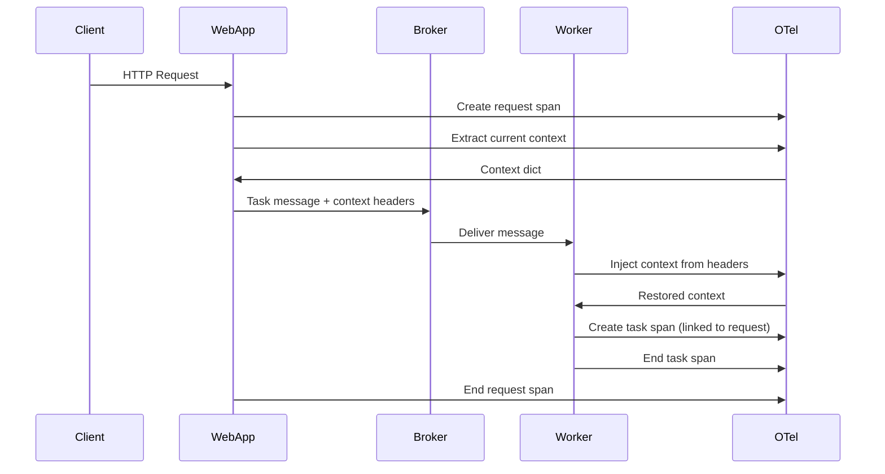
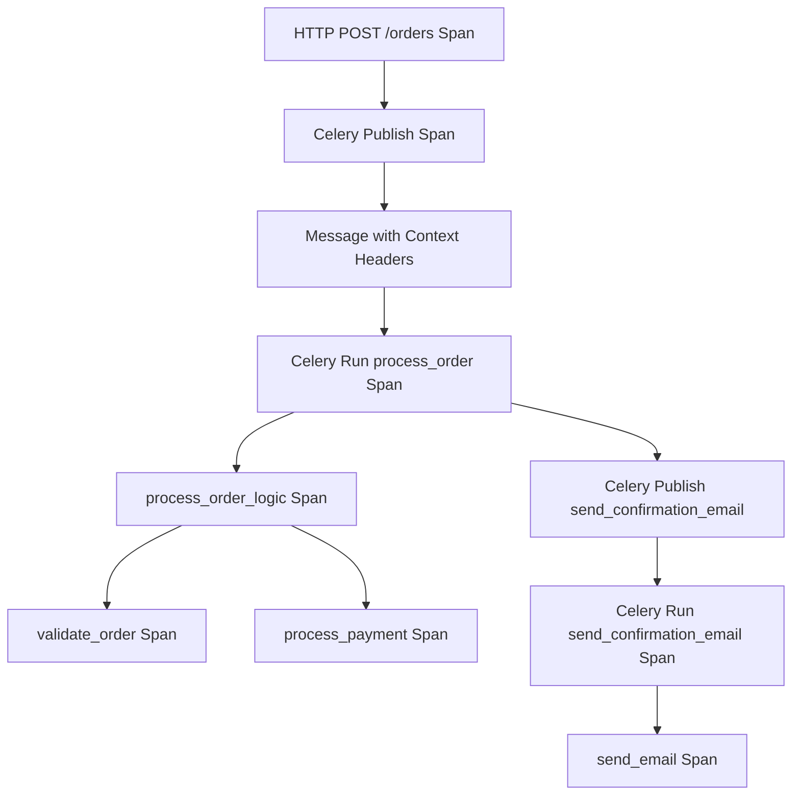

# How to Propagate OpenTelemetry Trace Context Through Celery Message Headers

Author: [nawazdhandala](https://www.github.com/nawazdhandala)

Tags: OpenTelemetry, Celery, Context Propagation, Python, Distributed Tracing, Message Headers

Description: Master the techniques for propagating OpenTelemetry trace context through Celery task queues using message headers to maintain distributed traces across async workers.

When you dispatch a Celery task from a traced request, the trace context needs to travel with the task message. Without proper context propagation, the task execution creates a disconnected trace, making it impossible to correlate the async work back to the original request. The solution involves injecting OpenTelemetry context into Celery message headers and extracting it on the worker side.

Celery's message protocol supports custom headers, which provides the perfect mechanism for carrying trace context. However, you need to handle serialization, ensure context is captured at the right time, and properly restore it when the worker receives the task.

## Understanding Context Propagation

OpenTelemetry uses a context propagation mechanism based on W3C Trace Context specification. The context includes trace ID, span ID, and sampling decisions, which are serialized into headers and transmitted across process boundaries.



## Setting Up OpenTelemetry and Celery

Install the required packages for OpenTelemetry and Celery instrumentation.

```bash
pip install celery \
    redis \
    opentelemetry-api \
    opentelemetry-sdk \
    opentelemetry-instrumentation-celery \
    opentelemetry-exporter-otlp
```

Initialize OpenTelemetry with proper configuration for distributed tracing.

```python
from opentelemetry import trace, context
from opentelemetry.sdk.trace import TracerProvider
from opentelemetry.sdk.trace.export import BatchSpanProcessor
from opentelemetry.exporter.otlp.proto.grpc.trace_exporter import OTLPSpanExporter
from opentelemetry.instrumentation.celery import CeleryInstrumentor
from opentelemetry.propagate import inject, extract
from celery import Celery, Task
from typing import Any, Dict
import json

# Configure tracer provider
provider = TracerProvider()
processor = BatchSpanProcessor(OTLPSpanExporter(
    endpoint="http://localhost:4317",
    insecure=True
))
provider.add_span_processor(processor)
trace.set_tracer_provider(provider)

# Get tracer for manual instrumentation
tracer = trace.get_tracer(__name__)

# Create Celery app
app = Celery('tasks', broker='redis://localhost:6379/0')

# Basic Celery configuration
app.conf.update(
    task_serializer='json',
    accept_content=['json'],
    result_serializer='json',
    timezone='UTC',
    enable_utc=True,
)
```

## Implementing Context Propagation in Task Base Class

Create a custom Celery task base class that automatically handles context propagation through message headers.

```python
from celery import Task
from opentelemetry.trace import SpanKind, Status, StatusCode

class TracedTask(Task):
    """
    Custom Celery Task base class that handles OpenTelemetry context propagation.

    This class automatically:
    - Injects context into task headers when tasks are called
    - Extracts context from headers when tasks execute
    - Creates properly linked spans for task execution
    """

    def apply_async(self, args=None, kwargs=None, task_id=None, producer=None,
                    link=None, link_error=None, shadow=None, **options):
        """
        Override apply_async to inject OpenTelemetry context into headers.
        This method is called when you use .delay() or .apply_async() on a task.
        """
        # Get current OpenTelemetry context
        current_context = context.get_current()

        # Prepare headers dict for context injection
        headers = options.get('headers', {})

        # Inject OpenTelemetry context into headers
        # This adds traceparent, tracestate, and other W3C headers
        inject(headers, context=current_context)

        # Update options with modified headers
        options['headers'] = headers

        # Create a span for the task dispatch
        with tracer.start_as_current_span(
            f"celery.publish.{self.name}",
            kind=SpanKind.PRODUCER
        ) as span:
            span.set_attribute("messaging.system", "celery")
            span.set_attribute("messaging.destination", self.name)
            span.set_attribute("messaging.operation", "publish")

            if task_id:
                span.set_attribute("messaging.message_id", task_id)

            # Call the original apply_async
            return super().apply_async(
                args=args,
                kwargs=kwargs,
                task_id=task_id,
                producer=producer,
                link=link,
                link_error=link_error,
                shadow=shadow,
                **options
            )

    def __call__(self, *args, **kwargs):
        """
        Override __call__ to extract context and create span for task execution.
        This method is called when the worker actually runs the task.
        """
        # Extract context from task request headers
        headers = self.request.headers or {}

        # Extract OpenTelemetry context from headers
        # This restores the trace context from the producer
        extracted_context = extract(headers)

        # Attach the extracted context
        token = context.attach(extracted_context)

        try:
            # Create a span for task execution
            with tracer.start_as_current_span(
                f"celery.run.{self.name}",
                kind=SpanKind.CONSUMER,
                context=extracted_context
            ) as span:
                # Add task metadata to span
                span.set_attribute("messaging.system", "celery")
                span.set_attribute("messaging.operation", "process")
                span.set_attribute("celery.task_name", self.name)
                span.set_attribute("celery.task_id", self.request.id)

                if self.request.retries:
                    span.set_attribute("celery.retry_count", self.request.retries)

                # Add arguments info (be careful with sensitive data)
                span.set_attribute("celery.args_count", len(args))
                span.set_attribute("celery.kwargs_count", len(kwargs))

                try:
                    # Execute the actual task
                    result = super().__call__(*args, **kwargs)
                    span.set_status(Status(StatusCode.OK))
                    return result

                except Exception as e:
                    # Record exception in span
                    span.record_exception(e)
                    span.set_status(Status(StatusCode.ERROR, str(e)))
                    raise

        finally:
            # Detach context
            context.detach(token)
```

## Creating Traced Tasks

With the TracedTask base class, create tasks that automatically propagate context.

```python
@app.task(base=TracedTask, bind=True)
def process_order(self, order_id: str, user_id: str):
    """
    Process an order with automatic trace context propagation.
    The bind=True parameter gives access to self (the task instance).
    """
    with tracer.start_as_current_span("process_order_logic") as span:
        span.set_attribute("order.id", order_id)
        span.set_attribute("user.id", user_id)

        # Simulate order validation
        with tracer.start_as_current_span("validate_order") as validation_span:
            validation_span.set_attribute("validation.step", "inventory_check")
            # Your validation logic
            import time
            time.sleep(0.5)

        # Simulate payment processing
        with tracer.start_as_current_span("process_payment") as payment_span:
            payment_span.set_attribute("payment.gateway", "stripe")
            time.sleep(1)

        # Trigger another task (context is automatically propagated)
        send_confirmation_email.delay(order_id, user_id)

        return {"status": "completed", "order_id": order_id}


@app.task(base=TracedTask, bind=True)
def send_confirmation_email(self, order_id: str, user_id: str):
    """
    Send order confirmation email.
    This task is called from process_order and maintains the trace.
    """
    with tracer.start_as_current_span("send_email") as span:
        span.set_attribute("email.type", "order_confirmation")
        span.set_attribute("order.id", order_id)
        span.set_attribute("user.id", user_id)

        # Simulate email sending
        import time
        time.sleep(0.3)

        span.set_attribute("email.sent", True)
        return True
```

## Integrating with Web Frameworks

When tasks are triggered from web requests, proper context propagation ensures end-to-end traces.

```python
from fastapi import FastAPI, BackgroundTasks
from opentelemetry.instrumentation.fastapi import FastAPIInstrumentor

# Create FastAPI app
web_app = FastAPI()
FastAPIInstrumentor.instrument_app(web_app)


@web_app.post("/orders")
async def create_order(order_data: dict):
    """
    Create an order endpoint that triggers Celery tasks.
    OpenTelemetry context is automatically propagated from the request to Celery.
    """
    # Current span is automatically created by FastAPI instrumentation
    current_span = trace.get_current_span()
    current_span.set_attribute("order.type", order_data.get("type"))

    # Extract order details
    order_id = order_data.get("order_id")
    user_id = order_data.get("user_id")

    # Dispatch Celery task
    # Context is automatically injected into headers by TracedTask
    task = process_order.delay(order_id, user_id)

    current_span.set_attribute("celery.task_id", task.id)

    return {
        "status": "accepted",
        "order_id": order_id,
        "task_id": task.id
    }


@web_app.get("/orders/{order_id}/status")
async def get_order_status(order_id: str):
    """
    Check order status by querying a Celery task.
    """
    with tracer.start_as_current_span("check_order_status") as span:
        span.set_attribute("order.id", order_id)

        # Trigger a query task
        result = query_order_status.delay(order_id)

        # Wait for result (in production, you'd use a different pattern)
        status = result.get(timeout=5)

        return {"order_id": order_id, "status": status}


@app.task(base=TracedTask, bind=True)
def query_order_status(self, order_id: str):
    """Query the current status of an order."""
    with tracer.start_as_current_span("database_query") as span:
        span.set_attribute("db.system", "postgresql")
        span.set_attribute("db.operation", "SELECT")
        span.set_attribute("order.id", order_id)

        # Simulate database query
        import time
        time.sleep(0.2)

        return "processing"
```

## Handling Task Chains and Groups

Celery supports complex task workflows like chains and groups. Context propagation must work through these patterns.

```python
from celery import chain, group, chord

@app.task(base=TracedTask, bind=True)
def fetch_data(self, source: str):
    """Fetch data from a source."""
    with tracer.start_as_current_span("fetch_from_source") as span:
        span.set_attribute("data.source", source)
        import time
        time.sleep(0.5)
        return {"source": source, "data": f"data_from_{source}"}


@app.task(base=TracedTask, bind=True)
def transform_data(self, data: dict):
    """Transform fetched data."""
    with tracer.start_as_current_span("transform") as span:
        span.set_attribute("data.source", data.get("source"))
        import time
        time.sleep(0.3)
        return {"transformed": True, **data}


@app.task(base=TracedTask, bind=True)
def aggregate_results(self, results: list):
    """Aggregate results from multiple sources."""
    with tracer.start_as_current_span("aggregate") as span:
        span.set_attribute("results.count", len(results))
        import time
        time.sleep(0.2)
        return {"aggregated": results, "total": len(results)}


@web_app.post("/data/pipeline")
async def run_data_pipeline():
    """
    Run a complex Celery pipeline with chains and chords.
    Context propagates through the entire workflow.
    """
    with tracer.start_as_current_span("initiate_pipeline") as span:
        # Create a chain: fetch -> transform for each source
        workflow = chord([
            chain(fetch_data.s(source), transform_data.s())
            for source in ["api", "database", "cache"]
        ])(aggregate_results.s())

        span.set_attribute("workflow.id", workflow.id)

        return {"status": "pipeline_started", "workflow_id": workflow.id}
```

## Manual Context Injection for Advanced Cases

Sometimes you need manual control over context propagation, such as when using different serializers or custom message formats.

```python
from opentelemetry.propagate import inject, extract
from typing import Dict, Any

def inject_context_into_headers(headers: Dict[str, Any]) -> Dict[str, Any]:
    """
    Manually inject OpenTelemetry context into a headers dict.
    Useful when you need explicit control over context propagation.
    """
    current_context = context.get_current()
    inject(headers, context=current_context)
    return headers


def extract_context_from_headers(headers: Dict[str, Any]) -> context.Context:
    """
    Manually extract OpenTelemetry context from headers.
    Returns a context object that can be attached.
    """
    return extract(headers)


@app.task(bind=True)
def legacy_task_with_manual_context(self):
    """
    Task that manually extracts and uses context.
    Useful for tasks that don't use TracedTask base class.
    """
    # Manually extract context
    headers = self.request.headers or {}
    extracted_context = extract_context_from_headers(headers)

    # Attach context
    token = context.attach(extracted_context)

    try:
        with tracer.start_as_current_span(
            "legacy_task_execution",
            context=extracted_context
        ) as span:
            span.set_attribute("task.type", "legacy")
            # Your task logic
            return "completed"

    finally:
        context.detach(token)


def trigger_legacy_task():
    """Trigger legacy task with manual context injection."""
    # Prepare headers with context
    headers = {}
    inject_context_into_headers(headers)

    # Send task with headers
    legacy_task_with_manual_context.apply_async(headers=headers)
```

## Debugging Context Propagation

When context propagation isn't working, you need tools to debug what's happening.

```python
import logging

logger = logging.getLogger(__name__)


def log_context_state(location: str):
    """
    Log the current OpenTelemetry context state.
    Useful for debugging context propagation issues.
    """
    current_context = context.get_current()
    current_span = trace.get_current_span()

    span_context = current_span.get_span_context()

    logger.info(f"Context at {location}:")
    logger.info(f"  Trace ID: {format(span_context.trace_id, '032x')}")
    logger.info(f"  Span ID: {format(span_context.span_id, '016x')}")
    logger.info(f"  Is valid: {span_context.is_valid}")
    logger.info(f"  Is remote: {span_context.is_remote}")


@app.task(base=TracedTask, bind=True)
def debug_task(self, test_data: str):
    """Task that logs context information for debugging."""
    log_context_state("task_start")

    with tracer.start_as_current_span("debug_operation") as span:
        span.set_attribute("test.data", test_data)
        log_context_state("inside_span")

    log_context_state("task_end")
    return "debug_complete"


@web_app.post("/debug/trace")
async def debug_trace_endpoint():
    """Endpoint to test context propagation."""
    log_context_state("request_handler")

    task = debug_task.delay("test_value")

    return {"task_id": task.id}
```

## Handling Context with Result Backends

When tasks return results, you might want to include trace information in the result for later correlation.

```python
@app.task(base=TracedTask, bind=True)
def task_with_trace_info(self, data: str):
    """
    Task that includes trace information in its result.
    Useful for correlating task results with traces.
    """
    with tracer.start_as_current_span("task_execution") as span:
        # Get current trace information
        span_context = span.get_span_context()

        # Your task logic
        result = process_data(data)

        # Return result with trace information
        return {
            "result": result,
            "trace_id": format(span_context.trace_id, '032x'),
            "span_id": format(span_context.span_id, '016x'),
            "task_id": self.request.id
        }


def process_data(data: str) -> str:
    """Simulate data processing."""
    import time
    time.sleep(0.5)
    return f"processed_{data}"


@web_app.post("/task/with-trace")
async def run_task_with_trace():
    """Run task and get result with trace information."""
    task = task_with_trace_info.delay("sample_data")

    # In production, don't block like this
    result = task.get(timeout=5)

    return result
```

## Visualizing Celery Traces

With proper context propagation, your traces show the complete request-to-task flow.



## Best Practices

Always use a custom task base class for context propagation. This ensures consistent behavior across all tasks and reduces the chance of forgetting to propagate context.

Inject context during task dispatch, not in the task itself. The context must be captured when apply_async is called, while the original context is still active.

Extract context at the beginning of task execution. Attach the extracted context before any spans are created to ensure proper parent-child relationships.

Test context propagation in your CI pipeline. Create tests that verify trace IDs match between the caller and the task.

Be careful with task serialization. If you customize the serializer, ensure it preserves headers where context is stored.

Monitor for orphaned spans. If tasks are creating spans that don't link back to requests, your context propagation isn't working correctly.

## Conclusion

Propagating OpenTelemetry trace context through Celery message headers creates end-to-end distributed traces across your async task infrastructure. By injecting context into headers during task dispatch and extracting it during execution, you maintain trace relationships across process boundaries. The custom task base class approach makes this automatic and reliable, ensuring all your Celery tasks are properly traced and correlated with the requests that triggered them.
