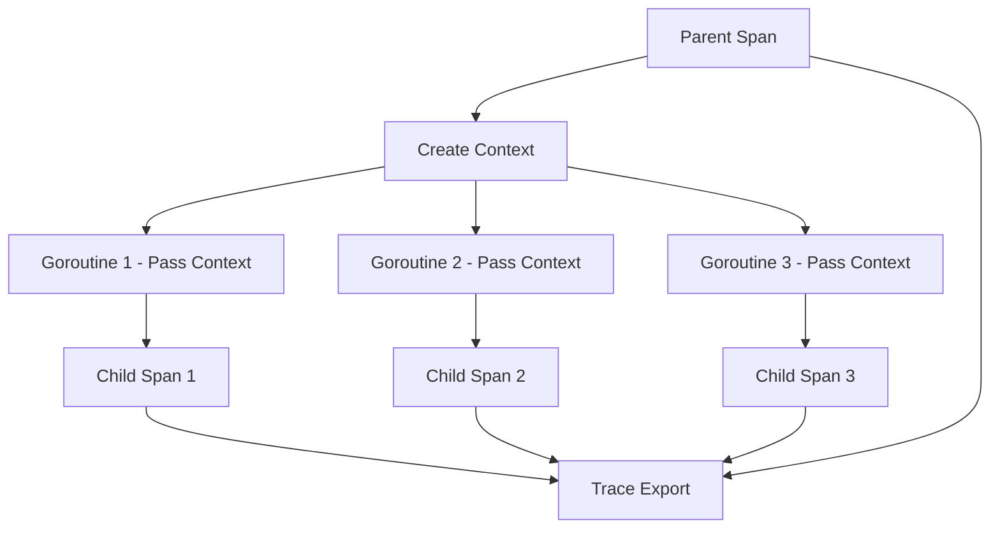

# How to Propagate OpenTelemetry Trace Context Across Go Goroutines

Author: [nawazdhandala](https://www.github.com/nawazdhandala)

Tags: OpenTelemetry, Go, Goroutines, Context Propagation, Concurrency

Description: Master context propagation patterns in Go concurrent programs to maintain trace continuity across goroutines, worker pools, and asynchronous operations.

Go's concurrency model makes it trivial to spawn goroutines for parallel processing, background work, and asynchronous operations. However, this concurrency introduces a critical challenge for distributed tracing: when you launch a goroutine, you create an independent execution context that doesn't automatically inherit the parent's trace information.

Without proper context propagation, traces fragment into disconnected pieces. You lose the ability to see how concurrent operations relate to their parent request, making it impossible to understand the full picture of request processing. A web request that spawns five goroutines for parallel database queries appears as six separate traces instead of one cohesive operation.

## Understanding Context in Go

Go's context package serves as the carrier for trace information. When you create a span with OpenTelemetry, it embeds trace IDs and span IDs into the context. This context must explicitly pass to any goroutines that should participate in the same trace.

The challenge stems from Go's design: goroutines are independent. When you write `go func()`, you create a new stack with its own local variables. If you don't explicitly pass the context into that goroutine, the trace information stays with the parent.

## Setting Up for Examples

Install OpenTelemetry and create a basic tracer configuration for the examples.

```go
package main

import (
    "context"
    "log"
    "time"

    "go.opentelemetry.io/otel"
    "go.opentelemetry.io/otel/exporters/stdout/stdouttrace"
    "go.opentelemetry.io/otel/sdk/resource"
    sdktrace "go.opentelemetry.io/otel/sdk/trace"
    semconv "go.opentelemetry.io/otel/semconv/v1.17.0"
)

func initTracer() (*sdktrace.TracerProvider, error) {
    exporter, err := stdouttrace.New(stdouttrace.WithPrettyPrint())
    if err != nil {
        return nil, err
    }

    tp := sdktrace.NewTracerProvider(
        sdktrace.WithBatcher(exporter),
        sdktrace.WithResource(resource.NewWithAttributes(
            semconv.SchemaURL,
            semconv.ServiceName("goroutine-tracing"),
        )),
    )

    otel.SetTracerProvider(tp)
    return tp, nil
}

func main() {
    tp, err := initTracer()
    if err != nil {
        log.Fatal(err)
    }
    defer func() {
        ctx, cancel := context.WithTimeout(context.Background(), 5*time.Second)
        defer cancel()
        tp.Shutdown(ctx)
    }()

    // Example usage will go here
}
```

This setup creates a tracer provider that outputs traces to stdout for visibility.

## Wrong Way: Losing Context

First, understand what happens when you don't propagate context properly.

```go
package main

import (
    "context"
    "time"

    "go.opentelemetry.io/otel"
    "go.opentelemetry.io/otel/attribute"
)

// WRONG: This goroutine loses trace context
func wrongContextPropagation(ctx context.Context) {
    tracer := otel.Tracer("examples")

    // Create parent span
    ctx, parentSpan := tracer.Start(ctx, "parent-operation")
    defer parentSpan.End()

    // Launch goroutine WITHOUT passing context
    go func() {
        // This creates a NEW trace, disconnected from parent
        _, childSpan := tracer.Start(context.Background(), "child-operation")
        defer childSpan.End()

        time.Sleep(50 * time.Millisecond)
        // This span has no relationship to parent
    }()

    parentSpan.SetAttributes(attribute.String("problem", "child span is orphaned"))
    time.Sleep(100 * time.Millisecond)
}
```

This code creates two separate traces because the goroutine uses `context.Background()` instead of the parent's context. The child span appears as an independent trace with no connection to the parent operation.

## Correct Way: Explicit Context Passing

Always pass context explicitly to goroutines that should participate in the trace.

```go
package main

import (
    "context"
    "time"

    "go.opentelemetry.io/otel"
    "go.opentelemetry.io/otel/attribute"
)

// CORRECT: Explicitly pass context to goroutine
func correctContextPropagation(ctx context.Context) {
    tracer := otel.Tracer("examples")

    // Create parent span
    ctx, parentSpan := tracer.Start(ctx, "parent-operation")
    defer parentSpan.End()

    // Pass context to goroutine
    go func(ctx context.Context) {
        // Create child span using parent's context
        _, childSpan := tracer.Start(ctx, "child-operation")
        defer childSpan.End()

        childSpan.SetAttributes(attribute.String("worker", "goroutine-1"))
        time.Sleep(50 * time.Millisecond)
        // This span correctly appears as child of parent
    }(ctx)

    parentSpan.SetAttributes(attribute.String("pattern", "explicit-context-passing"))
    time.Sleep(100 * time.Millisecond)
}
```

The goroutine receives context as a parameter, ensuring the child span links to the parent span. The trace shows the parent-child relationship correctly.

## Pattern: Parallel Workers with WaitGroup

When spawning multiple goroutines for parallel processing, propagate context to each worker.

```go
package main

import (
    "context"
    "fmt"
    "sync"
    "time"

    "go.opentelemetry.io/otel"
    "go.opentelemetry.io/otel/attribute"
)

func parallelProcessing(ctx context.Context, items []string) {
    tracer := otel.Tracer("examples")

    // Create parent span for the entire operation
    ctx, span := tracer.Start(ctx, "parallel-processing")
    defer span.End()

    span.SetAttributes(attribute.Int("items.count", len(items)))

    var wg sync.WaitGroup

    // Launch worker for each item
    for i, item := range items {
        wg.Add(1)

        // Pass context to each worker
        go func(ctx context.Context, index int, data string) {
            defer wg.Done()

            // Create child span for this worker
            _, workerSpan := tracer.Start(ctx, "process-item")
            defer workerSpan.End()

            workerSpan.SetAttributes(
                attribute.Int("worker.index", index),
                attribute.String("item.data", data),
            )

            // Simulate processing
            time.Sleep(time.Duration(50+index*10) * time.Millisecond)

            workerSpan.SetAttributes(attribute.String("result", "processed"))
        }(ctx, i, item)
    }

    // Wait for all workers to complete
    wg.Wait()

    span.SetAttributes(attribute.String("status", "all workers completed"))
}
```

Each worker goroutine receives the parent context and creates its own child span. The resulting trace shows all workers as children of the parent operation, making it easy to see parallel execution timing.

## Pattern: Worker Pool with Channels

Worker pools present a more complex context propagation challenge because work items flow through channels.

```go
package main

import (
    "context"
    "fmt"
    "sync"

    "go.opentelemetry.io/otel"
    "go.opentelemetry.io/otel/attribute"
)

// WorkItem carries both data and trace context
type WorkItem struct {
    Ctx  context.Context
    Data string
    ID   int
}

func workerPoolExample(ctx context.Context, numWorkers int) {
    tracer := otel.Tracer("examples")

    ctx, span := tracer.Start(ctx, "worker-pool")
    defer span.End()

    span.SetAttributes(attribute.Int("pool.size", numWorkers))

    // Create channel for work items
    workChan := make(chan WorkItem, 100)

    // Start worker pool
    var wg sync.WaitGroup
    for i := 0; i < numWorkers; i++ {
        wg.Add(1)
        go worker(i, workChan, &wg)
    }

    // Submit work items with context
    for i := 0; i < 10; i++ {
        // Create a span for queueing the work
        itemCtx, queueSpan := tracer.Start(ctx, "queue-work-item")
        queueSpan.SetAttributes(attribute.Int("item.id", i))

        // Send work item with its context through channel
        workChan <- WorkItem{
            Ctx:  itemCtx,
            Data: fmt.Sprintf("task-%d", i),
            ID:   i,
        }

        queueSpan.End()
    }

    close(workChan)
    wg.Wait()

    span.SetAttributes(attribute.String("status", "all work completed"))
}

func worker(id int, workChan <-chan WorkItem, wg *sync.WaitGroup) {
    defer wg.Done()

    tracer := otel.Tracer("examples")

    for item := range workChan {
        // Use context from work item to maintain trace
        _, workSpan := tracer.Start(item.Ctx, "process-work-item")

        workSpan.SetAttributes(
            attribute.Int("worker.id", id),
            attribute.Int("item.id", item.ID),
            attribute.String("item.data", item.Data),
        )

        // Simulate work
        time.Sleep(100 * time.Millisecond)

        workSpan.End()
    }
}
```

The key insight: wrap both the work data and its context in a struct that flows through the channel. Workers extract the context to create properly linked spans.

## Pattern: Fire and Forget with Detached Context

Sometimes you launch goroutines for background work that shouldn't block the parent operation. However, you still want these operations in the trace.

```go
package main

import (
    "context"
    "time"

    "go.opentelemetry.io/otel"
    "go.opentelemetry.io/otel/attribute"
    "go.opentelemetry.io/otel/trace"
)

func fireAndForgetExample(ctx context.Context) {
    tracer := otel.Tracer("examples")

    ctx, span := tracer.Start(ctx, "main-operation")
    defer span.End()

    // Launch background task without waiting
    go backgroundTask(ctx)

    // Continue with main work
    time.Sleep(50 * time.Millisecond)

    span.SetAttributes(attribute.String("pattern", "fire-and-forget"))
}

func backgroundTask(parentCtx context.Context) {
    tracer := otel.Tracer("examples")

    // Detach from parent context to prevent cancellation propagation
    // but keep trace information
    ctx := trace.ContextWithSpan(
        context.Background(),
        trace.SpanFromContext(parentCtx),
    )

    // Create span using trace from parent but independent context
    _, span := tracer.Start(ctx, "background-cleanup")
    defer span.End()

    span.SetAttributes(attribute.String("type", "background"))

    // Simulate background work
    time.Sleep(200 * time.Millisecond)

    span.SetAttributes(attribute.String("status", "completed"))
}
```

This pattern creates a new context that won't be cancelled when the parent completes, but maintains the trace relationship by copying the span information.

## Pattern: Fan-Out Fan-In

The fan-out fan-in pattern distributes work across multiple goroutines and collects results. Proper context propagation shows how work flows through the system.

```go
package main

import (
    "context"
    "fmt"
    "sync"

    "go.opentelemetry.io/otel"
    "go.opentelemetry.io/otel/attribute"
)

func fanOutFanIn(ctx context.Context, inputs []int) []int {
    tracer := otel.Tracer("examples")

    ctx, span := tracer.Start(ctx, "fan-out-fan-in")
    defer span.End()

    resultChan := make(chan int, len(inputs))
    var wg sync.WaitGroup

    // Fan-out: spawn goroutine for each input
    _, fanOutSpan := tracer.Start(ctx, "fan-out")
    for _, input := range inputs {
        wg.Add(1)
        go func(ctx context.Context, val int) {
            defer wg.Done()

            _, processSpan := tracer.Start(ctx, "process-value")
            processSpan.SetAttributes(attribute.Int("input", val))

            // Simulate processing
            result := val * 2
            time.Sleep(50 * time.Millisecond)

            resultChan <- result
            processSpan.SetAttributes(attribute.Int("result", result))
            processSpan.End()
        }(ctx, input)
    }
    fanOutSpan.End()

    // Wait for all goroutines in separate goroutine
    go func() {
        wg.Wait()
        close(resultChan)
    }()

    // Fan-in: collect results
    _, fanInSpan := tracer.Start(ctx, "fan-in")
    var results []int
    for result := range resultChan {
        results = append(results, result)
    }
    fanInSpan.SetAttributes(attribute.Int("results.count", len(results)))
    fanInSpan.End()

    span.SetAttributes(attribute.Int("total.results", len(results)))

    return results
}
```

This trace clearly shows the fan-out phase where work distributes across goroutines, the processing phase where each goroutine works independently, and the fan-in phase where results collect.

## Pattern: Pipeline Stages

Pipeline processing passes data through multiple stages, each potentially running concurrently. Context must flow through the pipeline to maintain trace continuity.

```go
package main

import (
    "context"
    "fmt"

    "go.opentelemetry.io/otel"
    "go.opentelemetry.io/otel/attribute"
)

type PipelineItem struct {
    Ctx   context.Context
    Value int
}

func pipelineExample(ctx context.Context, inputs []int) []int {
    tracer := otel.Tracer("examples")

    ctx, span := tracer.Start(ctx, "pipeline")
    defer span.End()

    // Stage 1: Input
    stage1 := make(chan PipelineItem, len(inputs))
    go func() {
        defer close(stage1)
        for _, input := range inputs {
            itemCtx, itemSpan := tracer.Start(ctx, "stage1-input")
            itemSpan.SetAttributes(attribute.Int("value", input))
            stage1 <- PipelineItem{Ctx: itemCtx, Value: input}
            itemSpan.End()
        }
    }()

    // Stage 2: Transform
    stage2 := make(chan PipelineItem, len(inputs))
    go func() {
        defer close(stage2)
        for item := range stage1 {
            _, transformSpan := tracer.Start(item.Ctx, "stage2-transform")
            transformed := item.Value * 2
            transformSpan.SetAttributes(
                attribute.Int("input", item.Value),
                attribute.Int("output", transformed),
            )
            stage2 <- PipelineItem{Ctx: item.Ctx, Value: transformed}
            transformSpan.End()
        }
    }()

    // Stage 3: Filter
    stage3 := make(chan PipelineItem, len(inputs))
    go func() {
        defer close(stage3)
        for item := range stage2 {
            _, filterSpan := tracer.Start(item.Ctx, "stage3-filter")
            if item.Value > 10 {
                filterSpan.SetAttributes(
                    attribute.Int("value", item.Value),
                    attribute.Bool("passed", true),
                )
                stage3 <- item
            } else {
                filterSpan.SetAttributes(
                    attribute.Int("value", item.Value),
                    attribute.Bool("passed", false),
                )
            }
            filterSpan.End()
        }
    }()

    // Collect results
    var results []int
    for item := range stage3 {
        results = append(results, item.Value)
    }

    span.SetAttributes(
        attribute.Int("input.count", len(inputs)),
        attribute.Int("output.count", len(results)),
    )

    return results
}
```

Each pipeline stage receives items that carry their context, creating a trace showing data flow through all stages.

## Context Propagation Visualization

Understanding how context flows through concurrent operations:



The parent span's context propagates to each goroutine, which creates child spans that link back to the parent in the final trace.

## Common Pitfalls and Solutions

Avoid these common mistakes when propagating context across goroutines.

```go
package main

import (
    "context"
    "sync"

    "go.opentelemetry.io/otel"
)

// PITFALL 1: Using loop variable directly
func pitfallLoopVariable(ctx context.Context, items []string) {
    tracer := otel.Tracer("examples")
    ctx, span := tracer.Start(ctx, "loop-pitfall")
    defer span.End()

    for _, item := range items {
        // WRONG: 'item' variable is reused in each iteration
        go func(ctx context.Context) {
            _, span := tracer.Start(ctx, "process")
            // All goroutines see the last value of 'item'
            span.SetAttributes(attribute.String("item", item))
            span.End()
        }(ctx)
    }
}

// SOLUTION: Pass loop variable as parameter
func solutionLoopVariable(ctx context.Context, items []string) {
    tracer := otel.Tracer("examples")
    ctx, span := tracer.Start(ctx, "loop-correct")
    defer span.End()

    for _, item := range items {
        // CORRECT: Pass item as parameter
        go func(ctx context.Context, data string) {
            _, span := tracer.Start(ctx, "process")
            span.SetAttributes(attribute.String("item", data))
            span.End()
        }(ctx, item)
    }
}

// PITFALL 2: Not waiting for goroutines
func pitfallNotWaiting(ctx context.Context) {
    tracer := otel.Tracer("examples")
    ctx, span := tracer.Start(ctx, "no-wait")
    defer span.End()

    // WRONG: Function may return before goroutines complete
    for i := 0; i < 5; i++ {
        go func(ctx context.Context, id int) {
            _, span := tracer.Start(ctx, "worker")
            time.Sleep(100 * time.Millisecond)
            span.End()
        }(ctx, i)
    }
    // Spans may not be recorded because program exits
}

// SOLUTION: Use WaitGroup
func solutionWaitGroup(ctx context.Context) {
    tracer := otel.Tracer("examples")
    ctx, span := tracer.Start(ctx, "with-wait")
    defer span.End()

    var wg sync.WaitGroup

    for i := 0; i < 5; i++ {
        wg.Add(1)
        go func(ctx context.Context, id int) {
            defer wg.Done()
            _, span := tracer.Start(ctx, "worker")
            time.Sleep(100 * time.Millisecond)
            span.End()
        }(ctx, i)
    }

    wg.Wait() // Ensures all spans complete before parent ends
}
```

These patterns prevent race conditions and ensure traces capture complete information.

## Testing Context Propagation

Verify your context propagation works correctly with tests.

```go
package main

import (
    "context"
    "sync"
    "testing"

    "go.opentelemetry.io/otel"
    "go.opentelemetry.io/otel/sdk/trace"
    "go.opentelemetry.io/otel/sdk/trace/tracetest"
)

func TestContextPropagation(t *testing.T) {
    // Setup in-memory span recorder
    sr := tracetest.NewSpanRecorder()
    tp := trace.NewTracerProvider(trace.WithSpanProcessor(sr))
    otel.SetTracerProvider(tp)

    tracer := otel.Tracer("test")
    ctx := context.Background()

    // Create parent span
    ctx, parentSpan := tracer.Start(ctx, "parent")

    var wg sync.WaitGroup
    wg.Add(2)

    // Launch goroutines with context
    go func(ctx context.Context) {
        defer wg.Done()
        _, span := tracer.Start(ctx, "child-1")
        span.End()
    }(ctx)

    go func(ctx context.Context) {
        defer wg.Done()
        _, span := tracer.Start(ctx, "child-2")
        span.End()
    }(ctx)

    wg.Wait()
    parentSpan.End()

    // Verify spans were created
    spans := sr.Ended()
    if len(spans) != 3 {
        t.Fatalf("Expected 3 spans, got %d", len(spans))
    }

    // Verify parent-child relationships
    parentSpanID := spans[2].SpanContext().SpanID()
    for i := 0; i < 2; i++ {
        if spans[i].Parent().SpanID() != parentSpanID {
            t.Errorf("Span %d is not child of parent", i)
        }
    }
}
```

This test verifies that child spans correctly link to their parent span through context propagation.

Context propagation in concurrent Go programs requires discipline but provides immense value. By explicitly passing context to every goroutine that should participate in a trace, you maintain visibility into parallel operations, worker pools, pipelines, and background tasks. The resulting traces show not just individual operations but how concurrent work contributes to overall request processing, enabling you to identify bottlenecks, optimize parallelism, and debug issues in complex concurrent systems.
