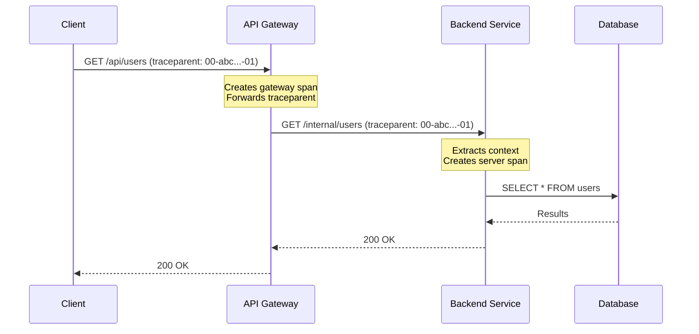

# How to Propagate Trace Context Through API Gateways

Author: [nawazdhandala](https://www.github.com/nawazdhandala)

Tags: OpenTelemetry, API Gateway, Context Propagation, Distributed Tracing, Nginx, Kong, AWS API Gateway, Envoy

Description: Learn how to configure API gateways like Nginx, Kong, AWS API Gateway, and Envoy to propagate OpenTelemetry trace context to backend services.

---

API gateways sit at the front door of your infrastructure. Every external request passes through them before reaching your backend services. This makes them both critically important for observability and a common source of broken distributed traces. If your gateway does not forward trace context headers, every backend service starts a new trace, and you lose the connection between the client request and the work that happens downstream.

The challenge is that most API gateways are not configured to propagate trace context by default. Some actively strip unknown headers. Others require explicit configuration to pass headers through. And some gateways can participate in tracing themselves, adding their own spans to the trace. Getting this right is essential for end-to-end visibility.

## The Role of the Gateway in a Trace

In a properly instrumented system, the API gateway should do two things: forward incoming trace context to backend services, and optionally create its own span representing the time spent in the gateway. Here is what the flow looks like:



The trace ID (`abc...` in this example) stays the same from client to gateway to backend to database. If the gateway drops the `traceparent` header, the backend creates a brand new trace ID, and you have two disconnected traces instead of one.

## Nginx: Header Forwarding Configuration

Nginx is one of the most widely used reverse proxies and API gateways. By default, Nginx does forward most headers to upstream servers, but there are configurations and edge cases that can prevent this.

The basic configuration to ensure trace context headers pass through:

```nginx
# nginx.conf - Ensure trace context headers are forwarded
http {
    upstream backend {
        server backend-service:8080;
    }

    server {
        listen 80;

        location /api/ {
            # Explicitly forward W3C Trace Context headers
            proxy_pass http://backend;

            # These are forwarded by default, but being explicit is safer
            proxy_set_header traceparent $http_traceparent;
            proxy_set_header tracestate $http_tracestate;

            # Also forward B3 headers if your services use them
            proxy_set_header X-B3-TraceId $http_x_b3_traceid;
            proxy_set_header X-B3-SpanId $http_x_b3_spanid;
            proxy_set_header X-B3-ParentSpanId $http_x_b3_parentspanid;
            proxy_set_header X-B3-Sampled $http_x_b3_sampled;

            # Forward baggage for context propagation
            proxy_set_header baggage $http_baggage;

            # Standard proxy headers
            proxy_set_header Host $host;
            proxy_set_header X-Real-IP $remote_addr;
            proxy_set_header X-Forwarded-For $proxy_add_x_forwarded_for;
        }
    }
}
```

The `proxy_set_header` directives map incoming request headers to upstream request headers. The `$http_` prefix accesses the value of any incoming request header (with the header name lowercased and hyphens replaced by underscores).

If you want Nginx to generate its own trace context when none is provided by the client, you can use the OpenTelemetry module for Nginx:

```nginx
# nginx.conf - With OpenTelemetry module for active tracing
load_module modules/ngx_http_opentelemetry_module.so;

http {
    # Configure the OpenTelemetry module
    opentelemetry_config /etc/nginx/otel-config.toml;

    # Enable tracing for all locations
    opentelemetry on;

    # Set the service name for spans generated by Nginx
    opentelemetry_service_name "api-gateway";

    upstream backend {
        server backend-service:8080;
    }

    server {
        listen 80;

        location /api/ {
            proxy_pass http://backend;

            # The OTel module automatically injects traceparent
            # and creates a span for each proxied request

            # Add custom attributes to the gateway span
            opentelemetry_attribute "gateway.route" "/api/";
        }
    }
}
```

The OpenTelemetry Nginx module does three things: it extracts incoming trace context, creates a span for the gateway processing, and injects the updated trace context (with the gateway's span as the parent) into the upstream request.

## Kong: Plugin-Based Propagation

Kong has built-in support for distributed tracing through its plugin system. The OpenTelemetry plugin handles both span creation and context propagation:

```yaml
# kong.yml - Declarative configuration with OpenTelemetry plugin
_format_version: "3.0"

services:
  - name: user-service
    url: http://backend-service:8080
    routes:
      - name: user-route
        paths:
          - /api/users

plugins:
  # Enable OpenTelemetry globally for all services
  - name: opentelemetry
    config:
      # OTLP endpoint for exporting spans
      endpoint: "http://otel-collector:4318/v1/traces"

      # Resource attributes for spans generated by Kong
      resource_attributes:
        service.name: "api-gateway"
        deployment.environment: "production"

      # Header type determines propagation format
      # w3c is the default and recommended option
      header_type: "w3c"

      # Sampling rate (1.0 = 100%)
      sampling_rate: 1.0
```

Kong's OpenTelemetry plugin handles everything automatically. It extracts trace context from incoming requests, creates spans for each proxied request, and injects the updated context into upstream requests. The `header_type` setting controls which propagation format is used.

If you only need header forwarding without Kong generating its own spans, you can use the `request-transformer` plugin to explicitly pass headers:

```yaml
# kong.yml - Simple header forwarding without tracing
plugins:
  - name: request-transformer
    config:
      add:
        headers:
          # Forward trace context headers as-is
          - "traceparent:$(headers.traceparent)"
          - "tracestate:$(headers.tracestate)"
```

## AWS API Gateway: Custom Integration Configuration

AWS API Gateway does not natively understand W3C Trace Context, but it has its own tracing integration through AWS X-Ray. If your backend services use OpenTelemetry, you have two options.

The first option is to enable X-Ray tracing on the API Gateway and configure your backend services to accept both X-Ray and W3C formats:

```python
# backend_service.py - Accept both X-Ray and W3C trace context
from opentelemetry.propagate import set_global_textmap
from opentelemetry.propagators.composite import CompositePropagator
from opentelemetry.trace.propagation import TraceContextTextMapPropagator
from opentelemetry.propagators.aws import AwsXRayPropagator

# Configure composite propagator to handle both formats
set_global_textmap(
    CompositePropagator([
        TraceContextTextMapPropagator(),  # W3C format from direct callers
        AwsXRayPropagator(),              # X-Ray format from API Gateway
    ])
)
```

The second option is to use HTTP API (v2) with a Lambda integration or HTTP integration that passes all headers through. HTTP APIs forward all headers by default, which means `traceparent` and `tracestate` will reach your backend:

```yaml
# serverless.yml - AWS HTTP API that forwards all headers
service: my-api

provider:
  name: aws
  runtime: python3.11

functions:
  users:
    handler: handler.get_users
    events:
      - httpApi:
          path: /api/users
          method: get
          # HTTP API v2 forwards all headers by default
          # No additional configuration needed for traceparent
```

For REST APIs (v1), you need to explicitly map headers in the integration request:

```json
{
  "requestParameters": {
    "integration.request.header.traceparent": "method.request.header.traceparent",
    "integration.request.header.tracestate": "method.request.header.tracestate"
  }
}
```

## Envoy Proxy: Native OpenTelemetry Support

Envoy has first-class support for distributed tracing and can propagate multiple trace context formats simultaneously:

```yaml
# envoy.yaml - Envoy configuration with OpenTelemetry tracing
static_resources:
  listeners:
    - name: listener_0
      address:
        socket_address:
          address: 0.0.0.0
          port_value: 8080
      filter_chains:
        - filters:
            - name: envoy.filters.network.http_connection_manager
              typed_config:
                "@type": type.googleapis.com/envoy.extensions.filters.network.http_connection_manager.v3.HttpConnectionManager
                stat_prefix: ingress_http

                # Configure tracing
                tracing:
                  # Use OpenTelemetry as the tracing provider
                  provider:
                    name: envoy.tracers.opentelemetry
                    typed_config:
                      "@type": type.googleapis.com/envoy.config.trace.v3.OpenTelemetryConfig
                      grpc_service:
                        envoy_grpc:
                          cluster_name: otel_collector
                      service_name: api-gateway

                route_config:
                  name: local_route
                  virtual_hosts:
                    - name: backend
                      domains: ["*"]
                      routes:
                        - match:
                            prefix: "/api/"
                          route:
                            cluster: backend_service

                          # Decorator adds operation name to the trace
                          decorator:
                            operation: "gateway-route:/api/"

  clusters:
    - name: backend_service
      connect_timeout: 5s
      type: STRICT_DNS
      load_assignment:
        cluster_name: backend_service
        endpoints:
          - lb_endpoints:
              - endpoint:
                  address:
                    socket_address:
                      address: backend-service
                      port_value: 8080

    - name: otel_collector
      connect_timeout: 5s
      type: STRICT_DNS
      typed_extension_protocol_options:
        envoy.extensions.upstreams.http.v3.HttpProtocolOptions:
          "@type": type.googleapis.com/envoy.extensions.upstreams.http.v3.HttpProtocolOptions
          explicit_http_config:
            http2_protocol_options: {}
      load_assignment:
        cluster_name: otel_collector
        endpoints:
          - lb_endpoints:
              - endpoint:
                  address:
                    socket_address:
                      address: otel-collector
                      port_value: 4317
```

Envoy automatically extracts incoming trace context, creates spans for each request, and propagates the updated context to upstream clusters. It supports W3C Trace Context, B3, and several other formats out of the box.

## Handling the "No Incoming Context" Case

When a request arrives at your gateway without any trace context (which is common for external client requests), you need to decide what happens. There are three approaches:

**Approach 1: Let the gateway generate context.** If your gateway has an OpenTelemetry integration (like the Nginx module or Kong plugin), it will create a new trace and propagate that to backends. This is the recommended approach.

**Approach 2: Let the first backend generate context.** If your gateway is just a pass-through, the first instrumented backend service will create a new trace. The downside is that you lose visibility into gateway processing time.

**Approach 3: Use a pre-gateway sidecar.** Deploy a lightweight proxy or middleware before the gateway that generates trace context for requests that do not have one:

```python
# context_initializer_middleware.py
from opentelemetry import trace
from opentelemetry.propagate import inject

tracer = trace.get_tracer("context-initializer")

class TraceContextInitializer:
    """WSGI middleware that ensures every request has trace context."""

    def __init__(self, app):
        self.app = app

    def __call__(self, environ, start_response):
        # Check if traceparent is already present
        traceparent = environ.get("HTTP_TRACEPARENT")

        if not traceparent:
            # No incoming context - create a new root span
            with tracer.start_as_current_span(
                "gateway-entry",
                kind=trace.SpanKind.SERVER
            ):
                # The instrumentation will now inject the new context
                return self.app(environ, start_response)
        else:
            # Context exists - let it pass through
            return self.app(environ, start_response)
```

## Testing Gateway Propagation

After configuring your gateway, verify propagation is working with a simple end-to-end test:

```bash
#!/bin/bash
# test_gateway_propagation.sh

# Generate a known trace ID for testing
TRACE_ID="aaaabbbbccccddddaaaabbbbccccdddd"
SPAN_ID="1111222233334444"
TRACEPARENT="00-${TRACE_ID}-${SPAN_ID}-01"

echo "Sending request with traceparent: $TRACEPARENT"

# Send a request through the gateway with a known traceparent
RESPONSE=$(curl -s -D - \
  -H "traceparent: $TRACEPARENT" \
  http://gateway:8080/api/debug/propagation)

echo "Response: $RESPONSE"

# If your backend has a propagation debug endpoint, check the trace ID
# The trace_id in the response should match aaaabbbbccccddddaaaabbbbccccdddd
```

If the trace ID in your backend's response matches the one you sent, propagation is working end to end through the gateway.

## Common Gateway Pitfalls

A few things to watch out for when configuring gateway propagation.

**Header case sensitivity.** HTTP/1.1 headers are case-insensitive, but some gateways normalize them to lowercase or uppercase. Make sure your backend framework handles both `traceparent` and `Traceparent`.

**Header size limits.** Some gateways impose limits on header sizes. Trace context headers are small (under 200 bytes typically), but if you are also propagating baggage with lots of key-value pairs, you might hit limits.

**Multiple gateway hops.** If your request passes through multiple gateways or proxies, each one needs to forward the headers. A single misconfigured proxy in the chain breaks the entire trace.

**gRPC vs HTTP.** If your gateway translates between gRPC and HTTP (or vice versa), make sure the trace context is translated along with the protocol. gRPC uses metadata instead of headers, and the key names might differ.

## Wrapping Up

API gateways are the most common point where distributed traces break. The fix depends on which gateway you are using, but the principle is the same everywhere: make sure `traceparent` and `tracestate` headers flow from the incoming request to the upstream request without being dropped. For gateways that support OpenTelemetry natively (Kong, Envoy, Nginx with the OTel module), enable the tracing integration to get gateway spans as a bonus. For gateways that do not have native support, configure explicit header forwarding to at least maintain the trace chain.
