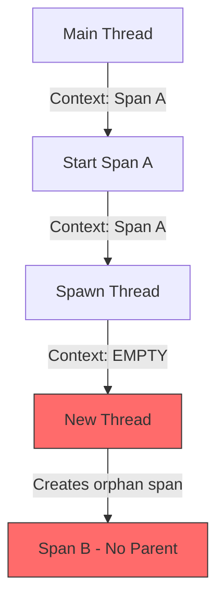

# How to Propagate Trace Context Across Async Boundaries (Threads, Promises)

Author: [nawazdhandala](https://www.github.com/nawazdhandala)

Tags: OpenTelemetry, Distributed Tracing, Context Propagation, Async, Threads, Promises, Concurrency

Description: Learn how to maintain OpenTelemetry trace context across async boundaries like threads, promises, and coroutines to avoid broken traces.

---

One of the most frustrating things about working with OpenTelemetry is when your traces break for no obvious reason. Everything looks right. You have the SDK configured. You are creating spans. But the spans show up as disconnected root spans instead of forming a proper trace tree. Nine times out of ten, the problem is that you crossed an async boundary and the trace context did not come with you.

This happens because OpenTelemetry stores the current span in a context object that is tied to the current execution flow. When you spawn a new thread, schedule work on a thread pool, or create a promise that resolves later, that context does not automatically transfer. Understanding how and why this happens is the first step to fixing it.

## How Context Storage Works

OpenTelemetry uses a concept called context to store the active span and other propagation data. In most languages, this context is stored in thread-local storage (or its equivalent). When you call `tracer.start_as_current_span()`, the new span is attached to the current context. Any child spans created in the same execution flow will automatically become children of that span.

The problem shows up when execution moves to a different flow:



The main thread has Span A in its context. When you spawn a new thread, the new thread gets a fresh, empty context. Any spans created in that thread have no parent and become root spans.

## Python: Threads and ThreadPoolExecutor

Python's threading module does not propagate context by default. Here is the broken version first, so you can see the problem clearly:

```python
# broken_threading.py - Context is lost when spawning threads
import threading
from opentelemetry import trace

tracer = trace.get_tracer(__name__)

def background_task():
    # This span has NO parent because the thread has empty context
    with tracer.start_as_current_span("background-work") as span:
        print(f"Parent: {span.parent}")  # Prints None
        do_work()

def handle_request():
    with tracer.start_as_current_span("handle-request"):
        # Spawning a thread loses the trace context
        t = threading.Thread(target=background_task)
        t.start()
        t.join()
```

The fix is to capture the context before spawning the thread and pass it explicitly:

```python
# fixed_threading.py - Manually propagate context to threads
import threading
from opentelemetry import trace, context

tracer = trace.get_tracer(__name__)

def background_task(ctx):
    # Attach the captured context to this thread
    token = context.attach(ctx)
    try:
        # Now this span correctly becomes a child of handle-request
        with tracer.start_as_current_span("background-work") as span:
            print(f"Parent: {span.parent}")  # Prints the parent span context
            do_work()
    finally:
        # Always detach to clean up
        context.detach(token)

def handle_request():
    with tracer.start_as_current_span("handle-request"):
        # Capture the current context before spawning
        ctx = context.get_current()
        t = threading.Thread(target=background_task, args=(ctx,))
        t.start()
        t.join()
```

The key operations are `context.get_current()` to snapshot the context and `context.attach()` to activate it in the new thread. Always call `context.detach()` in a finally block to prevent context leaks.

For `ThreadPoolExecutor`, the pattern is similar but you can wrap it more cleanly with a decorator:

```python
# threadpool_propagation.py
from concurrent.futures import ThreadPoolExecutor
from opentelemetry import trace, context
from functools import wraps

tracer = trace.get_tracer(__name__)

def propagate_context(func):
    """Decorator that captures and propagates trace context to threads."""
    @wraps(func)
    def wrapper(*args, **kwargs):
        # Capture context at submission time, not execution time
        ctx = context.get_current()

        def contextualized():
            token = context.attach(ctx)
            try:
                return func(*args, **kwargs)
            finally:
                context.detach(token)

        return contextualized
    return wrapper

def handle_request():
    with tracer.start_as_current_span("handle-request"):
        executor = ThreadPoolExecutor(max_workers=4)

        # Wrap the task function to propagate context
        @propagate_context
        def process_item(item_id):
            with tracer.start_as_current_span(f"process-{item_id}"):
                return do_processing(item_id)

        # Submit wrapped tasks - context propagates automatically
        futures = [executor.submit(process_item(), i) for i in range(10)]
        results = [f.result() for f in futures]
```

The decorator snapshots the context at the moment the task is submitted, not when it eventually runs on the thread pool. This distinction matters because the thread pool might execute the task much later, after the original context has changed.

## JavaScript/TypeScript: Promises and Async/Await

Node.js uses a different mechanism than thread-local storage. It relies on `AsyncLocalStorage` (or the older `async_hooks` API) to track context across async boundaries. The OpenTelemetry Node.js SDK sets this up for you through the `AsyncHooksContextManager` or the newer `AsyncLocalStorageContextManager`.

Most of the time, if you have configured your SDK correctly, context propagation through promises and async/await just works:

```typescript
// working_async.ts - Context flows through async/await automatically
import { trace } from "@opentelemetry/api";

const tracer = trace.getTracer("my-service");

async function fetchUserData(userId: string) {
    // This span is automatically a child of the calling span
    return tracer.startActiveSpan("fetch-user-data", async (span) => {
        try {
            const user = await database.findUser(userId);
            span.setAttribute("user.found", !!user);
            return user;
        } finally {
            span.end();
        }
    });
}

async function handleRequest(req: Request) {
    return tracer.startActiveSpan("handle-request", async (parentSpan) => {
        try {
            // Context propagates through await - this works fine
            const user = await fetchUserData(req.params.userId);
            const orders = await fetchOrders(user.id);
            return { user, orders };
        } finally {
            parentSpan.end();
        }
    });
}
```

The trouble starts when you do things that break out of the normal async chain. Event emitters, manual callbacks, and `setTimeout` can all cause problems:

```typescript
// broken_eventemitter.ts - Context lost through event emitters
import { trace, context } from "@opentelemetry/api";
import { EventEmitter } from "events";

const tracer = trace.getTracer("my-service");
const emitter = new EventEmitter();

// This listener loses context because the event is emitted
// from a different async scope
emitter.on("data-ready", (data) => {
    // This span might be orphaned depending on when the event fires
    tracer.startActiveSpan("process-data", (span) => {
        processData(data);
        span.end();
    });
});

function handleRequest() {
    tracer.startActiveSpan("handle-request", (span) => {
        // The event fires later, possibly outside this context
        fetchData().then((data) => {
            emitter.emit("data-ready", data);
        });
        span.end();
    });
}
```

The fix is to bind the context explicitly when setting up listeners or passing callbacks:

```typescript
// fixed_eventemitter.ts - Explicitly propagate context through events
import { trace, context } from "@opentelemetry/api";
import { EventEmitter } from "events";

const tracer = trace.getTracer("my-service");
const emitter = new EventEmitter();

function handleRequest() {
    tracer.startActiveSpan("handle-request", (span) => {
        // Capture the active context
        const currentContext = context.active();

        // Bind the listener to the captured context
        const boundListener = context.bind(currentContext, (data: any) => {
            tracer.startActiveSpan("process-data", (processSpan) => {
                processData(data);
                processSpan.end();
            });
        });

        emitter.on("data-ready", boundListener);

        fetchData().then((data) => {
            emitter.emit("data-ready", data);
        });

        span.end();
    });
}
```

The `context.bind()` call wraps the callback so that whenever it executes, it runs within the captured context. This is the Node.js equivalent of the Python `context.attach()` pattern.

## Go: Goroutines and Context

Go actually has the cleanest story here because context propagation is already a core part of the language through `context.Context`. OpenTelemetry for Go stores spans in the standard `context.Context`, so you just need to pass the context to your goroutines:

```go
// goroutine_tracing.go
package main

import (
    "context"
    "go.opentelemetry.io/otel"
)

var tracer = otel.Tracer("my-service")

func handleRequest(ctx context.Context) {
    // Start a parent span
    ctx, parentSpan := tracer.Start(ctx, "handle-request")
    defer parentSpan.End()

    // Pass ctx to the goroutine - this is all you need
    go func(ctx context.Context) {
        // This span correctly becomes a child of handle-request
        ctx, childSpan := tracer.Start(ctx, "background-work")
        defer childSpan.End()

        doWork(ctx)
    }(ctx)  // Pass the context as a parameter, do not close over it
}
```

The common mistake in Go is closing over the context variable instead of passing it as a parameter. If the parent function modifies `ctx` after spawning the goroutine (for example, by starting another span), the goroutine might see the wrong context.

## Java: CompletableFuture and Virtual Threads

Java has a particularly tricky situation because `CompletableFuture` runs callbacks on the common ForkJoinPool by default. OpenTelemetry's Java agent handles a lot of this automatically, but if you are using manual instrumentation, you need to wrap your executors:

```java
// TracedExecutor.java
import io.opentelemetry.api.trace.Span;
import io.opentelemetry.api.trace.Tracer;
import io.opentelemetry.context.Context;

public class OrderService {
    private final Tracer tracer;

    public CompletableFuture<Order> processOrder(String orderId) {
        Span parentSpan = tracer.spanBuilder("process-order").startSpan();

        // Capture the context with the parent span
        Context parentContext = Context.current().with(parentSpan);

        return CompletableFuture.supplyAsync(() -> {
            // Make the captured context current in this thread
            try (var scope = parentContext.makeCurrent()) {
                // Child span now has the correct parent
                Span childSpan = tracer.spanBuilder("fetch-order-details")
                    .startSpan();
                try {
                    return fetchOrderDetails(orderId);
                } finally {
                    childSpan.end();
                }
            }
        }).whenComplete((result, error) -> {
            if (error != null) {
                parentSpan.recordException(error);
            }
            parentSpan.end();
        });
    }
}
```

The `Context.current().with(parentSpan)` captures the context, and `parentContext.makeCurrent()` activates it in the executor thread. The try-with-resources ensures cleanup.

## Common Pitfalls to Watch For

There are a few patterns that consistently cause context propagation failures across all languages.

First, watch out for connection pools and long-lived objects that cache context. If you store a context reference in a connection pool object, it will go stale as soon as the original request completes.

Second, be careful with fire-and-forget patterns. If you spawn async work and do not wait for it, make sure you are passing context explicitly rather than relying on ambient context.

Third, timer-based callbacks (cron jobs, scheduled tasks, retry loops) always need explicit context handling because there is no parent request context to inherit from.

## Wrapping Up

Context propagation across async boundaries boils down to one principle: whenever execution moves to a new thread, goroutine, or async scope, you need to explicitly carry the context with you. The specifics vary by language. Python uses `context.attach/detach`, JavaScript uses `context.bind`, Go passes `context.Context` as a parameter, and Java uses `Context.makeCurrent()`. But the underlying pattern is always the same: capture the context before the boundary, and restore it on the other side.
