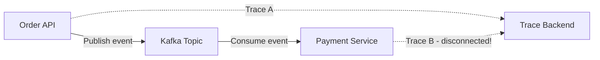
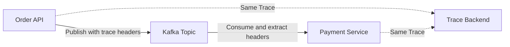
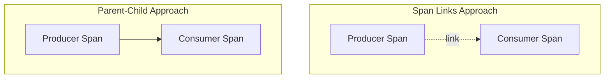

# How to Propagate Trace Context Across Kafka Producers and Consumers

Author: [nawazdhandala](https://www.github.com/nawazdhandala)

Tags: OpenTelemetry, Kafka, Distributed Tracing, Context Propagation, Messaging, Observability

Description: Learn how to propagate OpenTelemetry trace context through Kafka message headers to maintain end-to-end distributed traces across asynchronous messaging boundaries.

---

Distributed tracing works beautifully for synchronous HTTP calls. A request comes in, you make some downstream calls, and the trace context flows through headers at each hop. But the moment you introduce Kafka into the picture, things get complicated. A producer sends a message and moves on. Minutes or hours later, a consumer picks it up and processes it. How do you connect those two operations into a single trace?

The answer is trace context propagation through Kafka message headers. OpenTelemetry provides the tools to inject trace context when producing messages and extract it when consuming them. This lets you build traces that span the async boundary, showing you the complete journey from the initial request through the message queue and into the consumer's processing logic.

## The Problem with Async Boundaries

In a typical microservices architecture with Kafka, a request might trigger a chain like this: an API receives an order, validates it, publishes an event to Kafka, and a separate service picks up that event to process payment. Without trace context propagation, you'd see two disconnected traces - one for the API and one for the payment processor. You'd have no way to correlate them.



With proper context propagation, the consumer's trace becomes a continuation of the producer's trace, and you get a single, connected view.



## How Context Propagation Works in Kafka

Kafka messages have a headers field - a collection of key-value pairs that travel with the message payload. OpenTelemetry uses these headers to carry trace context, the same way it uses HTTP headers for synchronous calls. The producer injects the `traceparent` and `tracestate` values into the message headers, and the consumer extracts them to recreate the span context.

The key difference from HTTP propagation is the span relationship. In HTTP, the downstream service creates a child span. In messaging, the consumer typically creates a "link" to the producer's span rather than a direct parent-child relationship. This is because the consumer might process the message long after the producer's trace has finished, and nesting it as a child span would create a misleadingly long trace duration. That said, you can choose either approach depending on your use case.

## Java Producer with OpenTelemetry

Let's start with a Java Kafka producer that injects trace context into messages. We'll use the OpenTelemetry Java SDK with the Kafka instrumentation library.

First, add the necessary dependencies to your project.

```xml
<!-- pom.xml - Dependencies for Kafka OpenTelemetry instrumentation -->
<dependencies>
    <!-- OpenTelemetry API and SDK -->
    <dependency>
        <groupId>io.opentelemetry</groupId>
        <artifactId>opentelemetry-api</artifactId>
        <version>1.36.0</version>
    </dependency>
    <dependency>
        <groupId>io.opentelemetry</groupId>
        <artifactId>opentelemetry-sdk</artifactId>
        <version>1.36.0</version>
    </dependency>

    <!-- Kafka client -->
    <dependency>
        <groupId>org.apache.kafka</groupId>
        <artifactId>kafka-clients</artifactId>
        <version>3.7.0</version>
    </dependency>

    <!-- OpenTelemetry Kafka instrumentation -->
    <dependency>
        <groupId>io.opentelemetry.instrumentation</groupId>
        <artifactId>opentelemetry-kafka-clients-2.6</artifactId>
        <version>2.2.0-alpha</version>
    </dependency>

    <!-- OTLP exporter for sending traces -->
    <dependency>
        <groupId>io.opentelemetry</groupId>
        <artifactId>opentelemetry-exporter-otlp</artifactId>
        <version>1.36.0</version>
    </dependency>
</dependencies>
```

Now here's the producer code. The OpenTelemetry Kafka instrumentation wraps the standard KafkaProducer and handles context injection automatically.

```java
// TracedKafkaProducer.java
import io.opentelemetry.api.OpenTelemetry;
import io.opentelemetry.api.trace.Span;
import io.opentelemetry.api.trace.Tracer;
import io.opentelemetry.context.Scope;
import io.opentelemetry.instrumentation.kafkaclients.v2_6.KafkaTelemetry;
import org.apache.kafka.clients.producer.*;
import org.apache.kafka.common.serialization.StringSerializer;

import java.util.Properties;

public class TracedKafkaProducer {

    private final Producer<String, String> producer;
    private final Tracer tracer;

    public TracedKafkaProducer(OpenTelemetry openTelemetry) {
        this.tracer = openTelemetry.getTracer("order-service", "1.0.0");

        // Configure the base Kafka producer
        Properties props = new Properties();
        props.put(ProducerConfig.BOOTSTRAP_SERVERS_CONFIG, "kafka:9092");
        props.put(ProducerConfig.KEY_SERIALIZER_CLASS_CONFIG, StringSerializer.class);
        props.put(ProducerConfig.VALUE_SERIALIZER_CLASS_CONFIG, StringSerializer.class);

        // Create the base producer
        KafkaProducer<String, String> baseProducer = new KafkaProducer<>(props);

        // Wrap it with OpenTelemetry instrumentation
        // This automatically injects trace context into message headers
        KafkaTelemetry kafkaTelemetry = KafkaTelemetry.create(openTelemetry);
        this.producer = kafkaTelemetry.wrap(baseProducer);
    }

    public void publishOrderEvent(String orderId, String orderJson) {
        // Create a span for the publish operation
        Span span = tracer.spanBuilder("publish-order-event")
            .setAttribute("messaging.system", "kafka")
            .setAttribute("messaging.destination.name", "order-events")
            .setAttribute("messaging.operation", "publish")
            .setAttribute("order.id", orderId)
            .startSpan();

        // Make this span the current span so the producer picks up the context
        try (Scope scope = span.makeCurrent()) {
            ProducerRecord<String, String> record = new ProducerRecord<>(
                "order-events",  // topic
                orderId,         // key
                orderJson        // value
            );

            // Send the message - trace context is automatically injected into headers
            producer.send(record, (metadata, exception) -> {
                if (exception != null) {
                    span.recordException(exception);
                    span.setStatus(io.opentelemetry.api.trace.StatusCode.ERROR);
                } else {
                    span.setAttribute("messaging.kafka.partition", metadata.partition());
                    span.setAttribute("messaging.kafka.offset", metadata.offset());
                }
                span.end();
            });
        }
    }
}
```

## Java Consumer with Context Extraction

On the consumer side, the instrumented wrapper extracts the trace context from message headers and creates spans that link back to the producer's trace.

```java
// TracedKafkaConsumer.java
import io.opentelemetry.api.OpenTelemetry;
import io.opentelemetry.api.trace.Span;
import io.opentelemetry.api.trace.Tracer;
import io.opentelemetry.context.Scope;
import io.opentelemetry.instrumentation.kafkaclients.v2_6.KafkaTelemetry;
import org.apache.kafka.clients.consumer.*;
import org.apache.kafka.common.serialization.StringDeserializer;

import java.time.Duration;
import java.util.Collections;
import java.util.Properties;

public class TracedKafkaConsumer {

    private final Consumer<String, String> consumer;
    private final Tracer tracer;

    public TracedKafkaConsumer(OpenTelemetry openTelemetry) {
        this.tracer = openTelemetry.getTracer("payment-service", "1.0.0");

        // Configure the base Kafka consumer
        Properties props = new Properties();
        props.put(ConsumerConfig.BOOTSTRAP_SERVERS_CONFIG, "kafka:9092");
        props.put(ConsumerConfig.GROUP_ID_CONFIG, "payment-processors");
        props.put(ConsumerConfig.KEY_DESERIALIZER_CLASS_CONFIG, StringDeserializer.class);
        props.put(ConsumerConfig.VALUE_DESERIALIZER_CLASS_CONFIG, StringDeserializer.class);
        props.put(ConsumerConfig.AUTO_OFFSET_RESET_CONFIG, "earliest");

        // Create the base consumer
        KafkaConsumer<String, String> baseConsumer = new KafkaConsumer<>(props);

        // Wrap with OpenTelemetry instrumentation
        // This extracts trace context from message headers automatically
        KafkaTelemetry kafkaTelemetry = KafkaTelemetry.create(openTelemetry);
        this.consumer = kafkaTelemetry.wrap(baseConsumer);
    }

    public void startConsuming() {
        consumer.subscribe(Collections.singletonList("order-events"));

        while (true) {
            // Poll for records - each record will have trace context extracted
            ConsumerRecords<String, String> records = consumer.poll(Duration.ofMillis(1000));

            for (ConsumerRecord<String, String> record : records) {
                // The instrumentation creates a span linked to the producer's span
                // We create a processing span as a child of that
                Span processSpan = tracer.spanBuilder("process-order-payment")
                    .setAttribute("messaging.system", "kafka")
                    .setAttribute("messaging.destination.name", record.topic())
                    .setAttribute("messaging.operation", "process")
                    .setAttribute("messaging.kafka.partition", record.partition())
                    .setAttribute("messaging.kafka.offset", record.offset())
                    .startSpan();

                try (Scope scope = processSpan.makeCurrent()) {
                    // Process the order payment
                    processPayment(record.value());
                    processSpan.setStatus(io.opentelemetry.api.trace.StatusCode.OK);
                } catch (Exception e) {
                    processSpan.recordException(e);
                    processSpan.setStatus(io.opentelemetry.api.trace.StatusCode.ERROR);
                } finally {
                    processSpan.end();
                }
            }
        }
    }

    private void processPayment(String orderJson) {
        // Your payment processing logic here
    }
}
```

## Python Implementation

If your services are written in Python, the approach is similar. The `opentelemetry-instrumentation-kafka-python` package provides automatic instrumentation for the `kafka-python` library.

Install the required packages first.

```bash
# Install OpenTelemetry SDK and Kafka instrumentation for Python
pip install opentelemetry-api \
    opentelemetry-sdk \
    opentelemetry-exporter-otlp \
    opentelemetry-instrumentation-kafka-python \
    kafka-python
```

Here's a Python producer that injects trace context into Kafka messages.

```python
# traced_producer.py
from opentelemetry import trace
from opentelemetry.sdk.trace import TracerProvider
from opentelemetry.sdk.trace.export import BatchSpanProcessor
from opentelemetry.exporter.otlp.proto.grpc.trace_exporter import OTLPSpanExporter
from opentelemetry.instrumentation.kafka import KafkaInstrumentor
from kafka import KafkaProducer
import json

# Set up the tracer provider and exporter
provider = TracerProvider()
processor = BatchSpanProcessor(OTLPSpanExporter(endpoint="http://otel-collector:4317"))
provider.add_span_processor(processor)
trace.set_tracer_provider(provider)

# Instrument the kafka-python library globally
# This patches KafkaProducer and KafkaConsumer to handle trace context
KafkaInstrumentor().instrument()

tracer = trace.get_tracer("order-service", "1.0.0")

# Create a standard KafkaProducer - it's automatically instrumented
producer = KafkaProducer(
    bootstrap_servers=["kafka:9092"],
    value_serializer=lambda v: json.dumps(v).encode("utf-8"),
)

def publish_order_event(order_id, order_data):
    """Publish an order event with trace context automatically injected."""
    # Start a span for the publish operation
    with tracer.start_as_current_span(
        "publish-order-event",
        attributes={
            "messaging.system": "kafka",
            "messaging.destination.name": "order-events",
            "messaging.operation": "publish",
            "order.id": order_id,
        },
    ) as span:
        # The instrumentation injects traceparent into Kafka headers
        future = producer.send(
            "order-events",
            key=order_id.encode("utf-8"),
            value=order_data,
        )
        # Wait for the send to complete and record metadata
        metadata = future.get(timeout=10)
        span.set_attribute("messaging.kafka.partition", metadata.partition)
        span.set_attribute("messaging.kafka.offset", metadata.offset)
```

And the corresponding Python consumer that extracts trace context.

```python
# traced_consumer.py
from opentelemetry import trace
from opentelemetry.sdk.trace import TracerProvider
from opentelemetry.sdk.trace.export import BatchSpanProcessor
from opentelemetry.exporter.otlp.proto.grpc.trace_exporter import OTLPSpanExporter
from opentelemetry.instrumentation.kafka import KafkaInstrumentor
from kafka import KafkaConsumer
import json

# Set up tracing (same as producer)
provider = TracerProvider()
processor = BatchSpanProcessor(OTLPSpanExporter(endpoint="http://otel-collector:4317"))
provider.add_span_processor(processor)
trace.set_tracer_provider(provider)

# Instrument kafka-python
KafkaInstrumentor().instrument()

tracer = trace.get_tracer("payment-service", "1.0.0")

# Create a standard KafkaConsumer - automatically instrumented
consumer = KafkaConsumer(
    "order-events",
    bootstrap_servers=["kafka:9092"],
    group_id="payment-processors",
    value_deserializer=lambda m: json.loads(m.decode("utf-8")),
    auto_offset_reset="earliest",
)

def consume_and_process():
    """Consume messages with trace context automatically extracted."""
    for message in consumer:
        # The instrumentation extracts trace context from headers
        # and creates a span linked to the producer's trace
        with tracer.start_as_current_span(
            "process-order-payment",
            attributes={
                "messaging.system": "kafka",
                "messaging.destination.name": message.topic,
                "messaging.operation": "process",
                "messaging.kafka.partition": message.partition,
                "messaging.kafka.offset": message.offset,
            },
        ) as span:
            try:
                order_data = message.value
                process_payment(order_data)
                span.set_status(trace.StatusCode.OK)
            except Exception as e:
                span.record_exception(e)
                span.set_status(trace.StatusCode.ERROR, str(e))

def process_payment(order_data):
    """Your payment processing logic."""
    pass

if __name__ == "__main__":
    consume_and_process()
```

## Manual Context Propagation

Sometimes you can't use the automatic instrumentation libraries, or you need more control over how context is propagated. In those cases, you can manually inject and extract trace context using Kafka headers.

Here's how to do it manually in Python. This gives you full control over the propagation process.

```python
# manual_propagation.py
from opentelemetry import trace, context
from opentelemetry.context.propagation import get_global_textmap_propagator

tracer = trace.get_tracer("manual-kafka-tracer")

class KafkaHeaderCarrier:
    """Adapter that lets OpenTelemetry propagators read/write Kafka headers."""

    def __init__(self, headers=None):
        # Kafka headers are a list of (key, value) tuples
        self.headers = headers or []

    def get(self, key):
        """Extract a header value by key (used during context extraction)."""
        for k, v in self.headers:
            if k == key:
                return v.decode("utf-8") if isinstance(v, bytes) else v
        return None

    def set(self, key, value):
        """Set a header value (used during context injection)."""
        self.headers.append((key, value.encode("utf-8") if isinstance(value, str) else value))

    def keys(self):
        """Return all header keys."""
        return [k for k, v in self.headers]

def produce_with_context(producer, topic, key, value):
    """Manually inject trace context into Kafka message headers."""
    with tracer.start_as_current_span("produce") as span:
        # Create a carrier and inject the current context into it
        carrier = KafkaHeaderCarrier()
        get_global_textmap_propagator().inject(carrier.headers, setter=carrier)

        # Send the message with the trace context in headers
        producer.send(topic, key=key, value=value, headers=carrier.headers)

def consume_with_context(message):
    """Manually extract trace context from Kafka message headers."""
    # Build a carrier from the message headers
    carrier = KafkaHeaderCarrier(message.headers or [])

    # Extract the context from the carrier
    ctx = get_global_textmap_propagator().extract(carrier=carrier, getter=carrier)

    # Use the extracted context as the parent for the processing span
    with tracer.start_as_current_span("process", context=ctx):
        # Process the message within the extracted trace context
        process_message(message)
```

## Collector Configuration

Set up the OpenTelemetry Collector to receive traces from both producers and consumers.

```yaml
# otel-collector-config.yaml
receivers:
  otlp:
    protocols:
      grpc:
        endpoint: 0.0.0.0:4317

processors:
  batch:
    timeout: 5s
    send_batch_size: 512

  # Group spans from the same trace together for better visualization
  groupbytrace:
    wait_duration: 10s
    num_traces: 10000

exporters:
  otlp:
    endpoint: https://your-tracing-backend:4317

service:
  pipelines:
    traces:
      receivers: [otlp]
      processors: [groupbytrace, batch]
      exporters: [otlp]
```

## Span Links vs. Parent-Child Relationships

OpenTelemetry offers two ways to connect producer and consumer spans. The automatic instrumentation typically uses span links, which represent a causal relationship without implying that one span is nested inside the other. This makes sense for messaging because the consumer processes the message independently of the producer's lifecycle.

However, if you want a tighter parent-child relationship (maybe for short-lived messages where the consumer processes immediately), you can configure that by extracting the context and using it as the parent context when starting your consumer span.



The span links approach is generally recommended for messaging systems. It gives you the correlation without distorting span durations.

## Wrapping Up

Propagating trace context through Kafka is essential for maintaining end-to-end visibility in event-driven architectures. The automatic instrumentation libraries make it straightforward - just wrap your producer and consumer, and the trace headers flow automatically through Kafka message headers. When you need more control, manual propagation using the TextMap propagator gives you full flexibility. Either way, you end up with connected traces that show you the complete request lifecycle, even across asynchronous messaging boundaries.
