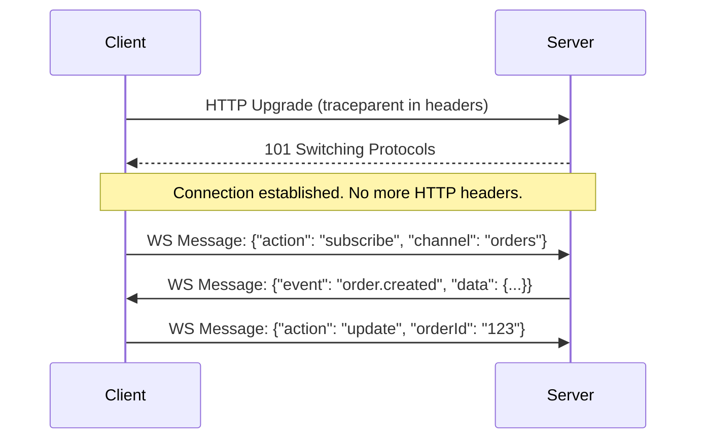

# How to Propagate Trace Context Through WebSocket Messages

Author: [nawazdhandala](https://www.github.com/nawazdhandala)

Tags: OpenTelemetry, WebSocket, Context Propagation, Distributed Tracing, Real-Time

Description: Learn how to propagate OpenTelemetry trace context through WebSocket messages for end-to-end tracing of real-time communication flows.

---

WebSockets create a persistent connection between client and server. Unlike HTTP, where each request is independent and can carry its own headers, WebSocket messages flow over a single long-lived connection with no built-in mechanism for per-message metadata. This makes trace context propagation trickier, because there are no headers to piggyback on after the initial handshake.

This guide covers practical techniques for propagating OpenTelemetry trace context through WebSocket messages, covering both browser-to-server and server-to-server scenarios. We will look at embedding context in message payloads, using a message envelope pattern, and handling the unique challenges that come with bidirectional real-time communication.

## Why WebSocket Tracing Is Different

With HTTP, the OpenTelemetry instrumentation libraries handle propagation automatically. They inject `traceparent` into request headers and extract it on the other side. WebSocket messages do not have headers. After the initial HTTP upgrade handshake, all communication happens through frames that carry only your application data.



The initial handshake carries trace context in HTTP headers, but that context represents the connection establishment, not individual messages. Each message is its own logical operation and needs its own trace context.

## The Message Envelope Pattern

The most reliable approach is to wrap every WebSocket message in an envelope that includes trace context alongside the payload. This keeps the propagation mechanism consistent and predictable.

```javascript
// message-envelope.js - Define a standard envelope for all WebSocket messages
const { propagation, context, trace } = require('@opentelemetry/api');

// Create an envelope that wraps any WebSocket message with trace context.
// Every message sent through the WebSocket will use this format.
function createMessageEnvelope(type, payload) {
  const carrier = {};

  // Inject the current trace context into the carrier.
  // This serializes traceparent and tracestate into plain strings.
  propagation.inject(context.active(), carrier);

  return {
    // Trace context travels alongside the message data
    traceContext: carrier,
    // Message metadata
    type: type,
    timestamp: Date.now(),
    // The actual message payload
    payload: payload,
  };
}

// Extract trace context from a received envelope
function extractFromEnvelope(envelope) {
  if (!envelope.traceContext) {
    return context.active();
  }

  // Reconstruct the parent context from the carrier
  return propagation.extract(context.active(), envelope.traceContext);
}

module.exports = { createMessageEnvelope, extractFromEnvelope };
```

This envelope adds a small overhead to each message (roughly 80-100 bytes for the W3C Trace Context headers), but it gives you full tracing capability across every WebSocket interaction.

## Client-Side Implementation

On the browser side, wrap the native WebSocket with a tracing layer that automatically handles envelope creation and context extraction.

```javascript
// traced-websocket.js - Browser WebSocket wrapper with OpenTelemetry tracing
import { trace, context, propagation } from '@opentelemetry/api';

const tracer = trace.getTracer('websocket-client');

class TracedWebSocket {
  constructor(url) {
    this.ws = new WebSocket(url);
    this.handlers = new Map();

    this.ws.onmessage = (event) => {
      const envelope = JSON.parse(event.data);
      this._handleIncoming(envelope);
    };
  }

  // Send a message with automatic trace context injection
  send(type, payload) {
    return tracer.startActiveSpan(`ws.send.${type}`, (span) => {
      // Set useful attributes on the span
      span.setAttribute('ws.message.type', type);
      span.setAttribute('ws.direction', 'outgoing');

      // Build the envelope with current trace context embedded
      const carrier = {};
      propagation.inject(context.active(), carrier);

      const envelope = {
        traceContext: carrier,
        type: type,
        timestamp: Date.now(),
        payload: payload,
      };

      this.ws.send(JSON.stringify(envelope));
      span.end();
    });
  }

  // Register a handler for a specific message type
  on(type, handler) {
    this.handlers.set(type, handler);
  }

  // Process incoming messages with context extraction
  _handleIncoming(envelope) {
    const handler = this.handlers.get(envelope.type);
    if (!handler) return;

    // Extract the trace context from the incoming message.
    // This creates a parent context so any spans created
    // in the handler are linked to the server-side trace.
    const parentContext = propagation.extract(
      context.active(),
      envelope.traceContext || {}
    );

    context.with(parentContext, () => {
      tracer.startActiveSpan(`ws.receive.${envelope.type}`, (span) => {
        span.setAttribute('ws.message.type', envelope.type);
        span.setAttribute('ws.direction', 'incoming');

        try {
          handler(envelope.payload);
        } catch (error) {
          span.recordException(error);
          span.setStatus({ code: 2, message: error.message });
        } finally {
          span.end();
        }
      });
    });
  }
}

export default TracedWebSocket;
```

Using this wrapper is straightforward.

```javascript
// Using the traced WebSocket in application code
import TracedWebSocket from './traced-websocket';

const ws = new TracedWebSocket('wss://api.example.com/ws');

// Sending a message creates a span and embeds trace context
ws.send('order.create', {
  items: [{ sku: 'WIDGET-1', quantity: 2 }],
  customerId: 'cust-123',
});

// Receiving a message extracts trace context and creates a linked span
ws.on('order.confirmed', (data) => {
  console.log('Order confirmed:', data.orderId);
  updateUI(data);
});
```

## Server-Side Implementation

The server side needs to extract context from incoming messages and inject it into outgoing ones. Here is a Node.js implementation using the `ws` library.

```javascript
// ws-server.js - WebSocket server with OpenTelemetry tracing
const WebSocket = require('ws');
const { trace, context, propagation, ROOT_CONTEXT } = require('@opentelemetry/api');

const tracer = trace.getTracer('websocket-server');
const wss = new WebSocket.Server({ port: 8080 });

wss.on('connection', (ws, req) => {
  // The initial HTTP upgrade request carries trace context.
  // Extract it to link the connection span to the caller's trace.
  const connectionContext = propagation.extract(ROOT_CONTEXT, req.headers);

  context.with(connectionContext, () => {
    tracer.startActiveSpan('ws.connection', (connectionSpan) => {
      connectionSpan.setAttribute('ws.client.ip', req.socket.remoteAddress);

      ws.on('message', (data) => {
        const envelope = JSON.parse(data.toString());

        // Extract trace context from the message envelope.
        // This links the processing span to the client's send span.
        const messageContext = propagation.extract(
          ROOT_CONTEXT,
          envelope.traceContext || {}
        );

        context.with(messageContext, () => {
          handleMessage(ws, envelope);
        });
      });

      ws.on('close', () => {
        connectionSpan.end();
      });
    });
  });
});

function handleMessage(ws, envelope) {
  const spanName = `ws.handle.${envelope.type}`;

  tracer.startActiveSpan(spanName, (span) => {
    span.setAttribute('ws.message.type', envelope.type);

    try {
      // Process the message based on type
      let response;
      switch (envelope.type) {
        case 'order.create':
          response = processOrder(envelope.payload);
          break;
        case 'subscribe':
          response = handleSubscription(envelope.payload);
          break;
        default:
          response = { error: 'Unknown message type' };
      }

      // Send the response with current trace context.
      // This lets the client link its receive handler
      // to this processing span.
      sendWithContext(ws, `${envelope.type}.response`, response);
    } catch (error) {
      span.recordException(error);
      span.setStatus({ code: 2, message: error.message });
      sendWithContext(ws, 'error', { message: error.message });
    } finally {
      span.end();
    }
  });
}

// Helper to send a message with trace context injected
function sendWithContext(ws, type, payload) {
  const carrier = {};
  propagation.inject(context.active(), carrier);

  const envelope = {
    traceContext: carrier,
    type: type,
    timestamp: Date.now(),
    payload: payload,
  };

  ws.send(JSON.stringify(envelope));
}
```

## Handling Server-to-Server WebSocket Propagation

When WebSockets connect backend services (for example, a real-time data pipeline), the same envelope pattern applies. Here is a Python server that receives WebSocket messages with trace context and forwards them.

```python
# ws_processor.py - Python WebSocket service with trace propagation
import json
import asyncio
import websockets
from opentelemetry import trace, context, propagate

tracer = trace.get_tracer("data-processor")

async def process_messages(websocket):
    async for raw_message in websocket:
        envelope = json.loads(raw_message)

        # Extract trace context from the incoming envelope
        parent_ctx = propagate.extract(
            carrier=envelope.get("traceContext", {})
        )

        # Process within the extracted context so the span
        # is a child of the upstream service's span
        with trace.get_tracer_provider().get_tracer(__name__).start_as_current_span(
            f"process.{envelope['type']}",
            context=parent_ctx,
            attributes={"ws.message.type": envelope["type"]},
        ) as span:
            result = transform_data(envelope["payload"])

            # Forward to the next service with updated context.
            # The new context includes this span as the parent.
            carrier = {}
            propagate.inject(carrier)

            outgoing = {
                "traceContext": carrier,
                "type": f"{envelope['type']}.processed",
                "timestamp": int(asyncio.get_event_loop().time() * 1000),
                "payload": result,
            }

            # Send to downstream WebSocket consumers
            await forward_to_subscribers(outgoing)
```

## Tracing Request-Response Patterns Over WebSocket

Many WebSocket protocols implement a request-response pattern using message IDs. You can use span links to connect the request span to the response span when they do not share a direct parent-child relationship.

```javascript
// request-response-tracing.js - Correlate request/response over WebSocket
const { trace, context, propagation, SpanKind } = require('@opentelemetry/api');

const tracer = trace.getTracer('ws-rpc');
const pendingRequests = new Map();

function sendRequest(ws, method, params) {
  return new Promise((resolve) => {
    // Generate a unique request ID
    const requestId = crypto.randomUUID();

    tracer.startActiveSpan(`ws.request.${method}`, {
      kind: SpanKind.CLIENT,
    }, (span) => {
      // Store the span context so we can link the response to it
      const spanContext = span.spanContext();
      pendingRequests.set(requestId, {
        resolve: resolve,
        span: span,
        spanContext: spanContext,
      });

      // Inject trace context into the envelope
      const carrier = {};
      propagation.inject(context.active(), carrier);

      ws.send(JSON.stringify({
        traceContext: carrier,
        type: 'rpc.request',
        payload: {
          id: requestId,
          method: method,
          params: params,
        },
      }));

      // Do not end the span here. It will be ended
      // when the response arrives.
    });
  });
}

function handleResponse(envelope) {
  const { id, result } = envelope.payload;
  const pending = pendingRequests.get(id);

  if (!pending) return;

  // Extract the server's trace context from the response
  const serverContext = propagation.extract(
    context.active(),
    envelope.traceContext || {}
  );

  // End the original request span now that we have the response
  pending.span.setAttribute('rpc.response.received', true);
  pending.span.end();

  pendingRequests.delete(id);
  pending.resolve(result);
}
```

## Visualizing WebSocket Traces

A fully traced WebSocket interaction produces a trace that shows both sides of the conversation.

```mermaid
gantt
    title WebSocket Order Flow Trace
    dateFormat X
    axisFormat %s

    section Browser
    ws.send.order.create        :0, 10
    ws.receive.order.confirmed  :250, 260

    section Server
    ws.handle.order.create      :15, 100
    Validate Order              :20, 50
    Save to Database            :50, 90
    ws.send.order.confirmed     :100, 110

    section Downstream
    Notify Warehouse            :110, 200
```



The trace shows the browser sending a message, the server processing it (with child spans for validation and database operations), and the confirmation flowing back. The downstream notification is connected through the same trace context.

## Performance Considerations

Adding trace context to every WebSocket message has a cost. Here are some guidelines for managing it.

For high-frequency messages (like real-time position updates or live metrics), you might not want to trace every single message. Use sampling to reduce the volume.

```javascript
// Selective tracing for high-frequency WebSocket messages
const messageCount = { current: 0 };

function shouldTrace(messageType) {
  // Always trace business-critical messages
  if (messageType.startsWith('order.') || messageType.startsWith('payment.')) {
    return true;
  }

  // Sample 1 in 100 for high-frequency messages like position updates
  if (messageType === 'position.update') {
    messageCount.current++;
    return messageCount.current % 100 === 0;
  }

  return true;
}
```

For messages where tracing is skipped, you can still include the trace context in the envelope but skip creating spans. This way, if a downstream service needs to trace something, it still has the parent context available.

## Wrapping Up

Propagating trace context through WebSocket messages requires a manual approach because WebSocket frames do not have headers. The message envelope pattern gives you a clean, consistent way to embed trace context alongside your application data. Wrap your messages in an envelope with a `traceContext` field, use `propagation.inject` on the sending side and `propagation.extract` on the receiving side, and you get full distributed tracing across WebSocket connections. For high-frequency messages, add sampling to keep the overhead manageable. The key is establishing the envelope as a convention across all your WebSocket services so that trace context flows reliably through every message.
