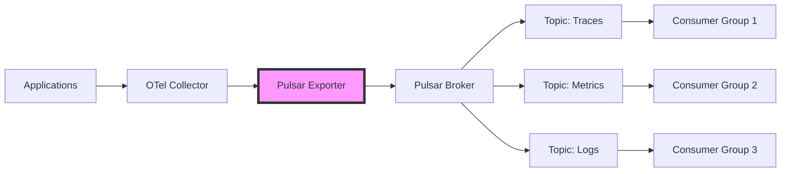

# How to Configure the Pulsar Exporter in the OpenTelemetry Collector

Author: [nawazdhandala](https://www.github.com/nawazdhandala)

Tags: OpenTelemetry, Collector, Exporters, Pulsar, Apache Pulsar, Streaming, Message Queue

Description: Learn how to configure the Pulsar exporter in the OpenTelemetry Collector to stream telemetry data to Apache Pulsar for scalable, event-driven observability architectures.

The Pulsar exporter enables the OpenTelemetry Collector to publish telemetry data to Apache Pulsar, a cloud-native distributed messaging and streaming platform. This integration is ideal for organizations building large-scale, event-driven observability systems that require multi-tenancy, geo-replication, and guaranteed message ordering.

## Understanding the Pulsar Exporter

Apache Pulsar is a distributed pub-sub messaging system that provides features beyond traditional message brokers. It offers native support for multi-tenancy, geo-replication, tiered storage, and guaranteed message ordering. By exporting telemetry data to Pulsar, you can build scalable observability pipelines that handle massive data volumes while maintaining strong delivery guarantees.

The Pulsar exporter publishes traces, metrics, and logs to Pulsar topics. These topics can be consumed by multiple subscribers, processed by Pulsar Functions for real-time transformations, or stored in tiered storage for long-term retention. Pulsar's architecture makes it particularly suitable for multi-region deployments and scenarios requiring high throughput with low latency.



## Key Pulsar Features for Observability

Apache Pulsar provides several features that make it well-suited for observability workloads:

**Multi-Tenancy**: Isolate telemetry data from different teams or environments using tenants and namespaces without deploying separate clusters.

**Geo-Replication**: Automatically replicate telemetry data across multiple data centers for disaster recovery and regional processing.

**Message Ordering**: Maintain strict ordering guarantees per partition key, ensuring trace spans arrive in order for accurate correlation.

**Tiered Storage**: Automatically offload older telemetry data to object storage (S3, GCS, Azure Blob) for cost-effective long-term retention.

**Schema Registry**: Enforce and evolve telemetry data schemas with backward and forward compatibility.

## Basic Configuration

Here is a basic configuration for exporting telemetry data to Apache Pulsar:

```yaml
receivers:
  # Receive telemetry via OTLP
  otlp:
    protocols:
      grpc:
        endpoint: 0.0.0.0:4317
      http:
        endpoint: 0.0.0.0:4318

processors:
  # Batch telemetry for efficiency
  batch:
    timeout: 10s
    send_batch_size: 1024

exporters:
  # Configure Pulsar exporter
  pulsar:
    # Pulsar service URL
    endpoint: pulsar://localhost:6650
    # Topic for traces
    topic: persistent://public/default/otel-traces
    # Message encoding format
    encoding: json
    # Producer name
    producer_name: otel-collector-traces
    # Send timeout
    timeout: 30s
    # Batching configuration
    batching:
      max_publish_delay: 10ms
      max_messages: 1000

service:
  pipelines:
    traces:
      receivers: [otlp]
      processors: [batch]
      exporters: [pulsar]
```

This configuration connects to a local Pulsar instance and publishes trace data to the topic "persistent://public/default/otel-traces". The topic follows Pulsar's naming convention: persistence-type://tenant/namespace/topic-name.

## Topic Configuration and Naming

Pulsar topics follow a hierarchical naming structure that supports multi-tenancy and organization:

```yaml
receivers:
  otlp:
    protocols:
      grpc:
        endpoint: 0.0.0.0:4317

processors:
  batch:
    timeout: 10s

exporters:
  # Traces to persistent topic
  pulsar/traces:
    endpoint: pulsar://pulsar.example.com:6650
    # Persistent topic with tenant and namespace
    topic: persistent://production/telemetry/traces
    encoding: protobuf
    producer_name: otel-traces-producer
    # Topic properties
    properties:
      retention: "7d"
      ttl: "24h"

  # Metrics to persistent topic
  pulsar/metrics:
    endpoint: pulsar://pulsar.example.com:6650
    topic: persistent://production/telemetry/metrics
    encoding: json
    producer_name: otel-metrics-producer
    properties:
      retention: "30d"

  # Logs to non-persistent topic (low latency)
  pulsar/logs:
    endpoint: pulsar://pulsar.example.com:6650
    # Non-persistent topic for lower latency
    topic: non-persistent://production/telemetry/logs
    encoding: json
    producer_name: otel-logs-producer

service:
  pipelines:
    traces:
      receivers: [otlp]
      processors: [batch]
      exporters: [pulsar/traces]

    metrics:
      receivers: [otlp]
      processors: [batch]
      exporters: [pulsar/metrics]

    logs:
      receivers: [otlp]
      processors: [batch]
      exporters: [pulsar/logs]
```

**Persistent Topics**: Messages are stored on disk and replicated. Use for critical telemetry that must not be lost.

**Non-Persistent Topics**: Messages are kept in memory only. Use for high-throughput, low-latency scenarios where data loss is acceptable.

The tenant and namespace structure allows you to organize topics by environment (production, staging) and purpose (telemetry, events).

## Secure Configuration with TLS

For production deployments, secure the connection to Pulsar using TLS authentication:

```yaml
receivers:
  otlp:
    protocols:
      grpc:
        endpoint: 0.0.0.0:4317

processors:
  batch:
    timeout: 10s

exporters:
  pulsar:
    # Use pulsar+ssl for TLS connections
    endpoint: pulsar+ssl://pulsar.example.com:6651
    topic: persistent://production/telemetry/traces
    encoding: json
    producer_name: otel-collector-prod

    # TLS configuration
    tls:
      insecure: false
      ca_file: /etc/ssl/certs/pulsar-ca.crt
      cert_file: /etc/ssl/certs/client.crt
      key_file: /etc/ssl/private/client.key
      server_name_override: pulsar.example.com

    # Authentication configuration
    authentication:
      # Token-based authentication
      type: token
      token: ${PULSAR_AUTH_TOKEN}

    timeout: 30s
    batching:
      max_publish_delay: 10ms
      max_messages: 1000

service:
  pipelines:
    traces:
      receivers: [otlp]
      processors: [batch]
      exporters: [pulsar]
```

TLS encryption protects telemetry data in transit. Pulsar supports multiple authentication mechanisms including tokens, mutual TLS, and OAuth2. Store authentication tokens in environment variables rather than configuration files.

## Partitioned Topics for Scalability

Use partitioned topics to distribute load across multiple brokers and improve throughput:

```yaml
receivers:
  otlp:
    protocols:
      grpc:
        endpoint: 0.0.0.0:4317

processors:
  # Add partition key attribute
  attributes:
    actions:
      - key: partition.key
        from_attribute: service.name
        action: upsert

  batch:
    timeout: 10s

exporters:
  pulsar:
    endpoint: pulsar://pulsar.example.com:6650
    # Partitioned topic (must be created with partitions)
    topic: persistent://production/telemetry/traces
    encoding: protobuf
    producer_name: otel-collector

    # Partitioning strategy
    partitioning:
      # Use attribute as partition key
      key_attribute: partition.key
      # Hash function for key distribution
      hash_function: murmur3
      # Number of partitions (must match topic configuration)
      num_partitions: 16

    # Routing mode
    message_routing_mode: CustomPartition

    timeout: 30s
    batching:
      max_publish_delay: 10ms
      max_messages: 1000

service:
  pipelines:
    traces:
      receivers: [otlp]
      processors: [attributes, batch]
      exporters: [pulsar]
```

Partitioned topics distribute messages across multiple partitions based on a key. Using service name as the partition key ensures all telemetry from the same service goes to the same partition, maintaining ordering while allowing parallel processing across services.

## Message Ordering and Keys

Configure message keys to guarantee ordering for related telemetry data:

```yaml
receivers:
  otlp:
    protocols:
      grpc:
        endpoint: 0.0.0.0:4317

processors:
  # Extract ordering key
  transform:
    trace_statements:
      - context: span
        statements:
          # Use trace ID as ordering key to keep spans together
          - set(attributes["ordering.key"], trace_id.string())

  batch:
    timeout: 10s

exporters:
  pulsar:
    endpoint: pulsar://pulsar.example.com:6650
    topic: persistent://production/telemetry/traces
    encoding: protobuf
    producer_name: otel-collector

    # Message key for ordering
    message_key_attribute: ordering.key

    # Routing mode for ordered delivery
    message_routing_mode: SinglePartition

    # Message properties
    properties:
      source: otel-collector
      version: 1.0.0

    timeout: 30s

service:
  pipelines:
    traces:
      receivers: [otlp]
      processors: [transform, batch]
      exporters: [pulsar]
```

Messages with the same key are guaranteed to be delivered in order. For traces, using the trace ID as the key ensures all spans from a trace arrive in sequence, which is critical for proper trace reconstruction.

## Schema Registry Integration

Use Pulsar's schema registry to enforce data schemas and enable schema evolution:

```yaml
receivers:
  otlp:
    protocols:
      grpc:
        endpoint: 0.0.0.0:4317

processors:
  batch:
    timeout: 10s

exporters:
  pulsar:
    endpoint: pulsar://pulsar.example.com:6650
    topic: persistent://production/telemetry/traces
    producer_name: otel-collector

    # Schema configuration
    schema:
      # Schema type
      type: protobuf
      # Schema definition (inline or file path)
      definition: |
        syntax = "proto3";
        message Span {
          string trace_id = 1;
          string span_id = 2;
          string name = 3;
          int64 start_time = 4;
          int64 end_time = 5;
          map<string, string> attributes = 6;
        }
      # Schema validation
      validation: true
      # Auto-update schema
      auto_update: true

    encoding: protobuf
    timeout: 30s

service:
  pipelines:
    traces:
      receivers: [otlp]
      processors: [batch]
      exporters: [pulsar]
```

Schema registry ensures that all messages published to a topic conform to a defined schema. This prevents data quality issues and enables safe schema evolution. Pulsar supports Avro, JSON, and Protocol Buffers schemas.

## Geo-Replication Configuration

Configure geo-replication to replicate telemetry data across multiple Pulsar clusters:

```yaml
receivers:
  otlp:
    protocols:
      grpc:
        endpoint: 0.0.0.0:4317

processors:
  batch:
    timeout: 10s

exporters:
  pulsar:
    endpoint: pulsar://pulsar.us-west.example.com:6650
    topic: persistent://production/telemetry/traces
    encoding: json
    producer_name: otel-collector-us-west

    # Replication configuration
    replication:
      enabled: true
      # Replication clusters
      clusters:
        - us-west
        - us-east
        - eu-west
      # Replication backlog quota
      backlog_quota:
        limit: 10GB
        policy: producer_exception

    timeout: 30s
    batching:
      max_publish_delay: 10ms
      max_messages: 1000

service:
  pipelines:
    traces:
      receivers: [otlp]
      processors: [batch]
      exporters: [pulsar]
```

Geo-replication automatically copies messages to configured clusters. This provides disaster recovery, enables regional data processing, and ensures telemetry data availability across geographic regions. Each cluster can process the data independently while maintaining consistency.

## Performance Optimization

Optimize the Pulsar exporter for high-throughput scenarios:

```yaml
receivers:
  otlp:
    protocols:
      grpc:
        endpoint: 0.0.0.0:4317
        # Increase max message size
        max_recv_msg_size_mib: 64

processors:
  # Aggressive batching for throughput
  batch:
    timeout: 30s
    send_batch_size: 4096
    send_batch_max_size: 8192

exporters:
  pulsar:
    endpoint: pulsar://pulsar.example.com:6650
    topic: persistent://production/telemetry/traces
    encoding: protobuf
    producer_name: otel-collector

    # Producer configuration
    max_pending_messages: 10000
    max_pending_messages_across_partitions: 50000
    block_if_queue_full: true

    # Batching configuration for throughput
    batching:
      max_publish_delay: 100ms
      max_messages: 5000
      max_bytes: 4194304  # 4MB

    # Compression
    compression:
      type: ZSTD
      level: 3

    # Connection pool
    connection_pool:
      max_connections_per_broker: 10

    timeout: 60s

service:
  pipelines:
    traces:
      receivers: [otlp]
      processors: [batch]
      exporters: [pulsar]
```

Larger batches and compression reduce network overhead and improve throughput. ZSTD compression provides excellent compression ratios with good performance. Adjust max pending messages based on available memory and desired throughput.

## Dead Letter Queue Configuration

Configure dead letter topics to handle messages that fail processing:

```yaml
receivers:
  otlp:
    protocols:
      grpc:
        endpoint: 0.0.0.0:4317

processors:
  batch:
    timeout: 10s

exporters:
  pulsar:
    endpoint: pulsar://pulsar.example.com:6650
    topic: persistent://production/telemetry/traces
    encoding: json
    producer_name: otel-collector

    # Retry configuration
    retry_on_failure:
      enabled: true
      initial_interval: 5s
      max_interval: 30s
      max_elapsed_time: 300s
      # Max retries before sending to DLQ
      max_retries: 5

    # Dead letter queue configuration
    dead_letter_queue:
      # DLQ topic
      topic: persistent://production/telemetry/traces-dlq
      # Max redelivery attempts
      max_redeliver_count: 3
      # DLQ producer name
      producer_name: otel-collector-dlq

    timeout: 30s

service:
  pipelines:
    traces:
      receivers: [otlp]
      processors: [batch]
      exporters: [pulsar]
```

Dead letter queues capture messages that repeatedly fail processing. This prevents message loss and allows you to investigate and reprocess failed messages later. Monitor the DLQ topic to detect systematic processing issues.

## Multi-Tenant Configuration

Leverage Pulsar's multi-tenancy features to isolate telemetry data:

```yaml
receivers:
  otlp:
    protocols:
      grpc:
        endpoint: 0.0.0.0:4317

processors:
  # Add tenant and namespace from resource attributes
  attributes:
    actions:
      - key: pulsar.tenant
        from_attribute: deployment.environment
        action: upsert
      - key: pulsar.namespace
        from_attribute: service.namespace
        action: upsert

  batch:
    timeout: 10s

exporters:
  # Production tenant
  pulsar/production:
    endpoint: pulsar://pulsar.example.com:6650
    # Topic in production tenant
    topic: persistent://production/applications/traces
    encoding: json
    producer_name: otel-collector-prod
    authentication:
      type: token
      token: ${PULSAR_PROD_TOKEN}

  # Staging tenant
  pulsar/staging:
    endpoint: pulsar://pulsar.example.com:6650
    # Topic in staging tenant
    topic: persistent://staging/applications/traces
    encoding: json
    producer_name: otel-collector-staging
    authentication:
      type: token
      token: ${PULSAR_STAGING_TOKEN}

service:
  pipelines:
    traces/production:
      receivers: [otlp]
      processors: [attributes, batch]
      exporters: [pulsar/production]

    traces/staging:
      receivers: [otlp]
      processors: [attributes, batch]
      exporters: [pulsar/staging]
```

Multi-tenancy allows you to isolate data from different environments or teams using separate tenants and namespaces. Each tenant can have its own authentication, authorization, and resource quotas.

## Consumer Example

Here is a Go example of consuming telemetry data from Pulsar:

```go
package main

import (
    "context"
    "encoding/json"
    "log"

    "github.com/apache/pulsar-client-go/pulsar"
)

func main() {
    // Create Pulsar client
    client, err := pulsar.NewClient(pulsar.ClientOptions{
        URL: "pulsar://pulsar.example.com:6650",
        Authentication: pulsar.NewAuthenticationToken("your-token"),
    })
    if err != nil {
        log.Fatal(err)
    }
    defer client.Close()

    // Create consumer
    consumer, err := client.Subscribe(pulsar.ConsumerOptions{
        Topic:            "persistent://production/telemetry/traces",
        SubscriptionName: "trace-processor",
        Type:             pulsar.Shared,
    })
    if err != nil {
        log.Fatal(err)
    }
    defer consumer.Close()

    // Consume messages
    for {
        msg, err := consumer.Receive(context.Background())
        if err != nil {
            log.Printf("Error receiving message: %v", err)
            continue
        }

        // Process message
        var trace map[string]interface{}
        if err := json.Unmarshal(msg.Payload(), &trace); err != nil {
            log.Printf("Error unmarshaling: %v", err)
            consumer.Nack(msg)
            continue
        }

        log.Printf("Received trace: %v", trace)

        // Acknowledge message
        consumer.Ack(msg)
    }
}
```

This consumer uses shared subscription mode, which distributes messages across multiple consumers for parallel processing. Pulsar also supports exclusive and failover subscription modes for different consumption patterns.

## Monitoring and Observability

Monitor the Pulsar exporter to ensure reliable message delivery:

```yaml
receivers:
  otlp:
    protocols:
      grpc:
        endpoint: 0.0.0.0:4317

processors:
  batch:
    timeout: 10s

exporters:
  pulsar:
    endpoint: pulsar://pulsar.example.com:6650
    topic: persistent://production/telemetry/traces
    encoding: json
    producer_name: otel-collector

  # Export collector metrics
  prometheus:
    endpoint: "0.0.0.0:8888"

service:
  pipelines:
    traces:
      receivers: [otlp]
      processors: [batch]
      exporters: [pulsar]

  telemetry:
    logs:
      level: info
    metrics:
      level: detailed
      address: ":8888"
```

Monitor these key metrics:

- Messages published and failed counts
- Publish latency and throughput
- Producer queue size and backlog
- Connection status and reconnections

Also monitor Pulsar broker metrics including topic throughput, storage usage, and consumer lag. For more details on monitoring, see our guide on [monitoring the OpenTelemetry Collector](https://oneuptime.com/blog/post/2026-02-06-google-cloud-monitoring-receiver-opentelemetry-collector/view).

## Best Practices

Follow these best practices when using the Pulsar exporter:

**Use Persistent Topics for Critical Data**: Ensure important telemetry data is not lost by using persistent topics with appropriate replication.

**Enable Compression**: Reduce network bandwidth and storage costs by enabling compression, especially for high-volume data.

**Configure Appropriate Batching**: Balance latency and throughput by tuning batch size and delay parameters.

**Leverage Partitioning**: Use partitioned topics to distribute load across multiple brokers and improve scalability.

**Implement Message Keys**: Use message keys to guarantee ordering for related telemetry data.

**Monitor Producer Queues**: Track producer queue sizes to detect backpressure and processing bottlenecks.

**Use Schema Registry**: Enforce data quality and enable schema evolution using Pulsar's schema registry.

**Configure Geo-Replication**: Replicate critical telemetry data across regions for disaster recovery and regional processing.

## Integration with Streaming Architectures

The Pulsar exporter enables integration with streaming data architectures. For more information on stream processing patterns, see our posts on [real-time telemetry processing](https://oneuptime.com/blog/post/2026-02-06-route-high-value-telemetry-realtime-low-value-s3/view) and [event-driven observability](https://oneuptime.com/blog/post/2025-07-02-spring-boot-event-driven-architecture/view).

## Conclusion

The Pulsar exporter enables powerful streaming observability architectures by publishing telemetry data to Apache Pulsar. Pulsar's advanced features including multi-tenancy, geo-replication, guaranteed ordering, and tiered storage make it ideal for large-scale, mission-critical observability systems.

Configure the exporter based on your requirements, choosing appropriate topic structures, partitioning strategies, and reliability settings. With proper configuration and monitoring, the Pulsar exporter provides a robust foundation for building scalable, cloud-native observability pipelines that can handle massive data volumes across multiple regions while maintaining strong delivery guarantees.
