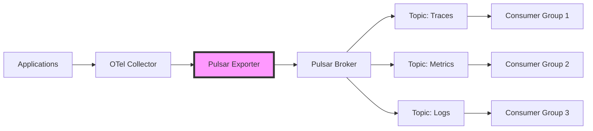

# How to Configure the Pulsar Exporter in the OpenTelemetry Collector

Author: [nawazdhandala](https://www.github.com/nawazdhandala)

Tags: OpenTelemetry, Collector, Exporter, Pulsar, Apache Pulsar, Streaming, Message Queue

Description: Learn how to configure the Pulsar exporter in the OpenTelemetry Collector to stream telemetry data to Apache Pulsar for scalable, event-driven observability architectures.

The Pulsar exporter enables the OpenTelemetry Collector to publish telemetry data to Apache Pulsar, a cloud-native distributed messaging and streaming platform. This integration is useful for organizations building large-scale, event-driven observability systems that require multi-tenancy, geo-replication, and explicit ordering controls.

## Understanding the Pulsar Exporter

Apache Pulsar is a distributed pub-sub messaging system that provides features beyond traditional message brokers. It offers native support for multi-tenancy, geo-replication, tiered storage, and ordering guarantees within Pulsar's producer, topic, partition, and subscription model. By exporting telemetry data to Pulsar, you can build scalable observability pipelines that handle massive data volumes while maintaining strong delivery guarantees.

The Pulsar exporter publishes traces, metrics, and logs to Pulsar topics. These topics can be consumed by multiple subscribers, processed by Pulsar Functions for real-time transformations, or stored in tiered storage for long-term retention. Pulsar's architecture makes it particularly suitable for multi-region deployments and scenarios requiring high throughput with low latency.


```mermaid
graph LR
    A[Applications] --> B[OTel Collector]
    B --> C[Pulsar Exporter]
    C --> D[Pulsar Broker]
    D --> E[Topic: Traces]
    D --> F[Topic: Metrics]
    D --> G[Topic: Logs]
    E --> H[Consumer Group 1]
    F --> I[Consumer Group 2]
    G --> J[Consumer Group 3]
    style C fill:#f9f,stroke:#333,stroke-width:4px
```

## Key Pulsar Features for Observability

Apache Pulsar provides several features that make it well-suited for observability workloads:

**Multi-Tenancy**: Isolate telemetry data from different teams or environments using tenants and namespaces without deploying separate clusters.

**Geo-Replication**: Automatically replicate telemetry data across multiple data centers for disaster recovery and regional processing.

**Message Ordering**: Maintain ordering within Pulsar's producer, topic, partition, and subscription semantics. For the Collector's Pulsar exporter, the Jaeger trace encodings key messages by trace ID.

**Tiered Storage**: Automatically offload older telemetry data to object storage (S3, GCS, Azure Blob) for cost-effective long-term retention.

**Schema Registry**: Enforce and evolve telemetry data schemas with backward and forward compatibility.

## Basic Configuration

Here is a basic configuration for exporting telemetry data to Apache Pulsar:

```yaml
receivers:
  # Receive telemetry via OTLP
  otlp:
    protocols:
      grpc:
        endpoint: 0.0.0.0:4317
      http:
        endpoint: 0.0.0.0:4318

processors:
  # Batch telemetry for efficiency
  batch:
    timeout: 10s
    send_batch_size: 1024

exporters:
  # Configure Pulsar exporter
  pulsar:
    # Pulsar service URL
    endpoint: pulsar://localhost:6650
    # Topic for traces
    topic: persistent://public/default/otel-traces
    # Message encoding format
    encoding: otlp_json
    # Send timeout
    timeout: 30s
    # Producer batching configuration
    producer:
      batching_max_publish_delay: 10ms
      batching_max_messages: 1000

service:
  pipelines:
    traces:
      receivers: [otlp]
      processors: [batch]
      exporters: [pulsar]
```

This configuration connects to a local Pulsar instance and publishes trace data to the topic "persistent://public/default/otel-traces". The topic follows Pulsar's naming convention: persistence-type://tenant/namespace/topic-name.

## Topic Configuration and Naming

Pulsar topics follow a hierarchical naming structure that supports multi-tenancy and organization:

```yaml
receivers:
  otlp:
    protocols:
      grpc:
        endpoint: 0.0.0.0:4317

processors:
  batch:
    timeout: 10s

exporters:
  # Traces to persistent topic
  pulsar/traces:
    endpoint: pulsar://pulsar.example.com:6650
    # Persistent topic with tenant and namespace
    topic: persistent://production/telemetry/traces
    encoding: otlp_proto

  # Metrics to persistent topic
  pulsar/metrics:
    endpoint: pulsar://pulsar.example.com:6650
    topic: persistent://production/telemetry/metrics
    encoding: otlp_json

  # Logs to non-persistent topic (low latency)
  pulsar/logs:
    endpoint: pulsar://pulsar.example.com:6650
    # Non-persistent topic for lower latency
    topic: non-persistent://production/telemetry/logs
    encoding: otlp_json

service:
  pipelines:
    traces:
      receivers: [otlp]
      processors: [batch]
      exporters: [pulsar/traces]

    metrics:
      receivers: [otlp]
      processors: [batch]
      exporters: [pulsar/metrics]

    logs:
      receivers: [otlp]
      processors: [batch]
      exporters: [pulsar/logs]
```

**Persistent Topics**: Messages are stored on disk and replicated. Use for critical telemetry that must not be lost.

**Non-Persistent Topics**: Messages are kept in memory only. Use for high-throughput, low-latency scenarios where data loss is acceptable.

The tenant and namespace structure allows you to organize topics by environment (production, staging) and purpose (telemetry, events).

## Secure Configuration with TLS

For production deployments, secure the connection to Pulsar using TLS encryption and authentication:

```yaml
receivers:
  otlp:
    protocols:
      grpc:
        endpoint: 0.0.0.0:4317

processors:
  batch:
    timeout: 10s

exporters:
  pulsar:
    # Use pulsar+ssl for TLS connections
    endpoint: pulsar+ssl://pulsar.example.com:6651
    topic: persistent://production/telemetry/traces
    encoding: otlp_json

    # TLS trust configuration for the Pulsar client
    tls_allow_insecure_connection: false
    tls_trust_certs_file_path: /etc/ssl/certs/pulsar-ca.crt

    # Authentication configuration
    auth:
      # Token-based authentication
      token:
        token: ${PULSAR_AUTH_TOKEN}

    timeout: 30s
    producer:
      batching_max_publish_delay: 10ms
      batching_max_messages: 1000

service:
  pipelines:
    traces:
      receivers: [otlp]
      processors: [batch]
      exporters: [pulsar]
```

TLS encryption protects telemetry data in transit. The Collector's Pulsar exporter supports token, mutual TLS, OAuth2, and Athenz authentication under the `auth` setting. Store authentication tokens in environment variables rather than configuration files.

## Partitioned Topics for Scalability

Use partitioned topics to distribute load across multiple brokers and improve throughput:

```yaml
receivers:
  otlp:
    protocols:
      grpc:
        endpoint: 0.0.0.0:4317

processors:
  batch:
    timeout: 10s

exporters:
  pulsar:
    endpoint: pulsar://pulsar.example.com:6650
    # Partitioned topic (must be created with partitions)
    topic: persistent://production/telemetry/traces
    encoding: otlp_proto

    timeout: 30s
    producer:
      hashing_scheme: murmur3_32hash
      partitions_auto_discovery_interval: 1m
      batching_max_publish_delay: 10ms
      batching_max_messages: 1000

service:
  pipelines:
    traces:
      receivers: [otlp]
      processors: [batch]
      exporters: [pulsar]
```

Partitioned topics distribute messages across multiple partitions. The Collector's Pulsar exporter can set the producer hashing scheme and auto-discovery interval for partitions, but it does not expose a configuration option to derive a Pulsar message key from an OpenTelemetry attribute. Create the partitioned topic in Pulsar before using it from the Collector.

## Message Ordering and Keys

Use a trace encoding that keys exported spans by trace ID when ordering related trace data matters:

```yaml
receivers:
  otlp:
    protocols:
      grpc:
        endpoint: 0.0.0.0:4317

processors:
  batch:
    timeout: 10s

exporters:
  pulsar:
    endpoint: pulsar://pulsar.example.com:6650
    topic: persistent://production/telemetry/traces
    # Jaeger trace encodings are keyed by trace ID by the exporter
    encoding: jaeger_proto

    producer:
      batch_builder_type: key_based

    timeout: 30s

service:
  pipelines:
    traces:
      receivers: [otlp]
      processors: [batch]
      exporters: [pulsar]
```

The Collector's Pulsar exporter does not expose a `message_key_attribute` option. For traces, the `jaeger_proto` and `jaeger_json` encodings key exported spans by trace ID. Use Pulsar's ordering and subscription semantics together with a single producer or key-based batching when strict per-key ordering matters.

## Schema Registry Integration

Use Pulsar's schema registry to enforce data schemas and enable schema evolution in producers and consumers that use Pulsar schemas. The Collector's Pulsar exporter does not expose schema registry settings directly; it publishes OTLP or Jaeger-encoded payloads:

```yaml
receivers:
  otlp:
    protocols:
      grpc:
        endpoint: 0.0.0.0:4317

processors:
  batch:
    timeout: 10s

exporters:
  pulsar:
    endpoint: pulsar://pulsar.example.com:6650
    topic: persistent://production/telemetry/traces
    encoding: otlp_proto
    timeout: 30s

service:
  pipelines:
    traces:
      receivers: [otlp]
      processors: [batch]
      exporters: [pulsar]
```

Schema registry ensures that schema-aware Pulsar producers publish messages that conform to a defined schema. This prevents data quality issues and enables safe schema evolution. Pulsar supports Avro, JSON, and Protocol Buffers schemas, but schema registration is managed through Pulsar clients and administration APIs rather than the Collector exporter configuration.

## Geo-Replication Configuration

Configure geo-replication in Pulsar to replicate telemetry data across multiple Pulsar clusters. The Collector exporter should point at the local or preferred Pulsar cluster:

```yaml
receivers:
  otlp:
    protocols:
      grpc:
        endpoint: 0.0.0.0:4317

processors:
  batch:
    timeout: 10s

exporters:
  pulsar:
    endpoint: pulsar://pulsar.us-west.example.com:6650
    topic: persistent://production/telemetry/traces
    encoding: otlp_json

    timeout: 30s
    producer:
      batching_max_publish_delay: 10ms
      batching_max_messages: 1000

service:
  pipelines:
    traces:
      receivers: [otlp]
      processors: [batch]
      exporters: [pulsar]
```

Geo-replication automatically copies messages to configured clusters when it is enabled on the Pulsar tenant, namespace, and cluster configuration. This provides disaster recovery, enables regional data processing, and ensures telemetry data availability across geographic regions. Each cluster can process the data independently while maintaining consistency.

## Performance Optimization

Optimize the Pulsar exporter for high-throughput scenarios:

```yaml
receivers:
  otlp:
    protocols:
      grpc:
        endpoint: 0.0.0.0:4317
        # Increase max message size
        max_recv_msg_size_mib: 64

processors:
  # Aggressive batching for throughput
  batch:
    timeout: 30s
    send_batch_size: 4096
    send_batch_max_size: 8192

exporters:
  pulsar:
    endpoint: pulsar://pulsar.example.com:6650
    topic: persistent://production/telemetry/traces
    encoding: otlp_proto

    # Producer configuration
    producer:
      max_pending_messages: 10000
      disable_block_if_queue_full: false

      # Batching configuration for throughput
      batching_max_publish_delay: 100ms
      batching_max_messages: 5000
      batching_max_size: 4194304  # 4MB

      # Compression
      compression_type: zstd
      compression_level: better

    max_connections_per_broker: 10

    timeout: 60s

service:
  pipelines:
    traces:
      receivers: [otlp]
      processors: [batch]
      exporters: [pulsar]
```

Larger batches and compression reduce network overhead and improve throughput. ZSTD compression provides excellent compression ratios with good performance. Adjust max pending messages based on available memory and desired throughput.

## Dead Letter Queue Configuration

Configure retries and the Collector sending queue to handle temporary publish failures:

```yaml
receivers:
  otlp:
    protocols:
      grpc:
        endpoint: 0.0.0.0:4317

processors:
  batch:
    timeout: 10s

exporters:
  pulsar:
    endpoint: pulsar://pulsar.example.com:6650
    topic: persistent://production/telemetry/traces
    encoding: otlp_json

    # Retry configuration
    retry_on_failure:
      enabled: true
      initial_interval: 5s
      max_interval: 30s
      max_elapsed_time: 300s

    # Queue batches while Pulsar is temporarily unavailable
    sending_queue:
      enabled: true
      num_consumers: 10
      queue_size: 1000

    timeout: 30s

service:
  pipelines:
    traces:
      receivers: [otlp]
      processors: [batch]
      exporters: [pulsar]
```

The Collector's Pulsar exporter does not have a dead letter queue setting. Dead letter topics are a Pulsar consumer-side feature for messages that fail after delivery to a subscriber. Use the exporter's retry and sending queue settings for temporary publish failures, and configure DLQs in downstream Pulsar consumers when reprocessing failed telemetry messages is required.

## Multi-Tenant Configuration

Leverage Pulsar's multi-tenancy features to isolate telemetry data:

```yaml
receivers:
  otlp:
    protocols:
      grpc:
        endpoint: 0.0.0.0:4317

processors:
  batch:
    timeout: 10s

exporters:
  # Production tenant
  pulsar/production:
    endpoint: pulsar://pulsar.example.com:6650
    # Topic in production tenant
    topic: persistent://production/applications/traces
    encoding: otlp_json
    auth:
      token:
        token: ${PULSAR_PROD_TOKEN}

  # Staging tenant
  pulsar/staging:
    endpoint: pulsar://pulsar.example.com:6650
    # Topic in staging tenant
    topic: persistent://staging/applications/traces
    encoding: otlp_json
    auth:
      token:
        token: ${PULSAR_STAGING_TOKEN}

service:
  pipelines:
    traces/production:
      receivers: [otlp]
      processors: [batch]
      exporters: [pulsar/production]

    traces/staging:
      receivers: [otlp]
      processors: [batch]
      exporters: [pulsar/staging]
```

Multi-tenancy allows you to isolate data from different environments or teams using separate tenants and namespaces. Each tenant can have its own authentication, authorization, and resource quotas. The exporter topic is static per exporter instance, so route data to the appropriate exporter with separate Collector deployments, receivers, or routing components when production and staging data should not be duplicated.

## Consumer Example

Here is a Go example of consuming telemetry data from Pulsar:

```go
package main

import (
    "context"
    "encoding/json"
    "log"

    "github.com/apache/pulsar-client-go/pulsar"
)

func main() {
    // Create Pulsar client
    client, err := pulsar.NewClient(pulsar.ClientOptions{
        URL: "pulsar://pulsar.example.com:6650",
        Authentication: pulsar.NewAuthenticationToken("your-token"),
    })
    if err != nil {
        log.Fatal(err)
    }
    defer client.Close()

    // Create consumer
    consumer, err := client.Subscribe(pulsar.ConsumerOptions{
        Topic:            "persistent://production/telemetry/traces",
        SubscriptionName: "trace-processor",
        Type:             pulsar.Shared,
    })
    if err != nil {
        log.Fatal(err)
    }
    defer consumer.Close()

    // Consume messages
    for {
        msg, err := consumer.Receive(context.Background())
        if err != nil {
            log.Printf("Error receiving message: %v", err)
            continue
        }

        // Process message
        var trace map[string]interface{}
        if err := json.Unmarshal(msg.Payload(), &trace); err != nil {
            log.Printf("Error unmarshaling: %v", err)
            consumer.Nack(msg)
            continue
        }

        log.Printf("Received trace: %v", trace)

        // Acknowledge message
        consumer.Ack(msg)
    }
}
```

This consumer uses shared subscription mode, which distributes messages across multiple consumers for parallel processing. Pulsar also supports exclusive and failover subscription modes for different consumption patterns.

## Monitoring and Observability

Monitor the Pulsar exporter to ensure reliable message delivery:

```yaml
receivers:
  otlp:
    protocols:
      grpc:
        endpoint: 0.0.0.0:4317

processors:
  batch:
    timeout: 10s

exporters:
  pulsar:
    endpoint: pulsar://pulsar.example.com:6650
    topic: persistent://production/telemetry/traces
    encoding: otlp_json

service:
  pipelines:
    traces:
      receivers: [otlp]
      processors: [batch]
      exporters: [pulsar]

  telemetry:
    logs:
      level: info
    metrics:
      level: detailed
      readers:
        - pull:
            exporter:
              prometheus:
                host: "0.0.0.0"
                port: 8888
```

Monitor these key metrics:

- Messages published and failed counts
- Publish latency and throughput
- Producer queue size and backlog
- Connection status and reconnections

Also monitor Pulsar broker metrics including topic throughput, storage usage, and consumer lag. For more details on monitoring, see our guide on [monitoring the OpenTelemetry Collector](https://oneuptime.com/blog/post/2026-02-06-google-cloud-monitoring-receiver-opentelemetry-collector/view).

## Best Practices

Follow these best practices when using the Pulsar exporter:

**Use Persistent Topics for Critical Data**: Ensure important telemetry data is not lost by using persistent topics with appropriate replication.

**Enable Compression**: Reduce network bandwidth and storage costs by enabling compression, especially for high-volume data.

**Configure Appropriate Batching**: Balance latency and throughput by tuning batch size and delay parameters.

**Leverage Partitioning**: Use partitioned topics to distribute load across multiple brokers and improve scalability.

**Understand Message Keys**: Use the Jaeger trace encodings when you need the exporter to key trace messages by trace ID, and rely on Pulsar producer, partition, and subscription semantics for ordering.

**Monitor Producer Queues**: Track producer queue sizes to detect backpressure and processing bottlenecks.

**Use Schema Registry Where Applicable**: Enforce data quality and enable schema evolution in schema-aware Pulsar producers and consumers.

**Configure Geo-Replication**: Replicate critical telemetry data across regions for disaster recovery and regional processing.

## Integration with Streaming Architectures

The Pulsar exporter enables integration with streaming data architectures. For more information on stream processing patterns, see our posts on [real-time telemetry processing](https://oneuptime.com/blog/post/2026-02-06-route-high-value-telemetry-realtime-low-value-s3/view) and [event-driven observability](https://oneuptime.com/blog/post/2025-07-02-spring-boot-event-driven-architecture/view).

## Conclusion

The Pulsar exporter enables powerful streaming observability architectures by publishing telemetry data to Apache Pulsar. Pulsar's advanced features including multi-tenancy, geo-replication, ordering guarantees, and tiered storage make it useful for large-scale, mission-critical observability systems.

Configure the exporter based on your requirements, choosing appropriate topic structures, partitioning strategies, and reliability settings. With proper configuration and monitoring, the Pulsar exporter provides a robust foundation for building scalable, cloud-native observability pipelines that can handle massive data volumes across multiple regions while maintaining strong delivery guarantees.
