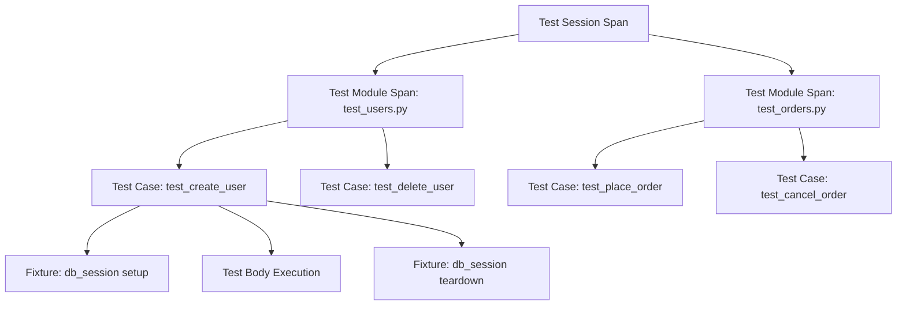

# How to Use pytest-opentelemetry for Python Test Observability

Author: [nawazdhandala](https://www.github.com/nawazdhandala)

Tags: OpenTelemetry, Python, pytest, Testing, Observability, Tracing

Description: Learn how to instrument your Python test suites with pytest-opentelemetry to gain deep observability into test execution, failures, and performance bottlenecks.

---

Running a test suite and seeing a pass/fail summary is fine for small projects. But once your test suite grows into hundreds or thousands of tests, you need more than a binary outcome. You need to understand which tests are slow, which ones are flaky, and how test execution patterns change over time. That is where pytest-opentelemetry comes in.

The pytest-opentelemetry plugin instruments your pytest runs with OpenTelemetry tracing. Every test session, module, and individual test case becomes a span in a distributed trace. You can export these spans to any OpenTelemetry-compatible backend and analyze them the same way you would analyze production traces.

## Why Trace Your Tests

Traditional test output tells you what failed. Tracing tells you why things are slow, where time is spent, and how test execution flows through your codebase. When you send test traces to an observability backend, you can:

- Identify the slowest tests and track their performance over time
- Detect flaky tests by correlating failures with specific attributes
- Understand setup and teardown overhead for fixtures
- Visualize the full test session as a trace waterfall

This is especially valuable in CI/CD pipelines where test duration directly impacts deployment velocity.

## Installing pytest-opentelemetry

The plugin is available on PyPI and works with pytest 7.x and later. Install it alongside the OpenTelemetry SDK and an exporter of your choice.

```bash
# Install the pytest plugin and OTLP exporter
pip install pytest-opentelemetry opentelemetry-sdk opentelemetry-exporter-otlp

# Verify the plugin is recognized by pytest
pytest --co -q 2>&1 | head -5
```

Once installed, the plugin registers itself as a pytest plugin automatically. You do not need to add it to your conftest.py or any configuration file.

## Basic Configuration

The plugin uses the standard OpenTelemetry SDK configuration, so you can control its behavior through environment variables. This keeps your test code clean and lets you change the export destination without modifying any files.

```bash
# Set the OTLP endpoint where spans will be sent
export OTEL_EXPORTER_OTLP_ENDPOINT="http://localhost:4317"

# Name the service so you can filter test traces in your backend
export OTEL_SERVICE_NAME="my-app-tests"

# Set the resource attributes for additional context
export OTEL_RESOURCE_ATTRIBUTES="deployment.environment=ci,service.version=1.2.3"

# Run your tests normally; the plugin handles instrumentation
pytest tests/ -v
```

With those environment variables set, every pytest run will produce spans and export them to your collector or backend. The service name is particularly important because it lets you distinguish test traces from production traces in the same observability platform.

## Understanding the Span Hierarchy

The plugin creates a structured hierarchy of spans that mirrors the pytest execution model. This hierarchy makes it easy to drill down from a high-level session overview to individual test details.



The session span is the root. Each test module becomes a child span, and individual test cases nest under their module. If your tests call instrumented application code, those spans will also appear as children of the test case span, giving you a complete picture of what happened during each test.

## Writing Tests with Rich Span Attributes

You can enrich your test spans with custom attributes by accessing the OpenTelemetry tracer directly within your tests. This is useful for adding metadata that helps you filter and group tests in your backend.

```python
# conftest.py
import pytest
from opentelemetry import trace

# Get a tracer instance for adding custom spans within tests
tracer = trace.get_tracer("test-instrumentation")


@pytest.fixture
def traced_db(request):
    """Database fixture that adds tracing context to test spans."""
    # Get the current span (created by pytest-opentelemetry)
    current_span = trace.get_current_span()

    # Add attributes that describe the test environment
    current_span.set_attribute("db.system", "postgresql")
    current_span.set_attribute("db.name", "test_db")
    current_span.set_attribute("test.category", "integration")

    # Create the database connection within a child span
    with tracer.start_as_current_span("db.connect") as span:
        span.set_attribute("db.connection_string", "localhost:5432/test_db")
        connection = create_test_connection()
        yield connection

    # Teardown also gets its own span
    with tracer.start_as_current_span("db.disconnect") as span:
        connection.close()
```

Now every test that uses the `traced_db` fixture will have spans showing the database connection setup and teardown timing. The custom attributes let you search for all integration tests or all tests that use PostgreSQL.

## Capturing Test Failures as Span Events

When a test fails, pytest-opentelemetry automatically records the failure on the span. But you can add more context by recording events and exceptions explicitly.

```python
# test_users.py
import pytest
from opentelemetry import trace


def test_user_creation_with_validation(traced_db):
    """Test that demonstrates rich failure context in spans."""
    tracer = trace.get_tracer("test-instrumentation")
    current_span = trace.get_current_span()

    # Record a span event marking the start of a logical phase
    current_span.add_event("validation.start", {
        "validation.rules_count": 5,
        "validation.strict_mode": True,
    })

    user_data = {"name": "Alice", "email": "invalid-email"}

    try:
        # Attempt the operation that might fail
        result = create_user(traced_db, user_data)
    except ValidationError as e:
        # Record the exception with full context on the span
        current_span.record_exception(e)
        current_span.set_attribute("test.failure_reason", "validation")
        current_span.set_attribute("test.invalid_field", "email")
        raise

    # Record success context if we get here
    current_span.set_attribute("test.user_id", result.id)
    current_span.add_event("user.created", {
        "user.id": result.id,
        "user.email": user_data["email"],
    })
```

When you look at this test's trace in your backend, you will see the validation start event, the exception event with the full stack trace, and the custom attributes describing why the failure happened. This is far more useful than a bare assertion error in a log file.

## CI/CD Pipeline Integration

The real power of test observability shows up in CI/CD pipelines. You can configure your pipeline to send test traces to the same backend as your production telemetry, letting you correlate deployment events with test behavior.

```yaml
# .github/workflows/test.yml
name: Test Suite

on: [push, pull_request]

jobs:
  test:
    runs-on: ubuntu-latest
    services:
      # Run a collector sidecar to receive test spans
      otel-collector:
        image: otel/opentelemetry-collector-contrib:latest
        ports:
          - 4317:4317

    steps:
      - uses: actions/checkout@v4

      - name: Install dependencies
        run: pip install -r requirements-test.txt

      - name: Run tests with tracing
        env:
          OTEL_EXPORTER_OTLP_ENDPOINT: "http://localhost:4317"
          OTEL_SERVICE_NAME: "my-app-tests"
          # Add CI-specific attributes for filtering
          OTEL_RESOURCE_ATTRIBUTES: >-
            ci.pipeline.id=${{ github.run_id }},
            ci.branch=${{ github.ref_name }},
            ci.commit.sha=${{ github.sha }}
        run: pytest tests/ -v --tb=short
```

The resource attributes include the pipeline ID, branch name, and commit SHA. These attributes let you query your backend for all test runs on a specific branch or see how test duration changed across commits.

## Analyzing Test Traces in Your Backend

Once spans are flowing into your backend, you can build dashboards and alerts around test performance. Here are some queries you might find useful.

To find the slowest tests over the last 24 hours, filter by the service name and sort by span duration. To detect flaky tests, look for test case spans that have both passed and failed statuses within the same time window. To track test suite duration trends, plot the duration of the session span over time grouped by branch.

```python
# Example: Local analysis script using the console exporter
# Useful for quick debugging without a backend
from opentelemetry import trace
from opentelemetry.sdk.trace import TracerProvider
from opentelemetry.sdk.trace.export import (
    ConsoleSpanExporter,
    SimpleSpanProcessor,
)

# Configure a console exporter for local debugging
provider = TracerProvider()
# SimpleSpanProcessor exports spans immediately (good for testing)
processor = SimpleSpanProcessor(ConsoleSpanExporter())
provider.add_span_processor(processor)
trace.set_tracer_provider(provider)

# Now run pytest programmatically
import pytest

# The plugin will use the configured provider
pytest.main(["tests/", "-v", "--tb=short"])
```

This script sets up a console exporter so you can see the raw span data in your terminal. It is a quick way to verify that the plugin is working before you point it at a real backend.

## Filtering and Sampling Test Spans

In large test suites, exporting every span for every test run can produce a lot of data. You can use the OpenTelemetry SDK's built-in sampling to control the volume.

```python
# conftest.py
from opentelemetry import trace
from opentelemetry.sdk.trace import TracerProvider
from opentelemetry.sdk.trace.sampling import TraceIdRatioBased

# Sample 25% of test traces in CI to reduce volume
# Use 100% sampling locally for full visibility
import os

sample_rate = 1.0 if os.getenv("CI") is None else 0.25
sampler = TraceIdRatioBased(sample_rate)

provider = TracerProvider(sampler=sampler)
trace.set_tracer_provider(provider)
```

On your local machine, every test run is fully traced. In CI, only 25% of runs produce full traces, keeping your data volume manageable while still giving you enough data to spot trends and outliers.

## Wrapping Up

Test observability is an underappreciated aspect of software reliability. By instrumenting your pytest runs with pytest-opentelemetry, you transform opaque pass/fail results into rich, queryable telemetry data. You can track test performance over time, catch flaky tests before they erode developer confidence, and understand exactly where time is spent during test execution.

The setup is minimal. Install the plugin, set a few environment variables, and your existing tests start producing spans. From there, you can add custom attributes, integrate with CI/CD, and build dashboards that give your team real visibility into the health of your test suite.
