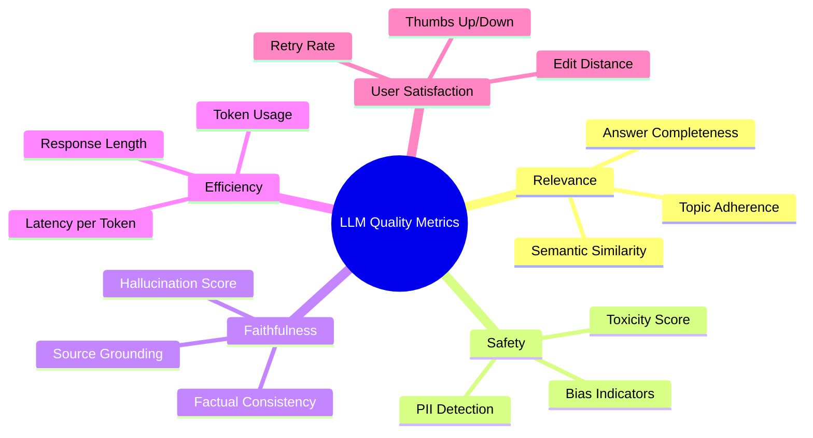
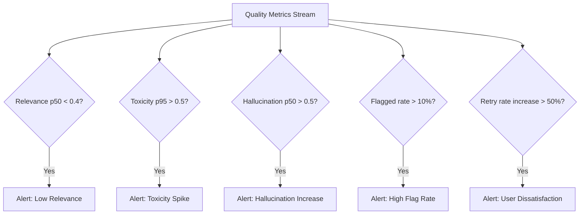

# How to Implement Quality Metrics for LLM Outputs Using OpenTelemetry Custom Metrics

Author: [nawazdhandala](https://www.github.com/nawazdhandala)

Tags: OpenTelemetry, LLM, Metrics, AI Quality, Custom Metrics, Observability, GenAI

Description: Learn how to build custom OpenTelemetry metrics to measure and monitor the quality of LLM outputs including relevance, toxicity, hallucination scores, and latency in production.

---

Running a large language model in production is one thing. Knowing whether it's actually producing good outputs is something else entirely. You can measure latency, throughput, and error rates with standard observability tools, but those metrics tell you nothing about the quality of what the model is saying. Is it hallucinating? Are the responses relevant to the user's question? Is the output too verbose or too terse?

This is where custom OpenTelemetry metrics come in. By defining metrics that capture quality dimensions specific to LLM outputs, you can build dashboards and alerts that tell you when your model's behavior is drifting. In this post, we'll implement a practical quality metrics system using OpenTelemetry's metrics API.

## What Quality Metrics Should You Track?

Before writing any code, let's think about what "quality" means for LLM outputs. Here are the dimensions that matter most in production:



You probably won't track all of these on day one. Start with the ones that matter most for your use case and add more over time.

## Setting Up Custom Metrics

Let's configure the OpenTelemetry metrics SDK and create our quality metrics instruments. We'll use histograms for distribution-based metrics and counters for categorical ones.

```python
# quality_metrics.py - Define custom OpenTelemetry metrics for LLM quality

from opentelemetry import metrics
from opentelemetry.sdk.metrics import MeterProvider
from opentelemetry.sdk.metrics.export import PeriodicExportingMetricReader
from opentelemetry.exporter.otlp.proto.grpc.metric_exporter import OTLPMetricExporter
from opentelemetry.sdk.resources import Resource

def setup_quality_metrics():
    resource = Resource.create({
        "service.name": "llm-quality-monitor",
        "service.version": "1.0.0",
    })

    # Export metrics every 15 seconds
    exporter = OTLPMetricExporter(endpoint="http://localhost:4317", insecure=True)
    reader = PeriodicExportingMetricReader(exporter, export_interval_millis=15000)

    provider = MeterProvider(resource=resource, metric_readers=[reader])
    metrics.set_meter_provider(provider)

    meter = metrics.get_meter("llm.quality", version="1.0.0")

    # Histogram for relevance scores (0.0 to 1.0)
    relevance_score = meter.create_histogram(
        name="llm.quality.relevance_score",
        description="Semantic relevance of LLM output to the input prompt",
        unit="score",
    )

    # Histogram for hallucination scores (0.0 = no hallucination, 1.0 = fully hallucinated)
    hallucination_score = meter.create_histogram(
        name="llm.quality.hallucination_score",
        description="Estimated hallucination level of LLM output",
        unit="score",
    )

    # Histogram for toxicity scores
    toxicity_score = meter.create_histogram(
        name="llm.quality.toxicity_score",
        description="Toxicity level detected in LLM output",
        unit="score",
    )

    # Histogram for output length in tokens
    output_tokens = meter.create_histogram(
        name="llm.output.token_count",
        description="Number of tokens in LLM output",
        unit="tokens",
    )

    # Counter for outputs flagged by quality checks
    flagged_outputs = meter.create_counter(
        name="llm.quality.flagged_outputs",
        description="Number of LLM outputs flagged by quality checks",
    )

    # Histogram for latency per output token
    latency_per_token = meter.create_histogram(
        name="llm.latency.per_token",
        description="Average latency per generated token",
        unit="ms",
    )

    return {
        "relevance": relevance_score,
        "hallucination": hallucination_score,
        "toxicity": toxicity_score,
        "output_tokens": output_tokens,
        "flagged": flagged_outputs,
        "latency_per_token": latency_per_token,
    }
```

## Building the Quality Evaluator

Now let's build the component that actually computes these quality scores. We'll use a combination of embedding similarity for relevance, a lightweight classifier for toxicity, and a simple heuristic for hallucination detection.

```python
# quality_evaluator.py - Compute quality scores for LLM outputs

from sentence_transformers import SentenceTransformer
import numpy as np
from transformers import pipeline as hf_pipeline

class LLMQualityEvaluator:
    def __init__(self):
        # Embedding model for computing semantic similarity
        self.embedding_model = SentenceTransformer("all-MiniLM-L6-v2")

        # Toxicity classifier from Hugging Face
        self.toxicity_classifier = hf_pipeline(
            "text-classification",
            model="unitary/toxic-bert",
            truncation=True,
        )

    def compute_relevance(self, prompt: str, response: str) -> float:
        """Compute cosine similarity between prompt and response embeddings."""
        embeddings = self.embedding_model.encode([prompt, response])
        # Cosine similarity between the two embeddings
        similarity = np.dot(embeddings[0], embeddings[1]) / (
            np.linalg.norm(embeddings[0]) * np.linalg.norm(embeddings[1])
        )
        # Clamp to [0, 1] range
        return float(max(0.0, min(1.0, similarity)))

    def compute_toxicity(self, text: str) -> float:
        """Run toxicity classification and return the toxic probability."""
        result = self.toxicity_classifier(text)
        # The model returns a label and score
        if result[0]["label"] == "toxic":
            return float(result[0]["score"])
        else:
            return 1.0 - float(result[0]["score"])

    def compute_hallucination_score(self, response: str, context: str = None) -> float:
        """Estimate hallucination by checking response grounding against context.

        This is a simplified version. In production, you'd use a dedicated
        NLI model or a more sophisticated grounding check.
        """
        if context is None:
            # Without context, we can only check for common hallucination patterns
            return self._heuristic_hallucination_check(response)

        # With context, check how well the response is grounded
        response_embedding = self.embedding_model.encode([response])
        context_embedding = self.embedding_model.encode([context])

        grounding_score = np.dot(response_embedding[0], context_embedding[0]) / (
            np.linalg.norm(response_embedding[0]) * np.linalg.norm(context_embedding[0])
        )

        # Invert: high grounding = low hallucination
        return float(max(0.0, 1.0 - grounding_score))

    def _heuristic_hallucination_check(self, text: str) -> float:
        """Simple heuristic checks for common hallucination indicators."""
        score = 0.0
        indicators = [
            "as an AI",  # Self-referencing can indicate confabulation
            "I don't have access to",
            "I cannot verify",
            "studies show that",  # Vague citation without specifics
            "research indicates",
        ]
        for indicator in indicators:
            if indicator.lower() in text.lower():
                score += 0.15
        return min(1.0, score)
```

## Integrating Quality Metrics into the LLM Serving Pipeline

Here's where we connect the quality evaluator to the OpenTelemetry metrics. Every time the LLM generates a response, we evaluate it and record the quality scores.

```python
# llm_service.py - LLM service with quality metrics integration

import time
from opentelemetry import trace, metrics
from quality_evaluator import LLMQualityEvaluator
from quality_metrics import setup_quality_metrics
import openai

tracer = trace.get_tracer("llm.service")
quality_instruments = setup_quality_metrics()
evaluator = LLMQualityEvaluator()

def generate_and_measure(
    prompt: str,
    model: str = "gpt-4",
    context: str = None,
    temperature: float = 0.7,
) -> dict:
    """Generate LLM response and record quality metrics."""

    # Common attributes attached to all metrics for this request
    metric_attrs = {
        "llm.model": model,
        "llm.temperature": str(temperature),
    }

    with tracer.start_as_current_span("llm.generate") as span:
        span.set_attribute("llm.model", model)
        span.set_attribute("llm.prompt_length", len(prompt))

        # Time the generation
        start = time.time()

        # Call the LLM API
        response = openai.chat.completions.create(
            model=model,
            messages=[{"role": "user", "content": prompt}],
            temperature=temperature,
        )

        generation_time_ms = (time.time() - start) * 1000
        output_text = response.choices[0].message.content
        output_token_count = response.usage.completion_tokens

        # Record basic output metrics
        quality_instruments["output_tokens"].record(output_token_count, metric_attrs)
        quality_instruments["latency_per_token"].record(
            generation_time_ms / max(output_token_count, 1), metric_attrs
        )

        # Run quality evaluations
        with tracer.start_as_current_span("llm.quality_evaluation"):
            # Relevance check
            relevance = evaluator.compute_relevance(prompt, output_text)
            quality_instruments["relevance"].record(relevance, metric_attrs)

            # Toxicity check
            toxicity = evaluator.compute_toxicity(output_text)
            quality_instruments["toxicity"].record(toxicity, metric_attrs)

            # Hallucination check
            hallucination = evaluator.compute_hallucination_score(output_text, context)
            quality_instruments["hallucination"].record(hallucination, metric_attrs)

            # Flag the output if any quality check fails thresholds
            flagged = False
            flag_reasons = []

            if relevance < 0.3:
                flagged = True
                flag_reasons.append("low_relevance")
            if toxicity > 0.7:
                flagged = True
                flag_reasons.append("high_toxicity")
            if hallucination > 0.6:
                flagged = True
                flag_reasons.append("high_hallucination")

            if flagged:
                for reason in flag_reasons:
                    quality_instruments["flagged"].add(1, {
                        **metric_attrs,
                        "flag.reason": reason,
                    })

        span.set_attribute("quality.relevance", relevance)
        span.set_attribute("quality.toxicity", toxicity)
        span.set_attribute("quality.hallucination", hallucination)
        span.set_attribute("quality.flagged", flagged)

        return {
            "output": output_text,
            "quality": {
                "relevance": relevance,
                "toxicity": toxicity,
                "hallucination": hallucination,
                "flagged": flagged,
                "flag_reasons": flag_reasons,
            },
        }
```

## Recording User Feedback as Metrics

Automated quality scores are helpful, but user feedback is the ground truth. Let's add metrics for capturing user satisfaction signals.

```python
# feedback_metrics.py - Record user feedback as OpenTelemetry metrics

from opentelemetry import metrics

meter = metrics.get_meter("llm.feedback")

# Counter for thumbs up/down
feedback_counter = meter.create_counter(
    name="llm.feedback.votes",
    description="User feedback votes on LLM outputs",
)

# Histogram for user-provided ratings (e.g., 1-5 stars)
rating_histogram = meter.create_histogram(
    name="llm.feedback.rating",
    description="User ratings of LLM output quality",
    unit="stars",
)

# Counter for how often users retry a prompt (indicates dissatisfaction)
retry_counter = meter.create_counter(
    name="llm.feedback.retries",
    description="Number of times users retry the same or similar prompt",
)

def record_feedback(request_id: str, model: str, vote: str, rating: int = None):
    """Record user feedback on a specific LLM output.

    Args:
        request_id: The ID of the original request
        model: The model that generated the response
        vote: Either 'up' or 'down'
        rating: Optional 1-5 star rating
    """
    attrs = {
        "llm.model": model,
        "feedback.vote": vote,
    }

    # Record the vote
    feedback_counter.add(1, attrs)

    # Record the star rating if provided
    if rating is not None:
        rating_histogram.record(rating, {"llm.model": model})

def record_retry(model: str):
    """Record when a user retries a prompt, suggesting the first response was poor."""
    retry_counter.add(1, {"llm.model": model})
```

## Setting Up Alerts on Quality Degradation

Once you have metrics flowing, you'll want to alert when quality drops. Here's a conceptual view of what your alerting rules might look like:



The specific thresholds will depend on your application. A creative writing assistant can tolerate higher "hallucination" scores than a medical information system. Start with conservative thresholds and adjust based on what you observe.

## Comparing Quality Across Model Versions

One of the most valuable uses of quality metrics is comparing model versions during A/B tests or rollouts. Since every metric includes the model name as an attribute, you can slice your dashboards by model.

```python
# ab_test_wrapper.py - A/B test wrapper that routes traffic and tracks quality per variant

import random
from llm_service import generate_and_measure

def ab_test_generate(prompt: str, context: str = None) -> dict:
    """Route requests to different model versions and track quality metrics per variant."""

    # Simple random routing - in production, use a proper feature flag system
    if random.random() < 0.5:
        model = "gpt-4"
    else:
        model = "gpt-4-turbo"

    # The quality metrics will automatically be tagged with the model name,
    # so you can compare quality distributions across variants in your dashboard
    return generate_and_measure(
        prompt=prompt,
        model=model,
        context=context,
    )
```

With this setup, your metrics backend will have separate histograms for each model variant. You can compare the relevance distribution of gpt-4 vs gpt-4-turbo, see if one has a higher hallucination rate, and make data-driven decisions about which model to promote.

## Metric Cardinality Considerations

A word of caution on attribute cardinality. It might be tempting to add attributes like `prompt.category` or `user.segment` to your quality metrics. That's fine as long as the number of distinct values is bounded. Don't add attributes with unbounded cardinality (like user IDs or full prompt text) to metrics instruments. This will cause your metrics backend to create a separate time series for each unique combination, which leads to storage explosion and slow queries.

Good metric attributes:
- `llm.model` (bounded: you have a fixed set of models)
- `flag.reason` (bounded: you define the reasons)
- `prompt.category` (bounded: if you have a fixed taxonomy)

Bad metric attributes:
- `user.id` (unbounded: grows with your user base)
- `prompt.text` (unbounded: every request is different)
- `request.id` (unbounded: every request is unique)

For request-level detail, use span attributes in traces rather than metric attributes.

## Conclusion

Quality metrics for LLM outputs fill a critical gap in ML observability. Standard infrastructure metrics tell you if your system is running, but quality metrics tell you if it's running well. By using OpenTelemetry's custom metrics to track relevance, toxicity, hallucination, and user feedback, you can detect quality regressions early, compare model versions objectively, and build confidence that your LLM is behaving the way you expect.

Start with a few key metrics, set up meaningful alerts, and iterate from there. The quality of your LLM monitoring will improve alongside the quality of your LLM outputs.
