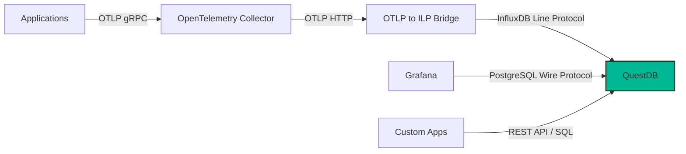

# How to Use QuestDB for OpenTelemetry Time-Series Metrics

Author: [nawazdhandala](https://www.github.com/nawazdhandala)

Tags: OpenTelemetry, QuestDB, Time-Series, Metric, SQL, Observability

Description: Learn how to use QuestDB as a high-performance time-series database for storing and querying OpenTelemetry metrics with standard SQL and fast analytical queries.

---

QuestDB is a high-performance time-series database built for fast ingestion and analytical queries. It uses a column-oriented storage engine and supports standard SQL, which makes it accessible to anyone who has worked with relational databases. For OpenTelemetry workloads, QuestDB offers an interesting alternative to purpose-built metrics databases because you can write complex analytical queries using familiar SQL syntax rather than learning a specialized query language. In this guide, we will set up a pipeline that collects OpenTelemetry metrics and stores them in QuestDB for analysis.

## Why QuestDB for OpenTelemetry Metrics

Most time-series databases for metrics use custom query languages. Prometheus has PromQL, InfluxDB has Flux, and TimescaleDB requires PostgreSQL extensions. QuestDB takes a different approach by providing fast time-series operations through standard SQL with a few targeted extensions.

QuestDB can ingest millions of rows per second on a single machine. It achieves this through a zero-GC Java implementation with memory-mapped storage and SIMD-accelerated query execution. For OpenTelemetry metrics that arrive at high frequency from many services, this ingestion speed means you do not need to worry about buffering or dropping data.

The SQL interface is particularly valuable for teams where not everyone is an observability specialist. Developers and data analysts who know SQL can write their own queries against metrics data without learning a new language.

## Architecture Overview

The pipeline uses the OpenTelemetry Collector to receive metrics and export them to a small OTLP HTTP bridge. The bridge writes the metrics to QuestDB via the InfluxDB line protocol (ILP), which QuestDB supports natively for high-speed ingestion.


```mermaid
graph LR
    A[Applications] -->|OTLP gRPC| B[OpenTelemetry Collector]
    B -->|OTLP HTTP| F[OTLP to ILP Bridge]
    F -->|InfluxDB Line Protocol| C[QuestDB]
    D[Grafana] -->|PostgreSQL Wire Protocol| C
    E[Custom Apps] -->|REST API / SQL| C
    style C fill:#00b894,stroke:#333,stroke-width:2px
```

QuestDB supports multiple ingestion protocols. ILP over HTTP is recommended for most production ingestion because it provides request-level feedback and retry behavior, while ILP over TCP has lower protocol overhead and is useful for simple high-throughput local pipelines. On the query side, QuestDB speaks the PostgreSQL wire protocol, so any PostgreSQL client or tool can connect to it.

## Deploying QuestDB

Start QuestDB using Docker:

```yaml
# docker-compose.yml for QuestDB

version: "3"

services:
  questdb:
    image: questdb/questdb:9.4.0
    ports:
      # Web console for interactive SQL queries
      - "9000:9000"
      # InfluxDB Line Protocol over TCP
      - "9009:9009"
      # PostgreSQL wire protocol for standard SQL clients
      - "8812:8812"
      # Health check and metrics endpoint
      - "9003:9003"
    volumes:
      - questdb_data:/var/lib/questdb
    environment:
      # Increase shared worker count for better query performance
      QDB_SHARED_WORKER_COUNT: 4
      # Set the maximum number of uncommitted rows before auto-commit
      QDB_CAIRO_MAX_UNCOMMITTED_ROWS: 500000
    restart: unless-stopped

volumes:
  questdb_data:
```

Start QuestDB and verify it is running:

```bash
# Start QuestDB
docker compose up -d

# Verify the web console is accessible
curl -s http://localhost:9000 | head -5

# Check the health endpoint
curl -s http://localhost:9003
# Should return OK
```

The web console at `http://localhost:9000` provides an interactive SQL editor where you can run queries and see results immediately.

## Creating the Metrics Table

Before ingesting data, create a table in QuestDB that will hold the OpenTelemetry metrics. QuestDB can auto-create tables from InfluxDB Line Protocol data, but defining the schema explicitly gives you more control over partitioning and data types.

Connect to QuestDB using the web console and run the following SQL:

```sql
-- Create a table for OpenTelemetry metrics
-- Partitioned by day for efficient time-range queries
CREATE TABLE IF NOT EXISTS otel_metrics (
    -- Timestamp of the metric data point
    timestamp TIMESTAMP,
    -- Name of the metric (e.g., http.server.request.duration)
    metric_name SYMBOL CAPACITY 1024,
    -- Service that emitted the metric
    service_name SYMBOL CAPACITY 256,
    -- Additional dimension attributes
    host_name SYMBOL CAPACITY 256,
    environment SYMBOL CAPACITY 32,
    -- Metric values
    value DOUBLE,
    -- Counter for aggregation
    count LONG
) TIMESTAMP(timestamp)
PARTITION BY DAY WAL
DEDUP UPSERT KEYS(timestamp, metric_name, service_name, host_name);
```

The `SYMBOL` type is QuestDB's dictionary-encoded string type, optimized for columns with a limited set of repeating values. This is perfect for dimension attributes like service names and metric names. The `PARTITION BY DAY` clause splits data into daily partitions, which allows QuestDB to efficiently prune partitions during time-range queries. The `WAL` keyword enables Write-Ahead Logging for durability.

## Configuring the OpenTelemetry Collector

The OpenTelemetry Collector does not have a native QuestDB exporter. The configuration below sends metrics to the bridge service using the stable OTLP HTTP exporter with JSON encoding, which keeps the bridge simple and lets the bridge map OTLP metrics into the `otel_metrics` table.

```yaml
# otel-collector-config.yml
receivers:
  # Accept OTLP metrics from instrumented applications
  otlp:
    protocols:
      grpc:
        endpoint: 0.0.0.0:4317
      http:
        endpoint: 0.0.0.0:4318

  # Collect host-level metrics
  hostmetrics:
    collection_interval: 15s
    scrapers:
      cpu:
      memory:
      disk:
      load:

processors:
  # Batch processor for efficient writes
  batch:
    timeout: 5s
    send_batch_size: 5000

  # Memory limiter prevents OOM
  memory_limiter:
    check_interval: 1s
    limit_mib: 256

exporters:
  # OTLP HTTP exporter sends JSON payloads to the bridge.
  # The exporter appends /v1/metrics to this base endpoint.
  otlp_http/questdb_bridge:
    endpoint: http://localhost:4319
    encoding: json

service:
  pipelines:
    metrics:
      receivers: [otlp, hostmetrics]
      processors: [memory_limiter, batch]
      exporters: [otlp_http/questdb_bridge]
```

Here is a Python bridge service that receives OTLP JSON data and writes gauge and sum data points to QuestDB using the ILP TCP protocol directly:

```python
# bridge.py - OTLP to QuestDB bridge
# This receives metrics from the Collector via OTLP HTTP
# and writes them to QuestDB using the ILP protocol

import socket
import time
from flask import Flask, request, jsonify

app = Flask(__name__)

# QuestDB ILP endpoint
QUESTDB_HOST = "localhost"
QUESTDB_ILP_PORT = 9009

def escape_ilp_tag(value):
    """Escape a value for use as an ILP measurement or tag value."""
    return str(value).replace("\\", "\\\\").replace(" ", "\\ ").replace(",", "\\,").replace("=", "\\=")

def send_to_questdb(metric_name, tags, value, timestamp_ns):
    """Send a single metric data point to QuestDB via ILP."""
    # Build the InfluxDB Line Protocol string
    # Format: measurement,tag1=val1,tag2=val2 field1=value timestamp
    tags = {"metric_name": metric_name, **tags}
    tag_str = ",".join(f"{escape_ilp_tag(k)}={escape_ilp_tag(v)}" for k, v in tags.items())
    line = f"otel_metrics,{tag_str} value={float(value)},count=1i {timestamp_ns}\n"

    # Send over TCP
    sock = socket.socket(socket.AF_INET, socket.SOCK_STREAM)
    try:
        sock.connect((QUESTDB_HOST, QUESTDB_ILP_PORT))
        sock.sendall(line.encode())
    finally:
        sock.close()

@app.route("/v1/metrics", methods=["POST"])
def receive_metrics():
    """Receive OTLP metrics and forward to QuestDB."""
    data = request.get_json()

    # Parse the OTLP JSON payload
    for resource_metric in data.get("resourceMetrics", []):
        # Extract resource attributes
        resource_attrs = {}
        for attr in resource_metric.get("resource", {}).get("attributes", []):
            resource_attrs[attr["key"]] = attr["value"].get("stringValue", "")

        service_name = resource_attrs.get("service.name", "unknown")
        host_name = resource_attrs.get("host.name", "unknown")
        environment = resource_attrs.get("deployment.environment.name", "unknown")

        for scope_metric in resource_metric.get("scopeMetrics", []):
            for metric in scope_metric.get("metrics", []):
                name = metric["name"]

                points = []
                if "gauge" in metric:
                    points = metric["gauge"].get("dataPoints", [])
                elif "sum" in metric:
                    points = metric["sum"].get("dataPoints", [])

                for dp in points:
                    value = dp.get("asDouble", dp.get("asInt", 0))
                    ts = dp.get("timeUnixNano", int(time.time() * 1e9))
                    tags = {
                        "service_name": service_name,
                        "host_name": host_name,
                        "environment": environment,
                    }
                    send_to_questdb(name, tags, value, ts)

    return jsonify({}), 200

if __name__ == "__main__":
    app.run(port=4319)
```

## Querying Metrics with SQL

Once metrics are flowing into QuestDB, you can query them using standard SQL with QuestDB's time-series extensions. Here are practical queries for OpenTelemetry metrics analysis.

```sql
-- Average metric value per service over the last hour
-- Uses QuestDB's SAMPLE BY for time-based aggregation
SELECT
    timestamp,
    service_name,
    metric_name,
    avg(value) AS avg_value,
    min(value) AS min_value,
    max(value) AS max_value,
    sum(count) AS total_points
FROM otel_metrics
WHERE timestamp > dateadd('h', -1, now())
SAMPLE BY 5m
ORDER BY timestamp DESC;
```

The `SAMPLE BY` clause is QuestDB's time-series extension to SQL. It groups rows into time buckets without requiring `GROUP BY` on the timestamp column. This is cleaner than writing `GROUP BY DATE_TRUNC(...)` and performs better internally.

```sql
-- Detect anomalies by comparing current values to the 24h average
-- Useful for spotting services that are behaving differently than usual
WITH
    current_window AS (
        SELECT
            service_name,
            metric_name,
            avg(value) AS current_avg
        FROM otel_metrics
        WHERE timestamp > dateadd('m', -15, now())
        GROUP BY service_name, metric_name
    ),
    daily_window AS (
        SELECT
            service_name,
            metric_name,
            avg(value) AS daily_avg
        FROM otel_metrics
        WHERE timestamp > dateadd('d', -1, now())
        GROUP BY service_name, metric_name
    )
SELECT
    current_window.service_name,
    current_window.metric_name,
    current_window.current_avg,
    daily_window.daily_avg
FROM current_window
JOIN daily_window ON (
    current_window.service_name = daily_window.service_name
    AND current_window.metric_name = daily_window.metric_name
)
WHERE current_window.current_avg > daily_window.daily_avg * 2;
```

```sql
-- Time-series trend for a specific metric
-- Returns data suitable for graphing
SELECT
    timestamp,
    service_name,
    avg(value) AS avg_value,
    count() AS data_points
FROM otel_metrics
WHERE
    metric_name = 'http.server.request.duration'
    AND timestamp > dateadd('h', -6, now())
SAMPLE BY 1m
ALIGN TO CALENDAR
ORDER BY timestamp;
```

The `ALIGN TO CALENDAR` modifier aligns the time buckets to clock boundaries (e.g., exactly on the minute), which produces cleaner charts.

## Connecting Grafana to QuestDB

QuestDB supports the PostgreSQL wire protocol, and the recommended Grafana integration is the official QuestDB data source plugin, which connects to QuestDB on the PostgreSQL wire port.

```yaml
# grafana/provisioning/datasources/questdb.yml
apiVersion: 1

datasources:
  - name: QuestDB
    type: questdb-questdb-datasource
    jsonData:
      # QuestDB PostgreSQL wire protocol endpoint
      server: questdb
      port: 8812
      username: admin
      tlsMode: disable
      maxOpenConnections: 10
    secureJsonData:
      password: quest
```

In Grafana, create panels using SQL queries. Use the `$__timeFilter(timestamp)` macro to automatically apply the dashboard time range:

```sql
-- Grafana panel query using the time filter macro
SELECT
    timestamp AS time,
    service_name,
    avg(value) AS value
FROM otel_metrics
WHERE
    $__timeFilter(timestamp)
    AND metric_name = 'system.cpu.utilization'
SAMPLE BY $__sampleByInterval
ORDER BY timestamp
```

## Data Retention

QuestDB supports automatic data retention through partition dropping. Set up a cron job or use QuestDB's built-in TTL (if available in your version) to remove old partitions:

```sql
-- Drop partitions older than 30 days
-- Run this periodically via a cron job or scheduled task
ALTER TABLE otel_metrics DROP PARTITION
WHERE timestamp < dateadd('d', -30, now());
```

Since the table is partitioned by day, this operation drops entire daily partitions without scanning individual rows, making it very fast.

## Performance Tuning

For production deployments, there are several QuestDB settings that impact performance with OpenTelemetry metrics workloads.

The `QDB_CAIRO_MAX_UNCOMMITTED_ROWS` setting controls how many rows QuestDB buffers before issuing a commit for a table. Higher values can improve ingestion throughput, while lower values make newly ingested data visible to queries sooner. The default is 500,000 rows, which is a reasonable starting point for metrics workloads.

Use `SYMBOL` columns for all string attributes that have a bounded set of values. Symbols are stored as integers internally with a dictionary lookup, which is much more space-efficient and faster to query than regular strings.

## Summary

QuestDB provides a compelling option for storing and analyzing OpenTelemetry metrics when your team values SQL familiarity and fast analytical queries. The combination of high ingestion throughput, standard SQL with time-series extensions, and PostgreSQL wire protocol compatibility means you can integrate QuestDB into existing toolchains with minimal friction. By routing OpenTelemetry metrics through the Collector and into QuestDB, you get a pipeline that handles high-volume metrics ingestion while giving your team the power to analyze that data using the query language they already know.
