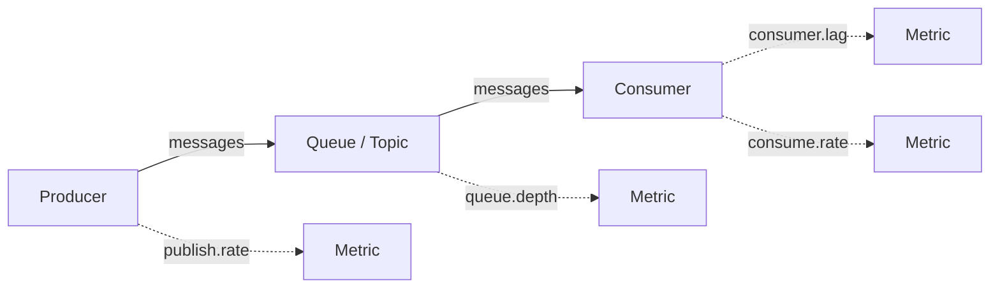

# How to Build a Queue Depth and Consumer Lag Dashboard from OpenTelemetry Messaging Metrics

Author: [nawazdhandala](https://www.github.com/nawazdhandala)

Tags: OpenTelemetry, Message Queues, Kafka, RabbitMQ, Consumer Lag

Description: Monitor message queue depth and consumer lag using OpenTelemetry messaging metrics for Kafka and RabbitMQ systems.

Message queues are the connective tissue of distributed systems, and when they back up, everything downstream suffers. Consumer lag - the gap between what producers have written and what consumers have processed - is one of the most important operational metrics for any event-driven architecture. Yet it is often the last thing teams instrument properly.

OpenTelemetry has semantic conventions for messaging systems that standardize how queue metrics are reported. This means you can build a single dashboard that covers Kafka, RabbitMQ, SQS, or any other broker, all using the same metric names and attribute schemas.

## What to Measure

There are four key signals for messaging health:



- **Queue depth** - number of messages waiting to be consumed
- **Consumer lag** - how far behind each consumer group is (Kafka-specific, measured in offsets)
- **Publish rate** - messages produced per second
- **Consume rate** - messages consumed per second

When publish rate exceeds consume rate, queue depth grows. When consumer lag grows, it means consumers are falling behind.

## Instrumenting Producers and Consumers

Here is how to instrument a Kafka producer and consumer with OpenTelemetry metrics in Python.

```python
# kafka_instrumentation.py
from opentelemetry import metrics
from opentelemetry import trace
from confluent_kafka import Producer, Consumer
import time

meter = metrics.get_meter("messaging.kafka")
tracer = trace.get_tracer("messaging.kafka")

# Counter for messages published
messages_published = meter.create_counter(
    name="messaging.publish.messages",
    description="Number of messages published",
    unit="{message}",
)

# Histogram for publish latency
publish_duration = meter.create_histogram(
    name="messaging.publish.duration",
    description="Time taken to publish a message",
    unit="ms",
)

# Counter for messages consumed
messages_consumed = meter.create_counter(
    name="messaging.receive.messages",
    description="Number of messages consumed",
    unit="{message}",
)

# Gauge for consumer lag per partition
consumer_lag_gauge = meter.create_observable_gauge(
    name="messaging.kafka.consumer.lag",
    description="Consumer group lag in number of offsets",
    unit="{offset}",
    callbacks=[lambda options: get_consumer_lag()],
)

def instrumented_produce(producer, topic, message):
    """Produce a message with OpenTelemetry instrumentation."""
    start = time.time()

    with tracer.start_as_current_span(
        f"{topic} publish",
        attributes={
            "messaging.system": "kafka",
            "messaging.destination.name": topic,
            "messaging.operation": "publish",
        }
    ):
        producer.produce(topic, value=message)
        producer.flush()

    elapsed_ms = (time.time() - start) * 1000
    labels = {
        "messaging.system": "kafka",
        "messaging.destination.name": topic,
    }
    messages_published.add(1, labels)
    publish_duration.record(elapsed_ms, labels)
```

## Collecting Queue Depth from the Broker

Consumer-side instrumentation tells you about processing, but queue depth and lag need to be collected from the broker itself. The OpenTelemetry Collector has receivers for this purpose.

For Kafka, use the `kafkametricsreceiver` that connects directly to the broker and scrapes topic and consumer group metrics.

```yaml
# otel-collector-kafka-metrics.yaml
receivers:
  # Scrape Kafka broker metrics directly
  kafkametrics:
    brokers:
      - kafka-broker-1:9092
      - kafka-broker-2:9092
      - kafka-broker-3:9092
    protocol_version: 3.5.0
    scrapers:
      - topics
      - consumers
    # Collect metrics every 30 seconds
    collection_interval: 30s

  # Also receive application-side metrics via OTLP
  otlp:
    protocols:
      grpc:
        endpoint: 0.0.0.0:4317

processors:
  batch:
    timeout: 10s

  # Add cluster identification
  resource:
    attributes:
      - key: kafka.cluster
        value: "prod-events"
        action: upsert

exporters:
  prometheusremotewrite:
    endpoint: http://prometheus:9090/api/v1/write

service:
  pipelines:
    metrics:
      receivers: [kafkametrics, otlp]
      processors: [resource, batch]
      exporters: [prometheusremotewrite]
```

For RabbitMQ, use the `rabbitmqreceiver` which collects queue-level metrics via the management API.

```yaml
# Additional receiver for RabbitMQ
receivers:
  rabbitmq:
    endpoint: http://rabbitmq:15672
    username: monitoring
    password: "${RABBITMQ_PASSWORD}"
    collection_interval: 30s
```

## Dashboard Queries

These PromQL queries power the key panels of the messaging dashboard.

```promql
# Queue depth across all topics
sum by (topic) (kafka_topic_partition_current_offset - kafka_consumer_group_offset)

# Consumer lag per consumer group
sum by (group, topic) (
  kafka_consumer_group_lag
)

# Publish rate per topic (messages per second)
sum by (topic) (
  rate(messaging_publish_messages_total[5m])
)

# Consume rate per consumer group
sum by (group, topic) (
  rate(messaging_receive_messages_total[5m])
)

# Publish vs consume rate difference (positive means queue is growing)
sum by (topic) (rate(messaging_publish_messages_total[5m]))
-
sum by (topic) (rate(messaging_receive_messages_total[5m]))

# Publish latency p99
histogram_quantile(0.99,
  sum(rate(messaging_publish_duration_bucket[5m])) by (le, topic)
)
```

## Dashboard Layout

**Row 1 - Queue Health at a Glance**: A stat panel per critical topic showing current queue depth with threshold coloring (green under 1000, yellow under 10000, red above). Next to it, a gauge showing the oldest unprocessed message age.

**Row 2 - Consumer Lag Trends**: Time series of consumer lag per consumer group. This is the most important panel - a steadily increasing line means consumers are falling behind and you need to scale them up or investigate processing bottlenecks.

**Row 3 - Throughput**: Publish rate and consume rate overlaid on the same chart per topic. When the publish line rises above the consume line, lag will start growing. Include a "rate difference" panel that shows the delta.

**Row 4 - Partition Distribution**: For Kafka, show message distribution across partitions. Uneven partition distribution means your partitioning key has hot spots.

**Row 5 - Processing Metrics**: Consumer processing duration histogram showing how long each message takes to process. If processing time increases, consumers fall behind even at constant publish rates.

## Alerting Rules

Set up alerts for the scenarios that need immediate attention.

```yaml
# alerting-rules.yaml for Prometheus
groups:
  - name: messaging-alerts
    rules:
      # Alert when consumer lag exceeds threshold
      - alert: HighConsumerLag
        expr: sum by (group, topic) (kafka_consumer_group_lag) > 50000
        for: 5m
        labels:
          severity: warning
        annotations:
          summary: "Consumer group {{ $labels.group }} lag on {{ $labels.topic }} is {{ $value }}"

      # Alert when queue depth is growing continuously
      - alert: QueueDepthGrowing
        expr: deriv(sum by (topic) (kafka_consumer_group_lag)[15m:1m]) > 100
        for: 10m
        labels:
          severity: critical
        annotations:
          summary: "Queue depth for {{ $labels.topic }} is growing at {{ $value }} per minute"
```

These alerts, combined with the dashboard, give you full visibility into your messaging infrastructure. When an alert fires, the dashboard provides the context you need to determine whether the issue is a slow consumer, a traffic spike, or a partition imbalance.
