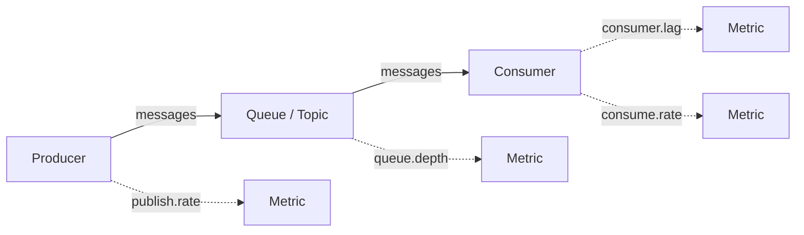

# How to Build a Queue Depth and Consumer Lag Dashboard from OpenTelemetry

Author: [nawazdhandala](https://www.github.com/nawazdhandala)

Tags: OpenTelemetry, Message Queue, Kafka, RabbitMQ, Consumer Lag

Description: Monitor message queue depth and consumer lag using OpenTelemetry messaging metrics for Kafka and RabbitMQ systems.

Message queues are the connective tissue of distributed systems, and when they back up, everything downstream suffers. Consumer lag - the gap between what producers have written and what consumers have processed - is one of the most important operational metrics for any event-driven architecture. Yet it is often the last thing teams instrument properly.

OpenTelemetry has semantic conventions for messaging client spans and metrics, and the Collector has broker-specific receivers for queue and consumer group metrics. This means you can build a single dashboard model for Kafka, RabbitMQ, SQS, or other brokers, while normalizing the broker-specific metric names that each receiver emits.

## What to Measure

There are four key signals for messaging health:


```mermaid
graph LR
    P[Producer] -->|messages| Q[Queue / Topic]
    Q -->|messages| C[Consumer]

    Q -.->|queue.depth| M1[Metric]
    C -.->|consumer.lag| M2[Metric]
    P -.->|publish.rate| M3[Metric]
    C -.->|consume.rate| M4[Metric]
```

- **Queue depth** - number of messages waiting to be consumed
- **Consumer lag** - how far behind each consumer group is (Kafka-specific, measured in offsets)
- **Publish rate** - messages produced per second
- **Consume rate** - messages consumed per second

When publish rate exceeds consume rate, queue depth grows. When consumer lag grows, it means consumers are falling behind.

## Instrumenting Producers and Consumers

Here is how to instrument a Kafka producer and consumer with OpenTelemetry metrics in Python.

```python
# kafka_instrumentation.py

from opentelemetry import metrics
from opentelemetry import trace
from confluent_kafka import Producer, Consumer, KafkaException
import time

meter = metrics.get_meter("messaging.kafka")
tracer = trace.get_tracer("messaging.kafka")

# Counter for messages published
messages_published = meter.create_counter(
    name="messaging.client.sent.messages",
    description="Number of messages the producer attempted to send",
    unit="{message}",
)

# Histogram for publish latency
publish_duration = meter.create_histogram(
    name="messaging.client.operation.duration",
    description="Duration of the Kafka send operation",
    unit="s",
)

# Counter for messages consumed
messages_consumed = meter.create_counter(
    name="messaging.client.consumed.messages",
    description="Number of messages consumed",
    unit="{message}",
)

# Histogram for consumer processing time
process_duration = meter.create_histogram(
    name="messaging.process.duration",
    description="Duration of processing a consumed message",
    unit="s",
)

def instrumented_produce(producer, topic, message):
    """Produce a message with OpenTelemetry instrumentation."""
    start = time.perf_counter()
    attributes = {
        "messaging.system": "kafka",
        "messaging.destination.name": topic,
        "messaging.operation.name": "send",
        "messaging.operation.type": "send",
        "topic": topic,
    }

    with tracer.start_as_current_span(
        f"{topic} send",
        attributes=attributes,
    ):
        producer.produce(topic, value=message)
        producer.flush()

    elapsed_s = time.perf_counter() - start
    messages_published.add(1, attributes)
    publish_duration.record(elapsed_s, attributes)

def instrumented_consume(consumer, handler, timeout=1.0):
    """Consume and process one Kafka message with OpenTelemetry instrumentation."""
    message = consumer.poll(timeout)
    if message is None:
        return None
    if message.error():
        raise KafkaException(message.error())

    start = time.perf_counter()
    attributes = {
        "messaging.system": "kafka",
        "messaging.destination.name": message.topic(),
        "messaging.destination.partition.id": str(message.partition()),
        "messaging.operation.name": "process",
        "messaging.operation.type": "process",
        "topic": message.topic(),
    }

    with tracer.start_as_current_span(
        f"{message.topic()} process",
        attributes=attributes,
    ):
        messages_consumed.add(1, attributes)
        handler(message)

    elapsed_s = time.perf_counter() - start
    process_duration.record(elapsed_s, attributes)
    return message
```

## Collecting Queue Depth from the Broker

Consumer-side instrumentation tells you about processing, but queue depth and lag need to be collected from the broker itself. The OpenTelemetry Collector has receivers for this purpose.

For Kafka, use the Kafka Metrics receiver that connects directly to the broker and scrapes topic and consumer group metrics.

```yaml
# otel-collector-kafka-metrics.yaml
receivers:
  # Scrape Kafka broker metrics directly
  kafka_metrics:
    brokers:
      - kafka-broker-1:9092
      - kafka-broker-2:9092
      - kafka-broker-3:9092
    protocol_version: 3.5.0
    scrapers:
      - topics
      - consumers
    # Collect metrics every 30 seconds
    collection_interval: 30s

  # Also receive application-side metrics via OTLP
  otlp:
    protocols:
      grpc:
        endpoint: 0.0.0.0:4317

processors:
  batch:
    timeout: 10s

  # Add cluster identification
  resource:
    attributes:
      - key: kafka.cluster
        value: "prod-events"
        action: upsert

exporters:
  prometheus_remote_write:
    endpoint: http://prometheus:9090/api/v1/write
    tls:
      insecure: true
    resource_to_telemetry_conversion:
      enabled: true

service:
  pipelines:
    metrics:
      receivers: [kafka_metrics, otlp]
      processors: [resource, batch]
      exporters: [prometheus_remote_write]
```

If you send remote write data to a vanilla Prometheus server, start Prometheus with `--web.enable-remote-write-receiver` so `/api/v1/write` accepts samples.

For RabbitMQ, use the `rabbitmqreceiver` which collects queue-level metrics via the management API.

```yaml
# Additional receiver for RabbitMQ
receivers:
  rabbitmq:
    endpoint: http://rabbitmq:15672
    username: monitoring
    password: "${env:RABBITMQ_PASSWORD}"
    collection_interval: 30s
```

## Dashboard Queries

These PromQL queries power the key panels of the messaging dashboard.

```promql
# Kafka backlog per topic and consumer group
sum by (group, topic) (kafka_consumer_group_lag)

# RabbitMQ ready messages per queue
sum by (rabbitmq_queue_name, rabbitmq_vhost_name) (
  rabbitmq_message_current{state="ready"}
)

# Consumer lag per consumer group
sum by (group, topic) (
  kafka_consumer_group_lag
)

# Publish rate per topic (messages per second)
sum by (topic) (
  rate(messaging_client_sent_messages_total[5m])
)

# Consume rate per consumer group
sum by (topic) (
  rate(messaging_client_consumed_messages_total[5m])
)

# Publish vs consume rate difference (positive means queue is growing)
sum by (topic) (rate(messaging_client_sent_messages_total[5m]))
-
sum by (topic) (rate(messaging_client_consumed_messages_total[5m]))

# Publish latency p99
histogram_quantile(0.99,
  sum(rate(messaging_client_operation_duration_seconds_bucket[5m])) by (le, topic)
)
```

## Dashboard Layout

**Row 1 - Queue Health at a Glance**: A stat panel per critical topic or queue showing current backlog with threshold coloring (green under 1000, yellow under 10000, red above). Next to it, show oldest unprocessed message age if your broker or application instrumentation exports that metric.

**Row 2 - Consumer Lag Trends**: Time series of consumer lag per consumer group. This is the most important panel - a steadily increasing line means consumers are falling behind and you need to scale them up or investigate processing bottlenecks.

**Row 3 - Throughput**: Publish rate and consume rate overlaid on the same chart per topic. When the publish line rises above the consume line, lag will start growing. Include a "rate difference" panel that shows the delta.

**Row 4 - Partition Distribution**: For Kafka, show message distribution across partitions. Uneven partition distribution means your partitioning key has hot spots.

**Row 5 - Processing Metrics**: Consumer processing duration histogram showing how long each message takes to process. If processing time increases, consumers fall behind even at constant publish rates.

## Alerting Rules

Set up alerts for the scenarios that need immediate attention.

```yaml
# alerting-rules.yaml for Prometheus
groups:
  - name: messaging-alerts
    rules:
      # Alert when consumer lag exceeds threshold
      - alert: HighConsumerLag
        expr: sum by (group, topic) (kafka_consumer_group_lag) > 50000
        for: 5m
        labels:
          severity: warning
        annotations:
          summary: "Consumer group {{ $labels.group }} lag on {{ $labels.topic }} is {{ $value }}"

      # Alert when Kafka consumer lag is growing continuously
      - alert: QueueDepthGrowing
        expr: deriv((sum by (topic) (kafka_consumer_group_lag))[15m:1m]) > 100
        for: 10m
        labels:
          severity: critical
        annotations:
          summary: "Consumer lag for {{ $labels.topic }} is growing at {{ $value }} offsets per second"
```

These alerts, combined with the dashboard, give you full visibility into your messaging infrastructure. When an alert fires, the dashboard provides the context you need to determine whether the issue is a slow consumer, a traffic spike, or a partition imbalance.
