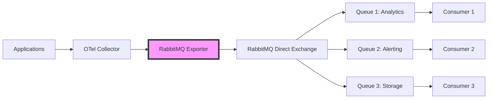

# How to Configure the RabbitMQ Exporter in the OpenTelemetry Collector

Author: [nawazdhandala](https://www.github.com/nawazdhandala)

Tags: OpenTelemetry, Collector, Exporter, RabbitMQ, Message Queue, AMQP, Event-Driven

Description: Learn how to configure the RabbitMQ exporter in the OpenTelemetry Collector to send telemetry data to RabbitMQ message queues for event-driven observability architectures.

The RabbitMQ exporter enables the OpenTelemetry Collector to send telemetry data to RabbitMQ message queues using the AMQP 0.9.1 protocol. This capability is valuable for event-driven architectures where you want to process telemetry data asynchronously, integrate with existing message-based workflows, or build decoupled observability pipelines.

## Understanding the RabbitMQ Exporter

RabbitMQ is a widely-used message broker that supports the Advanced Message Queuing Protocol (AMQP). By exporting telemetry data to RabbitMQ, you can leverage its message delivery features, routing capabilities, and extensive ecosystem of consumers.

The RabbitMQ exporter publishes traces, metrics, and logs as messages to RabbitMQ. By default, it publishes to the default direct exchange, and it can optionally publish to a named direct exchange. The exporter does not currently create exchanges, queues, or bindings, so those RabbitMQ entities must already exist.


```mermaid
graph LR
    A[Applications] --> B[OTel Collector]
    B --> C[RabbitMQ Exporter]
    C --> D[RabbitMQ Direct Exchange]
    D --> E[Queue 1: Analytics]
    D --> F[Queue 2: Alerting]
    D --> G[Queue 3: Storage]
    E --> H[Consumer 1]
    F --> I[Consumer 2]
    G --> J[Consumer 3]
    style C fill:#f9f,stroke:#333,stroke-width:4px
```

## Use Cases for RabbitMQ Export

The RabbitMQ exporter supports several important use cases:

**Asynchronous Processing**: Decouple telemetry collection from processing, allowing consumers to process data at their own pace without blocking the collector.

**Direct Routing**: Send telemetry data to one or more queues bound to a direct exchange with the configured routing key.

**Buffer and Backpressure**: Use RabbitMQ as a buffer during traffic spikes or when downstream systems are temporarily unavailable.

**Integration with Legacy Systems**: Connect OpenTelemetry to existing message-based workflows and systems that consume from RabbitMQ.

**Event-Driven Alerting**: Trigger alerts or workflows based on telemetry messages consumed from RabbitMQ queues.

## Basic Configuration

Here is a basic configuration for exporting telemetry data to RabbitMQ:

```yaml
receivers:
  # Receive telemetry via OTLP
  otlp:
    protocols:
      grpc:
        endpoint: 0.0.0.0:4317
      http:
        endpoint: 0.0.0.0:4318

processors:
  # Batch telemetry data
  batch:
    timeout: 10s
    send_batch_size: 512

exporters:
  # Configure RabbitMQ exporter
  rabbitmq:
    connection:
      endpoint: amqp://localhost:5672
      auth:
        plain:
          username: guest
          password: guest
    routing:
      routing_key: otlp_spans
    durable: true

service:
  pipelines:
    traces:
      receivers: [otlp]
      processors: [batch]
      exporters: [rabbitmq]
```

This configuration connects to a local RabbitMQ instance and publishes trace data to the default exchange with the routing key "otlp_spans". With the default exchange, RabbitMQ routes the message to a queue with the same name as the routing key, so a queue named "otlp_spans" must already exist.

## Exchange Types and Routing

RabbitMQ supports several exchange types that determine how messages are routed to queues. The RabbitMQ exporter currently supports the default exchange or a named direct exchange:

```yaml
receivers:
  otlp:
    protocols:
      grpc:
        endpoint: 0.0.0.0:4317

processors:
  batch:
    timeout: 10s

exporters:
  # Default exchange: routes to a queue whose name matches the routing key
  rabbitmq/default:
    connection:
      endpoint: amqp://rabbitmq.example.com:5672
      auth:
        plain:
          username: user
          password: password
    routing:
      routing_key: otlp_spans
    durable: true

  # Named direct exchange: exchange and queue bindings must already exist
  rabbitmq/direct:
    connection:
      endpoint: amqp://rabbitmq.example.com:5672
      auth:
        plain:
          username: user
          password: password
    routing:
      exchange: telemetry-direct
      routing_key: traces
    durable: true

service:
  pipelines:
    traces/default:
      receivers: [otlp]
      processors: [batch]
      exporters: [rabbitmq/default]

    traces/direct:
      receivers: [otlp]
      processors: [batch]
      exporters: [rabbitmq/direct]
```

**Direct Exchange**: Routes messages to queues whose binding key exactly matches the routing key. This is the exchange type supported by the RabbitMQ exporter.

**Topic Exchange**: Routes messages based on pattern matching between the routing key and binding patterns. RabbitMQ supports topic exchanges, but the current OpenTelemetry Collector RabbitMQ exporter does not support configuring topic exchanges.

**Fanout Exchange**: Broadcasts messages to all bound queues, ignoring routing keys. RabbitMQ supports fanout exchanges, but the current OpenTelemetry Collector RabbitMQ exporter does not support configuring fanout exchanges.

## Secure Connection Configuration

For production environments, secure the connection to RabbitMQ using TLS and authentication:

```yaml
receivers:
  otlp:
    protocols:
      grpc:
        endpoint: 0.0.0.0:4317

processors:
  batch:
    timeout: 10s

exporters:
  rabbitmq:
    connection:
      endpoint: amqps://rabbitmq.example.com:5671
      vhost: production
      auth:
        plain:
          username: username
          password: password
      tls:
        insecure: false
        ca_file: /etc/ssl/certs/rabbitmq-ca.crt
        cert_file: /etc/ssl/certs/client.crt
        key_file: /etc/ssl/private/client.key
        server_name_override: rabbitmq.example.com
      connection_timeout: 30s
      heartbeat: 60s
      publish_confirmation_timeout: 30s
      name: otel-collector-traces
    routing:
      exchange: telemetry-direct
      routing_key: otlp_spans
    durable: true
    retry_on_failure:
      enabled: true
      initial_interval: 5s
      max_interval: 30s
      max_elapsed_time: 300s

service:
  pipelines:
    traces:
      receivers: [otlp]
      processors: [batch]
      exporters: [rabbitmq]
```

TLS encryption protects telemetry data in transit. The `durable` setting marks published messages as persistent, but durable queues are still required on the RabbitMQ side if messages need to survive broker restarts.

## Multiple Pipeline Configuration

Configure different exporters for different telemetry signals with appropriate routing:

```yaml
receivers:
  otlp:
    protocols:
      grpc:
        endpoint: 0.0.0.0:4317

processors:
  batch/traces:
    timeout: 10s
    send_batch_size: 512

  batch/metrics:
    timeout: 30s
    send_batch_size: 1024

  batch/logs:
    timeout: 10s
    send_batch_size: 512

exporters:
  # Traces to RabbitMQ
  rabbitmq/traces:
    connection:
      endpoint: amqp://rabbitmq.example.com:5672
      auth:
        plain:
          username: user
          password: password
    routing:
      exchange: telemetry-direct
      routing_key: otlp_spans
    durable: true

  # Metrics to RabbitMQ
  rabbitmq/metrics:
    connection:
      endpoint: amqp://rabbitmq.example.com:5672
      auth:
        plain:
          username: user
          password: password
    routing:
      exchange: telemetry-direct
      routing_key: otlp_metrics
    durable: true

  # Logs to RabbitMQ
  rabbitmq/logs:
    connection:
      endpoint: amqp://rabbitmq.example.com:5672
      auth:
        plain:
          username: user
          password: password
    routing:
      exchange: telemetry-direct
      routing_key: otlp_logs
    durable: true

service:
  pipelines:
    traces:
      receivers: [otlp]
      processors: [batch/traces]
      exporters: [rabbitmq/traces]

    metrics:
      receivers: [otlp]
      processors: [batch/metrics]
      exporters: [rabbitmq/metrics]

    logs:
      receivers: [otlp]
      processors: [batch/logs]
      exporters: [rabbitmq/logs]
```

Separate pipelines allow you to configure different batching strategies and routing keys for each signal type. If you omit `routing.routing_key`, the exporter uses `otlp_spans` for traces, `otlp_metrics` for metrics, and `otlp_logs` for logs.

## Dynamic Routing with Message Attributes

The current RabbitMQ exporter uses a static routing key per exporter instance. To route by service, environment, or severity, configure separate exporter instances and route telemetry through separate Collector pipelines or separate Collector configurations:

```yaml
receivers:
  otlp:
    protocols:
      grpc:
        endpoint: 0.0.0.0:4317

processors:
  batch:
    timeout: 10s

exporters:
  rabbitmq/production:
    connection:
      endpoint: amqp://rabbitmq.example.com:5672
      auth:
        plain:
          username: user
          password: password
    routing:
      exchange: telemetry-direct
      routing_key: otlp_spans_production
    durable: true

service:
  pipelines:
    traces:
      receivers: [otlp]
      processors: [batch]
      exporters: [rabbitmq/production]
```

This configuration sends the traces in this pipeline to a static routing key, such as "otlp_spans_production". The current exporter does not support routing key templates or templated RabbitMQ message headers.

## Message Encoding Options

By default, the RabbitMQ exporter serializes telemetry with OTLP Protocol Buffers. You can configure an OTLP encoding extension when consumers need OTLP JSON:

```yaml
extensions:
  otlp_encoding/json:
    protocol: otlp_json

receivers:
  otlp:
    protocols:
      grpc:
        endpoint: 0.0.0.0:4317

processors:
  batch:
    timeout: 10s

exporters:
  # Default OTLP Protocol Buffers encoding
  rabbitmq/protobuf:
    connection:
      endpoint: amqp://rabbitmq.example.com:5672
      auth:
        plain:
          username: user
          password: password
    routing:
      exchange: telemetry-direct
      routing_key: otlp_spans_proto
    durable: true

  # OTLP JSON encoding
  rabbitmq/json:
    connection:
      endpoint: amqp://rabbitmq.example.com:5672
      auth:
        plain:
          username: user
          password: password
    routing:
      exchange: telemetry-direct
      routing_key: otlp_spans_json
    encoding_extension: otlp_encoding/json
    durable: true

service:
  extensions: [otlp_encoding/json]
  pipelines:
    traces/protobuf:
      receivers: [otlp]
      processors: [batch]
      exporters: [rabbitmq/protobuf]

    traces/json:
      receivers: [otlp]
      processors: [batch]
      exporters: [rabbitmq/json]
```

**OTLP JSON**: Human-readable, easier to debug, larger message size.

**OTLP Protocol Buffers**: Efficient binary format, smaller message size, requires OTLP schema knowledge.

**MessagePack**: RabbitMQ can carry MessagePack payloads, but the current RabbitMQ exporter does not provide a MessagePack encoding option.

## High Availability Configuration

Configure the exporter for reliable publishing with retries and RabbitMQ cluster endpoints managed outside the exporter:

```yaml
receivers:
  otlp:
    protocols:
      grpc:
        endpoint: 0.0.0.0:4317

processors:
  batch:
    timeout: 10s
    send_batch_size: 512

exporters:
  rabbitmq:
    connection:
      endpoint: amqp://rabbitmq.example.com:5672
      auth:
        plain:
          username: user
          password: password
      connection_timeout: 30s
      heartbeat: 60s
      publish_confirmation_timeout: 30s
    routing:
      exchange: telemetry-direct
      routing_key: otlp_spans
    durable: true
    retry_on_failure:
      enabled: true
      initial_interval: 5s
      max_interval: 30s
      max_elapsed_time: 300s

service:
  pipelines:
    traces:
      receivers: [otlp]
      processors: [batch]
      exporters: [rabbitmq]
```

For RabbitMQ clusters, point `connection.endpoint` at a stable endpoint such as a load balancer or service name. The current exporter accepts one endpoint per exporter instance and does not expose connection pool settings.

## Message Priority and TTL

Configure message priority and time-to-live on the RabbitMQ side when you need fine-grained control over message handling:

```yaml
receivers:
  otlp:
    protocols:
      grpc:
        endpoint: 0.0.0.0:4317

processors:
  batch:
    timeout: 10s

exporters:
  rabbitmq:
    connection:
      endpoint: amqp://rabbitmq.example.com:5672
      auth:
        plain:
          username: user
          password: password
    routing:
      exchange: telemetry-direct
      routing_key: otlp_spans
    durable: true

service:
  pipelines:
    traces:
      receivers: [otlp]
      processors: [batch]
      exporters: [rabbitmq]
```

Message priority and TTL are RabbitMQ message or queue features, but the current RabbitMQ exporter does not expose priority, expiration, or TTL configuration fields. Use RabbitMQ queue policies for TTL where appropriate.

## Consumer Example

Here is a Python example of consuming telemetry data from RabbitMQ:

```python
import pika
import json

# Connect to RabbitMQ
connection = pika.BlockingConnection(
    pika.ConnectionParameters(
        host='rabbitmq.example.com',
        port=5672,
        credentials=pika.PlainCredentials('user', 'password')
    )
)
channel = connection.channel()

# Declare exchange (should match existing RabbitMQ configuration)
channel.exchange_declare(
    exchange='telemetry-direct',
    exchange_type='direct',
    durable=True
)

# Declare queue
channel.queue_declare(queue='traces-consumer', durable=True)

# Bind queue to exchange with routing key
channel.queue_bind(
    exchange='telemetry-direct',
    queue='traces-consumer',
    routing_key='otlp_spans_json'
)

# Process messages
def callback(ch, method, properties, body):
    try:
        # Parse JSON message when the exporter uses an OTLP JSON encoding extension
        trace_data = json.loads(body)

        # Process trace data
        print(f"Received trace: {trace_data}")

        # Acknowledge message
        ch.basic_ack(delivery_tag=method.delivery_tag)
    except Exception as e:
        print(f"Error processing message: {e}")
        # Reject and requeue message
        ch.basic_nack(delivery_tag=method.delivery_tag, requeue=True)

# Start consuming
channel.basic_qos(prefetch_count=10)
channel.basic_consume(queue='traces-consumer', on_message_callback=callback)

print('Waiting for messages...')
channel.start_consuming()
```

This consumer connects to RabbitMQ, subscribes to trace messages, and processes them. If the exporter uses the default OTLP Protocol Buffers encoding, the consumer must decode OTLP protobuf payloads instead of calling `json.loads`.

## Monitoring and Performance

Monitor the RabbitMQ exporter to ensure reliable message delivery:

```yaml
receivers:
  otlp:
    protocols:
      grpc:
        endpoint: 0.0.0.0:4317

processors:
  batch:
    timeout: 10s

exporters:
  rabbitmq:
    connection:
      endpoint: amqp://rabbitmq.example.com:5672
      auth:
        plain:
          username: user
          password: password
    routing:
      exchange: telemetry-direct
      routing_key: otlp_spans
    durable: true

service:
  pipelines:
    traces:
      receivers: [otlp]
      processors: [batch]
      exporters: [rabbitmq]

  telemetry:
    logs:
      level: info
    metrics:
      level: detailed
      readers:
        - pull:
            exporter:
              prometheus:
                host: 0.0.0.0
                port: 8888
```

Monitor these key metrics:

- Exporter send and failure counts from the Collector's internal metrics
- Exporter queue size and capacity if a sending queue is enabled
- RabbitMQ connection health and publish errors in Collector logs
- Queue depth and consumer lag from RabbitMQ management metrics

For more details on collector monitoring, see our guide on [monitoring the OpenTelemetry Collector](https://oneuptime.com/blog/post/2026-02-06-google-cloud-monitoring-receiver-opentelemetry-collector/view).

## Best Practices

Follow these best practices when using the RabbitMQ exporter:

**Pre-create Exchanges and Queues**: Ensure the required direct exchange, queues, and bindings exist before starting the Collector.

**Use Durable Queues**: Ensure queues survive RabbitMQ restarts by making them durable.

**Enable Persistent Delivery**: Keep `durable: true` for critical telemetry data so messages are published as persistent.

**Use Publisher Confirm Timeouts**: Configure `publish_confirmation_timeout` to avoid waiting indefinitely for broker publish confirmations.

**Configure Retry on Failure**: Enable `retry_on_failure` so transient publish failures can be retried by the Collector.

**Set Appropriate TTL**: Use RabbitMQ queue policies to prevent unbounded queue growth when consumers lag.

**Monitor Queue Depth**: Track queue sizes to detect consumer lag or processing bottlenecks.

**Secure Connections**: Use TLS encryption and strong authentication in production environments.

**Choose Supported Routing**: Use the default exchange or a named direct exchange with pre-created bindings.

## Integration with Event-Driven Architectures

The RabbitMQ exporter enables integration with event-driven observability systems. For more information on building event-driven observability pipelines, see our posts on [OpenTelemetry architecture patterns](https://oneuptime.com/blog/post/2026-02-06-what-opentelemetry-does-not-do/view) and [asynchronous telemetry processing](https://oneuptime.com/blog/post/2026-02-13-asynchronous-telemetry-processing/view).

## Conclusion

The RabbitMQ exporter enables event-driven observability architectures by publishing telemetry data to RabbitMQ queues. This approach provides flexibility and resilience through asynchronous processing, persistent messages, and direct exchange routing.

Configure the exporter based on its current supported options: connection settings, static routing keys, optional direct exchange names, durable publishing, retry settings, and OTLP encoding extensions. With proper RabbitMQ setup and monitoring, the RabbitMQ exporter becomes a useful component for building decoupled observability systems that integrate with message-based workflows and event-driven applications.
