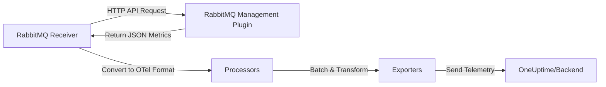

# How to Configure the RabbitMQ Receiver in the OpenTelemetry Collector

Author: [nawazdhandala](https://www.github.com/nawazdhandala)

Tags: OpenTelemetry, Collector, RabbitMQ, Message Queue, Metrics, Observability, Microservices

Description: Configure the RabbitMQ receiver in OpenTelemetry Collector to monitor message queues, track queue depths, measure consumer performance, and export comprehensive RabbitMQ telemetry for your distributed systems.

RabbitMQ is a widely adopted message broker that enables asynchronous communication between microservices. Monitoring RabbitMQ is essential for ensuring reliable message delivery, preventing queue backlogs, and maintaining system throughput. The RabbitMQ receiver in the OpenTelemetry Collector provides native integration with RabbitMQ's management API, automatically collecting metrics about queues, exchanges, connections, channels, and overall broker health.

## What is the RabbitMQ Receiver?

The RabbitMQ receiver is a specialized OpenTelemetry Collector component that connects to RabbitMQ's HTTP management API and scrapes comprehensive metrics about your message broker infrastructure. Unlike application-level monitoring that only tracks message publishing and consumption, the RabbitMQ receiver provides visibility into the broker itself.

The receiver monitors critical RabbitMQ aspects including:

- Queue depth and growth rates
- Message publish and consumption rates
- Unacknowledged message counts
- Consumer performance and lag
- Connection and channel statistics
- Memory and disk usage
- Exchange routing efficiency
- Node health in clustered deployments
- Message persistence and durability metrics

## How the RabbitMQ Receiver Works

The receiver connects to RabbitMQ's management plugin API (typically port 15672) and periodically fetches metrics. It parses the JSON responses and converts them into OpenTelemetry metrics:



The receiver supports authentication, TLS encryption, and can monitor multiple RabbitMQ nodes or clusters from a single Collector instance.

## Prerequisites

Before configuring the receiver, ensure the RabbitMQ management plugin is enabled:

```bash
# Enable management plugin on RabbitMQ
rabbitmq-plugins enable rabbitmq_management

# Verify the management API is accessible
curl -u guest:guest http://localhost:15672/api/overview
```

The management plugin provides a web UI at http://localhost:15672 and the API endpoint that the receiver uses.

## Basic Configuration

Here's a minimal configuration to start monitoring RabbitMQ:

```yaml
# Receivers section - defines how telemetry enters the Collector
receivers:
  # RabbitMQ receiver for message broker monitoring
  rabbitmq:
    # RabbitMQ management API endpoint
    # Default port: 15672 (management plugin)
    endpoint: "http://localhost:15672"

    # Authentication for management API
    username: "guest"
    password: ${RABBITMQ_PASSWORD}

    # Collection interval - how often to scrape metrics
    collection_interval: 30s

    # Enable basic queue and node metrics
    metrics:
      rabbitmq.queue.messages.ready:
        enabled: true
      rabbitmq.queue.messages.unacknowledged:
        enabled: true
      rabbitmq.consumer.count:
        enabled: true

# Processors - transform collected metrics
processors:
  # Batch metrics to reduce network overhead
  batch:
    timeout: 10s
    send_batch_size: 100

# Exporters - define where metrics are sent
exporters:
  # Export to OneUptime via OTLP HTTP
  otlphttp:
    endpoint: https://oneuptime.com/otlp
    headers:
      x-oneuptime-token: ${ONEUPTIME_TOKEN}

# Service section - wire components into pipelines
service:
  pipelines:
    # Metrics pipeline for RabbitMQ data
    metrics:
      receivers: [rabbitmq]
      processors: [batch]
      exporters: [otlphttp]
```

This basic configuration connects to a local RabbitMQ instance and collects essential queue metrics. The receiver automatically discovers all queues and tracks their depths and consumer counts.

## Comprehensive Metrics Configuration

For production monitoring, enable a full set of RabbitMQ metrics:

```yaml
receivers:
  rabbitmq:
    endpoint: "http://rabbitmq.internal:15672"
    username: "monitor"
    password: ${RABBITMQ_PASSWORD}
    collection_interval: 30s

    # Enable comprehensive RabbitMQ monitoring
    metrics:
      # Queue metrics - message depths and backlogs
      rabbitmq.queue.messages.ready:
        enabled: true
        description: "Number of messages ready for delivery"

      rabbitmq.queue.messages.unacknowledged:
        enabled: true
        description: "Messages delivered but not yet acknowledged"

      rabbitmq.queue.messages.total:
        enabled: true
        description: "Total messages in queue (ready + unacknowledged)"

      rabbitmq.queue.messages.published:
        enabled: true
        description: "Total messages published to queue"

      rabbitmq.queue.messages.delivered:
        enabled: true
        description: "Messages delivered to consumers"

      rabbitmq.queue.messages.acknowledged:
        enabled: true
        description: "Messages acknowledged by consumers"

      rabbitmq.queue.messages.redelivered:
        enabled: true
        description: "Messages redelivered after nack or timeout"

      # Consumer metrics - track consumer health
      rabbitmq.consumer.count:
        enabled: true
        description: "Number of active consumers per queue"

      rabbitmq.consumer.prefetch_count:
        enabled: true
        description: "Consumer prefetch setting"

      # Queue state metrics
      rabbitmq.queue.state:
        enabled: true
        description: "Queue state (running, idle, flow)"

      # Message rate metrics - throughput tracking
      rabbitmq.queue.message.publish_rate:
        enabled: true
        description: "Messages published per second"

      rabbitmq.queue.message.deliver_rate:
        enabled: true
        description: "Messages delivered per second"

      rabbitmq.queue.message.ack_rate:
        enabled: true
        description: "Messages acknowledged per second"

      # Memory and resource metrics
      rabbitmq.queue.memory:
        enabled: true
        description: "Memory used by queue in bytes"

      rabbitmq.node.memory.used:
        enabled: true
        description: "Total memory used by RabbitMQ node"

      rabbitmq.node.memory.limit:
        enabled: true
        description: "Memory limit for RabbitMQ node"

      rabbitmq.node.disk.free:
        enabled: true
        description: "Free disk space on node"

      rabbitmq.node.disk.limit:
        enabled: true
        description: "Disk free space alarm threshold"

      # Connection and channel metrics
      rabbitmq.connection.count:
        enabled: true
        description: "Number of client connections"

      rabbitmq.channel.count:
        enabled: true
        description: "Number of channels across all connections"

      # Exchange metrics
      rabbitmq.exchange.messages.published:
        enabled: true
        description: "Messages published through exchange"

      # Node health metrics
      rabbitmq.node.fd.used:
        enabled: true
        description: "File descriptors used"

      rabbitmq.node.fd.limit:
        enabled: true
        description: "File descriptor limit"

      rabbitmq.node.socket.used:
        enabled: true
        description: "Sockets used for connections"

      rabbitmq.node.socket.limit:
        enabled: true
        description: "Socket limit"

      # Erlang VM metrics
      rabbitmq.node.erlang.processes.used:
        enabled: true
        description: "Erlang processes running"

      rabbitmq.node.erlang.processes.limit:
        enabled: true
        description: "Maximum Erlang processes allowed"
```

This comprehensive configuration provides complete visibility into RabbitMQ operations, from individual queue performance to overall node health.

## Multi-Node Cluster Monitoring

For RabbitMQ clusters, monitor each node individually to track cluster health and identify performance bottlenecks:

```yaml
receivers:
  # RabbitMQ cluster node 1
  rabbitmq/node1:
    endpoint: "http://rabbitmq-node1.internal:15672"
    username: "monitor"
    password: ${RABBITMQ_PASSWORD}
    collection_interval: 30s
    metrics:
      rabbitmq.queue.messages.ready:
        enabled: true
      rabbitmq.queue.messages.unacknowledged:
        enabled: true
      rabbitmq.consumer.count:
        enabled: true
      rabbitmq.node.memory.used:
        enabled: true
      rabbitmq.node.disk.free:
        enabled: true
      rabbitmq.connection.count:
        enabled: true

  # RabbitMQ cluster node 2
  rabbitmq/node2:
    endpoint: "http://rabbitmq-node2.internal:15672"
    username: "monitor"
    password: ${RABBITMQ_PASSWORD}
    collection_interval: 30s
    metrics:
      rabbitmq.queue.messages.ready:
        enabled: true
      rabbitmq.queue.messages.unacknowledged:
        enabled: true
      rabbitmq.consumer.count:
        enabled: true
      rabbitmq.node.memory.used:
        enabled: true
      rabbitmq.node.disk.free:
        enabled: true
      rabbitmq.connection.count:
        enabled: true

  # RabbitMQ cluster node 3
  rabbitmq/node3:
    endpoint: "http://rabbitmq-node3.internal:15672"
    username: "monitor"
    password: ${RABBITMQ_PASSWORD}
    collection_interval: 30s
    metrics:
      rabbitmq.queue.messages.ready:
        enabled: true
      rabbitmq.queue.messages.unacknowledged:
        enabled: true
      rabbitmq.consumer.count:
        enabled: true
      rabbitmq.node.memory.used:
        enabled: true
      rabbitmq.node.disk.free:
        enabled: true
      rabbitmq.connection.count:
        enabled: true

# Add node-specific attributes
processors:
  attributes/node1:
    actions:
      - key: rabbitmq.cluster
        value: "production"
        action: insert
      - key: rabbitmq.node
        value: "rabbitmq-node1"
        action: insert

  attributes/node2:
    actions:
      - key: rabbitmq.cluster
        value: "production"
        action: insert
      - key: rabbitmq.node
        value: "rabbitmq-node2"
        action: insert

  attributes/node3:
    actions:
      - key: rabbitmq.cluster
        value: "production"
        action: insert
      - key: rabbitmq.node
        value: "rabbitmq-node3"
        action: insert

  batch:
    timeout: 10s

exporters:
  otlphttp:
    endpoint: https://oneuptime.com/otlp
    headers:
      x-oneuptime-token: ${ONEUPTIME_TOKEN}

service:
  pipelines:
    metrics/node1:
      receivers: [rabbitmq/node1]
      processors: [attributes/node1, batch]
      exporters: [otlphttp]

    metrics/node2:
      receivers: [rabbitmq/node2]
      processors: [attributes/node2, batch]
      exporters: [otlphttp]

    metrics/node3:
      receivers: [rabbitmq/node3]
      processors: [attributes/node3, batch]
      exporters: [otlphttp]
```

This configuration monitors all cluster nodes and tags metrics with cluster and node identifiers, making it easy to aggregate or filter by node in your observability platform.

## Filtering Specific Queues and Exchanges

In large RabbitMQ deployments with hundreds of queues, you may want to monitor only specific queues or exchanges:

```yaml
receivers:
  rabbitmq:
    endpoint: "http://rabbitmq.internal:15672"
    username: "monitor"
    password: ${RABBITMQ_PASSWORD}
    collection_interval: 30s

    # Filter which queues to monitor
    queues:
      # Monitor specific queues by name (regex supported)
      include:
        - "orders.*"        # All queues starting with "orders"
        - "payments.prod"   # Specific payment queue
        - "notifications"   # Notification queue

      # Exclude certain queues
      exclude:
        - ".*test.*"        # Exclude test queues
        - "temp.*"          # Exclude temporary queues

    # Filter which exchanges to monitor
    exchanges:
      include:
        - "orders.exchange"
        - "payments.exchange"
      exclude:
        - "amq.*"           # Exclude default AMQP exchanges

    metrics:
      rabbitmq.queue.messages.ready:
        enabled: true
      rabbitmq.queue.messages.unacknowledged:
        enabled: true
      rabbitmq.consumer.count:
        enabled: true
      rabbitmq.exchange.messages.published:
        enabled: true
```

Queue and exchange filtering reduces metric cardinality and focuses monitoring on business-critical message flows.

## TLS Configuration for Secure Deployments

For production RabbitMQ clusters with TLS-enabled management API:

```yaml
receivers:
  rabbitmq:
    # Use HTTPS endpoint for secure management API
    endpoint: "https://rabbitmq-prod.internal:15671"
    username: "monitor"
    password: ${RABBITMQ_PASSWORD}
    collection_interval: 30s

    # TLS configuration
    tls:
      # Verify server certificate
      insecure_skip_verify: false

      # Path to CA certificate for verification
      ca_file: "/etc/ssl/certs/rabbitmq-ca.crt"

      # Client certificate authentication (if required)
      cert_file: "/etc/ssl/certs/collector-client.crt"
      key_file: "/etc/ssl/private/collector-client.key"

      # Minimum TLS version
      min_version: "1.2"

    metrics:
      rabbitmq.queue.messages.ready:
        enabled: true
      rabbitmq.queue.messages.unacknowledged:
        enabled: true
      rabbitmq.consumer.count:
        enabled: true
```

Always use TLS in production to protect management credentials and metric data in transit.

## Production-Ready Configuration with Resilience

Here's a complete production configuration with error handling, resource limits, and performance optimization:

```yaml
receivers:
  rabbitmq:
    endpoint: "https://rabbitmq-prod.internal:15671"
    username: "monitor"
    password: ${RABBITMQ_PASSWORD}
    collection_interval: 30s

    # Request timeout - prevent hanging on slow API responses
    timeout: 15s

    # TLS settings
    tls:
      insecure_skip_verify: false
      ca_file: "/etc/ssl/certs/rabbitmq-ca.crt"

    # Queue filtering to reduce cardinality
    queues:
      include:
        - "orders.*"
        - "payments.*"
        - "notifications.*"
      exclude:
        - ".*test.*"
        - "tmp.*"

    metrics:
      # Critical queue metrics
      rabbitmq.queue.messages.ready:
        enabled: true
      rabbitmq.queue.messages.unacknowledged:
        enabled: true
      rabbitmq.consumer.count:
        enabled: true

      # Message flow rates
      rabbitmq.queue.message.publish_rate:
        enabled: true
      rabbitmq.queue.message.deliver_rate:
        enabled: true
      rabbitmq.queue.message.ack_rate:
        enabled: true

      # Resource metrics
      rabbitmq.node.memory.used:
        enabled: true
      rabbitmq.node.disk.free:
        enabled: true
      rabbitmq.connection.count:
        enabled: true

processors:
  # Add environment and cluster labels
  attributes:
    actions:
      - key: environment
        value: production
        action: insert
      - key: cluster.name
        value: rabbitmq-prod-cluster
        action: insert

  # Detect resource attributes (hostname, cloud provider)
  resourcedetection:
    detectors: [env, system, docker]
    timeout: 5s

  # Filter out zero-value metrics to reduce noise
  filter/drop_zeros:
    metrics:
      datapoint:
        - 'metric.name == "rabbitmq.queue.messages.ready" and value_int == 0'
        - 'metric.name == "rabbitmq.consumer.count" and value_int == 0'

  # Batch for efficiency
  batch:
    timeout: 30s
    send_batch_size: 1000

exporters:
  otlphttp:
    endpoint: https://oneuptime.com/otlp
    headers:
      x-oneuptime-token: ${ONEUPTIME_TOKEN}
    compression: gzip
    timeout: 30s

    # Retry configuration for failed exports
    retry_on_failure:
      enabled: true
      initial_interval: 5s
      max_interval: 30s
      max_elapsed_time: 300s

    # Queue to buffer metrics during backend outages
    sending_queue:
      enabled: true
      num_consumers: 10
      queue_size: 5000

service:
  pipelines:
    metrics:
      receivers: [rabbitmq]
      processors: [resourcedetection, attributes, filter/drop_zeros, batch]
      exporters: [otlphttp]
```

This configuration includes timeouts, retries, buffering, and filtering to ensure reliable metric collection even during RabbitMQ or network issues.

## Security Best Practices

Secure your RabbitMQ monitoring setup:

### Create a Dedicated Monitoring User

Create a RabbitMQ user with read-only monitoring permissions:

```bash
# Create monitoring user
rabbitmqctl add_user monitor "StrongPassword123!"

# Set monitoring tag (grants read-only access to management API)
rabbitmqctl set_user_tags monitor monitoring

# Grant permissions to view all vhosts (but not modify)
# Format: rabbitmqctl set_permissions -p <vhost> <user> <conf> <write> <read>
rabbitmqctl set_permissions -p "/" monitor "" "" ".*"

# Repeat for additional vhosts if needed
rabbitmqctl set_permissions -p "production" monitor "" "" ".*"
```

The monitoring tag provides read-only access to the management API without allowing configuration changes or message manipulation.

### Use Environment Variables

Never hardcode credentials:

```yaml
receivers:
  rabbitmq:
    endpoint: "${RABBITMQ_ENDPOINT}"
    username: "${RABBITMQ_MONITOR_USER}"
    password: "${RABBITMQ_MONITOR_PASSWORD}"
```

Set in your environment:

```bash
export RABBITMQ_ENDPOINT="https://rabbitmq-prod.internal:15671"
export RABBITMQ_MONITOR_USER="monitor"
export RABBITMQ_MONITOR_PASSWORD="StrongPassword123!"
```

### Restrict Network Access

Limit management API access to monitoring systems:

```bash
# In rabbitmq.conf, restrict management plugin to specific IPs
management.tcp.ip = 10.0.0.50
management.tcp.port = 15672

# Or use firewall rules to allow only Collector hosts
iptables -A INPUT -p tcp --dport 15672 -s 10.0.0.100 -j ACCEPT
iptables -A INPUT -p tcp --dport 15672 -j DROP
```

## Alerting on Critical RabbitMQ Conditions

Configure alerts for critical RabbitMQ scenarios:

**Queue Backlog Growing**: Alert when queue depth increases rapidly or exceeds thresholds, indicating consumer lag or failures.

**Zero Consumers**: Alert when a queue has no active consumers, preventing message processing.

**High Unacknowledged Messages**: Alert when unacknowledged message count is high, suggesting consumer issues or long processing times.

**Memory Pressure**: Alert when node memory usage exceeds 80% of the limit, which can trigger flow control and slow down publishers.

**Disk Space Low**: Alert when disk free space drops below thresholds, which can prevent message persistence.

**Connection/Channel Churn**: Alert on rapid connection/channel creation and destruction, indicating application issues.

These metrics are exported in OpenTelemetry format and integrate seamlessly with alerting systems in modern observability platforms like OneUptime.

## Troubleshooting

### Connection Failures

If the receiver can't connect to RabbitMQ:

1. Verify management plugin is enabled: `rabbitmq-plugins list`
2. Check management API is accessible: `curl http://localhost:15672/api/overview`
3. Verify credentials with RabbitMQ management UI
4. Check network connectivity and firewall rules
5. Review RabbitMQ logs: `/var/log/rabbitmq/`

Enable debug logging in the Collector:

```yaml
service:
  telemetry:
    logs:
      level: debug
```

### Authentication Errors

If authentication fails:

1. Verify user exists: `rabbitmqctl list_users`
2. Check user has monitoring tag: `rabbitmqctl list_users`
3. Verify password is correct
4. Check vhost permissions: `rabbitmqctl list_permissions -p /`

### Missing Metrics

If some metrics don't appear:

1. Verify queues exist and are not filtered out
2. Check queue names match include patterns
3. Review Collector logs for API errors
4. Verify monitoring user has permissions to view queues

### High Cardinality Issues

If metric cardinality is too high:

1. Use queue and exchange filtering to reduce scope
2. Monitor only business-critical queues
3. Aggregate metrics by queue name pattern
4. Increase collection_interval to reduce data volume

## Monitoring the Receiver

Enable Collector internal metrics to monitor the RabbitMQ receiver:

```yaml
service:
  telemetry:
    metrics:
      level: detailed
      readers:
        - periodic:
            exporter:
              otlp:
                protocol: http/protobuf
                endpoint: https://oneuptime.com/otlp
                headers:
                  x-oneuptime-token: ${ONEUPTIME_TOKEN}
```

Watch these internal metrics:

- `otelcol_receiver_accepted_metric_points`: Successful collections
- `otelcol_receiver_refused_metric_points`: Collection failures
- `otelcol_scraper_errored_metric_points`: API errors

## Related Topics

For comprehensive message broker and distributed system monitoring:

- [How to Configure the Zookeeper Receiver in OpenTelemetry Collector](https://oneuptime.com/blog/post/2026-02-06-zookeeper-receiver-opentelemetry-collector/view)
- [How to Configure the SQL Query Receiver in OpenTelemetry Collector](https://oneuptime.com/blog/post/2026-02-06-sql-query-receiver-opentelemetry-collector/view)
- [OpenTelemetry Collector: What It Is and When You Need It](https://oneuptime.com/blog/post/2025-09-18-what-is-opentelemetry-collector-and-why-use-one/view)
- [How to collect internal metrics from OpenTelemetry Collector](https://oneuptime.com/blog/post/2025-01-22-how-to-collect-opentelemetry-collector-internal-metrics/view)

## Summary

The RabbitMQ receiver provides comprehensive monitoring of your message broker infrastructure through RabbitMQ's management API. It automatically collects metrics about queues, exchanges, connections, consumers, and node health, giving you complete visibility into message flow and broker performance.

Configure the receiver with appropriate authentication, enable relevant metrics for your deployment size, and use filtering to manage metric cardinality in large installations. Follow security best practices by creating dedicated monitoring users with read-only access and using encrypted connections.

Whether monitoring a single RabbitMQ node or a multi-node production cluster, the RabbitMQ receiver scales to meet your observability needs. Track queue backlogs, consumer performance, resource utilization, and overall broker health to ensure reliable asynchronous communication in your distributed systems.

Need a powerful backend for your RabbitMQ metrics? OneUptime provides native OpenTelemetry support with advanced visualization, correlation, and alerting capabilities designed for modern microservices architectures.
