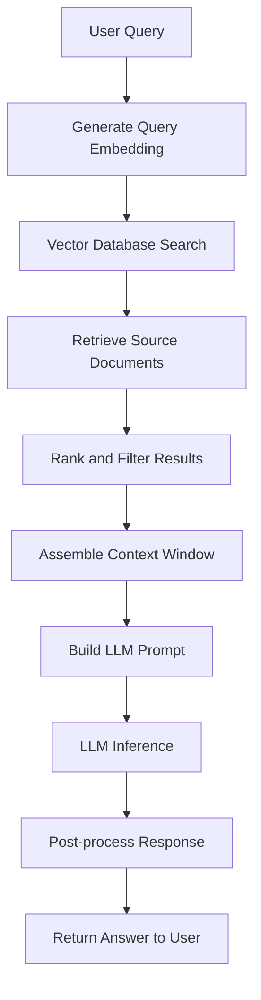

# How to Implement RAG Pipeline Tracing with OpenTelemetry

Author: [nawazdhandala](https://www.github.com/nawazdhandala)

Tags: OpenTelemetry, RAG, Retrieval Augmented Generation, Tracing, LLM, Observability, Vector Search, AI Pipelines

Description: A practical guide to tracing RAG pipelines with OpenTelemetry, covering document retrieval, embedding generation, context assembly, and LLM inference spans.

---

Retrieval-Augmented Generation (RAG) pipelines are deceptively complex. What looks like a single "ask a question, get an answer" flow actually involves multiple steps: embedding the query, searching a vector store, ranking results, assembling context, and calling an LLM. When the answer is wrong or slow, which step failed? Without tracing, you're guessing.

OpenTelemetry gives you the ability to trace every stage of a RAG pipeline as connected spans within a single trace. This guide walks through instrumenting a complete RAG pipeline so you can pinpoint exactly where things break down.

---

## Anatomy of a RAG Pipeline

Before we instrument anything, let's map out the typical RAG flow:



Each of these steps is a candidate for its own span. The goal is to create a trace that shows the full journey from user query to generated answer, with timing and metadata for every step along the way.

---

## Setting Up OpenTelemetry for RAG

Start by configuring the tracer provider. We'll use a single tracer for the entire RAG pipeline to keep span relationships clean.

```python
# pip install opentelemetry-api opentelemetry-sdk opentelemetry-exporter-otlp

from opentelemetry import trace
from opentelemetry.sdk.trace import TracerProvider
from opentelemetry.sdk.trace.export import BatchSpanProcessor
from opentelemetry.exporter.otlp.proto.grpc.trace_exporter import OTLPSpanExporter
from opentelemetry.sdk.resources import Resource

# Define the service resource so traces are labeled correctly
resource = Resource.create({
    "service.name": "rag-pipeline",
    "service.version": "1.0.0",
    "deployment.environment": "production"
})

# Set up the tracer with batch export for efficiency
provider = TracerProvider(resource=resource)
processor = BatchSpanProcessor(
    OTLPSpanExporter(endpoint="https://oneuptime.com/otlp")
)
provider.add_span_processor(processor)
trace.set_tracer_provider(provider)

# This tracer will be used throughout the RAG pipeline
tracer = trace.get_tracer("rag.pipeline", "1.0.0")
```

---

## Tracing the Full RAG Pipeline

Here's a complete instrumented RAG pipeline. Each step creates a child span, so the entire flow appears as a connected trace tree.

```python
import time
import numpy as np
from opentelemetry import trace
from opentelemetry.trace import StatusCode

tracer = trace.get_tracer("rag.pipeline")

class TracedRAGPipeline:
    def __init__(self, embedding_model, vector_store, llm_client):
        self.embedding_model = embedding_model
        self.vector_store = vector_store
        self.llm_client = llm_client

    def query(self, user_query, top_k=5, max_tokens=1024):
        """
        Execute a full RAG pipeline with end-to-end tracing.
        The parent span wraps the entire operation.
        """
        # The root span covers the entire RAG request
        with tracer.start_as_current_span("rag.query") as root_span:
            root_span.set_attribute("rag.query.text", user_query[:200])
            root_span.set_attribute("rag.query.top_k", top_k)
            root_span.set_attribute("rag.query.max_tokens", max_tokens)

            try:
                # Step 1: Generate the query embedding
                query_embedding = self._embed_query(user_query)

                # Step 2: Search the vector store
                search_results = self._vector_search(query_embedding, top_k)

                # Step 3: Rank and filter results
                ranked_results = self._rank_results(search_results, user_query)

                # Step 4: Assemble the context window
                context = self._assemble_context(ranked_results, max_tokens)

                # Step 5: Generate the LLM response
                response = self._generate_response(user_query, context)

                # Record success metrics on the root span
                root_span.set_attribute("rag.response.length", len(response))
                root_span.set_attribute("rag.status", "success")

                return response

            except Exception as e:
                root_span.set_status(StatusCode.ERROR, str(e))
                root_span.record_exception(e)
                raise
```

---

## Instrumenting Each Pipeline Stage

Now let's look at each stage individually. The key is recording the right attributes so you can debug issues later.

### Query Embedding

The embedding step converts the user's question into a vector. You want to know how long this takes and what model is being used.

```python
    def _embed_query(self, query_text):
        # Child span for the embedding generation step
        with tracer.start_as_current_span("rag.embed_query") as span:
            span.set_attribute("rag.embedding.model", self.embedding_model.model_name)
            span.set_attribute("rag.embedding.input_length", len(query_text))

            start = time.perf_counter()
            embedding = self.embedding_model.encode(query_text)
            elapsed_ms = (time.perf_counter() - start) * 1000

            # Record the embedding dimension and generation time
            span.set_attribute("rag.embedding.dimension", len(embedding))
            span.set_attribute("rag.embedding.duration_ms", elapsed_ms)

            return embedding
```

### Vector Search

This is often the most variable step in terms of latency. Capture the search parameters and result quality.

```python
    def _vector_search(self, query_embedding, top_k):
        # Child span for the vector database search
        with tracer.start_as_current_span("rag.vector_search") as span:
            span.set_attribute("rag.search.top_k", top_k)
            span.set_attribute("rag.search.vector_dimension", len(query_embedding))

            start = time.perf_counter()
            results = self.vector_store.search(
                vector=query_embedding,
                limit=top_k
            )
            elapsed_ms = (time.perf_counter() - start) * 1000

            # Log search quality indicators
            span.set_attribute("rag.search.results_count", len(results))
            span.set_attribute("rag.search.duration_ms", elapsed_ms)

            if results:
                scores = [r.score for r in results]
                span.set_attribute("rag.search.top_score", max(scores))
                span.set_attribute("rag.search.min_score", min(scores))
                span.set_attribute("rag.search.avg_score", sum(scores) / len(scores))

            return results
```

### Result Ranking

Sometimes you need a re-ranking step to improve relevance. Trace it separately so you can see its impact.

```python
    def _rank_results(self, search_results, query_text):
        # Child span for the re-ranking step
        with tracer.start_as_current_span("rag.rank_results") as span:
            span.set_attribute("rag.ranking.input_count", len(search_results))

            # Apply a minimum score threshold to filter out weak matches
            min_score_threshold = 0.7
            span.set_attribute("rag.ranking.score_threshold", min_score_threshold)

            filtered = [r for r in search_results if r.score >= min_score_threshold]
            span.set_attribute("rag.ranking.output_count", len(filtered))
            span.set_attribute("rag.ranking.filtered_out",
                             len(search_results) - len(filtered))

            # If too many results were filtered, that's worth flagging
            if len(filtered) == 0 and len(search_results) > 0:
                span.add_event("all_results_below_threshold", {
                    "threshold": min_score_threshold,
                    "best_score": max(r.score for r in search_results)
                })

            return filtered
```

### Context Assembly

This step builds the prompt context from retrieved documents. Token counting is important here because it directly affects LLM cost and quality.

```python
    def _assemble_context(self, ranked_results, max_tokens):
        # Child span for building the context string
        with tracer.start_as_current_span("rag.assemble_context") as span:
            span.set_attribute("rag.context.source_docs", len(ranked_results))
            span.set_attribute("rag.context.max_tokens", max_tokens)

            context_parts = []
            total_tokens = 0

            for i, result in enumerate(ranked_results):
                doc_text = result.payload.get("content", "")
                # Rough token estimate: 1 token per 4 characters
                doc_tokens = len(doc_text) // 4

                if total_tokens + doc_tokens > max_tokens:
                    # Record that we had to truncate the context
                    span.add_event("context_truncated", {
                        "included_docs": i,
                        "total_docs": len(ranked_results),
                        "token_limit": max_tokens
                    })
                    break

                context_parts.append(doc_text)
                total_tokens += doc_tokens

            context = "\n\n---\n\n".join(context_parts)
            span.set_attribute("rag.context.total_tokens", total_tokens)
            span.set_attribute("rag.context.included_docs", len(context_parts))

            return context
```

### LLM Inference

The LLM call is usually the most expensive step. Capture token usage, model details, and timing.

```python
    def _generate_response(self, query, context):
        # Child span for the LLM generation call
        with tracer.start_as_current_span("rag.llm_generate") as span:
            span.set_attribute("rag.llm.model", self.llm_client.model_name)
            span.set_attribute("rag.llm.context_length", len(context))

            # Build the prompt with the retrieved context
            prompt = f"""Answer the following question based on the provided context.
If the context doesn't contain enough information, say so.

Context:
{context}

Question: {query}

Answer:"""

            span.set_attribute("rag.llm.prompt_length", len(prompt))

            start = time.perf_counter()
            response = self.llm_client.generate(
                prompt=prompt,
                max_tokens=1024,
                temperature=0.1
            )
            elapsed_ms = (time.perf_counter() - start) * 1000

            # Record LLM performance and cost indicators
            span.set_attribute("rag.llm.duration_ms", elapsed_ms)
            span.set_attribute("rag.llm.response_length", len(response.text))
            span.set_attribute("rag.llm.input_tokens", response.usage.prompt_tokens)
            span.set_attribute("rag.llm.output_tokens", response.usage.completion_tokens)
            span.set_attribute("rag.llm.total_tokens", response.usage.total_tokens)

            return response.text
```

---

## Visualizing the Trace

With all these spans in place, a single RAG query produces a trace that looks like this in your observability tool:

```mermaid
gantt
    title RAG Pipeline Trace Timeline
    dateFormat X
    axisFormat %L ms

    section Pipeline
    rag.query           :0, 850

    section Embedding
    rag.embed_query     :0, 50

    section Search
    rag.vector_search   :50, 120

    section Ranking
    rag.rank_results    :120, 135

    section Context
    rag.assemble_context :135, 145

    section LLM
    rag.llm_generate    :145, 850
```



This visualization immediately tells you where time is being spent. In this example, the LLM inference dominates the total latency, which is typical. But if vector search suddenly takes 500ms instead of 70ms, you'll see it right away.

---

## Adding Quality Signals

Tracing latency is valuable, but for RAG specifically, you also want to track quality metrics. Add these as span events or attributes.

```python
def evaluate_response_quality(query, response, context, span):
    """
    Add quality signals to the RAG trace for offline analysis.
    These attributes help you identify when retrieval quality degrades.
    """
    # Check if the response acknowledges missing context
    hedging_phrases = ["i don't have enough", "based on the available", "i'm not sure"]
    has_hedging = any(phrase in response.lower() for phrase in hedging_phrases)
    span.set_attribute("rag.quality.has_hedging", has_hedging)

    # Measure context utilization - did the LLM use the retrieved content?
    context_words = set(context.lower().split())
    response_words = set(response.lower().split())
    overlap = len(context_words.intersection(response_words))
    utilization = overlap / max(len(context_words), 1)
    span.set_attribute("rag.quality.context_utilization", round(utilization, 3))

    # Record the response length ratio compared to context
    span.set_attribute("rag.quality.compression_ratio",
                      round(len(response) / max(len(context), 1), 3))
```

---

## Common Pitfalls and How to Spot Them

Once your traces are flowing, watch for these patterns:

**Empty context window**: The `rag.ranking.output_count` drops to zero. Your score threshold might be too aggressive, or the user query doesn't match anything in your knowledge base. Look at the `rag.search.top_score` to understand the gap.

**Context overflow**: The `context_truncated` event fires frequently. You're retrieving too many documents or your chunks are too large. Consider adjusting chunk size or reducing `top_k`.

**LLM hallucination despite good context**: High `rag.quality.context_utilization` but incorrect answers. The LLM might be ignoring the context. Try adjusting the prompt template or lowering the temperature.

**Embedding latency spikes**: The `rag.embed_query` span suddenly takes 200ms instead of 30ms. Your embedding model server might be under pressure, or a cold start is happening.

---

## Wrapping Up

Tracing a RAG pipeline with OpenTelemetry transforms debugging from guesswork into science. Each span captures what happened, how long it took, and enough metadata to understand why. When your RAG pipeline returns a bad answer, you can trace back through the chain to find whether the problem was in retrieval, ranking, context assembly, or generation.

Start with the basic span structure shown here, then gradually add quality metrics as you learn what matters for your specific use case. The investment in instrumentation pays off quickly when you're running RAG in production and need to understand why certain queries produce poor results.
