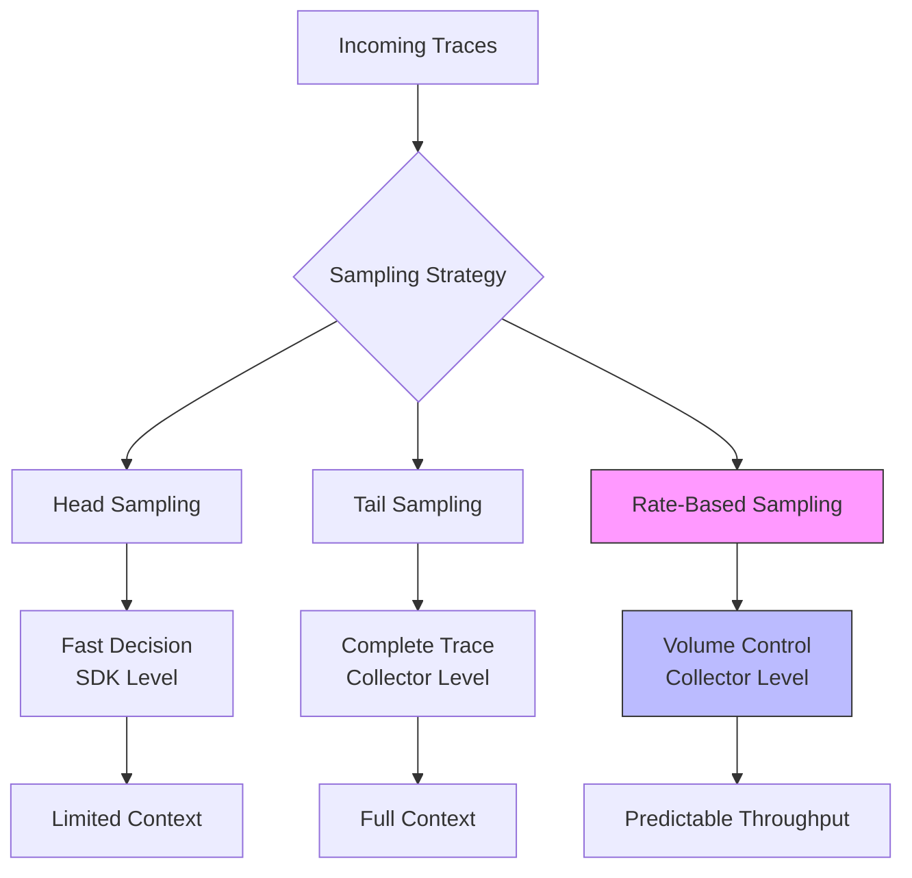

# How to Implement Rate-Based Sampling for High-Traffic Pipelines

Author: [nawazdhandala](https://www.github.com/nawazdhandala)

Tags: OpenTelemetry, Sampling, Performance, High Traffic, Collector, Observability

Description: Implement intelligent rate-based sampling strategies for high-traffic OpenTelemetry pipelines to control data volume while maintaining observability quality.

High-traffic applications generate massive amounts of telemetry data. A single endpoint handling 10,000 requests per second creates 36 million spans per hour. Without sampling, this volume overwhelms collectors, increases costs, and degrades query performance.

Rate-based sampling provides precise control over data volume by limiting spans per time unit, ensuring predictable throughput regardless of traffic patterns.

## Understanding Sampling Strategies

OpenTelemetry supports multiple sampling approaches:


```mermaid
graph TD
    A[Incoming Traces] --> B{Sampling Strategy}
    B --> C[Head Sampling]
    B --> D[Tail Sampling]
    B --> E[Rate-Based Sampling]

    C --> F[Fast Decision<br/>SDK Level]
    D --> G[Complete Trace<br/>Collector Level]
    E --> H[Volume Control<br/>Collector Level]

    F --> I[Limited Context]
    G --> J[Full Context]
    H --> K[Predictable Throughput]

    style E fill:#f9f,stroke:#333
    style H fill:#bbf,stroke:#333
```

**Head sampling** makes decisions at trace creation time in the SDK, before seeing the complete trace. Fast but limited context.

**Tail sampling** waits for the entire trace to complete before deciding. Better decisions but requires buffering.

**Rate-based sampling** limits throughput to a target rate, combining benefits of both approaches with predictable volume control.

## Why Rate-Based Sampling Matters

Consider a real-world scenario:

```python
# Calculate span volume for a high-traffic service

requests_per_second = 10000
spans_per_request = 12  # Average span count per trace
seconds_per_hour = 3600

spans_per_hour = requests_per_second * spans_per_request * seconds_per_hour
# Result: 432,000,000 spans per hour

# At $2 per million spans

cost_per_hour = (spans_per_hour / 1_000_000) * 2
# Result: $864 per hour = $20,736 per day = $622,080 per month

print(f"Monthly cost without sampling: ${cost_per_hour * 24 * 30:,.2f}")
```

Rate-based sampling reduces this to manageable levels while preserving observability for critical transactions.

## Configuring the Probabilistic Sampling Processor

The probabilistic sampling processor provides basic volume reduction based on trace ID hashing.

```yaml
# collector-config.yaml
receivers:
  otlp:
    protocols:
      grpc:
        endpoint: 0.0.0.0:4317

processors:
  # Basic probabilistic sampling
  probabilistic_sampler:
    # Sample 10% of traces
    sampling_percentage: 10
    # Hash seed for consistent sampling decisions
    hash_seed: 22

  batch:
    timeout: 10s
    send_batch_size: 1024

exporters:
  otlp:
    endpoint: backend:4317

service:
  pipelines:
    traces:
      receivers: [otlp]
      processors: [probabilistic_sampler, batch]
      exporters: [otlp]
```

This configuration samples 10% of traces deterministically based on trace ID, reducing volume by 90%.

Limitations of basic probabilistic sampling:
- Cannot differentiate between important and unimportant traces
- No rate limiting per time unit
- Traffic spikes still cause volume spikes

## Implementing Policy-Based Rate Sampling

The tail sampling processor provides sophisticated rate-based sampling with configurable policies.

```yaml
receivers:
  otlp:
    protocols:
      grpc:
        endpoint: 0.0.0.0:4317

processors:
  # Tail sampling with rate limiting
  tail_sampling:
    # How long to wait for trace completion
    decision_wait: 10s

    # Number of traces to keep in memory
    num_traces: 100000

    # Expected new traces per second
    expected_new_traces_per_sec: 10000

    # Sampling policies
    policies:
      # Policy 1: Always sample errors
      - name: errors-policy
        type: status_code
        status_code:
          status_codes: [ERROR]

      # Policy 2: Always sample slow requests
      - name: latency-policy
        type: latency
        latency:
          threshold_ms: 1000

      # Policy 3: Rate-limited sampling for normal traffic
      - name: rate-limiting
        type: rate_limiting
        rate_limiting:
          # Allow 1000 spans per second
          spans_per_second: 1000

      # Policy 4: Additional probabilistic sampling
      - name: probabilistic-policy
        type: probabilistic
        probabilistic:
          sampling_percentage: 5

  batch:
    timeout: 10s
    send_batch_size: 1024

exporters:
  otlp:
    endpoint: backend:4317

service:
  pipelines:
    traces:
      receivers: [otlp]
      processors: [tail_sampling, batch]
      exporters: [otlp]
```

This configuration implements a policy-based sampling strategy:
1. All errors are sampled (100%)
2. All slow requests (>1s) are sampled (100%)
3. Traffic that matches the rate-limiting policy is limited to an average of 1000 spans/second
4. A probabilistic policy samples 5% of traces that are not already sampled by another policy

Tail sampling policies are not processed as a sequential fallback chain. A trace is sampled if any non-drop policy returns a sample decision.

## Endpoint-Specific Rate Policies

Configure different static rates for different endpoints based on traffic patterns and business importance.

```yaml
processors:
  tail_sampling:
    decision_wait: 10s
    num_traces: 100000
    expected_new_traces_per_sec: 10000

    policies:
      # Always sample critical transactions
      - name: critical-transactions
        type: string_attribute
        string_attribute:
          key: transaction.critical
          values: ["true"]

      # Always sample errors
      - name: errors
        type: status_code
        status_code:
          status_codes: [ERROR]

      # Rate limit by endpoint with different rates
      - name: rate-limit-checkout
        type: and
        and:
          and_sub_policy:
            - name: checkout-endpoint
              type: string_attribute
              string_attribute:
                key: http.route
                values: ["/api/checkout"]
            - name: rate-limit
              type: rate_limiting
              rate_limiting:
                spans_per_second: 500  # Higher rate for critical endpoint

      - name: rate-limit-search
        type: and
        and:
          and_sub_policy:
            - name: search-endpoint
              type: string_attribute
              string_attribute:
                key: http.route
                values: ["/api/search"]
            - name: rate-limit
              type: rate_limiting
              rate_limiting:
                spans_per_second: 200  # Lower rate for search

      # Default rate limit for other traffic
      - name: rate-limit-default
        type: and
        and:
          and_sub_policy:
            - name: not-checkout-endpoint
              type: not
              not:
                not_sub_policy:
                  name: checkout-endpoint
                  type: string_attribute
                  string_attribute:
                    key: http.route
                    values: ["/api/checkout"]
            - name: not-search-endpoint
              type: not
              not:
                not_sub_policy:
                  name: search-endpoint
                  type: string_attribute
                  string_attribute:
                    key: http.route
                    values: ["/api/search"]
            - name: rate-limit
              type: rate_limiting
              rate_limiting:
                spans_per_second: 1000

      # Additional probabilistic sampling
      - name: probabilistic-fallback
        type: probabilistic
        probabilistic:
          sampling_percentage: 1
```

This configuration assigns different sampling rates based on endpoint importance, ensuring critical paths receive higher sampling rates.

## Service-Level Rate Limiting

Apply different sampling rates per service for multi-service architectures.

```yaml
receivers:
  otlp:
    protocols:
      grpc:
        endpoint: 0.0.0.0:4317

processors:
  # Use transform processor to add routing hints
  transform:
    trace_statements:
      - context: span
        statements:
          # Tag services for rate limiting
          - set(attributes["sampling.group"], "high-volume") where resource.attributes["service.name"] == "recommendation-service"
          - set(attributes["sampling.group"], "medium-volume") where resource.attributes["service.name"] == "catalog-service"
          - set(attributes["sampling.group"], "low-volume") where resource.attributes["service.name"] == "payment-service"

  tail_sampling:
    decision_wait: 10s
    num_traces: 100000
    expected_new_traces_per_sec: 10000

    policies:
      # High-volume services: aggressive rate limiting
      - name: high-volume-services
        type: and
        and:
          and_sub_policy:
            - name: high-volume-filter
              type: string_attribute
              string_attribute:
                key: sampling.group
                values: ["high-volume"]
            - name: rate-limit
              type: rate_limiting
              rate_limiting:
                spans_per_second: 500

      # Medium-volume services: moderate rate limiting
      - name: medium-volume-services
        type: and
        and:
          and_sub_policy:
            - name: medium-volume-filter
              type: string_attribute
              string_attribute:
                key: sampling.group
                values: ["medium-volume"]
            - name: rate-limit
              type: rate_limiting
              rate_limiting:
                spans_per_second: 1500

      # Low-volume services: minimal rate limiting
      - name: low-volume-services
        type: and
        and:
          and_sub_policy:
            - name: low-volume-filter
              type: string_attribute
              string_attribute:
                key: sampling.group
                values: ["low-volume"]
            - name: rate-limit
              type: rate_limiting
              rate_limiting:
                spans_per_second: 3000

  batch:
    timeout: 10s
    send_batch_size: 1024

exporters:
  otlp:
    endpoint: backend:4317

service:
  pipelines:
    traces:
      receivers: [otlp]
      processors: [transform, tail_sampling, batch]
      exporters: [otlp]
```

## Implementing Custom Rate Limiters

For advanced scenarios, implement custom rate limiting logic using the OpenTelemetry Collector SDK.

Create a custom processor in Go:

```go
// rate_limiter_processor.go
package ratelimiter

import (
    "context"
    "sync"

    "go.opentelemetry.io/collector/pdata/ptrace"
    "golang.org/x/time/rate"
)

type rateLimiterProcessor struct {
    // Rate limiters per service
    limiters map[string]*rate.Limiter
    mu       sync.RWMutex

    // Configuration
    defaultRate     int            // spans per second
    burstSize       int            // burst capacity
    perServiceRates map[string]int // optional spans per second by service
}

func newRateLimiterProcessor(defaultRate, burstSize int, perServiceRates map[string]int) *rateLimiterProcessor {
    return &rateLimiterProcessor{
        limiters:        make(map[string]*rate.Limiter),
        defaultRate:     defaultRate,
        burstSize:       burstSize,
        perServiceRates: perServiceRates,
    }
}

// Get or create rate limiter for a service
func (p *rateLimiterProcessor) getLimiter(service string) *rate.Limiter {
    p.mu.RLock()
    limiter, exists := p.limiters[service]
    p.mu.RUnlock()

    if exists {
        return limiter
    }

    p.mu.Lock()
    defer p.mu.Unlock()

    // Double-check after acquiring write lock
    if limiter, exists := p.limiters[service]; exists {
        return limiter
    }

    // Create new limiter
    serviceRate := p.defaultRate
    if configuredRate, ok := p.perServiceRates[service]; ok {
        serviceRate = configuredRate
    }

    limiter = rate.NewLimiter(rate.Limit(serviceRate), p.burstSize)
    p.limiters[service] = limiter
    return limiter
}

// Process traces
func (p *rateLimiterProcessor) processTraces(ctx context.Context, td ptrace.Traces) (ptrace.Traces, error) {
    // Create new traces object for sampled spans
    sampled := ptrace.NewTraces()

    resourceSpans := td.ResourceSpans()
    for i := 0; i < resourceSpans.Len(); i++ {
        rs := resourceSpans.At(i)
        var sampledRS ptrace.ResourceSpans
        hasSampledRS := false

        // Get service name from resource attributes
        serviceName := "unknown"
        if serviceAttr, ok := rs.Resource().Attributes().Get("service.name"); ok {
            serviceName = serviceAttr.Str()
        }

        // Get rate limiter for this service
        limiter := p.getLimiter(serviceName)

        scopeSpans := rs.ScopeSpans()
        for j := 0; j < scopeSpans.Len(); j++ {
            ss := scopeSpans.At(j)
            spans := ss.Spans()
            var targetSS ptrace.ScopeSpans
            hasTargetSS := false

            // Check rate limit for each span
            for k := 0; k < spans.Len(); k++ {
                span := spans.At(k)

                // Allow or drop based on rate limit
                if limiter.Allow() {
                    if !hasSampledRS {
                        sampledRS = sampled.ResourceSpans().AppendEmpty()
                        rs.Resource().CopyTo(sampledRS.Resource())
                        hasSampledRS = true
                    }

                    if !hasTargetSS {
                        targetSS = sampledRS.ScopeSpans().AppendEmpty()
                        ss.Scope().CopyTo(targetSS.Scope())
                        hasTargetSS = true
                    }

                    // Span allowed - copy only this span to output
                    span.CopyTo(targetSS.Spans().AppendEmpty())
                }
                // Else: span dropped due to rate limit
            }
        }
    }

    return sampled, nil
}
```

Use the custom processor in your collector configuration:

```yaml
receivers:
  otlp:
    protocols:
      grpc:
        endpoint: 0.0.0.0:4317

processors:
  # Custom rate limiter with burst support
  custom_rate_limiter:
    default_rate: 1000      # 1000 spans per second
    burst_size: 2000        # Allow bursts up to 2000
    per_service_rates:
      api-service: 2000
      database-service: 500
      cache-service: 100

  batch:
    timeout: 10s
    send_batch_size: 1024

exporters:
  otlp:
    endpoint: backend:4317

service:
  pipelines:
    traces:
      receivers: [otlp]
      processors: [custom_rate_limiter, batch]
      exporters: [otlp]
```

## Monitoring Rate Limiting Effectiveness

Track the Collector's internal tail-sampling metrics to understand rate limiter performance:

```yaml
receivers:
  otlp:
    protocols:
      grpc:
        endpoint: 0.0.0.0:4317

processors:
  tail_sampling:
    decision_wait: 10s
    num_traces: 100000
    expected_new_traces_per_sec: 10000
    policies:
      - name: rate-limiting
        type: rate_limiting
        rate_limiting:
          spans_per_second: 1000

  batch:
    timeout: 10s
    send_batch_size: 1024

exporters:
  otlp:
    endpoint: backend:4317

service:
  telemetry:
    metrics:
      level: normal
      readers:
        - pull:
            exporter:
              prometheus:
                host: 0.0.0.0
                port: 8888
                without_type_suffix: true
                without_units: true
  pipelines:
    traces:
      receivers: [otlp]
      processors: [tail_sampling, batch]
      exporters: [otlp]
```

Query sampling metrics:

```promql
# Sampling rate by policy
sum(rate(otelcol_processor_tail_sampling_count_traces_sampled{decision="sampled"}[5m])) by (policy) /
sum(rate(otelcol_processor_tail_sampling_count_traces_sampled[5m])) by (policy)

# Traces dropped before a sampling decision because num_traces was exceeded
rate(otelcol_processor_tail_sampling_sampling_trace_dropped_too_early[5m])

# Sampled vs total traces
sum(rate(otelcol_processor_tail_sampling_global_count_traces_sampled{sampled="true"}[5m])) /
sum(rate(otelcol_processor_tail_sampling_global_count_traces_sampled[5m]))
```

Create alerts for sampling anomalies:

```yaml
# prometheus-alerts.yaml
groups:
  - name: sampling_alerts
    interval: 30s
    rules:
      # Alert when sampling rate drops below threshold
      - alert: LowSamplingRate
        expr: |
          sum(rate(otelcol_processor_tail_sampling_global_count_traces_sampled{sampled="true"}[5m])) /
          sum(rate(otelcol_processor_tail_sampling_global_count_traces_sampled[5m])) < 0.01
        for: 5m
        labels:
          severity: warning
        annotations:
          summary: "Sampling rate below 1%"
          description: "Only {{ $value | humanizePercentage }} of traces are being sampled"

      # Alert when too many traces are dropped before a sampling decision
      - alert: HighEarlyTraceDropRate
        expr: |
          rate(otelcol_processor_tail_sampling_sampling_trace_dropped_too_early[5m]) > 100
        for: 5m
        labels:
          severity: warning
        annotations:
          summary: "High early trace drop rate"
          description: "{{ $value }} traces per second are being dropped before a sampling decision"
```

## Testing Rate-Based Sampling

Validate sampling behavior under load:

```python
# test_sampling.py
import asyncio
import aiohttp
from datetime import datetime
import time

async def send_trace(session, second, index, should_error=False):
    """Send a trace to the collector"""
    trace_id = f"{second + 1:08x}{index + 1:024x}"
    span_id = f"{index + 1:016x}"
    start_time = time.time_ns()
    duration_ms = 50 if not should_error else 2000
    end_time = start_time + duration_ms * 1_000_000

    trace_data = {
        "resourceSpans": [
            {
                "resource": {
                    "attributes": [
                        {"key": "service.name", "value": {"stringValue": "load-test"}}
                    ]
                },
                "scopeSpans": [
                    {
                        "scope": {"name": "sampling-load-test"},
                        "spans": [
                            {
                                "traceId": trace_id,
                                "spanId": span_id,
                                "name": "test-operation",
                                "startTimeUnixNano": str(start_time),
                                "endTimeUnixNano": str(end_time),
                                "status": {
                                    "code": 2 if should_error else 1
                                },
                            }
                        ],
                    }
                ],
            }
        ]
    }

    async with session.post(
        'http://localhost:4318/v1/traces',
        json=trace_data
    ) as response:
        return response.status == 200

async def test_rate_limiting():
    """Test rate limiting with high traffic"""
    print("Starting rate limiting test...")

    async with aiohttp.ClientSession() as session:
        # Send 10,000 traces per second for 60 seconds
        total_traces = 0
        start_time = datetime.now()

        for second in range(60):
            tasks = []

            # Create 10,000 tasks for this second
            for i in range(10000):
                # 1% should be errors (always sampled)
                should_error = (i % 100) == 0
                tasks.append(send_trace(session, second, i, should_error))

            # Execute all tasks for this second
            results = await asyncio.gather(*tasks)
            total_traces += len(results)

            print(f"Second {second + 1}: Sent {len(results)} traces")

            # Wait until next second
            await asyncio.sleep(1)

        duration = (datetime.now() - start_time).total_seconds()
        rate = total_traces / duration

        print(f"\nTest complete:")
        print(f"Total traces sent: {total_traces:,}")
        print(f"Duration: {duration:.1f}s")
        print(f"Average rate: {rate:.0f} traces/second")

# Run the test
if __name__ == "__main__":
    asyncio.run(test_rate_limiting())
```

Compare the observed sampling rate from Collector internal metrics:

```bash
curl -G http://prometheus:9090/api/v1/query \
  --data-urlencode 'query=sum(rate(otelcol_processor_tail_sampling_global_count_traces_sampled{sampled="true"}[5m])) / sum(rate(otelcol_processor_tail_sampling_global_count_traces_sampled[5m]))' \
  | jq -r '.data.result[0].value[1]'
```

## Best Practices for Rate-Based Sampling

1. **Start conservative**: Begin with higher sampling rates and reduce gradually
2. **Always sample errors**: Ensure 100% error sampling regardless of rate limits
3. **Tier critical endpoints**: Give business-critical paths higher sampling rates
4. **Monitor sampling metrics**: Track sampled traces and early trace drops
5. **Adjust based on traffic patterns**: Different rates for peak vs off-peak hours
6. **Test under load**: Validate sampling behavior matches expectations
7. **Document sampling policies**: Ensure teams understand what's sampled and why

For additional optimization techniques, see [How to Disable Unnecessary Auto-Instrumentation Libraries to Reduce Noise](https://oneuptime.com/blog/post/2026-02-06-disable-unnecessary-auto-instrumentation-reduce-noise/view) and [How to Aggregate Metrics at the Source to Reduce Data Volume](https://oneuptime.com/blog/post/2026-02-06-aggregate-metrics-source-reduce-data-volume/view).

Rate-based sampling provides predictable, controllable telemetry volume while preserving observability for critical transactions, making it essential for high-traffic production environments.
