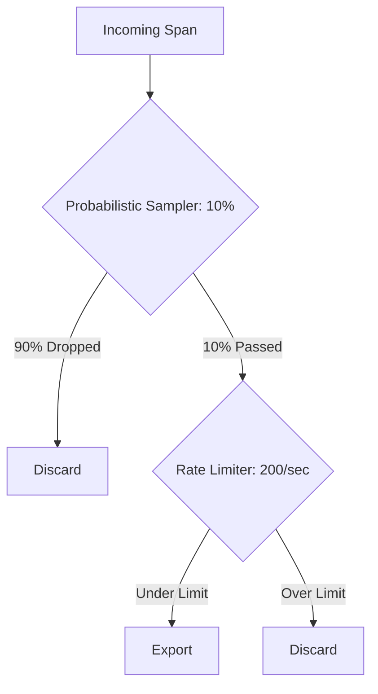

# How to Implement Rate-Limiting Samplers in OpenTelemetry

Author: [nawazdhandala](https://www.github.com/nawazdhandala)

Tags: OpenTelemetry, Sampling, Rate Limiting, Cost Control, Tracing, Performance

Description: Build rate-limiting samplers that cap trace throughput to a fixed number per second, preventing cost spikes during traffic surges.

---

Probabilistic sampling gives you a percentage of traffic. But percentages are relative. If your traffic doubles during a flash sale, your trace volume doubles too. Your observability bill does not care that you are only sampling 10% when that 10% is now twice what it was yesterday.

Rate-limiting samplers solve this by capping the absolute number of traces per second. You say "I want 100 traces per second" and you get at most 100, regardless of whether your actual traffic is 1,000 or 100,000 requests per second. This gives you predictable costs and predictable Collector load.

This guide covers how to build and deploy rate-limiting samplers at both the SDK and Collector layers.

---

## How Rate Limiting Differs from Probabilistic Sampling

| Aspect | Probabilistic | Rate Limiting |
|--------|--------------|---------------|
| Configuration | Percentage (e.g., 10%) | Absolute count (e.g., 100/sec) |
| Cost predictability | Varies with traffic | Fixed ceiling |
| Effective rate under load | Constant percentage | Decreasing percentage |
| Behavior at low traffic | May produce too few traces | Passes everything through |
| Burst handling | Linear scaling | Absorbs bursts up to limit |

The ideal approach is to combine both. Use probabilistic sampling as the primary strategy and add rate limiting as a safety net.



---

## The Token Bucket Algorithm

Rate-limiting samplers typically use a token bucket. The bucket holds tokens, each representing permission to sample one trace. Tokens are added at a fixed rate (the desired traces per second). When a span arrives and the sampler decides to keep it, a token is consumed. If the bucket is empty, the span is dropped even if it would otherwise be sampled.

```typescript
// token-bucket.ts - Reusable token bucket implementation
export class TokenBucket {
  private tokens: number;
  private lastRefillTime: number;
  private readonly maxTokens: number;
  private readonly refillRate: number; // tokens per millisecond

  constructor(tokensPerSecond: number, burstSize?: number) {
    // Burst size defaults to 1 second worth of tokens
    this.maxTokens = burstSize ?? tokensPerSecond;
    this.tokens = this.maxTokens;
    this.refillRate = tokensPerSecond / 1000;
    this.lastRefillTime = Date.now();
  }

  // Try to consume a token. Returns true if successful.
  tryConsume(): boolean {
    this.refill();

    if (this.tokens >= 1) {
      this.tokens -= 1;
      return true;
    }

    return false;
  }

  // Refill tokens based on elapsed time
  private refill(): void {
    const now = Date.now();
    const elapsed = now - this.lastRefillTime;

    if (elapsed > 0) {
      // Add tokens proportional to elapsed time
      this.tokens = Math.min(
        this.maxTokens,
        this.tokens + elapsed * this.refillRate
      );
      this.lastRefillTime = now;
    }
  }

  // Current fill level (useful for monitoring)
  getAvailableTokens(): number {
    this.refill();
    return Math.floor(this.tokens);
  }
}
```

The `burstSize` parameter controls how many tokens can accumulate during idle periods. Setting it equal to `tokensPerSecond` allows a 1-second burst after a quiet period. Setting it lower enforces a stricter rate.

---

## Building the Rate-Limiting Sampler

The sampler wraps an inner sampler (typically probabilistic) and adds rate limiting on top.

```typescript
// rate-limited-sampler.ts
import {
  Sampler,
  SamplingResult,
  SamplingDecision,
  Context,
  SpanKind,
  Attributes,
  Link,
} from '@opentelemetry/api';
import { TokenBucket } from './token-bucket';

export class RateLimitingSampler implements Sampler {
  private bucket: TokenBucket;
  private innerSampler: Sampler;
  private droppedCount: number = 0;

  constructor(
    tracesPerSecond: number,
    innerSampler: Sampler,
    burstSize?: number
  ) {
    this.bucket = new TokenBucket(tracesPerSecond, burstSize);
    this.innerSampler = innerSampler;
  }

  shouldSample(
    context: Context,
    traceId: string,
    spanName: string,
    spanKind: SpanKind,
    attributes: Attributes,
    links: Link[]
  ): SamplingResult {
    // First check if the inner sampler wants this span
    const innerResult = this.innerSampler.shouldSample(
      context, traceId, spanName, spanKind, attributes, links
    );

    // If the inner sampler says drop, drop it
    if (innerResult.decision !== SamplingDecision.RECORD_AND_SAMPLE) {
      return innerResult;
    }

    // Inner sampler says yes, but check the rate limit
    if (this.bucket.tryConsume()) {
      // Under the limit, allow it through
      return {
        decision: SamplingDecision.RECORD_AND_SAMPLE,
        attributes: {
          ...innerResult.attributes,
          'sampling.rate_limited': false,
        },
      };
    }

    // Rate limit exceeded, drop it
    this.droppedCount++;
    return {
      decision: SamplingDecision.NOT_RECORD,
      attributes: {
        'sampling.rate_limited': true,
        'sampling.dropped_count': this.droppedCount,
      },
    };
  }

  // Expose metrics for monitoring
  getDroppedCount(): number {
    return this.droppedCount;
  }

  resetDroppedCount(): void {
    this.droppedCount = 0;
  }

  toString(): string {
    return `RateLimitingSampler{rate=${this.bucket}, inner=${this.innerSampler}}`;
  }
}
```

---

## Wiring It Into the SDK

```typescript
// tracing.ts
import { NodeSDK } from '@opentelemetry/sdk-node';
import { OTLPTraceExporter } from '@opentelemetry/exporter-trace-otlp-http';
import {
  ParentBasedSampler,
  TraceIdRatioBasedSampler,
  AlwaysOnSampler,
} from '@opentelemetry/sdk-trace-base';
import { getNodeAutoInstrumentations } from '@opentelemetry/auto-instrumentations-node';
import { Resource } from '@opentelemetry/resources';
import { RateLimitingSampler } from './rate-limited-sampler';

// Inner sampler: 10% probabilistic
const probabilistic = new TraceIdRatioBasedSampler(0.1);

// Outer sampler: cap at 200 traces per second
const rateLimited = new RateLimitingSampler(200, probabilistic);

// Wrap in ParentBased for trace consistency
const sampler = new ParentBasedSampler({
  root: rateLimited,
  remoteParentSampled: new AlwaysOnSampler(),
  remoteParentNotSampled: rateLimited,
  localParentSampled: new AlwaysOnSampler(),
  localParentNotSampled: rateLimited,
});

const sdk = new NodeSDK({
  resource: new Resource({
    'service.name': 'api-gateway',
  }),
  traceExporter: new OTLPTraceExporter({
    url: 'http://otel-collector:4318/v1/traces',
  }),
  sampler,
  instrumentations: [getNodeAutoInstrumentations()],
});

sdk.start();
```

The `ParentBasedSampler` wrapping is important. You only want to rate-limit root spans. Child spans should follow the parent decision. If you rate-limit child spans independently, you get fragmented traces.

---

## Rate Limiting in the Collector

The Collector does not have a built-in rate-limiting sampler, but you can achieve the same effect with the `probabilistic_sampler` processor combined with resource-based routing, or by using the `tail_sampling` processor with a rate-limiting policy.

A practical approach is to use the `tail_sampling` processor with a `composite` policy:

```yaml
# otel-collector-config.yaml
receivers:
  otlp:
    protocols:
      grpc:
        endpoint: 0.0.0.0:4317

processors:
  tail_sampling:
    decision_wait: 10s
    num_traces: 50000
    policies:
      # Always keep errors regardless of rate
      - name: errors
        type: status_code
        status_code:
          status_codes: [ERROR]

      # Rate limit normal traces through composite policy
      - name: rate-limited-normal
        type: composite
        composite:
          # Maximum total spans per second across sub-policies
          max_total_spans_per_second: 500
          # How to allocate the budget
          policy_order: [baseline]
          composite_sub_policy:
            - name: baseline
              type: probabilistic
              probabilistic:
                sampling_percentage: 100
          rate_allocation:
            - policy: baseline
              percent: 100

  batch:
    timeout: 5s
    send_batch_size: 512

exporters:
  otlp:
    endpoint: https://oneuptime.com/otlp
    headers:
      x-oneuptime-token: "${ONEUPTIME_TOKEN}"

service:
  pipelines:
    traces:
      receivers: [otlp]
      processors: [tail_sampling, batch]
      exporters: [otlp]
```

The `composite` policy type in tail sampling supports `max_total_spans_per_second`, which acts as a rate limiter. Sub-policies compete for the budget, and when the limit is reached, additional traces are dropped.

---

## Priority-Aware Rate Limiting

In production, you want rate limiting that respects priorities. Errors should never be rate-limited. VIP customer traces should get priority over general traffic. Here is how to structure that.

```typescript
// priority-rate-limiter.ts
import {
  Sampler,
  SamplingResult,
  SamplingDecision,
  Context,
  SpanKind,
  Attributes,
  Link,
} from '@opentelemetry/api';
import { TokenBucket } from './token-bucket';

interface PriorityLevel {
  name: string;
  sampler: Sampler;
  // Reserved tokens per second for this priority
  reservedRate: number;
  // Can this priority borrow from the shared pool?
  canBorrowFromShared: boolean;
}

export class PriorityRateLimitingSampler implements Sampler {
  private levels: PriorityLevel[];
  private buckets: Map<string, TokenBucket>;
  private sharedBucket: TokenBucket;

  constructor(
    levels: PriorityLevel[],
    sharedPoolRate: number
  ) {
    this.levels = levels;
    this.buckets = new Map();

    // Create a dedicated bucket for each priority level
    for (const level of levels) {
      this.buckets.set(
        level.name,
        new TokenBucket(level.reservedRate)
      );
    }

    // Shared pool for overflow
    this.sharedBucket = new TokenBucket(sharedPoolRate);
  }

  shouldSample(
    context: Context,
    traceId: string,
    spanName: string,
    spanKind: SpanKind,
    attributes: Attributes,
    links: Link[]
  ): SamplingResult {
    for (const level of this.levels) {
      const innerResult = level.sampler.shouldSample(
        context, traceId, spanName, spanKind, attributes, links
      );

      if (innerResult.decision === SamplingDecision.RECORD_AND_SAMPLE) {
        const bucket = this.buckets.get(level.name)!;

        // Try the reserved bucket first
        if (bucket.tryConsume()) {
          return {
            decision: SamplingDecision.RECORD_AND_SAMPLE,
            attributes: {
              ...innerResult.attributes,
              'sampling.priority': level.name,
            },
          };
        }

        // Try the shared pool if allowed
        if (level.canBorrowFromShared && this.sharedBucket.tryConsume()) {
          return {
            decision: SamplingDecision.RECORD_AND_SAMPLE,
            attributes: {
              ...innerResult.attributes,
              'sampling.priority': level.name,
              'sampling.borrowed': true,
            },
          };
        }

        // Rate limit hit for this priority level
        return { decision: SamplingDecision.NOT_RECORD };
      }
    }

    return { decision: SamplingDecision.NOT_RECORD };
  }

  toString(): string {
    return `PriorityRateLimitingSampler{levels=${this.levels.length}}`;
  }
}
```

Usage:

```typescript
import { AlwaysOnSampler, TraceIdRatioBasedSampler } from '@opentelemetry/sdk-trace-base';
import { PriorityRateLimitingSampler } from './priority-rate-limiter';
import { ErrorSampler } from './error-sampler';
import { AttributeSampler } from './attribute-sampler';

const sampler = new PriorityRateLimitingSampler(
  [
    {
      name: 'errors',
      sampler: new ErrorSampler(),
      reservedRate: 50,         // 50 error traces/sec guaranteed
      canBorrowFromShared: true, // Can use shared pool if needed
    },
    {
      name: 'vip',
      sampler: new AttributeSampler([
        { key: 'customer.tier', values: ['enterprise'] }
      ]),
      reservedRate: 30,
      canBorrowFromShared: true,
    },
    {
      name: 'baseline',
      sampler: new TraceIdRatioBasedSampler(0.1),
      reservedRate: 100,
      canBorrowFromShared: false, // Baseline cannot steal from shared
    },
  ],
  20 // 20 traces/sec in the shared overflow pool
);
```

This setup guarantees that errors get at least 50 traces per second, VIP customers get at least 30, and general traffic gets up to 100. The shared pool of 20 provides overflow capacity for errors and VIP traces during spikes.

---

## Monitoring Rate Limiter Behavior

You should export metrics from your rate limiter so you can see when it is actively dropping traces.

```typescript
// Add periodic metric reporting
import { metrics } from '@opentelemetry/api';

const meter = metrics.getMeter('sampling-metrics');

// Gauge for available tokens
const tokensGauge = meter.createObservableGauge(
  'sampling.rate_limiter.available_tokens',
  { description: 'Available tokens in the rate limiter bucket' }
);

// Counter for rate-limited drops
const droppedCounter = meter.createCounter(
  'sampling.rate_limiter.dropped_total',
  { description: 'Total traces dropped due to rate limiting' }
);

// In your sampler, increment the counter on drops
// droppedCounter.add(1, { 'sampling.priority': level.name });
```

Watch for these patterns in your metrics:

- **Tokens consistently at zero**: Your rate limit is too low or traffic is too high. Consider increasing the limit or reducing the inner sampling rate.
- **Tokens always at maximum**: Your rate limit is never reached. You might be able to lower the probabilistic rate to save more.
- **Periodic drops**: Normal behavior during traffic spikes. This is the rate limiter doing its job.

---

## Choosing the Right Rate

Start with your budget. If your observability backend charges per span and you have a monthly budget, work backwards:

```
budget_spans_per_month = monthly_budget / cost_per_span
budget_spans_per_second = budget_spans_per_month / (30 * 24 * 3600)
average_spans_per_trace = 8  (measure this for your system)
target_traces_per_second = budget_spans_per_second / average_spans_per_trace
```

For example, with a $1,000/month budget at $0.000001 per span:

```
budget_spans_per_month = 1,000,000,000
budget_spans_per_second = 385
target_traces_per_second = 385 / 8 = ~48 traces/sec
```

Set your rate limiter to 48 traces per second, and you stay within budget regardless of traffic volume.

---

## Key Takeaways

1. Rate-limiting samplers cap absolute throughput, giving you predictable costs regardless of traffic volume
2. Use the token bucket algorithm for smooth rate limiting with burst tolerance
3. Always wrap rate-limiting samplers in `ParentBasedSampler` to avoid fragmenting traces
4. Combine probabilistic and rate-limiting sampling: probabilistic as the primary strategy, rate limiting as the safety net
5. Implement priority-aware rate limiting so errors and VIP traffic get guaranteed capacity
6. Monitor token bucket levels and drop counts to tune your rate limits over time
7. Calculate your target rate from your budget, not from your traffic volume

Rate limiting turns your observability spend from a variable cost into a fixed cost. That predictability makes it much easier to plan capacity and justify the investment.
