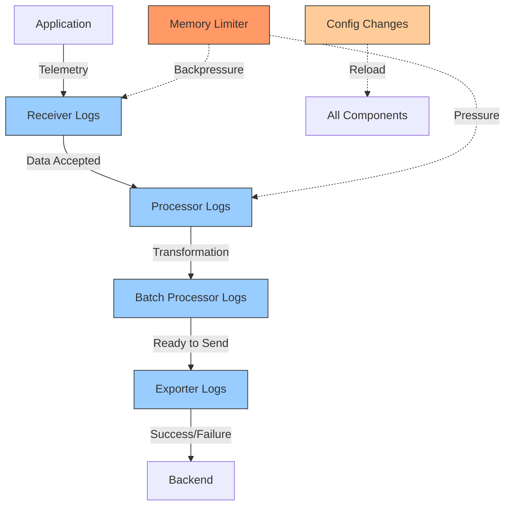

# How to Read and Interpret Collector Internal Logs

Author: [nawazdhandala](https://www.github.com/nawazdhandala)

Tags: OpenTelemetry, Collector, Logs, Troubleshooting, Debugging, Monitoring

Description: Master the art of reading and interpreting OpenTelemetry Collector internal logs to diagnose issues, monitor performance, and understand collector behavior.

The OpenTelemetry Collector generates internal logs that provide critical insights into its operation. These logs reveal data flow patterns, configuration issues, performance bottlenecks, and error conditions. Understanding how to read and interpret these logs is essential for maintaining healthy collector deployments and troubleshooting problems effectively.

## Understanding Log Levels

The collector supports five log levels, each providing different detail about operations. Choosing the appropriate level balances between information richness and log volume.

**Log level hierarchy**:

```yaml
service:
  telemetry:
    logs:
      # Available levels: debug, info, warn, error, dpanic, panic, fatal
      level: info
      # Output format: console or json
      encoding: console
      # Disable caller information for cleaner logs
      disable_caller: false
      # Disable stacktraces for info and warn levels
      disable_stacktrace: true
      # Output destination: stdout, stderr, or file path
      output_paths:
        - stdout
      # Error output destination
      error_output_paths:
        - stderr
```

**Debug level** provides maximum detail, including component initialization, data flow through each pipeline stage, and detailed error information. Use debug level when troubleshooting specific issues:

```yaml
service:
  telemetry:
    logs:
      level: debug
      encoding: console
```

Debug logs show every operation, making them verbose but invaluable for troubleshooting.

**Info level** balances detail with volume, showing important operational events like component startup, configuration changes, and periodic statistics:

```yaml
service:
  telemetry:
    logs:
      level: info
      encoding: console
```

Info is appropriate for production monitoring where you need visibility without overwhelming log systems.

**Warn level** highlights potential issues that don't prevent operation but merit attention:

```yaml
service:
  telemetry:
    logs:
      level: warn
      encoding: console
```

Use warn level in stable production environments where you only want notification of unusual conditions.

**Error level** shows only errors that affect collector functionality:

```yaml
service:
  telemetry:
    logs:
      level: error
      encoding: console
```

Error level is minimal and appropriate only when log volume must be extremely low.

## Log Structure and Format

Collector logs follow a structured format that makes parsing and filtering straightforward.

**Console format** provides human-readable logs:

```
2026-02-06T10:30:45.123Z    info    service@v0.96.0/telemetry.go:84    Setting up own telemetry...
2026-02-06T10:30:45.124Z    info    service@v0.96.0/telemetry.go:201   Serving Prometheus metrics    {"address": ":8888", "level": "Basic"}
2026-02-06T10:30:45.125Z    info    exporter@v0.96.0/exporter.go:275   Development component. May change in the future.    {"kind": "exporter", "data_type": "traces", "name": "debug"}
2026-02-06T10:30:45.126Z    info    service@v0.96.0/service.go:143    Starting otelcol-contrib...    {"Version": "0.96.0", "NumCPU": 8}
2026-02-06T10:30:45.127Z    info    extensions@v0.96.0/extensions.go:33   Starting extensions...
2026-02-06T10:30:45.128Z    info    zapgrpc/zapgrpc.go:178    [core] [Server #1] Server created    {"grpc_log": true}
2026-02-06T10:30:45.129Z    info    service@v0.96.0/service.go:169    Everything is ready. Begin running and processing data.
```

Each log line contains:
- Timestamp in ISO 8601 format
- Log level (info, warn, error, debug)
- Component identifier showing package and version
- Message describing the event
- Optional structured fields in JSON format

**JSON format** enables programmatic parsing and integration with log aggregation systems:

```yaml
service:
  telemetry:
    logs:
      level: info
      encoding: json
      output_paths:
        - stdout
```

JSON output example:

```json
{"level":"info","ts":"2026-02-06T10:30:45.123Z","caller":"service@v0.96.0/telemetry.go:84","msg":"Setting up own telemetry..."}
{"level":"info","ts":"2026-02-06T10:30:45.124Z","caller":"service@v0.96.0/telemetry.go:201","msg":"Serving Prometheus metrics","address":":8888","level":"Basic"}
{"level":"info","ts":"2026-02-06T10:30:45.125Z","caller":"exporter@v0.96.0/exporter.go:275","msg":"Development component. May change in the future.","kind":"exporter","data_type":"traces","name":"debug"}
```

JSON format includes the same information as console format but in a structured format ideal for log aggregation and analysis tools.

## Reading Startup Logs

Startup logs reveal configuration issues, component initialization status, and readiness. Understanding startup log patterns helps diagnose initialization problems.

**Successful startup sequence**:

```
2026-02-06T10:30:45.123Z    info    service@v0.96.0/telemetry.go:84    Setting up own telemetry...
2026-02-06T10:30:45.124Z    info    service@v0.96.0/telemetry.go:201   Serving Prometheus metrics    {"address": ":8888", "level": "Basic"}
2026-02-06T10:30:45.125Z    info    service@v0.96.0/service.go:143    Starting otelcol-contrib...    {"Version": "0.96.0", "NumCPU": 8}
2026-02-06T10:30:45.126Z    info    extensions@v0.96.0/extensions.go:33   Starting extensions...
2026-02-06T10:30:45.127Z    info    extensions@v0.96.0/extensions.go:37   Extension is starting...    {"kind": "extension", "name": "health_check"}
2026-02-06T10:30:45.128Z    info    healthcheckextension@v0.96.0/healthcheckextension.go:44    Starting health_check extension    {"kind": "extension", "name": "health_check", "config": {"Endpoint":":13133"}}
2026-02-06T10:30:45.129Z    info    extensions@v0.96.0/extensions.go:41   Extension started.    {"kind": "extension", "name": "health_check"}
2026-02-06T10:30:45.130Z    info    service@v0.96.0/service.go:169    Everything is ready. Begin running and processing data.
```

The final "Everything is ready" message confirms successful startup. Before this message, each component logs its initialization.

**Startup failure patterns**:

Configuration errors during startup show specific component failures:

```
2026-02-06T10:30:45.123Z    info    service@v0.96.0/telemetry.go:84    Setting up own telemetry...
2026-02-06T10:30:45.124Z    info    service@v0.96.0/service.go:143    Starting otelcol-contrib...    {"Version": "0.96.0", "NumCPU": 8}
2026-02-06T10:30:45.125Z    error   service@v0.96.0/service.go:226    Failed to build pipelines    {"error": "cannot build pipelines: cannot build receiver \"otlp\": missing required field 'endpoint'"}
Error: failed to build the service: cannot build pipelines: cannot build receiver "otlp": missing required field 'endpoint'
```

The error message identifies the specific component and configuration issue preventing startup.

For comprehensive startup troubleshooting, see https://oneuptime.com/blog/post/troubleshoot-collector-startup-failures/view.

## Monitoring Data Flow

Runtime logs show telemetry data flowing through pipelines. Understanding these patterns helps identify processing bottlenecks and data quality issues.

**Normal data flow logs**:

```yaml
# Configuration with debug logging enabled
receivers:
  otlp:
    protocols:
      grpc:
        endpoint: 0.0.0.0:4317

processors:
  batch:
    timeout: 10s
    send_batch_size: 100

exporters:
  debug:
    verbosity: normal
  otlp:
    endpoint: backend.example.com:4317

service:
  telemetry:
    logs:
      level: debug

  pipelines:
    traces:
      receivers: [otlp]
      processors: [batch]
      exporters: [debug, otlp]
```

With debug logging, you'll see data flow messages:

```
2026-02-06T10:31:00.456Z    debug   otlpreceiver@v0.96.0/otlp.go:89    Received trace data    {"kind": "receiver", "name": "otlp", "data_type": "traces", "resource_spans": 1, "spans": 5}
2026-02-06T10:31:00.457Z    debug   batchprocessor@v0.96.0/batch_processor.go:189   Processing batch    {"kind": "processor", "name": "batch", "spans": 5}
2026-02-06T10:31:10.458Z    debug   batchprocessor@v0.96.0/batch_processor.go:234   Sending batch    {"kind": "processor", "name": "batch", "spans": 105, "trigger": "timeout"}
2026-02-06T10:31:10.459Z    debug   otlpexporter@v0.96.0/otlp.go:156    Exporting trace data    {"kind": "exporter", "name": "otlp", "resource_spans": 21, "spans": 105}
```

These logs show:
- Data arriving at receivers with counts
- Processing through processors
- Batch formation and sending triggers
- Export operations with data counts

This visibility helps verify pipeline operation and identify processing delays.

## Identifying Performance Issues

Performance-related logs reveal bottlenecks, slowdowns, and resource constraints affecting collector operation.

**Exporter backpressure warnings**:

```
2026-02-06T10:35:00.789Z    warn    exporterhelper@v0.96.0/queued_retry.go:321    Exporter queue is full    {"kind": "exporter", "data_type": "traces", "name": "otlp", "queue_size": 1000, "dropped_items": 50}
2026-02-06T10:35:01.890Z    warn    exporterhelper@v0.96.0/queued_retry.go:180    Exporting failed. Will retry the request after interval.    {"kind": "exporter", "data_type": "traces", "name": "otlp", "interval": "5.234s", "error": "rpc error: code = Unavailable desc = connection closed"}
```

These warnings indicate the exporter cannot keep up with incoming data. The queue fills and data begins dropping. Common causes include:
- Backend unable to accept data fast enough
- Network connectivity issues
- Exporter configuration limiting throughput

**Solution approaches**:

```yaml
exporters:
  otlp:
    endpoint: backend.example.com:4317

    # Increase timeout for slow backends
    timeout: 60s

    # Configure retry behavior
    retry_on_failure:
      enabled: true
      initial_interval: 5s
      max_interval: 30s

    # Increase queue size to buffer during temporary issues
    sending_queue:
      enabled: true
      queue_size: 5000  # Increased from 1000
      num_consumers: 20  # Increased from 10
```

Monitor logs after configuration changes to verify improvements.

**Memory pressure indicators**:

```
2026-02-06T10:40:15.234Z    warn    memorylimiterprocessor@v0.96.0/memorylimiter.go:285    Memory usage is above soft limit    {"kind": "processor", "name": "memory_limiter", "memory_usage_mib": 1400, "soft_limit_mib": 1280, "hard_limit_mib": 1536}
2026-02-06T10:40:16.345Z    warn    memorylimiterprocessor@v0.96.0/memorylimiter.go:304    Refusing data due to memory pressure    {"kind": "processor", "name": "memory_limiter", "memory_usage_mib": 1500, "hard_limit_mib": 1536}
```

Memory limiter logs show when memory pressure causes backpressure. This protects against OOM kills but indicates the collector needs more resources or lower data volume.

For memory troubleshooting details, see https://oneuptime.com/blog/post/troubleshoot-memory-issues-oom-kills-collector/view.

## Interpreting Error Messages

Error logs require immediate attention as they indicate failures affecting data collection or export.

**Receiver errors**:

```
2026-02-06T10:45:30.567Z    error   otlpreceiver@v0.96.0/otlp.go:134    Failed to receive trace data    {"kind": "receiver", "name": "otlp", "error": "rpc error: code = InvalidArgument desc = invalid trace data"}
```

Receiver errors typically indicate:
- Malformed data from clients
- Protocol mismatches
- Authentication failures

Examine client configurations and test with known-good telemetry to isolate the issue.

**Processor errors**:

```
2026-02-06T10:50:45.678Z    error   transformprocessor@v0.96.0/processor.go:89    Failed to process span    {"kind": "processor", "name": "transform", "error": "error evaluating statement: attribute not found: http.status_code"}
```

Processor errors show transformation or filtering failures. Review processor configuration against actual telemetry data structure.

**Exporter errors**:

```
2026-02-06T10:55:12.789Z    error   otlpexporter@v0.96.0/otlp.go:189    Failed to export traces    {"kind": "exporter", "data_type": "traces", "name": "otlp", "error": "rpc error: code = Unavailable desc = connection refused"}
```

Exporter errors indicate backend connectivity or compatibility issues. Verify:
- Backend service is running and accessible
- Network connectivity between collector and backend
- Authentication credentials are valid
- Data format matches backend expectations

## Analyzing Throughput Metrics

Some log messages include throughput information, helping understand collector load:

```
2026-02-06T11:00:00.123Z    info    service@v0.96.0/service.go:201    Received spans    {"spans_received": 15340, "spans_dropped": 0}
2026-02-06T11:00:00.124Z    info    service@v0.96.0/service.go:202    Exported spans    {"spans_exported": 15340, "spans_failed": 0}
```

These periodic summaries show:
- Total data received
- Data dropped due to errors or backpressure
- Data successfully exported
- Export failures

Calculate drop rate as `spans_dropped / (spans_received + spans_dropped)`. Non-zero drop rates indicate capacity or configuration issues.

## Structured Logging for Automated Analysis

JSON-formatted logs enable automated analysis and alerting:

```yaml
service:
  telemetry:
    logs:
      level: info
      encoding: json
      output_paths:
        - /var/log/otelcol/collector.log

receivers:
  otlp:
    protocols:
      grpc:
        endpoint: 0.0.0.0:4317

processors:
  batch:
    timeout: 10s

exporters:
  otlp:
    endpoint: backend.example.com:4317

  # Export collector logs to observability backend
  otlphttp/logs:
    endpoint: http://logs-backend.example.com:4318
    logs_endpoint: /v1/logs

service:
  pipelines:
    traces:
      receivers: [otlp]
      processors: [batch]
      exporters: [otlp]
```

Parse JSON logs with standard tools:

```bash
# Extract all error messages
cat /var/log/otelcol/collector.log | jq 'select(.level=="error") | {time: .ts, msg: .msg, error: .error}'

# Count errors by component
cat /var/log/otelcol/collector.log | jq -r 'select(.level=="error") | .caller' | cut -d'/' -f1 | sort | uniq -c

# Find memory pressure events
cat /var/log/otelcol/collector.log | jq 'select(.msg | contains("memory")) | {time: .ts, msg: .msg, memory_usage_mib: .memory_usage_mib}'

# Monitor exporter queue fullness
cat /var/log/otelcol/collector.log | jq 'select(.msg | contains("queue is full")) | {time: .ts, name: .name, queue_size: .queue_size, dropped_items: .dropped_items}'
```

## Correlating Logs with Metrics

Collector internal metrics complement logs. Correlating logs with metrics provides comprehensive troubleshooting context:

```yaml
service:
  telemetry:
    logs:
      level: info
      encoding: json

    # Enable detailed internal metrics
    metrics:
      level: detailed
      address: 0.0.0.0:8888

receivers:
  otlp:
    protocols:
      grpc:
        endpoint: 0.0.0.0:4317

  # Scrape collector's own metrics
  prometheus:
    config:
      scrape_configs:
        - job_name: 'otel-collector'
          scrape_interval: 10s
          static_configs:
            - targets: ['localhost:8888']

processors:
  batch:
    timeout: 10s

exporters:
  otlp:
    endpoint: backend.example.com:4317

  # Export collector metrics
  prometheusremotewrite:
    endpoint: http://prometheus.example.com:9090/api/v1/write

service:
  pipelines:
    traces:
      receivers: [otlp]
      processors: [batch]
      exporters: [otlp]

    metrics:
      receivers: [prometheus]
      processors: [batch]
      exporters: [prometheusremotewrite]
```

When investigating an issue:

1. Check logs for error messages and timestamps
2. Query metrics around those timestamps
3. Correlate metric changes with log events
4. Identify patterns and root causes

Key metrics to correlate:
- `otelcol_receiver_accepted_spans`: Compare with receiver logs
- `otelcol_processor_refused_spans`: Correlate with memory pressure logs
- `otelcol_exporter_sent_spans`: Match with exporter logs
- `otelcol_process_uptime`: Verify against startup logs

## Creating Effective Log Queries

Effective log queries quickly surface relevant information from large log volumes.

**Find all errors in the last hour**:

```bash
# Using grep
grep "error" /var/log/otelcol/collector.log | tail -1000

# Using jq for JSON logs
cat /var/log/otelcol/collector.log | jq 'select(.level=="error" and .ts > "'$(date -u -d '1 hour ago' '+%Y-%m-%dT%H:%M:%S')'Z")'

# Using Kubernetes
kubectl logs -n observability deployment/otel-collector --since=1h | grep error
```

**Track a specific data type through pipeline**:

```bash
# Follow trace data through components
cat /var/log/otelcol/collector.log | jq 'select(.data_type=="traces") | {time: .ts, component: .kind, name: .name, msg: .msg}'
```

**Monitor component initialization**:

```bash
# Find all component start messages
cat /var/log/otelcol/collector.log | jq 'select(.msg | contains("started") or contains("Starting"))'
```

**Identify configuration changes**:

```bash
# Find configuration reload events
cat /var/log/otelcol/collector.log | jq 'select(.msg | contains("config") or contains("configuration"))'
```

## Log Patterns for Common Issues

Recognize these log patterns to quickly diagnose common problems:

**Pattern: Receiver not receiving data**

```
# Receiver started but no data arrival logs
2026-02-06T10:30:45.130Z    info    otlpreceiver@v0.96.0/otlp.go:45    Starting OTLP receiver    {"kind": "receiver", "name": "otlp", "endpoint": "0.0.0.0:4317"}
# ... no subsequent "Received trace data" debug logs
```

**Diagnosis**: Check client configurations, network connectivity, and firewall rules.

**Pattern: Data stuck in batch processor**

```
# Data received but batches not sending
2026-02-06T11:00:00.456Z    debug   otlpreceiver@v0.96.0/otlp.go:89    Received trace data    {"spans": 10}
2026-02-06T11:00:05.567Z    debug   otlpreceiver@v0.96.0/otlp.go:89    Received trace data    {"spans": 15}
# ... no batch send logs
```

**Diagnosis**: Check batch processor timeout and size configurations. Verify exporters are functional.

**Pattern: Exporter repeatedly failing**

```
# Continuous export failures
2026-02-06T11:10:00.123Z    error   otlpexporter@v0.96.0/otlp.go:189    Failed to export traces    {"error": "connection refused"}
2026-02-06T11:10:05.234Z    error   otlpexporter@v0.96.0/otlp.go:189    Failed to export traces    {"error": "connection refused"}
2026-02-06T11:10:10.345Z    error   otlpexporter@v0.96.0/otlp.go:189    Failed to export traces    {"error": "connection refused"}
```

**Diagnosis**: Backend is down or unreachable. Check backend service health and network connectivity.

**Pattern: Memory limiter activating**

```
# Increasing memory pressure
2026-02-06T11:15:00.123Z    warn    memorylimiterprocessor@v0.96.0/memorylimiter.go:285    Memory usage above soft limit
2026-02-06T11:15:05.234Z    warn    memorylimiterprocessor@v0.96.0/memorylimiter.go:304    Refusing data due to memory pressure
2026-02-06T11:15:10.345Z    warn    memorylimiterprocessor@v0.96.0/memorylimiter.go:304    Refusing data due to memory pressure
```

**Diagnosis**: Collector needs more memory or lower data volume. Review memory allocation and processing efficiency.

## Visualizing Log Flow

Understanding component interaction helps interpret logs:



Each component generates logs at different pipeline stages. Following data through these stages via logs reveals where issues occur.

## Best Practices for Log Management

Effective log management ensures you have necessary information without overwhelming systems:

**Use appropriate log levels per environment**:

```yaml
# Development environment
service:
  telemetry:
    logs:
      level: debug
      encoding: console

# Staging environment
service:
  telemetry:
    logs:
      level: info
      encoding: json

# Production environment
service:
  telemetry:
    logs:
      level: warn
      encoding: json
      output_paths:
        - /var/log/otelcol/collector.log
```

**Implement log rotation**:

```yaml
# For file-based logging, configure rotation externally
# Example logrotate configuration
# /etc/logrotate.d/otelcol
#
# /var/log/otelcol/*.log {
#     daily
#     rotate 7
#     compress
#     delaycompress
#     notifempty
#     create 0644 otelcol otelcol
#     sharedscripts
#     postrotate
#         kill -USR1 $(cat /var/run/otelcol.pid)
#     endscript
# }
```

**Send logs to observability backends**:

```yaml
extensions:
  file_storage:
    directory: /var/lib/otelcol/file_storage

receivers:
  otlp:
    protocols:
      grpc:
        endpoint: 0.0.0.0:4317

  # Collect collector's own logs
  filelog:
    include:
      - /var/log/otelcol/collector.log
    operators:
      # Parse JSON formatted logs
      - type: json_parser
        parse_from: body

processors:
  batch:
    timeout: 10s

exporters:
  otlp:
    endpoint: backend.example.com:4317

  # Export collector logs separately
  otlphttp/logs:
    endpoint: http://logs-backend.example.com:4318

service:
  extensions: [file_storage]

  pipelines:
    traces:
      receivers: [otlp]
      processors: [batch]
      exporters: [otlp]

    # Pipeline for collector's own logs
    logs:
      receivers: [filelog]
      processors: [batch]
      exporters: [otlphttp/logs]
```

This configuration sends collector logs to a separate backend for centralized monitoring.

## Advanced Troubleshooting with Debug Logs

For complex issues, combine debug logging with other troubleshooting tools:

```yaml
extensions:
  # Enable zpages for live metrics
  zpages:
    endpoint: 0.0.0.0:55679

  # Enable pprof for profiling
  pprof:
    endpoint: 0.0.0.0:1777

receivers:
  otlp:
    protocols:
      grpc:
        endpoint: 0.0.0.0:4317

processors:
  memory_limiter:
    check_interval: 1s
    limit_mib: 1536
    spike_limit_mib: 512

  batch:
    timeout: 10s

exporters:
  debug:
    verbosity: detailed

  otlp:
    endpoint: backend.example.com:4317

service:
  extensions: [zpages, pprof]

  telemetry:
    logs:
      # Enable debug for detailed troubleshooting
      level: debug
      encoding: json
      output_paths:
        - stdout
        - /var/log/otelcol/debug.log

    metrics:
      level: detailed
      address: 0.0.0.0:8888

  pipelines:
    traces:
      receivers: [otlp]
      processors: [memory_limiter, batch]
      exporters: [debug, otlp]
```

Use debug logs together with:
- zPages for live pipeline visibility: https://oneuptime.com/blog/post/zpages-live-debugging-collector/view
- pprof for performance analysis: https://oneuptime.com/blog/post/profile-collector-pprof-extension/view
- Debug exporter for data inspection: https://oneuptime.com/blog/post/debug-exporter-troubleshoot-collector-pipelines/view

## Conclusion

Mastering collector internal logs provides deep insight into collector behavior, enabling rapid issue diagnosis and performance optimization. Understanding log levels, structure, common patterns, and correlation with metrics equips you to maintain healthy collector deployments. Combine log analysis with other troubleshooting tools for comprehensive observability of your observability infrastructure.

For startup-specific log analysis, see https://oneuptime.com/blog/post/troubleshoot-collector-startup-failures/view. For runtime performance issues, refer to https://oneuptime.com/blog/post/troubleshoot-memory-issues-oom-kills-collector/view.
