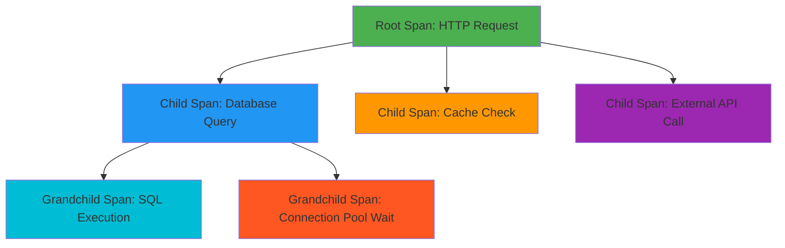

# How to Read and Interpret OpenTelemetry Trace Waterfalls

Author: [nawazdhandala](https://www.github.com/nawazdhandala)

Tags: OpenTelemetry, Traces, Waterfall, Debugging, Distributed Tracing

Description: Master the skill of reading trace waterfalls to diagnose latency issues, identify bottlenecks, and understand request flows across distributed systems.

You open a trace waterfall after a production incident. Dozens of colored bars cascade down the screen. Some are nested, some overlap, some have gaps. Without knowing how to read this visualization, you're staring at modern art instead of actionable data.

Trace waterfalls are the visual representation of how a request flowed through your distributed system. Each horizontal bar represents a span (a unit of work), positioned along a timeline. The relationships between spans- parent-child nesting, sequential vs parallel execution, timing gaps- tell the story of what happened.

Knowing how to read these waterfalls is a core debugging skill. It's the difference between guessing at root causes and pinpointing exactly where time was spent. This guide will teach you how to interpret every element of a trace waterfall so you can diagnose issues faster.

## Anatomy of a Waterfall

A trace waterfall has a few core elements that appear consistently across observability tools (Jaeger, Zipkin, Tempo, OneUptime, etc).



**Timeline (X-axis)**: Time progresses from left to right. The scale is usually milliseconds or microseconds. The leftmost point is when the trace started (root span begins). Everything else is relative to that.

**Span hierarchy (Y-axis)**: Spans are stacked vertically. Parent spans appear above their children. Indentation or visual nesting indicates relationships. The root span is always at the top.

**Span bars**: Horizontal bars represent span duration. The left edge is when the span started. The right edge is when it ended. The width is the duration. Color coding usually indicates service, error status, or span type.

**Gaps**: Empty space between spans on the timeline indicates waiting time, processing time in uninstrumented code, or time spent in parts of the system you don't have visibility into.

**Overlaps**: When child spans overlap on the timeline, they ran in parallel (async operations, goroutines, threads, worker queues).

## Reading Span Relationships

The parent-child hierarchy tells you the call graph. When Span A creates Span B, B is a child of A. The start time of B must be after the start time of A, and the end time of B must be before (or equal to) the end time of A.

If you see spans that violate this rule (child ending after parent), you have clock skew between hosts or a bug in instrumentation.

### Sequential execution

Child spans that don't overlap ran sequentially. Span B starts after Span A ends.

```
Parent Span         [================================]
  Child A           [=======]
  Child B                   [========]
  Child C                            [=====]
```

This pattern suggests blocking operations. The parent waited for each child before starting the next. Common in synchronous request handlers.

### Parallel execution

Child spans that overlap ran concurrently. Span B and Span C both start while Span A is still running.

```
Parent Span         [================================]
  Child A           [============]
  Child B             [==========]
  Child C               [============]
```

This pattern suggests async operations. The parent fired off multiple tasks and waited for them to complete. Common in modern web frameworks (Promise.all, goroutines, async/await).

### Nested execution

Grandchild spans are children of child spans. Hierarchies can be arbitrarily deep.

```
Parent Span         [================================]
  Child A           [============]
    Grandchild 1    [====]
    Grandchild 2        [===]
  Child B                        [==========]
```

Deep nesting is normal when you're tracking internal function calls or nested database queries. If your tree is 20 levels deep, consider whether all those spans add value or just noise.

## Identifying Bottlenecks

The point of a waterfall is to find where time went. Here's how to spot common issues.

### Long single span

One span dominates the trace duration. Everything else is fast.

```
Root                [====================================] 500ms
  Database          [================================]    480ms
  Business logic    [=]                                   10ms
  Cache check       [=]                                   10ms
```

**Diagnosis**: The database operation is the bottleneck. Investigate the query (missing index? N+1? lock contention?).

### Many short spans

Lots of small spans add up to significant time.

```
Root                [====================================] 500ms
  API call 1        [==]                                  20ms
  API call 2          [==]                                20ms
  API call 3            [==]                              20ms
  ... (20 more)
```

**Diagnosis**: Death by a thousand cuts. You're making too many sequential calls. Consider batching, caching, or parallelizing.

### Gap before span starts

Time passes between parent starting and child starting.

```
Parent              [====================================] 500ms
  Child                        [==============]           200ms
                    ^^^^^^^^^^^
                    300ms gap
```

**Diagnosis**: The parent did uninstrumented work before calling the child. Or the child was waiting in a queue (thread pool, task queue) before executing. Add spans to cover the gap.

### Gap after span ends

Time passes between child ending and parent ending, with no other children.

```
Parent              [====================================] 500ms
  Child             [==============]                      200ms
                                  ^^^^^^^^^^^^^^^^^^^
                                  300ms gap
```

**Diagnosis**: The parent did uninstrumented work after the child returned. Common in frameworks that do cleanup, logging, or response serialization. Add spans if it matters.

### Wide parent, narrow children

Parent span is much longer than the sum of its children.

```
Parent              [====================================] 500ms
  Child A           [=====]                               50ms
  Child B                 [=====]                         50ms
  Child C                       [=====]                   50ms
                    Total children: 150ms
                    Unaccounted: 350ms
```

**Diagnosis**: Most time is spent in uninstrumented code within the parent. Add more spans to get visibility.

### Narrow parent, wide children

Children's durations sum to more than the parent's duration (impossible unless they overlap).

```
Parent              [====================================] 500ms
  Child A           [===============]                    200ms
  Child B             [=============]                    180ms
  Child C               [===========]                    160ms
                    Total: 540ms (overlapped)
```

**Diagnosis**: Children ran in parallel. This is normal for async operations. The parent's wall-clock time is correct.

## Reading Span Attributes

Each span has metadata (attributes, events, status). Good observability tools let you click a span to see details. Here's what to look for.

### Service name

Which service or component created this span. Critical for distributed traces that cross multiple microservices.

```
span: "GET /orders"
service.name: "order-api"
```

If you see spans from unexpected services, you might have a misconfiguration or a service calling something it shouldn't.

### Span kind

Indicates the role of the span in a distributed trace.

- **SERVER**: Handling an incoming request (HTTP server, gRPC server)
- **CLIENT**: Making an outgoing request (HTTP client, gRPC client, database client)
- **PRODUCER**: Sending a message to a queue/stream
- **CONSUMER**: Receiving a message from a queue/stream
- **INTERNAL**: Internal function call (not crossing a network boundary)

Span kind helps you distinguish between "this service received a request" vs "this service made a request."

### HTTP attributes

For HTTP spans, you'll see:

```
http.method: "POST"
http.target: "/api/orders"
http.status_code: 200
http.route: "/api/orders"
http.user_agent: "Mozilla/5.0..."
```

Check status codes for errors. Check routes for cardinality explosions (UUIDs in URL paths).

### Database attributes

For database spans:

```
db.system: "postgresql"
db.name: "orders_db"
db.statement: "SELECT * FROM orders WHERE user_id = $1"
db.operation: "SELECT"
```

The `db.statement` is gold. You can copy-paste it and run EXPLAIN ANALYZE to see the query plan.

### Error status

Spans have a status: OK, ERROR, or UNSET.

```
status.code: ERROR
status.message: "connection timeout after 5000ms"
```

Errors should stand out visually in your tool (red color, exclamation icon). Always check error messages for clues.

### Span events

Events are timestamped logs attached to a span. They're useful for marking milestones within a long operation.

```
span: "process_payment"
  event @ 10ms: "authorization_started"
  event @ 150ms: "authorization_succeeded"
  event @ 160ms: "capture_started"
  event @ 320ms: "capture_succeeded"
```

If a span is slow, events help you pinpoint which phase took time.

## Common Waterfall Patterns

You'll see certain patterns repeatedly. Recognizing them speeds up diagnosis.

### The fan-out

One parent, many parallel children (all start around the same time).

```
Root                [====================================]
  Worker 1          [==========]
  Worker 2          [===========]
  Worker 3          [=========]
  Worker 4          [============]
  Worker 5          [==========]
```

**Common in**: Batch operations, parallel aggregations, GraphQL resolvers fetching multiple resources, MapReduce jobs.

**Watch for**: One slow child holding up the entire operation. The parent's duration is limited by the slowest child.

### The chain

Each span waits for the previous one to complete before starting.

```
Root                [====================================]
  Step 1            [========]
  Step 2                    [=========]
  Step 3                              [=======]
  Step 4                                     [========]
```

**Common in**: Workflow engines, state machines, multi-step APIs, saga patterns.

**Watch for**: Unnecessary serialization. Could any steps run in parallel?

### The retry

The same operation appears multiple times, with gaps between.

```
Root                [====================================]
  API call          [===] FAIL
                       [===] FAIL
                          [===] SUCCESS
```

**Common in**: HTTP clients with retry logic, message queue consumers with redelivery, job schedulers.

**Watch for**: Exponential backoff working correctly. If retries are immediate, you're hammering a failing service. If there are too many retries, your timeout budget is misconfigured.

### The N+1 query

A parent span has many sequential child spans with similar names.

```
Root                [====================================]
  SELECT users      [==]
  SELECT orders     [=]
  SELECT orders     [=]
  SELECT orders     [=]
  SELECT orders     [=]
  ... (100 more)
```

**Common in**: ORM-heavy code without eager loading, GraphQL without DataLoader, microservices without batching.

**Watch for**: Total time dominated by the small repeated spans. Fix by batching, eager loading, or caching.

### The mystery gap

A parent span has no children, but takes significant time.

```
Root                [====================================] 500ms
  (no children)
```

**Common in**: Uninstrumented code, CPU-bound work, third-party libraries without instrumentation.

**Watch for**: You have no visibility into what's happening. Add custom spans to break down the work.

## Clock Skew and Time Anomalies

Distributed traces rely on timestamps from multiple machines. If clocks are out of sync, you'll see weird artifacts.

### Child starts before parent

Impossible unless you have clock skew. Child's host clock is ahead of parent's host clock.

```
Parent              [====================================]
  Child           [=======]
              ^^^^^
              Child starts 50ms before parent (impossible)
```

**Fix**: Use NTP to sync clocks. Modern orchestration platforms (Kubernetes, AWS) usually handle this. If you're on bare metal or edge devices, check your time sync.

### Child ends after parent

Impossible unless you have clock skew or a bug in instrumentation.

```
Parent              [====================================]
  Child                              [=============]
                                                  ^^^^^
                                                  Child ends after parent
```

**Fix**: Same as above. Also check that you're calling `span.end()` in the right places.

### Negative durations

A span's end time is before its start time. This is a bug in your instrumentation or a severe clock issue.

```
span start: 1000ms
span end: 900ms
duration: -100ms (invalid)
```

**Fix**: Review your span lifecycle code. Ensure you're not accidentally swapping start/end timestamps.

## Using Waterfall Data for Optimization

Once you've identified a bottleneck, here's how to decide what to optimize.

### Calculate percentage of total

If a span took 300ms out of a 500ms trace, that's 60% of the time. Optimizing anything else is a waste of effort.

### Check if it's parallelizable

If you have 5 sequential database queries that take 20ms each (100ms total), running them in parallel could drop that to 20ms. Waterfall shows this opportunity clearly.

### Look at cardinality

If you see hundreds of similar spans in a single trace, you have a loop or a batching problem. Aggregate those operations.

### Compare across traces

Pull up multiple traces for the same endpoint. Is the slow span always slow, or intermittent? Consistent slowness suggests a scaling issue (missing index, undersized cache). Intermittent slowness suggests contention (locks, connection pool exhaustion, GC pauses).

## Tools and Visualization Differences

Different observability backends render waterfalls slightly differently. Core concepts are the same, but UI varies.

**Jaeger**: Classic waterfall with collapsible span trees. Click a span to see JSON details. Good search/filter by tags.

**Zipkin**: Similar to Jaeger. Less feature-rich but lightweight. Good for simple traces.

**Tempo (Grafana)**: Integrated with Grafana. Can link traces to metrics and logs via TraceQL. Modern UI with better filtering.

**OneUptime**: Full-stack observability with traces, metrics, logs, and alerting. Waterfall view with correlation across telemetry types. Built-in SLO tracking.

**Honeycomb**: Less traditional waterfall, more of a heatmap/bubble view. Great for high-cardinality analysis across many traces, not as intuitive for single-trace debugging.

All of them let you click spans, see attributes, filter by tags, and search traces. Pick one that integrates with your existing stack.

Related reading: [Three Pillars of Observability: Logs, Metrics, Traces](https://oneuptime.com/blog/post/2025-08-20-three-pillars-of-observability-logs-metrics-traces/view)

## Practical Example: Debugging a Slow API

You get an alert: `GET /api/users/{id}/orders` is slow (p95 > 1000ms). You pull up a trace.

```
Root: GET /users/123/orders          [==================================] 1200ms
  Auth middleware                    [=]                                   10ms
  Load user from DB                    [====]                              40ms
  Load orders from DB                      [=================]            200ms
  Enrich each order (loop)                             [===============] 950ms
    Load product (order 1)                             [===]              50ms
    Load product (order 2)                                [===]           50ms
    Load product (order 3)                                   [===]        50ms
    ... (19 more)
```

**Diagnosis**: N+1 query. We're loading 20 products sequentially in a loop. Each query takes 50ms. Total: 1000ms.

**Fix**: Batch the product IDs and fetch them in a single query. Or parallelize the queries. Or cache products in Redis.

After the fix:

```
Root: GET /users/123/orders          [==============] 300ms
  Auth middleware                    [=]              10ms
  Load user from DB                    [====]         40ms
  Load orders from DB                      [====]     200ms
  Load all products (batched)                  [===] 50ms
```

**Result**: 1200ms → 300ms (75% reduction). The waterfall made the problem obvious.

## Advanced Techniques

### Exemplar linking

Modern observability platforms can link metrics to exemplar traces. When a metric spikes (e.g., p99 latency), you can jump directly to a trace that contributed to that metric.

This is a game-changer for debugging. You see the metric anomaly, click it, and immediately see a waterfall of a slow request. No hunting for trace IDs.

OneUptime and Grafana Tempo both support this via OpenTelemetry's exemplar feature.

### Trace comparison

Some tools let you compare two traces side-by-side. Useful for A/B testing, canary deployments, or before/after optimization.

You can visually see which spans got faster, which got slower, and where new spans appeared.

### Aggregated waterfalls

Instead of looking at one trace, some tools aggregate hundreds of traces into a single view. Each span shows p50/p95/p99 durations.

This helps you understand typical behavior vs outliers. A span might usually take 10ms but occasionally spike to 500ms. The aggregated view surfaces that variance.

### Trace-to-log linking

Spans can include trace context (trace_id, span_id) in logs. When you see a slow span, you can jump to logs for that exact span and see detailed debug output.

This requires your logging framework to inject OpenTelemetry context. Most modern loggers support this.

Related reading: [How to reduce noise in OpenTelemetry? Keep What Matters, Drop the Rest](https://oneuptime.com/blog/post/2025-08-25-how-to-reduce-noise-in-opentelemetry/view)

## Common Mistakes When Reading Waterfalls

**Assuming duration = span width**: In some tools, the visual width is scaled to fit the screen. A 10ms span and a 100ms span might look similar if the trace is long. Always read the actual duration number.

**Ignoring sampling**: If your trace was sampled, you might only see a subset of spans. Check the sampling decision (usually a span attribute or trace flag).

**Not checking clock sync**: If you see impossible timing relationships, check for clock skew before debugging your application.

**Focusing on absolute numbers**: A 50ms database query might be fine if your SLA is 1000ms. It might be terrible if your SLA is 100ms. Context matters.

**Not correlating with metrics**: Traces show individual requests. Metrics show aggregate behavior. A trace might look fine, but if your error rate metric is spiking, you need to look at more traces.

## Key Takeaways

Trace waterfalls are a superpower when you know how to read them. Every horizontal bar, every gap, every parent-child relationship tells part of the story. The waterfall is a timeline of what your distributed system did to handle a request.

Master these skills:
- Identify parent-child relationships to understand call graphs
- Spot sequential vs parallel execution patterns
- Calculate what percentage of time each span consumed
- Recognize common anti-patterns (N+1, retry storms, mystery gaps)
- Use span attributes to get context (HTTP status, SQL queries, error messages)
- Check for clock skew and instrumentation bugs

When you can read a waterfall fluently, debugging shifts from guesswork to data-driven analysis. You stop saying "the database is slow" and start saying "this specific query with these parameters is slow because of a missing index on this table."

That precision is the point of distributed tracing. The waterfall is just the visual interface to that precision. Learn to read it, and you'll debug production faster than you ever thought possible.

**Related Reading:**
- [What is OpenTelemetry Collector and why use one?](https://oneuptime.com/blog/post/2025-09-18-what-is-opentelemetry-collector-and-why-use-one/view)
- [How to reduce noise in OpenTelemetry? Keep What Matters, Drop the Rest](https://oneuptime.com/blog/post/2025-08-25-how-to-reduce-noise-in-opentelemetry/view)
