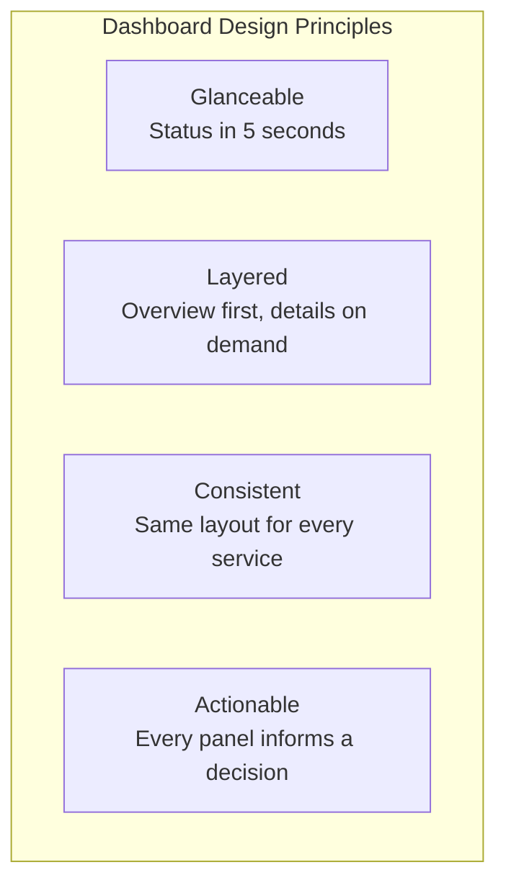
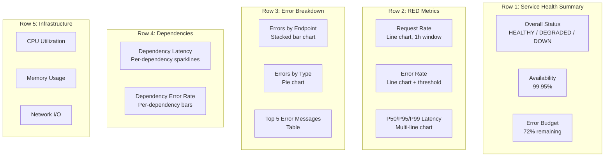

# How to Build Real-Time Service Health Dashboards with OpenTelemetry

Author: [nawazdhandala](https://www.github.com/nawazdhandala)

Tags: OpenTelemetry, Dashboards, Service Health, Real-Time Monitoring, Metrics, Observability, RED Metrics

Description: Learn how to build real-time service health dashboards using OpenTelemetry metrics, covering the RED method, golden signals, and practical dashboard design patterns.

---

A good service health dashboard answers one question in under five seconds: is everything OK? If the answer is no, it should immediately point you toward what is wrong. Too many dashboards fail at this because they are either too cluttered with dozens of graphs or too sparse to be useful.

OpenTelemetry provides a consistent, structured set of metrics across all your services. This consistency is what makes it possible to build dashboards that work the same way for every service, so on-call engineers do not need to learn a different dashboard layout for each team's services.

This guide covers how to design effective service health dashboards using OpenTelemetry metrics, what to include, what to leave out, and how to make them genuinely useful during incidents.

---

## Dashboard Design Philosophy



The best dashboards follow a hierarchy: the top row tells you overall health at a glance, the middle rows show the RED metrics (Rate, Errors, Duration) with enough detail to narrow down problems, and the bottom rows show infrastructure metrics for deeper investigation.

---

## Instrumenting the RED Metrics

The RED method (Rate, Errors, Duration) is the foundation of service health monitoring. Here is how to instrument these metrics consistently across services.

```python
# red_metrics.py
from opentelemetry import metrics
from opentelemetry.sdk.metrics import MeterProvider
from opentelemetry.sdk.metrics.export import PeriodicExportingMetricReader
from opentelemetry.exporter.otlp.proto.http.metric_exporter import OTLPMetricExporter
from opentelemetry.sdk.resources import Resource, SERVICE_NAME
import time

def setup_red_metrics(service_name: str):
    """
    Set up the standard RED metrics for a service.
    These metrics power the service health dashboard.
    """
    resource = Resource.create({
        SERVICE_NAME: service_name,
        "service.version": "1.2.3",
        "deployment.environment": "production",
    })

    reader = PeriodicExportingMetricReader(
        OTLPMetricExporter(endpoint="https://otel.oneuptime.com/v1/metrics"),
        export_interval_millis=10000,
    )
    provider = MeterProvider(resource=resource, metric_readers=[reader])
    metrics.set_meter_provider(provider)
    meter = metrics.get_meter("service.health")

    # RATE: Request throughput
    request_counter = meter.create_counter(
        name="http.server.request.total",
        description="Total number of HTTP requests received",
        unit="requests",
    )

    # ERRORS: Error count with classification
    error_counter = meter.create_counter(
        name="http.server.error.total",
        description="Total number of HTTP errors",
        unit="errors",
    )

    # DURATION: Request latency distribution
    request_duration = meter.create_histogram(
        name="http.server.request.duration",
        description="HTTP request duration",
        unit="ms",
    )

    return request_counter, error_counter, request_duration

# Initialize RED metrics
request_counter, error_counter, request_duration = setup_red_metrics("order-service")

def track_request(endpoint: str, method: str, status_code: int, duration_ms: float):
    """Record RED metrics for a completed HTTP request."""
    attributes = {
        "http.route": endpoint,
        "http.method": method,
        "http.status_code": str(status_code),
    }

    # Always count the request (Rate)
    request_counter.add(1, attributes)

    # Record the duration (Duration)
    request_duration.record(duration_ms, attributes)

    # Count errors separately for easier error rate calculation
    if status_code >= 500:
        error_counter.add(1, {
            **attributes,
            "error.type": classify_http_error(status_code),
        })

def classify_http_error(status_code: int) -> str:
    """Classify HTTP errors into categories for dashboard grouping."""
    if status_code == 500:
        return "internal_error"
    elif status_code == 502:
        return "bad_gateway"
    elif status_code == 503:
        return "service_unavailable"
    elif status_code == 504:
        return "gateway_timeout"
    elif status_code == 429:
        return "rate_limited"
    else:
        return f"http_{status_code}"
```

These three metrics form the core of your dashboard. Rate tells you traffic volume, Errors tells you reliability, and Duration tells you performance. Every service should export these with the same metric names and attribute conventions.

---

## Adding Infrastructure Metrics

Beyond the RED metrics, your dashboard needs infrastructure signals to help with troubleshooting.

```python
# infra_metrics.py
from opentelemetry import metrics
import psutil

meter = metrics.get_meter("service.infrastructure")

# CPU utilization per core
cpu_utilization = meter.create_observable_gauge(
    name="system.cpu.utilization",
    description="CPU utilization percentage",
    unit="percent",
    callbacks=[lambda options: [
        metrics.Observation(psutil.cpu_percent(interval=None))
    ]],
)

# Memory usage with breakdown
memory_usage = meter.create_observable_gauge(
    name="system.memory.usage",
    description="Memory usage in bytes",
    unit="bytes",
    callbacks=[lambda options: [
        metrics.Observation(psutil.virtual_memory().used, {"state": "used"}),
        metrics.Observation(psutil.virtual_memory().available, {"state": "available"}),
    ]],
)

# Open file descriptors (a common resource leak indicator)
open_fds = meter.create_observable_gauge(
    name="process.open_file_descriptors",
    description="Number of open file descriptors",
    unit="fds",
    callbacks=[lambda options: [
        metrics.Observation(psutil.Process().num_fds())
    ]],
)

# Network I/O
network_bytes = meter.create_observable_counter(
    name="system.network.bytes",
    description="Network bytes transferred",
    unit="bytes",
    callbacks=[lambda options: [
        metrics.Observation(
            psutil.net_io_counters().bytes_sent, {"direction": "sent"}
        ),
        metrics.Observation(
            psutil.net_io_counters().bytes_recv, {"direction": "received"}
        ),
    ]],
)
```

These infrastructure metrics appear in the lower section of your dashboard. They are not the first thing you look at, but they are essential when you need to determine whether a latency spike is caused by application code or by resource constraints.

---

## Adding Dependency Health Metrics

Your service does not exist in isolation. Track the health of your dependencies so you can quickly determine if a problem is yours or someone else's.

```python
# dependency_metrics.py
from opentelemetry import metrics
import time

meter = metrics.get_meter("service.dependencies")

# Track downstream service call latency
dependency_latency = meter.create_histogram(
    name="dependency.request.duration",
    description="Latency of calls to downstream dependencies",
    unit="ms",
)

# Track downstream service availability
dependency_errors = meter.create_counter(
    name="dependency.request.errors",
    description="Errors from downstream dependencies",
    unit="errors",
)

dependency_requests = meter.create_counter(
    name="dependency.request.total",
    description="Total calls to downstream dependencies",
    unit="requests",
)

def track_dependency_call(
    dependency_name: str,
    duration_ms: float,
    success: bool,
    status_code: int = 0,
):
    """Record metrics for a call to a downstream dependency."""
    attributes = {
        "dependency.name": dependency_name,
        "dependency.type": classify_dependency(dependency_name),
    }

    dependency_requests.add(1, attributes)
    dependency_latency.record(duration_ms, attributes)

    if not success:
        dependency_errors.add(1, {
            **attributes,
            "error.status_code": str(status_code),
        })

def classify_dependency(name: str) -> str:
    """Classify a dependency by type for dashboard grouping."""
    databases = ["postgresql", "mysql", "mongodb", "redis"]
    if any(db in name.lower() for db in databases):
        return "database"
    if "kafka" in name.lower() or "rabbitmq" in name.lower():
        return "messaging"
    return "service"
```

The dependency panel on your dashboard shows whether your service's problems are self-inflicted or caused by something upstream or downstream.

---

## Dashboard Layout

Here is the recommended layout, organized in rows from most to least urgent.



---

## Computing the Overall Health Status

The top-level health indicator is the single most important element on your dashboard. Compute it from your RED metrics.

```python
# health_status.py
from enum import Enum
from dataclasses import dataclass

class HealthStatus(Enum):
    HEALTHY = "healthy"
    DEGRADED = "degraded"
    DOWN = "down"

@dataclass
class ServiceHealth:
    """Computed service health status from RED metrics."""
    status: HealthStatus
    request_rate: float
    error_rate_percent: float
    p95_latency_ms: float
    issues: list

def compute_health(metrics_client, service: str) -> ServiceHealth:
    """
    Compute the overall health status of a service based on
    current RED metrics compared to thresholds.
    """
    # Fetch current metric values
    request_rate = metrics_client.query_rate(
        "http.server.request.total",
        labels={"service.name": service},
        window="5m",
    )

    error_rate = metrics_client.query_rate(
        "http.server.error.total",
        labels={"service.name": service},
        window="5m",
    )

    p95_latency = metrics_client.query_percentile(
        "http.server.request.duration",
        percentile=0.95,
        labels={"service.name": service},
        window="5m",
    )

    # Calculate error percentage
    error_percent = (error_rate / request_rate * 100) if request_rate > 0 else 0

    # Determine health status based on thresholds
    issues = []
    status = HealthStatus.HEALTHY

    if error_percent > 5.0:
        status = HealthStatus.DOWN
        issues.append(f"Error rate is {error_percent:.1f}% (threshold: 5%)")
    elif error_percent > 1.0:
        status = HealthStatus.DEGRADED
        issues.append(f"Error rate is {error_percent:.1f}% (threshold: 1%)")

    if p95_latency > 1000:
        status = HealthStatus.DOWN
        issues.append(f"P95 latency is {p95_latency:.0f}ms (threshold: 1000ms)")
    elif p95_latency > 500:
        if status != HealthStatus.DOWN:
            status = HealthStatus.DEGRADED
        issues.append(f"P95 latency is {p95_latency:.0f}ms (threshold: 500ms)")

    if request_rate == 0:
        status = HealthStatus.DOWN
        issues.append("No traffic detected")

    return ServiceHealth(
        status=status,
        request_rate=request_rate,
        error_rate_percent=error_percent,
        p95_latency_ms=p95_latency,
        issues=issues,
    )
```

The health computation uses simple, well-understood thresholds. A service is HEALTHY when errors are under 1% and P95 latency is under 500ms. It is DEGRADED when either metric exceeds its warning threshold. It is DOWN when either exceeds the critical threshold or when no traffic is flowing.

---

## Keeping Dashboards Consistent Across Services

The biggest advantage of using OpenTelemetry for dashboards is consistency. When every service uses the same metric names and conventions, you can build a single dashboard template that works for all services.

```python
# dashboard_template.py
def generate_dashboard_config(service_name: str) -> dict:
    """
    Generate a dashboard configuration for a service.
    Uses the standard OpenTelemetry metric names that every service exports.
    """
    return {
        "title": f"{service_name} - Service Health",
        "refresh_interval": "10s",
        "rows": [
            {
                "title": "Health Summary",
                "panels": [
                    {
                        "type": "stat",
                        "title": "Status",
                        "query": f'compute_health("{service_name}")',
                    },
                    {
                        "type": "stat",
                        "title": "Request Rate",
                        "query": f'rate(http_server_request_total{{service_name="{service_name}"}}[5m])',
                    },
                    {
                        "type": "stat",
                        "title": "Error Rate",
                        "query": (
                            f'rate(http_server_error_total{{service_name="{service_name}"}}[5m]) / '
                            f'rate(http_server_request_total{{service_name="{service_name}"}}[5m]) * 100'
                        ),
                    },
                ],
            },
            {
                "title": "RED Metrics",
                "panels": [
                    {
                        "type": "timeseries",
                        "title": "Request Rate",
                        "query": f'rate(http_server_request_total{{service_name="{service_name}"}}[1m])',
                    },
                    {
                        "type": "timeseries",
                        "title": "Error Rate",
                        "query": f'rate(http_server_error_total{{service_name="{service_name}"}}[1m])',
                    },
                    {
                        "type": "timeseries",
                        "title": "Latency Percentiles",
                        "queries": [
                            f'histogram_quantile(0.50, rate(http_server_request_duration_bucket{{service_name="{service_name}"}}[5m]))',
                            f'histogram_quantile(0.95, rate(http_server_request_duration_bucket{{service_name="{service_name}"}}[5m]))',
                            f'histogram_quantile(0.99, rate(http_server_request_duration_bucket{{service_name="{service_name}"}}[5m]))',
                        ],
                    },
                ],
            },
        ],
    }
```

This template generator produces a consistent dashboard for any service. The only parameter is the service name, because the metric names and attribute conventions are standardized through OpenTelemetry.

---

## Summary

Real-time service health dashboards built on OpenTelemetry metrics give you immediate visibility into the state of your services. The key is designing them around the RED method (Rate, Errors, Duration) and organizing the panels in a hierarchy from "is everything OK?" at the top to "what exactly is wrong?" at the bottom. Standardize your metric names and conventions across services so you can use a single dashboard template everywhere. A consistent dashboard that every engineer can read in five seconds is worth more than a dozen custom dashboards that only the service owner understands.
