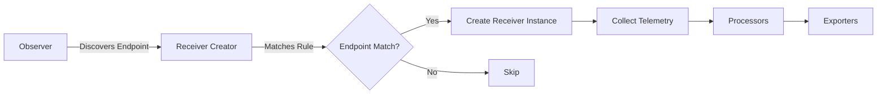

# How to Configure the Receiver Creator for Dynamic Receiver Configuration

Author: [nawazdhandala](https://www.github.com/nawazdhandala)

Tags: OpenTelemetry, Collector, Receiver Creator, Dynamic Configuration, Service Discovery

Description: Learn how to configure the Receiver Creator in the OpenTelemetry Collector for dynamic receiver instantiation based on discovered endpoints and services.

---

The Receiver Creator is a powerful meta-receiver in the OpenTelemetry Collector that dynamically creates and manages receiver instances based on discovered endpoints. This is particularly useful in containerized environments where services come and go, making static receiver configurations impractical.

For more on OpenTelemetry Collector fundamentals, see our guide on [collector architecture](https://oneuptime.com/blog/post/opentelemetry-collector-architecture/view).

## What is the Receiver Creator?

The Receiver Creator watches for endpoints using observers and dynamically instantiates receivers when matching endpoints are discovered. It eliminates the need to manually configure receivers for every service, making it ideal for:

- Kubernetes environments with dynamic pod creation
- Auto-scaling service deployments
- Multi-tenant systems with varying service configurations
- Development environments with frequently changing services



## Basic Configuration

The Receiver Creator requires at least one observer and one receiver template. Observers discover endpoints, and templates define how to create receivers for matching endpoints.

```yaml
receivers:
  receiver_creator:
    # Define observers that discover endpoints
    watch_observers: [k8s_observer]

    receivers:
      # Template for creating receivers when endpoints match
      prometheus:
        # Rule determines which endpoints trigger receiver creation
        rule: type == "pod" && labels["prometheus.io/scrape"] == "true"
        config:
          # Receiver configuration with templated values from endpoint
          scrape_configs:
            - job_name: '{{.Name}}'
              scrape_interval: 30s
              static_configs:
                - targets: ['{{.Target}}']
              metric_relabel_configs:
                - source_labels: [__name__]
                  target_label: service
                  replacement: '{{.Name}}'
```

## Observers

Observers discover endpoints that might need receivers. The Receiver Creator supports multiple observer types.

### Kubernetes Observer

The Kubernetes observer watches for Kubernetes resources like pods, services, and nodes.

```yaml
extensions:
  k8s_observer:
    # Authentication method for Kubernetes API
    auth_type: serviceAccount

    # Watch for specific resource types
    observe_pods: true
    observe_nodes: true
    observe_services: false

    # Filter which pods to observe
    node: ${env:K8S_NODE_NAME}

receivers:
  receiver_creator:
    watch_observers: [k8s_observer]

    receivers:
      # Scrape metrics from pods with annotations
      prometheus:
        rule: type == "pod" && annotations["prometheus.io/scrape"] == "true"
        config:
          scrape_configs:
            - job_name: 'k8s-pods'
              scrape_interval: 30s
              # Use port from annotation, default to 8080
              static_configs:
                - targets: ['{{.Target}}:{{default "8080" (index .Annotations "prometheus.io/port")}}']
              metrics_path: '{{default "/metrics" (index .Annotations "prometheus.io/path")}}'
              relabel_configs:
                - source_labels: [__address__]
                  target_label: __address__
                  replacement: '{{.PodIP}}:{{default "8080" (index .Annotations "prometheus.io/port")}}'
```

### Host Observer

The host observer discovers endpoints on the local host by scanning ports.

```yaml
extensions:
  host_observer:
    # List of ports to scan for services
    refresh_interval: 60s

receivers:
  receiver_creator:
    watch_observers: [host_observer]

    receivers:
      # Create Redis receiver for discovered Redis instances
      redis:
        rule: type == "port" && port == 6379
        config:
          endpoint: '{{.Target}}'
          collection_interval: 10s
          password: ${env:REDIS_PASSWORD}

      # Create PostgreSQL receiver for discovered instances
      postgresql:
        rule: type == "port" && port == 5432
        config:
          endpoint: '{{.Target}}'
          username: ${env:POSTGRES_USER}
          password: ${env:POSTGRES_PASSWORD}
          databases: [postgres]
```

### Docker Observer

The Docker observer watches Docker containers.

```yaml
extensions:
  docker_observer:
    endpoint: unix:///var/run/docker.sock
    timeout: 5s
    excluded_images: ["excluded-image-*"]

receivers:
  receiver_creator:
    watch_observers: [docker_observer]

    receivers:
      # Scrape metrics from containers with specific label
      prometheus:
        rule: type == "container" && labels["monitoring.enabled"] == "true"
        config:
          scrape_configs:
            - job_name: 'docker-containers'
              static_configs:
                - targets: ['{{.Host}}:{{index .Labels "monitoring.port"}}']
              metric_relabel_configs:
                - source_labels: [__name__]
                  target_label: container_name
                  replacement: '{{.Name}}'
```

## Endpoint Rules

Rules determine which discovered endpoints should trigger receiver creation. Rules use the Common Expression Language (CEL) for flexible matching.

### Basic Rule Syntax

```yaml
receivers:
  receiver_creator:
    watch_observers: [k8s_observer]

    receivers:
      # Match by type
      prometheus/pods:
        rule: type == "pod"
        config: {}

      # Match by label
      prometheus/annotated:
        rule: labels["app"] == "myapp"
        config: {}

      # Match by annotation
      prometheus/scrape:
        rule: annotations["prometheus.io/scrape"] == "true"
        config: {}

      # Complex conditions with AND
      prometheus/specific:
        rule: type == "pod" && labels["env"] == "production" && annotations["metrics"] == "enabled"
        config: {}

      # Complex conditions with OR
      prometheus/multi:
        rule: labels["app"] == "frontend" || labels["app"] == "backend"
        config: {}
```

### Rule Variables

Different observers provide different variables for use in rules.

```yaml
receivers:
  receiver_creator:
    watch_observers: [k8s_observer]

    receivers:
      prometheus:
        # Available variables for Kubernetes pods:
        # - type: "pod", "service", "node"
        # - name: pod name
        # - namespace: pod namespace
        # - uid: pod UID
        # - labels: map of labels
        # - annotations: map of annotations
        # - podIP: pod IP address
        rule: |
          type == "pod" &&
          namespace == "production" &&
          labels["monitoring"] == "enabled" &&
          annotations["prometheus.io/scrape"] == "true"
        config:
          scrape_configs:
            - job_name: 'pod-{{.Namespace}}-{{.Name}}'
              static_configs:
                - targets: ['{{.PodIP}}:{{index .Annotations "prometheus.io/port"}}']
```

## Resource Attributes

Add resource attributes to telemetry collected from dynamically created receivers.

```yaml
receivers:
  receiver_creator:
    watch_observers: [k8s_observer]

    # Define resource attributes for all receivers
    resource_attributes:
      # Static attributes
      deployment.environment: production
      service.namespace: observability

      # Attributes from endpoint metadata
      k8s.pod.name: '`name`'
      k8s.namespace.name: '`namespace`'
      k8s.pod.uid: '`uid`'

    receivers:
      prometheus:
        rule: type == "pod" && annotations["prometheus.io/scrape"] == "true"

        # Additional resource attributes specific to this receiver
        resource_attributes:
          # Extract label values
          app.name: '`labels["app"]`'
          app.version: '`labels["version"]`'

          # Extract annotation values
          monitoring.path: '`annotations["prometheus.io/path"]`'

        config:
          scrape_configs:
            - job_name: '{{.Name}}'
              static_configs:
                - targets: ['{{.PodIP}}:{{index .Annotations "prometheus.io/port"}}']
```

## Advanced Configuration Examples

### Multi-Environment Setup

Configure different receiver behaviors based on environment labels.

```yaml
receivers:
  receiver_creator:
    watch_observers: [k8s_observer]

    receivers:
      # Production pods - less frequent scraping
      prometheus/production:
        rule: type == "pod" && labels["env"] == "production" && annotations["prometheus.io/scrape"] == "true"
        resource_attributes:
          deployment.environment: production
          k8s.pod.name: '`name`'
          k8s.namespace.name: '`namespace`'
        config:
          scrape_configs:
            - job_name: 'prod-{{.Name}}'
              scrape_interval: 60s
              static_configs:
                - targets: ['{{.PodIP}}:{{index .Annotations "prometheus.io/port"}}']

      # Development pods - more frequent scraping
      prometheus/development:
        rule: type == "pod" && labels["env"] == "development" && annotations["prometheus.io/scrape"] == "true"
        resource_attributes:
          deployment.environment: development
          k8s.pod.name: '`name`'
          k8s.namespace.name: '`namespace`'
        config:
          scrape_configs:
            - job_name: 'dev-{{.Name}}'
              scrape_interval: 15s
              static_configs:
                - targets: ['{{.PodIP}}:{{index .Annotations "prometheus.io/port"}}']
```

### Service-Specific Receivers

Create different receiver types based on discovered service characteristics.

```yaml
receivers:
  receiver_creator:
    watch_observers: [k8s_observer]

    receivers:
      # Redis metrics
      redis:
        rule: type == "pod" && labels["app"] == "redis"
        resource_attributes:
          service.name: redis-{{.Name}}
          k8s.pod.name: '`name`'
        config:
          endpoint: '{{.PodIP}}:6379'
          collection_interval: 30s
          password: ${env:REDIS_PASSWORD}

      # PostgreSQL metrics
      postgresql:
        rule: type == "pod" && labels["app"] == "postgresql"
        resource_attributes:
          service.name: postgresql-{{.Name}}
          k8s.pod.name: '`name`'
        config:
          endpoint: '{{.PodIP}}:5432'
          username: ${env:POSTGRES_USER}
          password: ${env:POSTGRES_PASSWORD}
          databases: [postgres]

      # Generic Prometheus metrics for other services
      prometheus:
        rule: type == "pod" && labels["app"] != "redis" && labels["app"] != "postgresql" && annotations["prometheus.io/scrape"] == "true"
        resource_attributes:
          service.name: '`labels["app"]`'
          k8s.pod.name: '`name`'
        config:
          scrape_configs:
            - job_name: '{{.Name}}'
              static_configs:
                - targets: ['{{.PodIP}}:{{index .Annotations "prometheus.io/port"}}']
```

### Conditional Configuration

Use templating to adjust receiver configuration based on endpoint properties.

```yaml
receivers:
  receiver_creator:
    watch_observers: [k8s_observer]

    receivers:
      prometheus:
        rule: type == "pod" && annotations["prometheus.io/scrape"] == "true"
        config:
          scrape_configs:
            - job_name: '{{.Name}}'
              # Adjust scrape interval based on annotation
              scrape_interval: '{{default "30s" (index .Annotations "prometheus.io/interval")}}'

              # Use custom metrics path if specified
              metrics_path: '{{default "/metrics" (index .Annotations "prometheus.io/path")}}'

              # Use custom port if specified, otherwise default to 8080
              static_configs:
                - targets: ['{{.PodIP}}:{{default "8080" (index .Annotations "prometheus.io/port")}}']

              # Add scheme from annotation
              scheme: '{{default "http" (index .Annotations "prometheus.io/scheme")}}'

              # Add TLS config if enabled
              {{if eq (index .Annotations "prometheus.io/tls") "true"}}
              tls_config:
                insecure_skip_verify: false
              {{end}}

              # Add bearer token if specified
              {{if index .Annotations "prometheus.io/bearer_token"}}
              authorization:
                credentials: '{{index .Annotations "prometheus.io/bearer_token"}}'
              {{end}}
```

## Complete Configuration Example

Here's a production-ready configuration with multiple observers and receivers.

```yaml
extensions:
  # Kubernetes observer for pod discovery
  k8s_observer:
    auth_type: serviceAccount
    observe_pods: true
    observe_nodes: false
    node: ${env:K8S_NODE_NAME}

  # Host observer for local services
  host_observer:
    refresh_interval: 60s

receivers:
  receiver_creator:
    # Watch both Kubernetes and host endpoints
    watch_observers: [k8s_observer, host_observer]

    # Global resource attributes
    resource_attributes:
      collector.name: ${env:HOSTNAME}
      cluster.name: ${env:CLUSTER_NAME}

    receivers:
      # Prometheus scraping for Kubernetes pods
      prometheus/k8s:
        rule: |
          type == "pod" &&
          annotations["prometheus.io/scrape"] == "true" &&
          labels["monitoring"] != "disabled"

        resource_attributes:
          k8s.pod.name: '`name`'
          k8s.namespace.name: '`namespace`'
          k8s.pod.uid: '`uid`'
          service.name: '`labels["app"]`'
          service.version: '`labels["version"]`'

        config:
          scrape_configs:
            - job_name: 'k8s-{{.Namespace}}-{{.Name}}'
              scrape_interval: '{{default "30s" (index .Annotations "prometheus.io/interval")}}'
              metrics_path: '{{default "/metrics" (index .Annotations "prometheus.io/path")}}'
              static_configs:
                - targets: ['{{.PodIP}}:{{default "8080" (index .Annotations "prometheus.io/port")}}']

              relabel_configs:
                # Keep pod and namespace labels
                - source_labels: [__meta_kubernetes_pod_name]
                  target_label: pod
                - source_labels: [__meta_kubernetes_namespace]
                  target_label: namespace

      # Redis receiver for Redis instances
      redis/discovered:
        rule: (type == "pod" && labels["app"] == "redis") || (type == "port" && port == 6379)

        resource_attributes:
          service.name: redis
          db.system: redis

        config:
          endpoint: '{{if .PodIP}}{{.PodIP}}{{else}}{{.Target}}{{end}}:6379'
          collection_interval: 30s
          password: ${env:REDIS_PASSWORD}
          metrics:
            redis.uptime:
              enabled: true
            redis.connected_clients:
              enabled: true
            redis.memory.used:
              enabled: true

      # PostgreSQL receiver
      postgresql/discovered:
        rule: (type == "pod" && labels["app"] == "postgresql") || (type == "port" && port == 5432)

        resource_attributes:
          service.name: postgresql
          db.system: postgresql

        config:
          endpoint: '{{if .PodIP}}{{.PodIP}}{{else}}{{.Target}}{{end}}:5432'
          username: ${env:POSTGRES_USER}
          password: ${env:POSTGRES_PASSWORD}
          databases: [postgres]
          collection_interval: 60s

processors:
  # Add batch processing for efficiency
  batch:
    timeout: 10s
    send_batch_size: 1024

  # Add resource detection
  resourcedetection:
    detectors: [env, system]
    timeout: 5s

exporters:
  # Export to OTLP endpoint
  otlp:
    endpoint: ${env:OTEL_EXPORTER_OTLP_ENDPOINT}
    headers:
      authorization: Bearer ${env:OTEL_AUTH_TOKEN}

service:
  extensions: [k8s_observer, host_observer]

  pipelines:
    metrics:
      receivers: [receiver_creator]
      processors: [resourcedetection, batch]
      exporters: [otlp]
```

## Troubleshooting

### Enable Debug Logging

Add debug logging to see what the Receiver Creator is doing.

```yaml
service:
  telemetry:
    logs:
      level: debug
      # Filter to receiver_creator logs only
      initial_fields:
        service: receiver_creator
```

### Common Issues

**Issue: Receivers not being created**

Check that:
- Observers are properly configured and discovering endpoints
- Rules correctly match the endpoint properties
- Templates use valid syntax

**Issue: Too many receivers created**

Refine rules to be more specific:

```yaml
receivers:
  receiver_creator:
    receivers:
      prometheus:
        # Too broad - creates receiver for ALL pods
        rule: type == "pod"

        # Better - only pods with annotation
        rule: type == "pod" && annotations["prometheus.io/scrape"] == "true"

        # Best - specific namespace and annotation
        rule: |
          type == "pod" &&
          namespace == "production" &&
          annotations["prometheus.io/scrape"] == "true"
```

**Issue: Resource attribute templating not working**

Resource attribute values must be wrapped in backticks:

```yaml
resource_attributes:
  # Wrong - treated as string literal
  k8s.pod.name: 'name'

  # Correct - evaluated as expression
  k8s.pod.name: '`name`'
```

## Performance Considerations

The Receiver Creator can create many receiver instances, which impacts resource usage.

### Limit Receiver Creation

```yaml
receivers:
  receiver_creator:
    watch_observers: [k8s_observer]

    receivers:
      prometheus:
        # Add resource limits to prevent too many receivers
        rule: |
          type == "pod" &&
          namespace in ["production", "staging"] &&
          annotations["prometheus.io/scrape"] == "true"

        config:
          scrape_configs:
            - job_name: '{{.Name}}'
              # Increase scrape interval to reduce load
              scrape_interval: 60s
              static_configs:
                - targets: ['{{.PodIP}}:{{index .Annotations "prometheus.io/port"}}']
```

### Use Batch Processing

Always use batch processors with the Receiver Creator to efficiently handle telemetry from multiple receivers.

```yaml
processors:
  batch:
    timeout: 10s
    send_batch_size: 1024
    send_batch_max_size: 2048

service:
  pipelines:
    metrics:
      receivers: [receiver_creator]
      processors: [batch]
      exporters: [otlp]
```

## Summary

| Component | Purpose |
|-----------|---------|
| **Observers** | Discover endpoints (Kubernetes, Docker, host) |
| **Rules** | Match endpoints using CEL expressions |
| **Templates** | Define receiver configuration with variables |
| **Resource Attributes** | Add metadata to collected telemetry |
| **Watch Observers** | List of observers to monitor |

The Receiver Creator eliminates manual receiver configuration in dynamic environments. It automatically creates and destroys receiver instances as services come and go, making it essential for Kubernetes, auto-scaling, and containerized deployments. By combining observers, rules, and templates, you can build flexible, maintainable telemetry collection that adapts to your infrastructure.

For more on OpenTelemetry receivers, see our guides on [Prometheus receiver](https://oneuptime.com/blog/post/prometheus-receiver-opentelemetry-collector/view) and [OTLP receiver](https://oneuptime.com/blog/post/otlp-receiver-opentelemetry-collector/view).
