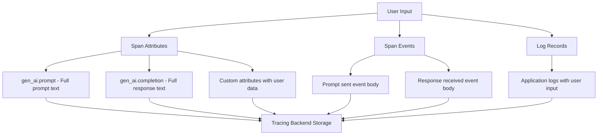
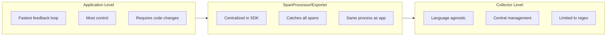

# How to Redact Sensitive User Prompts in GenAI OpenTelemetry Traces

Author: [nawazdhandala](https://www.github.com/nawazdhandala)

Tags: OpenTelemetry, GenAI, Security, PII Redaction, Tracing, Data Privacy, LLM

Description: A step-by-step guide to redacting sensitive user data like PII, credentials, and personal information from GenAI OpenTelemetry traces before they reach your observability backend.

---

When you instrument GenAI applications with OpenTelemetry, you naturally want to capture prompt and response data in your traces. It's incredibly useful for debugging. If a user reports a bad response, you can look up the trace, see exactly what prompt was sent, and understand what went wrong.

But there's a problem. User prompts often contain sensitive information. People paste their API keys into chatbots. They ask questions that include their home address, social security number, or medical details. If that data ends up in your tracing backend, you've got a compliance nightmare on your hands. GDPR, HIPAA, SOC 2 - all of these require you to protect personally identifiable information (PII).

The good news is that OpenTelemetry gives you multiple hooks to intercept and redact sensitive data before it leaves your application. Let's look at how to do it right.

## Where Sensitive Data Shows Up in Traces

Before we start redacting, we need to understand where PII can appear in GenAI traces:



The OpenTelemetry GenAI semantic conventions define attributes like `gen_ai.prompt` and `gen_ai.completion` that are designed to carry the full text. These are the primary targets for redaction.

## Strategy 1: Redact at the Application Level

The simplest approach is to redact PII before it ever becomes a span attribute. This is the most secure option because the sensitive data never enters the OpenTelemetry pipeline at all.

```python
# pii_redactor.py - PII detection and redaction utilities

import re
from typing import List, Tuple

class PIIRedactor:
    """Detects and redacts common PII patterns from text."""

    def __init__(self):
        # Define regex patterns for common PII types
        self.patterns: List[Tuple[str, str, str]] = [
            # (pattern_name, regex, replacement)
            ("ssn", r"\b\d{3}-\d{2}-\d{4}\b", "[REDACTED_SSN]"),
            ("email", r"\b[A-Za-z0-9._%+-]+@[A-Za-z0-9.-]+\.[A-Z|a-z]{2,}\b", "[REDACTED_EMAIL]"),
            ("phone_us", r"\b(?:\+1[-.\s]?)?\(?\d{3}\)?[-.\s]?\d{3}[-.\s]?\d{4}\b", "[REDACTED_PHONE]"),
            ("credit_card", r"\b(?:\d{4}[-\s]?){3}\d{4}\b", "[REDACTED_CC]"),
            ("ip_address", r"\b\d{1,3}\.\d{1,3}\.\d{1,3}\.\d{1,3}\b", "[REDACTED_IP]"),
            # API keys often follow patterns like sk-... or key-...
            ("api_key", r"\b(?:sk|api|key|token|secret|password)[-_]?[A-Za-z0-9]{20,}\b", "[REDACTED_API_KEY]"),
            # AWS access keys
            ("aws_key", r"\bAKIA[0-9A-Z]{16}\b", "[REDACTED_AWS_KEY]"),
        ]

    def redact(self, text: str) -> str:
        """Apply all redaction patterns to the input text."""
        redacted = text
        for name, pattern, replacement in self.patterns:
            redacted = re.sub(pattern, replacement, redacted, flags=re.IGNORECASE)
        return redacted

    def detect(self, text: str) -> List[str]:
        """Return a list of PII types found in the text without redacting."""
        found = []
        for name, pattern, _ in self.patterns:
            if re.search(pattern, text, re.IGNORECASE):
                found.append(name)
        return found
```

Now use this redactor when setting span attributes in your GenAI application:

```python
# genai_traced.py - GenAI service with PII redaction in span attributes

from opentelemetry import trace
from pii_redactor import PIIRedactor
import openai

tracer = trace.get_tracer("genai.service")
redactor = PIIRedactor()

def chat_completion(user_prompt: str, model: str = "gpt-4") -> str:
    with tracer.start_as_current_span("genai.chat_completion") as span:
        # Detect what types of PII are present (for metrics, not stored as raw text)
        pii_types = redactor.detect(user_prompt)
        span.set_attribute("pii.types_detected", str(pii_types))
        span.set_attribute("pii.detected", len(pii_types) > 0)

        # Store the REDACTED version of the prompt, never the original
        redacted_prompt = redactor.redact(user_prompt)
        span.set_attribute("gen_ai.prompt", redacted_prompt)
        span.set_attribute("gen_ai.system", "openai")
        span.set_attribute("gen_ai.request.model", model)

        # Send the ORIGINAL prompt to the LLM (it needs the real data)
        response = openai.chat.completions.create(
            model=model,
            messages=[{"role": "user", "content": user_prompt}],
        )

        output = response.choices[0].message.content

        # Also redact the response since the LLM might echo back sensitive data
        redacted_output = redactor.redact(output)
        span.set_attribute("gen_ai.completion", redacted_output)
        span.set_attribute("gen_ai.usage.prompt_tokens", response.usage.prompt_tokens)
        span.set_attribute("gen_ai.usage.completion_tokens", response.usage.completion_tokens)

        return output
```

This is important to get right: the LLM gets the original prompt so it can respond correctly, but only the redacted version goes into the trace.

## Strategy 2: Use a Custom SpanProcessor

If you want a centralized redaction layer that catches all spans regardless of which part of your code created them, you can implement a custom `SpanProcessor`. This acts as middleware in the OpenTelemetry pipeline.

```python
# redacting_span_processor.py - Custom SpanProcessor that redacts PII from all spans

from opentelemetry.sdk.trace import SpanProcessor, ReadableSpan
from opentelemetry.sdk.trace.export import SpanExporter
from pii_redactor import PIIRedactor
from opentelemetry.trace import Span

class RedactingSpanProcessor(SpanProcessor):
    """A SpanProcessor that redacts PII from span attributes before export."""

    def __init__(self, delegate_exporter: SpanExporter):
        self.exporter = delegate_exporter
        self.redactor = PIIRedactor()

        # Attributes that should be checked for PII
        self.sensitive_attributes = {
            "gen_ai.prompt",
            "gen_ai.completion",
            "http.request.body",
            "http.response.body",
            "db.statement",
            "user.input",
            "message.content",
        }

    def on_start(self, span: Span, parent_context=None):
        # Nothing to do at span start
        pass

    def on_end(self, span: ReadableSpan):
        # We'll handle this in the batch export
        pass

    def shutdown(self):
        self.exporter.shutdown()

    def force_flush(self, timeout_millis=None):
        self.exporter.force_flush(timeout_millis)
```

Since the built-in `ReadableSpan` is immutable after it ends, a cleaner approach is to combine the redaction with a custom exporter wrapper:

```python
# redacting_exporter.py - Exporter wrapper that redacts PII before sending

from opentelemetry.sdk.trace.export import SpanExporter, SpanExportResult
from opentelemetry.sdk.trace import ReadableSpan
from pii_redactor import PIIRedactor
from typing import Sequence

class RedactingExporter(SpanExporter):
    """Wraps another exporter and redacts PII from span attributes before export."""

    def __init__(self, delegate: SpanExporter):
        self.delegate = delegate
        self.redactor = PIIRedactor()
        # Attribute keys that might contain sensitive user data
        self.sensitive_keys = {
            "gen_ai.prompt",
            "gen_ai.completion",
            "user.input",
            "message.content",
        }

    def export(self, spans: Sequence[ReadableSpan]) -> SpanExportResult:
        redacted_spans = []
        for span in spans:
            # Check if any sensitive attributes exist on this span
            needs_redaction = any(
                key in span.attributes for key in self.sensitive_keys
                if span.attributes is not None
            )

            if needs_redaction and span.attributes:
                # Create a new attributes dict with redacted values
                new_attrs = dict(span.attributes)
                for key in self.sensitive_keys:
                    if key in new_attrs and isinstance(new_attrs[key], str):
                        new_attrs[key] = self.redactor.redact(new_attrs[key])

                # Create a modified copy of the span with redacted attributes
                redacted_spans.append(
                    _create_redacted_span(span, new_attrs)
                )
            else:
                redacted_spans.append(span)

        return self.delegate.export(redacted_spans)

    def shutdown(self):
        self.delegate.shutdown()

    def force_flush(self, timeout_millis=None):
        return self.delegate.force_flush(timeout_millis)
```

To use the redacting exporter, wrap your regular OTLP exporter with it:

```python
# setup_with_redaction.py - Configure OpenTelemetry with the redacting exporter

from opentelemetry import trace
from opentelemetry.sdk.trace import TracerProvider
from opentelemetry.sdk.trace.export import BatchSpanProcessor
from opentelemetry.exporter.otlp.proto.grpc.trace_exporter import OTLPSpanExporter
from redacting_exporter import RedactingExporter

def configure_tracing_with_redaction():
    # Create the real OTLP exporter
    otlp_exporter = OTLPSpanExporter(endpoint="http://localhost:4317", insecure=True)

    # Wrap it with the redacting exporter
    redacting_exporter = RedactingExporter(delegate=otlp_exporter)

    # Use the redacting exporter in the span processor
    provider = TracerProvider()
    provider.add_span_processor(BatchSpanProcessor(redacting_exporter))
    trace.set_tracer_provider(provider)
```

## Strategy 3: Redact in the OpenTelemetry Collector

If you want to keep your application code clean and handle redaction centrally, you can use the OpenTelemetry Collector's `transform` processor with OTTL (OpenTelemetry Transformation Language).

```yaml
# otel-collector-config.yaml - Collector config with PII redaction transforms

receivers:
  otlp:
    protocols:
      grpc:
        endpoint: 0.0.0.0:4317

processors:
  # Use the transform processor to redact PII patterns
  transform:
    trace_statements:
      - context: span
        statements:
          # Redact email addresses from prompt attributes
          - replace_pattern(attributes["gen_ai.prompt"], "\\b[A-Za-z0-9._%+-]+@[A-Za-z0-9.-]+\\.[A-Z|a-z]{2,}\\b", "[REDACTED_EMAIL]")
          # Redact SSN patterns
          - replace_pattern(attributes["gen_ai.prompt"], "\\b\\d{3}-\\d{2}-\\d{4}\\b", "[REDACTED_SSN]")
          # Redact phone numbers
          - replace_pattern(attributes["gen_ai.prompt"], "\\b\\d{3}[-.]?\\d{3}[-.]?\\d{4}\\b", "[REDACTED_PHONE]")
          # Apply the same redactions to completion text
          - replace_pattern(attributes["gen_ai.completion"], "\\b[A-Za-z0-9._%+-]+@[A-Za-z0-9.-]+\\.[A-Z|a-z]{2,}\\b", "[REDACTED_EMAIL]")
          - replace_pattern(attributes["gen_ai.completion"], "\\b\\d{3}-\\d{2}-\\d{4}\\b", "[REDACTED_SSN]")

exporters:
  otlp:
    endpoint: "https://your-backend.example.com:4317"

service:
  pipelines:
    traces:
      receivers: [otlp]
      processors: [transform]
      exporters: [otlp]
```

The collector approach is nice because it applies to all services sending traces through that collector, not just one application. But it has a limitation: regex-based redaction can't catch everything. Names, addresses, and contextual PII often don't follow predictable patterns.

## Strategy 4: Using Microsoft Presidio for Advanced PII Detection

For more sophisticated PII detection that goes beyond regex, you can integrate Microsoft Presidio. It uses NLP models to detect entities like names, locations, and organizations.

```python
# presidio_redactor.py - Advanced PII redaction using Microsoft Presidio

from presidio_analyzer import AnalyzerEngine
from presidio_anonymizer import AnonymizerEngine
from presidio_anonymizer.entities import OperatorConfig

class PresidioRedactor:
    def __init__(self):
        # Initialize the Presidio analyzer and anonymizer
        self.analyzer = AnalyzerEngine()
        self.anonymizer = AnonymizerEngine()

    def redact(self, text: str, language: str = "en") -> str:
        """Detect and redact PII using Presidio NLP models."""
        # Analyze the text for PII entities
        results = self.analyzer.analyze(
            text=text,
            language=language,
            entities=[
                "PERSON",
                "EMAIL_ADDRESS",
                "PHONE_NUMBER",
                "CREDIT_CARD",
                "US_SSN",
                "LOCATION",
                "IP_ADDRESS",
                "MEDICAL_LICENSE",
                "US_BANK_NUMBER",
            ],
        )

        # Anonymize detected entities with placeholder tags
        anonymized = self.anonymizer.anonymize(
            text=text,
            analyzer_results=results,
            operators={
                "DEFAULT": OperatorConfig("replace", {"new_value": "[REDACTED]"}),
                "PERSON": OperatorConfig("replace", {"new_value": "[REDACTED_NAME]"}),
                "EMAIL_ADDRESS": OperatorConfig("replace", {"new_value": "[REDACTED_EMAIL]"}),
                "PHONE_NUMBER": OperatorConfig("replace", {"new_value": "[REDACTED_PHONE]"}),
                "CREDIT_CARD": OperatorConfig("replace", {"new_value": "[REDACTED_CC]"}),
            },
        )

        return anonymized.text
```

Presidio can catch things like "My name is John Smith and I live at 123 Main Street" that pure regex approaches would miss. The tradeoff is that it adds latency (NLP model inference) and occasional false positives.

## Deciding Where to Redact

Here's a comparison of the different approaches to help you decide:



My recommendation: use a layered approach. Redact known PII patterns at the application level (Strategy 1) as your primary defense, and add collector-level redaction (Strategy 3) as a safety net for anything that slips through.

## Testing Your Redaction

Don't forget to test that your redaction actually works. Here's a simple test that verifies PII doesn't leak into exported spans.

```python
# test_redaction.py - Verify PII is properly redacted from traces

from pii_redactor import PIIRedactor

def test_email_redaction():
    redactor = PIIRedactor()
    text = "Please send the report to john.doe@example.com"
    result = redactor.redact(text)
    # Verify the email is gone
    assert "john.doe@example.com" not in result
    assert "[REDACTED_EMAIL]" in result

def test_ssn_redaction():
    redactor = PIIRedactor()
    text = "My SSN is 123-45-6789, please update my records"
    result = redactor.redact(text)
    assert "123-45-6789" not in result
    assert "[REDACTED_SSN]" in result

def test_api_key_redaction():
    redactor = PIIRedactor()
    text = "Use this key: sk-abc123def456ghi789jkl012mno345"
    result = redactor.redact(text)
    assert "sk-abc123def456ghi789jkl012mno345" not in result
    assert "[REDACTED_API_KEY]" in result

def test_no_false_positives():
    redactor = PIIRedactor()
    text = "The weather is nice today and the sky is blue."
    result = redactor.redact(text)
    # This text has no PII, so it should be unchanged
    assert result == text
```

## Conclusion

Redacting sensitive data from GenAI traces isn't optional - it's a requirement for any production system handling user data. The approach you choose depends on your constraints, but the most robust setup combines application-level redaction for immediate protection with collector-level redaction as a backup.

Remember that redaction is a defense-in-depth problem. No single approach catches everything. Regex handles structured data well (emails, SSNs, credit cards), NLP-based tools like Presidio catch unstructured PII (names, addresses), and collector-level rules provide a safety net across all your services.

The effort you put into getting this right pays off in reduced compliance risk and the confidence to capture the trace data you need for debugging without worrying about what sensitive information might be hiding in your prompts.
